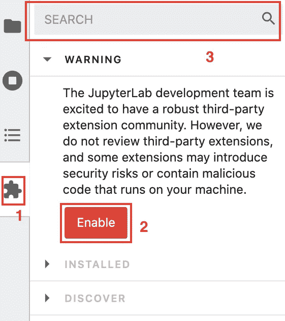
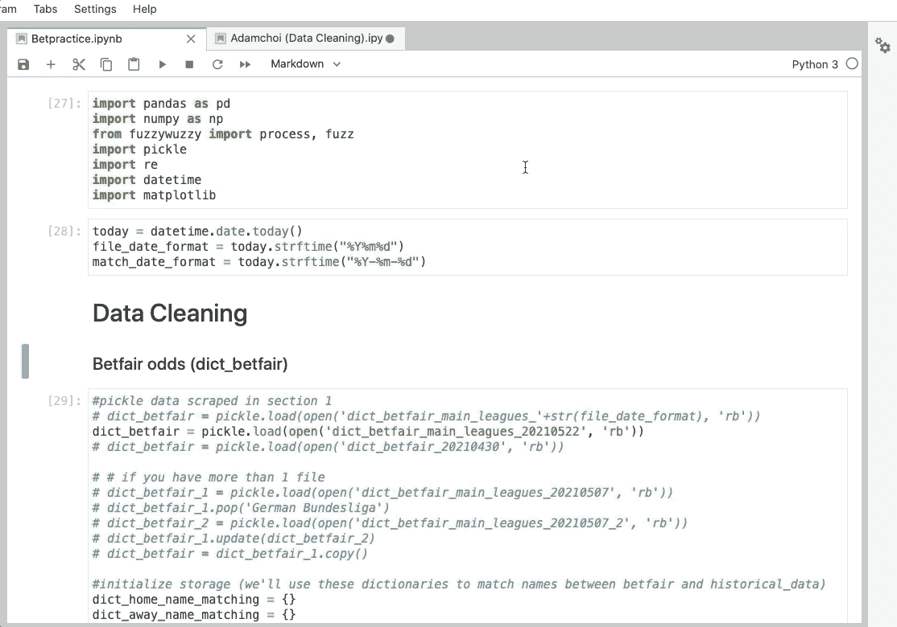
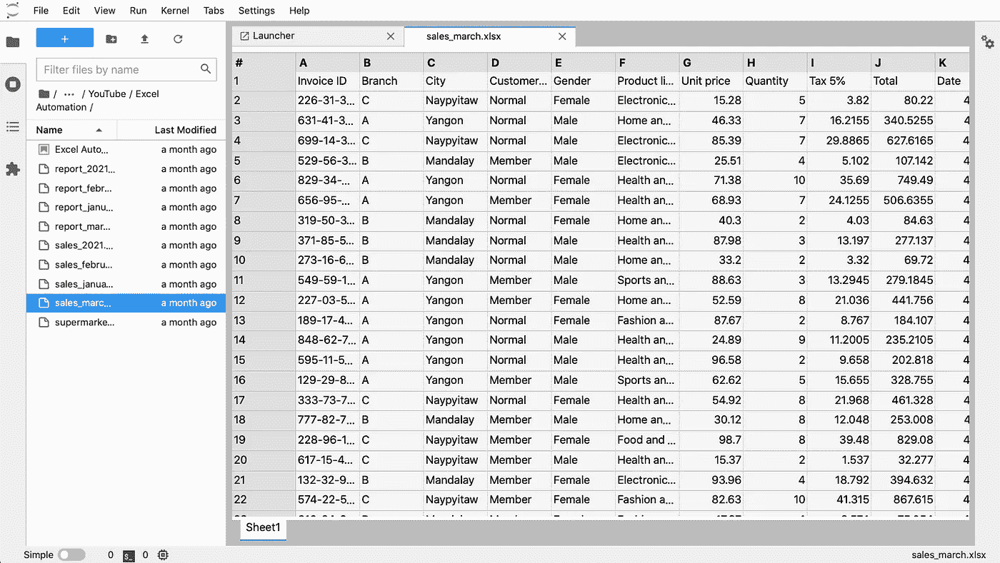
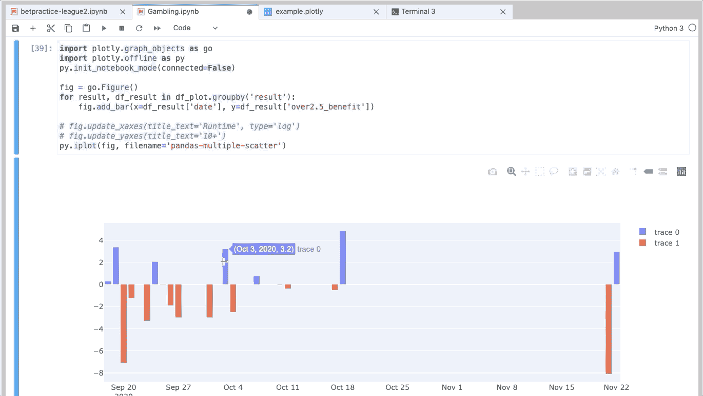
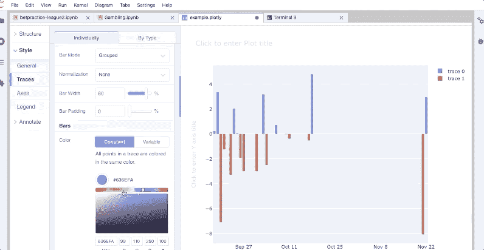
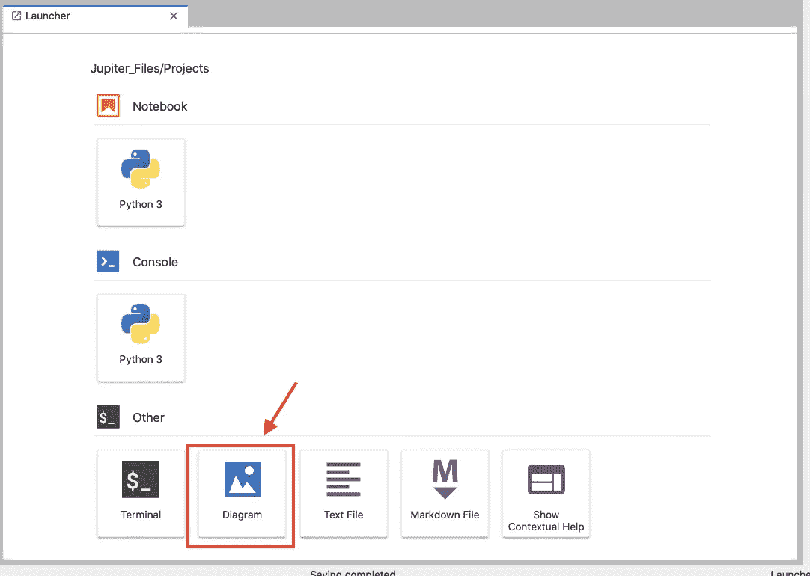
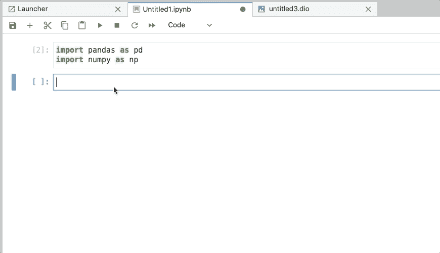
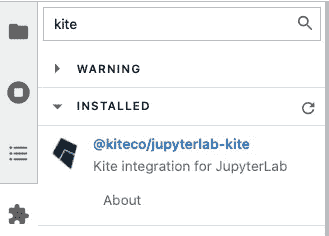

# 5 个扩展，让你转到 Jupyter 实验室

> 原文：<https://towardsdatascience.com/5-extensions-that-will-make-you-switch-to-jupyter-lab-32c6b66ac755?source=collection_archive---------3----------------------->

## 有时候 Jupyter 笔记本是不够的。


安德里亚斯·福斯伯格在 [Unsplash](https://unsplash.com?utm_source=medium&utm_medium=referral) 上拍摄的照片

Jupyter Lab 被称为 Jupyter 的下一代笔记本界面。它将笔记本、控制台、文本编辑器和终端集成到一个单一的交互式协作环境中。

除了带来经典笔记本和文本编辑器，Jupyter 实验室还提供第三方扩展。正如我们在[的上一篇文章](/12-jupyter-notebook-extensions-that-will-make-your-life-easier-e0aae0bd181)中看到的，Jupyter Notebook 只提供了有限数量的原生扩展；然而，Jupyter Lab 包含了一个健壮且蓬勃发展的第三方扩展社区。在本指南中，我将向您展示 5 个扩展，这会让您考虑转而使用 Jupyter Lab。

如果你一直只使用 Jupyter 笔记本，从未听说过 Jupyter 实验室，下面有一个快速设置(如果你熟悉 Jupyter 实验室，请跳转到扩展部分)

```
**Table of Contents** 1\. [Installing JupyterLab](#2140)
2\. [How to Install Extensions](#2e20)
3\. [Extensions Available by Default on JupyterLab 3.0+](#7f4c)
4\. [Extension 1: JupyterLab Spreadsheet](#c97e)
5\. [Extension 2: Interactive Graphs with Plotly and Chart Editor](#2cf0)
6\. [Extension 3: Drawing with JupyterLab-DrawIO](#ead8)
7\. [Extension 4: Auto-completion to A Next Level with Kite](#a9fe)
8\. [Extension 5: Debugger](#259d)
```

# 安装 JupyterLab

正如它的[文档](https://jupyterlab.readthedocs.io/en/stable/getting_started/installation.html)中提到的，你可以很容易地用 conda 或 pip 安装 Jupyter Lab。

```
# conda
conda install -c conda-forge jupyterlab# pip
pip install jupyterlab
```

安装完成后，运行以下命令打开 Jupyter Lab

```
jupyter lab
```

# 如何安装扩展

JupyterLab 扩展有两种类型:源代码扩展和预构建扩展。源扩展要求安装 Node.js。根据[文档](https://jupyterlab.readthedocs.io/en/stable/user/extensions.html)，可以用下面的命令安装 Node.js。

```
# conda
conda install -c conda-forge nodejs# pip
pip install nodejs
```

但是，在尝试安装扩展时，我仍然得到了“您需要安装 Node.js”的消息。我通过从它的[网站](https://nodejs.org/)下载“推荐给大多数用户”的 Node.js 并直接安装它来解决这个问题。

一旦有了 Node.js，就可以安装扩展了。在 Jupyter Lab 中有两种安装扩展的方法。

## 选项 1:通过扩展管理器安装扩展

您可以使用扩展管理器轻松安装扩展。只要按照这些步骤。

1.  单击位于左侧边栏的扩展管理器图标。
2.  点击“启用”按钮。
3.  搜索任何你想要的库，然后安装它。



作者图片

## 选项 2:通过终端安装扩展

要安装扩展，请在命令提示符或终端中运行以下代码

```
jupyter labextension install name-of-extension
```

除了编写`name-of-extension`，您还可以编写包含扩展名的本地目录、gzipped tarball 或 gzipped tarball 的 URL。如果你想指定一个特定的版本，比如写`name-of-extension@version`。

```
jupyter labextension install name-of-extension@1.2.3
```

*注意:安装任何扩展后，搜索框下方会显示一条消息“需要一个包含最新变更的版本”。确保你每次安装新的扩展时点击“重建”按钮，然后等待一个新的消息弹出，点击“保存并重新加载”*

现在是时候看看我相信可能会诱惑你转投 Jupyter 实验室的扩展了！

# JupyterLab 3.0+上默认可用的扩展

对于 JupyterLab 3.0 或更高版本，默认情况下有一些扩展可用，如目录。此外，正如你在下面的 gif 中看到的，它可以并排拖动每个选项卡，调整它们的大小，在笔记本之间复制单元格，拖放单元格，隐藏代码，以及更改主题，而无需安装任何扩展！



作者图片

# 扩展 1: JupyterLab 电子表格

默认情况下，您可以打开多个。Jupyter 实验室的 csv 文件；然而，如果你试图打开一个. xlsx 文件，你会得到一个错误。这时你需要安装一个名为`jupyterlab-spreadsheet`的第三方扩展

要安装它，只需在搜索框上写下`jupyterlab-spreadsheet` 或运行命令`jupyter labextension install jupyterlab-spreadsheet`。Jupyter 实验室的电子表格是这样的。



作者图片

# 扩展 2:带有 Plotly 的交互式图表和带有图表编辑器的简单编辑

Plotly **是一个制作交互式图形的**图形库。它也可以在 Jupyter 笔记本中使用，但使用`jupyterlab-chart-editor`您甚至可以通过用户友好的点击界面编辑 Plotly 图表。

首先，确保您已经安装了 Plotly 库(`pip install plotly)` 并且 JupyterLab 也安装了`ipywidgets`包。

```
#conda 
conda install jupyterlab "ipywidgets>=7.5"# pip
pip install jupyterlab "ipywidgets>=7.5"
```

然后打开一个终端并运行`jupyter labextension install jupyterlab-plotly`来安装 Plotly 扩展。在这之后，你应该能够绘制如下所示的交互式图形(在这里使用代码[来尝试你的第一个图形)](https://github.com/plotly/jupyterlab-chart-editor#usage)



作者图片

现在你可以很容易地用 JupyterLab-chart-editor 编辑这些图表。打开终端，运行`jupyter labextension install jupyterlab-chart-editor`安装图表编辑器。

要查看它的运行情况，您必须将自己绘制的图形保存到 JSON 中

```
pio.write_json(fig, 'example.plotly')
```

在这个例子中，我创建了一个名为`‘example.plotly’`的文件。要打开它，右击文件菜单中的`‘example.plotly’`，用“Plotly 编辑器”打开。像这样的窗户应该打开。



作者图片

您可以在这里进行一些更改，然后使用“文件”菜单再次保存该文件，并将其导入到原始笔记本中。

```
fig_styled = pio.read_json('example.plotly')
```

# 扩展 3:用 JupyterLab-DrawIO 绘图

Draw.io 是一款免费的在线图表软件，用于制作流程图、过程图等。有了`jupyterlab-drawio`第三方应用，你可以拥有 Jupyter 实验室的所有功能。

要安装它，只需搜索`jupyterlab-drawio`或运行命令`jupyter labextension install jupyterlab-drawio`。然后，一个新的“图表”图标应该出现在启动器选项卡中。



作者图片

点击它打开一个新的。dio 文件。现在你可以画任何你想画的东西了！


作者图片

# 扩展 4:使用 Kite 自动完成到下一个级别

Kite 将自动补全提升到了一个新的高度，它的快速补全能够感知代码的上下文。虽然 Jupyter Notebook 提供了自动完成功能，但它包含一些错误，使得编写代码不如在您最喜欢的文本编辑器或 IDE 中那样流畅。

幸运的是，有了 Kite，你将得到更长的多线完井，而你通常得不到。最重要的是，只需鼠标悬停就可以查看 Python 文档，还可以找到有用的示例和操作方法。



作者图片

要安装它，请确保您具有以下要求:

*   JupyterLab >=2.2.0
*   风筝发动机
*   带 pip 的 Python 3.6+版本

要安装风筝引擎，进入他们的 [Github 页面](https://github.com/kiteco/jupyterlab-kite)，向下滚动直到安装部分。为你的操作系统下载安装程序，然后像安装任何程序一样安装它。如果安装成功，您应该在已安装的扩展中看到 Kite。现在写一些代码来看看 Kite 的自动完成功能。



作者图片

要检查所有的文本编辑器/IDE 兼容打开风筝，然后去设置，并点击插件。

# 扩展 5:调试器

大多数 IDE 支持和 Jupyter 缺乏的一个有用特性是调试器。Jupyter 3.0 +默认自带；但是，如果 Jupyter Lab 上没有，请按照下面的步骤进行安装。

首先，搜索`jupyterlab/debugger`或运行命令`jupyter labextension install jupyterlab/debugger`安装调试器。然后，在后端，需要一个实现 Jupyter 调试协议的内核。目前，唯一实现这个协议的内核是 xeus-python，这是 python 编程语言的一个新的 Jupyter 内核。要安装 *xeus-python* ，在终端上运行以下命令。

```
# conda
conda install xeus-python -c conda-forge#pip
pip install xeus-python
```

请记住，pip 选项仍处于试验阶段*。*一旦 *xeus-python* 和调试器扩展安装完毕，打开一个新的 *xpython* ，点击右边的 bug 图标展开调试器。


图片来自 Jupyter 博客

*就是这样！其他很酷的扩展像*[*Google Drive*](https://github.com/jupyterlab/jupyterlab-google-drive)*，* [*Github*](https://github.com/jupyterlab/jupyterlab-github) ，*和* [*语言包*](https://github.com/jupyterlab/language-packs/) *也是可用的。使用新的扩展功能，让您的生活更轻松！*

[**与 3k 以上的人一起加入我的电子邮件列表，获取我在所有教程中使用的 Python for Data Science 备忘单(免费 PDF)**](https://frankandrade.ck.page/bd063ff2d3)