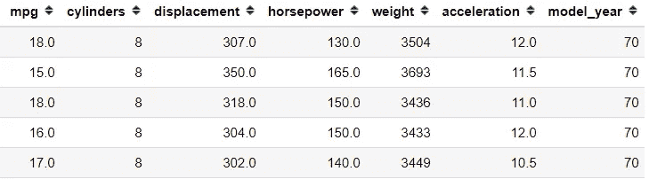
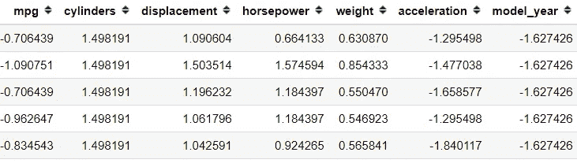
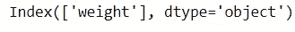
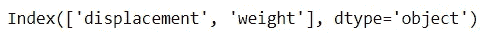
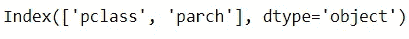
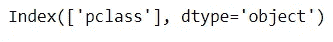
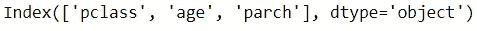

# Scikit 的 5 个特性选择方法-了解您应该知道的

> 原文：<https://towardsdatascience.com/5-feature-selection-method-from-scikit-learn-you-should-know-ed4d116e4172?source=collection_archive---------2----------------------->

## 通过只选择最重要的功能来提高性能


[粘土银行](https://unsplash.com/@claybanks?utm_source=medium&utm_medium=referral)在 [Unsplash](https://unsplash.com?utm_source=medium&utm_medium=referral) 拍摄的照片

特征选择是一种减少变量的方法，通过使用某些标准来选择对我们的模型预测目标最有用的变量。

增加特征的数量将有助于模型具有良好的预测能力，但只是到某一点为止。这就是我们所说的**维度诅咒**，模型的性能会随着我们使用的特征数量的增加而提高。尽管如此，当特性数超过峰值时，性能会下降。这就是为什么我们只需要选择能够有效预测的特征。

特征选择类似于**降维技术，**的目的是减少特征的数量，但本质上它们是不同的。不同之处在于，要素选择会选择要保留的要素或从数据集中移除的要素，而降维会创建数据的投影，从而产生全新的输入要素。如果你想知道更多关于降维的知识，你可以看看我下面的其他文章。

</5-must-know-dimensionality-reduction-techniques-via-prince-e6ffb27e55d1>  

特性选择有许多方法，但我只展示 Scikit-Learn 中的 5 个特性选择。我只限制 scikit 中的一个工具——learn，因为它最简单也最有用。让我们开始吧。

# 1.方差阈值特征选择

方差较高的要素意味着该要素中的值会变化或基数较高。另一方面，较低的方差意味着要素中的值相似，而零方差意味着要素具有相同的值。

直觉上，你希望有一个变化的特征，因为我们不希望我们的预测模型有偏差。这就是为什么我们可以根据之前选择的方差来选择特性。

方差阈值是一种简单的方法，可以根据每个特征中的预期方差来消除特征。虽然，方差阈值法也有一些缺点。方差阈值特征选择仅看到输入特征(X ),而不考虑因变量(y)的任何信息。它只对消除**非监督建模**的特征有用，而不是监督建模。

让我们用一个示例数据集来尝试一下。

```
import pandas as pd
import seaborn as sns
mpg = sns.load_dataset('mpg').select_dtypes('number')
mpg.head()
```



作者创建的图像

对于这个例子，为了简单起见，我只使用数字特征。在使用方差阈值特征选择之前，我们需要转换所有这些数值特征，因为方差受数值范围的影响。

```
from sklearn.preprocessing import StandardScaler
scaler = StandardScaler()
mpg = pd.DataFrame(scaler.fit_transform(mpg), columns = mpg.columns)
mpg.head()
```



作者创建的图像

在所有要素都处于相同比例的情况下，让我们尝试使用方差阈值方法仅选择我们想要的要素。假设我把方差限制在一。

```
from sklearn.feature_selection import VarianceThreshold
selector = VarianceThreshold(1)
selector.fit(mpg)
mpg.columns[selector.get_support()]
```



作者创建的图像

似乎只有权重特征是基于我们设置的方差阈值来选择的。

正如我之前所说，方差阈值只有在我们考虑无监督学习的特征选择时才有用。如果我们希望特征选择用于监督学习的目的呢？这就是我们接下来要讨论的。毕竟，从 Scikit-Learn 中选择的大多数特性对于监督学习都是有用的。

# 2.用 SelectKBest 进行单变量特征选择

单变量特征选择是一种基于单变量统计检验的特征选择方法，例如:chi2、Pearson-correlation 等等。

使用 **SelectKBest 的前提是将单变量统计测试与根据 X 和 y 之间的统计结果**选择 K 个特征相结合

让我们用之前的一个示例数据来使用它。

```
mpg = sns.load_dataset('mpg')
mpg = mpg.select_dtypes('number').dropna()#Divide the features into Independent and Dependent Variable
X = mpg.drop('mpg' , axis =1)
y = mpg['mpg']
```

因为单变量特征选择方法旨在用于监督学习，所以我们将特征分成自变量和因变量。接下来，我们将使用基于互信息回归的 SelectKBest 来选择特性。假设我只想要最上面的两个特性。

```
from sklearn.feature_selection import SelectKBest, mutual_info_regression#Select top 2 features based on mutual info regression
selector = SelectKBest(mutual_info_regression, k =2)
selector.fit(X, y)
X.columns[selector.get_support()]
```



作者创建的图像

基于互信息回归，我们只选择“位移”和“重量”特征，像这些是最重要的特征。

# 3.递归特征消除(RFE)

递归特征消除或 RFE 是一种特征选择方法**，利用机器学习模型通过在递归训练**后消除最不重要的特征来选择特征。

根据 Scikit-Learn 的说法，RFE 是一种通过递归考虑越来越小的特征集来选择特征的方法。首先，在初始特征集上训练估计器，每个特征的重要性通过一个`coef_`属性或通过一个`feature_importances_`属性获得。然后，从当前特征集中删除最不重要的特征。该过程在删减集上递归重复，直到最终达到要选择的特征的期望数量。

TL；RFE 博士基于机器学习模型选择了前 k 个特征，这些机器学习模型具有来自其模型(几乎任何模型)的`coef_`属性或`feature_importances_`属性。RFE 会删除最不重要的特征，然后重新训练模型，直到它只选择你想要的 K 个特征。

这个方法只在模型有`coef_`或`features_importances_`属性时有效，如果有模型有这些属性，你可以在 Scikit-Learn 上应用 RFE。

让我们用一个数据集的例子。在这个示例中，我想使用泰坦尼克号数据集来解决分类问题，我想预测谁会幸存。

```
#Load the dataset and only selecting the numerical features for example purposes
titanic = sns.load_dataset('titanic')[['survived', 'pclass', 'age', 'parch', 'sibsp', 'fare']].dropna()
X = titanic.drop('survived', axis = 1)
y = titanic['survived']
```

我想看看哪些特征最能帮助我预测使用 RFE 谁能在泰坦尼克号事件中幸存。让我们使用逻辑回归模型来获得最佳特征。

```
from sklearn.feature_selection import RFE
from sklearn.linear_model import LogisticRegression# #Selecting the Best important features according to Logistic Regressionrfe_selector = RFE(estimator=LogisticRegression(),n_features_to_select = 2, step = 1)
rfe_selector.fit(X, y)
X.columns[rfe_selector.get_support()]
```



作者创建的图像

默认情况下，为 RFE 选择的要素数是所有要素的中值，步长(每次迭代消除的要素数)为 1。您可以根据您的知识或您使用的指标来更改它。

# 4.通过 SelectFromModel 进行功能选择

像 RFE 一样，Scikit-Learn 的 SelectFromModel 基于机器学习模型估计来选择特征。不同之处在于 **SelectFromModel 特征选择是基于重要性属性**(通常是`coef_`或`feature_importances_`，但也可以是任何可调用的)**阈值**。默认情况下，阈值是平均值。

让我们用一个数据集例子来更好地理解这个概念。我会用我们之前的泰坦尼克号数据。

```
from sklearn.feature_selection import SelectFromModel# #Selecting the Best important features according to Logistic Regression using SelectFromModelsfm_selector = SelectFromModel(estimator=LogisticRegression())
sfm_selector.fit(X, y)
X.columns[sfm_selector.get_support()]
```



作者创建的图像

使用 SelectFromModel，我们发现只有一个特性通过了阈值:“pclass”特性。

像 RFE 一样，你可以使用任何机器学习模型来选择特征，只要它可以用来估计属性的重要性。您可以用随机森林模型或 XGBoost 来尝试一下。

# 5.特征选择顺序特征选择

在 sci kit-Learn 0.24 版中新增的顺序特征选择(SFS)是一种贪婪算法，通过基于**交叉验证分数估计器向前或向后查找最佳特征。**

根据 Scikit-Learn 的说法， **SFS-Forward** 通过从零个特征开始进行特征选择，并找到一个特征，当机器学习模型在这个单一特征上训练时，该特征使交叉验证分数最大化。一旦选择了第一个特征，就通过向所选特征添加新特征来重复该过程。当我们发现达到期望的特征数量时，该过程停止。

**SFS-Backward** 遵循相同的思路，但工作方向相反:它从所有的特征开始，贪婪地移除所有的特征，直到达到所需的特征数量。

SFS 不同于 RFE 和 SelectFromModel，因为机器学习模型不需要`coef_`或`feature_importances_`属性。但是，由于它通过多次拟合模型来评估结果，因此速度相当慢。

我们用一个例子来试试。我想试试 SFS-Backward 做个例子。

```
from sklearn.feature_selection import SequentialFeatureSelector#Selecting the Best important features according to Logistic Regressionsfs_selector = SequentialFeatureSelector(estimator=LogisticRegression(), n_features_to_select = 3, cv =10, direction ='backward')
sfs_selector.fit(X, y)
X.columns[sfs_selector.get_support()]
```



作者创建的图像

使用 SFS-Backward 进行三个特征选择和十个交叉验证，我们最终得到“pclass”、“age”和“parch”特征。

您可以尝试这种要素选择，并查看模型性能如何，但请记住，随着要素和数据数量的增加，您的选择时间也会增加。

# **结论**

特征选择是机器学习模型的一个重要方面，因为我们不希望有许多特征完全不影响我们的预测模型。

在本文中，我向您展示了您可以使用的 5 种 Scikit-Learn 特性选择方法，它们是:

1.  方差阈值特征选择
2.  使用 SelectKBest 的单变量选择
3.  递归特征消除或 RFE
4.  SelectFromModel
5.  顺序特征选择或 SFS

希望有帮助！

在我的 [**社交媒体**](https://bio.link/cornelli) **上访问我。**

> 如果您没有订阅为中等会员，请考虑通过[我的推荐](https://cornelliusyudhawijaya.medium.com/membership)订阅。