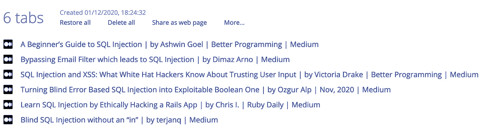

# 5 个提高我工作效率的免费工具

> 原文：<https://towardsdatascience.com/5-free-tools-that-increase-my-productivity-c0fafbbbdd42?source=collection_archive---------11----------------------->

卡尔·海尔达尔在 [Unsplash](https://unsplash.com/s/photos/productivity?utm_source=unsplash&utm_medium=referral&utm_content=creditCopyText) 上拍摄的照片

## 这不是一个好的 IDE，尽管它很有帮助！

在过去的几年里，我读了不少文章，听了一些播客，在这些播客中，人们(不一定来自数据科学领域)分享了他们最喜欢的提高工作效率的工具。我用其中的一部分做了实验，然而，大多数都没有*点击*，我在开始后不久就放弃了它们。但是过了一段时间，有几个卡住了，从那以后我几乎每天都在使用它们。

尽管一个好的 IDE 可以极大地提高生产力，但我不会在下面的列表中提到任何一个，因为有很多选择，每个人都可以有自己的偏好。对我来说，Jupyter Lab 是笔记本的首选工具(它有很多普通笔记本没有的非常方便的特性)，而我使用 VS Code/PyCharm 编写脚本。

在这篇文章中，我想与你分享我的设置是什么，为什么我喜欢它。自然，这是一个非常主观的话题，我并不是说这是所有无限可能性中最好的一个。这就是为什么我真的很想在评论中听到关于你的经历的任何建议或评论！

[来源](https://bear.app/)

# 记笔记——熊

很长一段时间，我一直在 MacBook 上使用默认的 Notes 应用程序，然而，它缺少一些对我的日常使用非常有帮助的功能。就我个人而言，我使用 notes 应用程序的目的远远不止于 notes——我试图建立一个各种各样的知识库(不同的信息我想留着以后用，并按主题分类)，我用它来做任务规划和待办事项列表(我知道有很多很棒的应用程序可以做这个，但我喜欢保持简单)，起草文章，保存我想读的书的列表，等等。

那是我发现[熊](https://bear.app)的时候，从那以后我一直在用它。简而言之，这是一个非常简单(但时尚)的文本编辑器。但在我看来，有几个特点非常突出，值得一提:

*   优雅而直观的设计。
*   允许存储相当多的编程语言的代码片段(包括高亮部分)。这就是为什么它是一个知识库的伟大工具！
*   在知识库的基础上，多级标签系统非常适合组织你的笔记。例如，假设您要撰写一篇中等文章的草稿，并将其与所有其他草稿存储在一起。然后你只需要把`#medium/drafts`放在便笺中，Bear 会处理剩下的事情。完成后，将它移动到发布目录中就像将那一行改为`#medium/published`一样简单。老实说，起初我并不相信这种组织笔记的方式，但是过了一段时间后，我渐渐喜欢上了这种方式，它实际上非常直观和快捷！
*   对图像和照片的内嵌支持—非常适合存储相关截图。
*   待办事项列表的交互式勾选框。
*   笔记以纯文本格式存储，也很容易导出为大多数常见的文件格式。
*   应用内聚焦模式隐藏了除空白笔记之外的几乎所有内容，因此您可以深入研究您的想法。

此外，您可以免费使用 Bear 的大部分功能。可能会让您考虑 premium 选项的一个功能是所有设备之间的同步。我本来打算订阅的，因为我花了相当多的时间在路上(通勤时间长)，然而，在大流行时期，这种情况已经不复存在了。但是我以后一定会去试一试！

[来源](https://getpocket.com)

# 内容管理—袖珍版

[Pocket](https://getpocket.com) 是由 Mozilla 公司开发的浏览器扩展/应用程序，它允许你存储任何在线内容(文章、新闻、视频等)。)供以后查看。我经常使用它来存储我在旅途中找到的文章或视频，而那时没有时间观看。当您创建帐户时，您的所有内容将在所有设备上同步，因此您可以轻松地将文章存储在手机上，然后轻松地将其放在桌面上。

Pocket 还有其他一些优点。首先，您可以使用自定义标签，它允许您根据自己的设计将内容分类。另一个值得一提的功能是分散注意力，而且口袋里通常没有广告。如果你想从一个有很多令人分心的元素的网站上阅读一篇文章，Pocket 可以让你在一个漂亮干净的页面上阅读摘录。最后，如果你正在寻找灵感或者想要了解最新的新闻，你可以使用 discover 标签来查看推荐的内容(也可以根据你的喜好定制)。

还有一个具有其他奇特功能的高级模式，然而，对于我的用例来说，免费帐户已经足够好了。

[来源](https://www.one-tab.com/)

# 浏览器管理— OneTab

在研究某个主题或从事某个项目时，您可能会在浏览器中打开多个选项卡，有时会出现文本标题难以辨认的情况。当你想休息一下，打开更多不相关的标签时，情况会变得更糟…这就是 OneTab 的用处。这是一个免费的浏览器扩展，它可以让你将所有打开的标签转换成一个列表，然后存储在一个单独的标签中。您可以多次使用该功能，每个列表都带有时间戳。

例如，几周前，我参加了一个关于黑客方法的网络研讨会，并阅读了一些关于 SQL 注入的内容。我没有看完所有我找到的文章，所以只需点击一下，我就把所有的标签页转换成一个列表，如下图所示。

如你所见，用一个时钟恢复/删除所有存储的标签是很容易的。对我来说，OneTab 是一个很好的工具，可以让我暂时停止使用它，并为将来的会话捕捉浏览器的当前状态。此外，为了您的隐私，保存的网站只存储在本地。

照片由 [Unsplash](https://unsplash.com/s/photos/tomato?utm_source=unsplash&utm_medium=referral&utm_content=creditCopyText) 上的[模型图形](https://unsplash.com/@mockupgraphics?utm_source=unsplash&utm_medium=referral&utm_content=creditCopyText)拍摄

# 番茄工作法——番茄定时器

我不是一个死忠[番茄工作法](https://en.wikipedia.org/wiki/Pomodoro_Technique)的粉丝，他总是在完成 4 组后才休息一段时间。在我目前的职位上，很难计划 2 小时不间断的工作，因为有计划好的与不同团队的会议，计划外的会议，等等…然而，我发现即使时间更短也很有用。专注于一项任务的一两次冲刺已经很有帮助了，对我来说，当我知道计时器在倒计时时，不屈服于任何分心会更容易。

大多数时候，我用的是定时器，我只是让它在一个标签上开着，然后等待 25 分钟结束的钟声。一般来说，任何计时器都可以工作，不管是你手机上的计时器还是厨房用具上的计时器。

[来源](https://selfcontrolapp.com/)

# 终极聚焦模式——自我控制

你有没有发现自己心不在焉地去了一个网站(可以是脸书，推特，其他社交媒体等。)然后“就一分钟”变成了 10 分钟甚至更久？如果答案是肯定的，[自控力](https://selfcontrolapp.com/)可以成为你新的最好的朋友！这是一款适用于 macOS 的免费应用，你可以创建一个你想避开的网站的*屏蔽列表*，然后指定你想屏蔽它们的时间。一旦做了，就没有怜悯和回头。你可以删除该应用程序或重启电脑，但屏蔽将保持不变。相当硬核，但非常有效。

也有一些替代应用程序可以用于焦点模式，其中一些也可以阻止应用程序。从我的快速研究来看，这是最严格的一个，老实说，我只需要屏蔽网站，所以它完全符合我的需求。

# 总结

这就是帮助我提高效率的 5 个工具的清单。前 4 个是我日常使用的，并深深融入了我的工作流程。我过去在这个角色中更频繁地使用自制力，但是随着时间的推移，我变得更加自制力了(这是一个坏的双关语),我不再需要那么频繁地使用它了。

写完这篇文章后的某个时候，我读完了尼尔·埃亚尔的*难分难解的*，惊喜地发现他建议的提高生产力的技巧中有一些重叠。例如，他提到使用 Pocket 来存储文章，以便进行不受干扰的阅读(或者可能在散步时听它们)，或者使用自我控制作为我们想要避免的网站的最终拦截器。

你最喜欢的提高生产力的工具是什么？正如介绍中提到的，我很乐意在评论中读到你的建议和经验。你可以在推特上联系我。

觉得这篇文章有趣？成为一个媒介成员，通过无限制的阅读继续学习。如果你使用[这个链接](https://eryk-lewinson.medium.com/membership)成为会员，你将支持我，不需要你额外付费。提前感谢，再见！

如果您喜欢这篇文章，您可能还会对以下内容感兴趣:

 [## 在 VS 代码中调试 Python 脚本的综合指南

### 了解如何在 10 分钟内高效调试您的脚本！

towardsdatascience.com](/a-comprehensive-guide-to-debugging-python-scripts-in-vs-code-b9f9f777d4b8)  [## 懒惰预测:拟合和评估 scikit 中的所有模型——用一行代码学习

### 查看哪些模型最适合您的数据集的最简单方法！

towardsdatascience.com](/lazy-predict-fit-and-evaluate-all-the-models-from-scikit-learn-with-a-single-line-of-code-7fe510c7281)  [## 我最喜欢的 10 个在线学习数据科学的资源

### 这些网站将帮助您跟上数据科学的最新趋势

towardsdatascience.com](/my-10-favorite-resources-for-learning-data-science-online-c645aa3d0afb)