# big query 2021 年新 UI 的 5 大特性(是的，它有标签！)

> 原文：<https://towardsdatascience.com/5-great-features-in-bigquerys-new-ui-for-2021-yes-it-has-tabs-c4bac66d66b?source=collection_archive---------21----------------------->

## 我探索了 BigQuery 的新 UI，它刚刚在预览版中发布

授权给作者的图像

对于谷歌大查询的用户来说，本周是激动人心的一周；一个备受期待的 UI 更新在公开预览版中发布。

在过去一周愤怒地使用了新的用户界面后，我想分享一下我对新外观的 10 大赞。

读者应该注意到，新的用户界面是在预览，因此可能会进一步改善，然后正式发布(很可能)测试版。

所以，不分先后，我们开始吧。

# #1 新布局、新面板

所以提醒一下，这里是以前的 UI 的样子；在这里，我对我制作的伦敦自行车租赁计划(可从 Google 获得的公共数据集)的副本运行了一个简单的查询。我们在左边有一个菜单窗格，在右边有一个水平分割的窗格，用来运行我们的 SQL 查询。

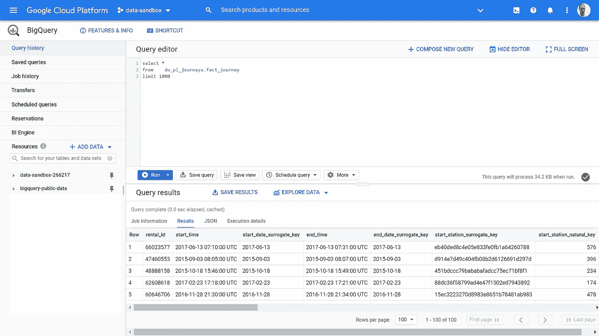

当您第一次启动新的 UI 时，它看起来是这样的。正如你所看到的，变化很大！

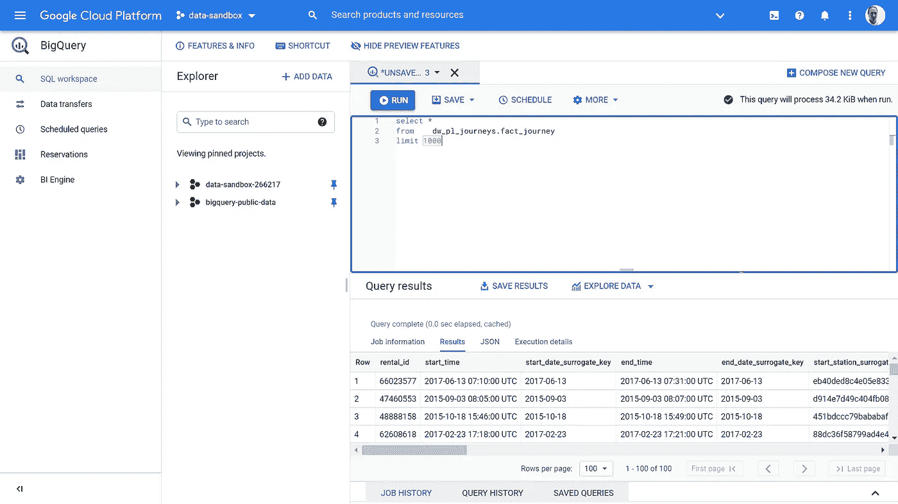

## 新导航菜单

我喜欢的第一件事是左边新的垂直面板——它的官方标签是“BigQuery navigation menu ”,包含以下选项:

**SQL 工作区**(新)
这将带您回到这个主屏幕，在这里您可以执行 SQL 查询。这是非常有用的，这意味着你可以很容易地返回到这个页面，如果你点击这个菜单中的其他服务之一。

**数据传输**(旧左侧面板中的*传输*)
和以前一样，这将带您进入 BigQuery 数据传输服务(DTS)。DTS 屏幕没有变化，除了取消了返回箭头(您现在单击上面的 **SQL workspace** 菜单项)，它是相同的。

> **提示**:新的 UI 提示您保存您的更改，如果您还没有这样做的话。当您从 DTS 面板返回时，旧的 UI 会记住您的 SQL 查询—在新的 UI 中，您的 SQL 会丢失。因此，请确保从查询历史选项中保存或检索您的查询。

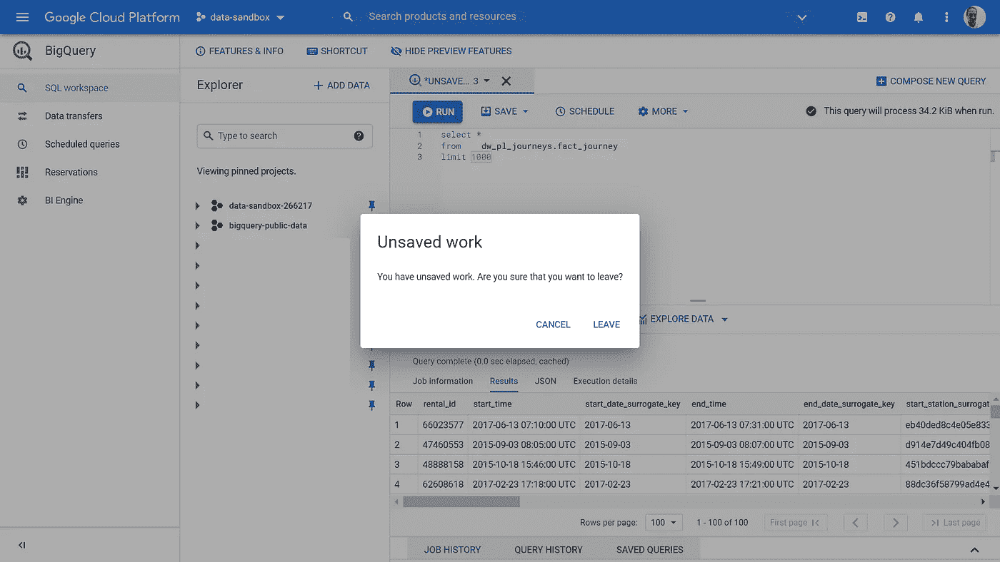

单击新的左侧菜单窗格中的链接，提示保存您的工作

**预定查询**(旧左侧面板中的*预定查询*，无变化)

**保留**(旧左侧面板中的*保留*，无变化)

**匕发动机**(老款左侧面板*匕发动机*，无变化)

## 隐藏面板的新控件

我确实注意到这个新的垂直导航面板的一点是，它占用了相当多的屏幕空间，可能会使您的 SQL 面板有点拥挤，特别是在笔记本电脑上。

好消息是——有一些新的展开/折叠控件来隐藏这个菜单(我倾向于在这种模式下工作)。这些位于导航窗格的底部，如下所示:

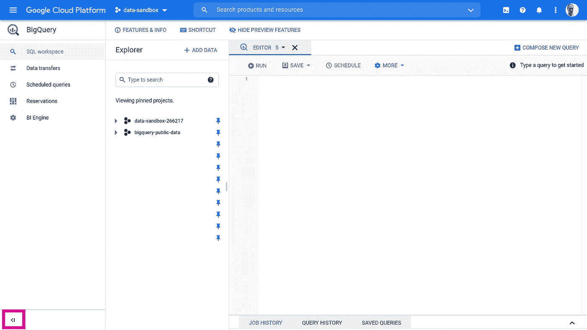

我倾向于折叠这个菜单，并且认为大多数人也会这样做:

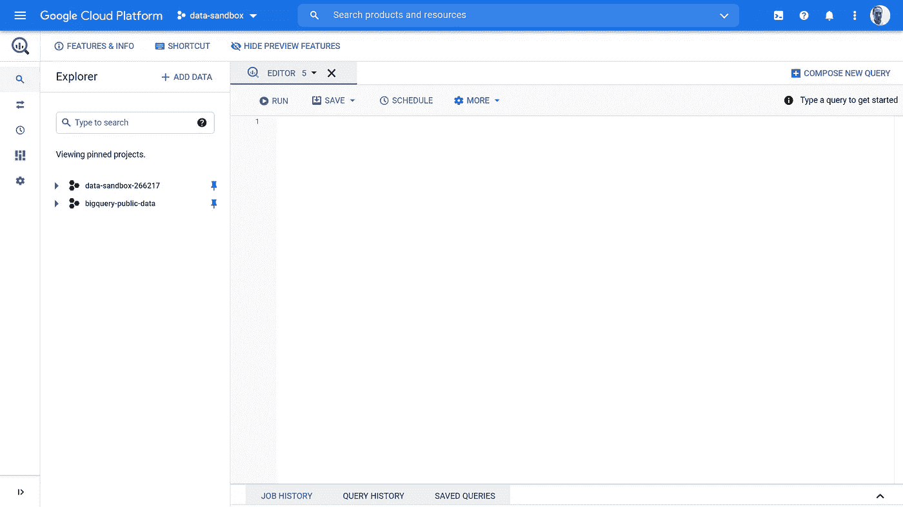

我倾向于隐藏新的导航窗格

有一点有点奇怪，在*浏览器*窗格的底部没有类似的控件；如果你想隐藏它，你必须像以前一样手动调整大小。

# #2 选项卡式 SQL 窗格在这里！

很高兴在新版本中看到这些——这是许多经验丰富的数据库开发人员将会习惯的。例如，MS SQLServer Management Server 支持选项卡式查询窗格，一些竞争对手的现代云数据仓库也支持，特别是雪花。

在新的用户界面中，有多种方法可以添加新标签:

1.  点击**撰写新查询**按钮
2.  从**查询历史**窗格中选择一个查询，点击**在编辑器**中打开查询。这很好，因为我曾经发现当只有一个窗格时，这会覆盖您的 SQL，这有点烦人。干得好谷歌！
3.  从**保存的查询**窗格中，点击**在编辑器**中打开查询。同样，很高兴看到这没有覆盖您当前的 SQL 窗口。
4.  在**浏览器**窗格中，点击一个表或视图名称，这将在一个新的选项卡中打开定义。这是一个相当大的变化，如果您回想一下当前的 UI，这会在 SQL 查询下面的面板中打开表定义(替换任何结果)。我个人不确定我是否喜欢最后这种新行为——如果你想快速浏览数据集中的几个表，这可能会很快导致大量标签被打开。我过去经常使用的另一个功能(现在看来已经没有了)是，您过去可以单击详细信息窗格中的列名，它会将该列添加到您的 SQL 窗口中。我想我需要习惯使用新的和改进的智能感知…

# #3 新的智能感知改造！

一旦进入新的 SQL 窗格，首先要注意的一件事就是改进的 Intellisense。这现在真的很好，使编写 SQL 快了很多，特别是如果您不太熟悉表结构的话。

这里有几个例子。

## 查找数据集和表

所以，我想从我的数据集中选择 **dw_pl_journeys** 。我只需开始输入数据集的名称，就可以实时看到匹配的数据集(和数据库)。按 tab 键完成数据集:

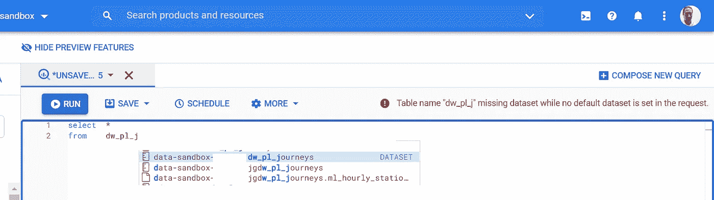

BigQuery 还可以搜索表名，所以在上面的例子中，如果我输入:

select * from**fact _ journey**我在我可以访问的数据集中看到所有与此匹配的表。

## 关键词(包括函数！)

BigQuery 现在支持所有关键字的自动完成——我发现这真的很有帮助，事实上，这是我最喜欢的变化之一。

例如，我现在只需输入**选择日期 _** 就可以很容易地看到**的日期函数**

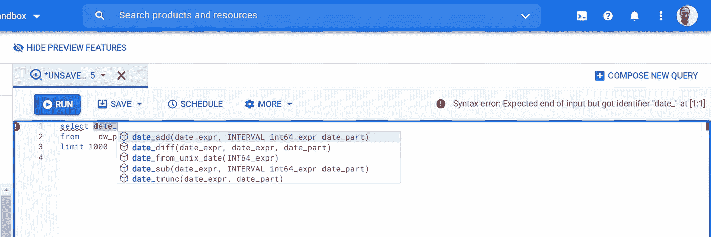

我喜欢这个新功能——如果你不确定你需要的日期功能，可以节省时间

> 提示:要像以前一样强制显示 intellisense，请使用 ctrl+space 热键

# #4 新页脚导航菜单

引入了新的页脚菜单，如下所示。这包含**作业历史、查询历史**和**保存的查询。**这些已经从左侧导航菜单中移出。

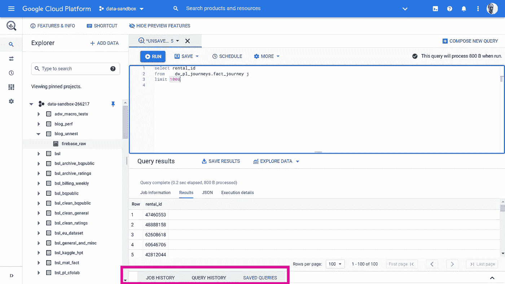

# #5 并排查看 SQL 结果的拆分窗格

最后，但绝不是最不重要的，新的 UI 能够并排显示选项卡。当您想要比较两个查询的结果时，这非常有用，比如说，您使用的是笔记本电脑，所以没有两台显示器。

假设我想并排查看这两个选项卡:

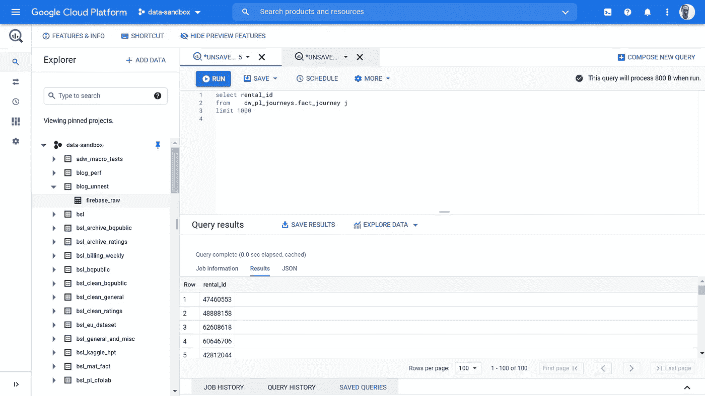

首先，选择右侧选项卡上的下拉菜单，并选择**向右拆分选项卡:**

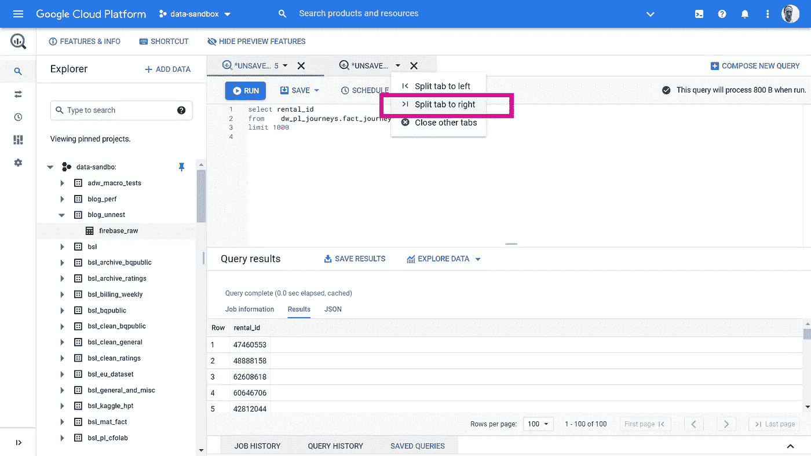

这将 tab2 放在 tab 1 旁边，现在我可以运行并比较结果了——非常有用！

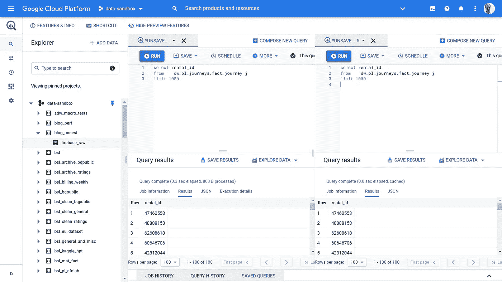

# 结论

在过去的几天里，我愤怒地使用了新的 UI，我认为与数据科学家和数据专业人员分享我的经验会有所帮助。

总之，我真的很喜欢这个版本中所做的事情，尽管它只是预览版。特别是，新的选项卡是一个非常受欢迎的新增功能，新的智能感知可以列出函数，节省了我交叉引用外部文档来记住函数名或要传递哪些参数的时间。

有几件事我不太确定——特别是出现在新选项卡中的表细节有点奇怪，在我看来，我更喜欢它在 SQL 窗格下面打开。

我很想听听你对新变化的看法，请随时发表评论，2021 年开始 SQL 争论！

# 后续步骤

1.了解更多关于 [Ancoris 数据、分析& AI](https://www.ancoris.com/solutions/data_analytics_ai)