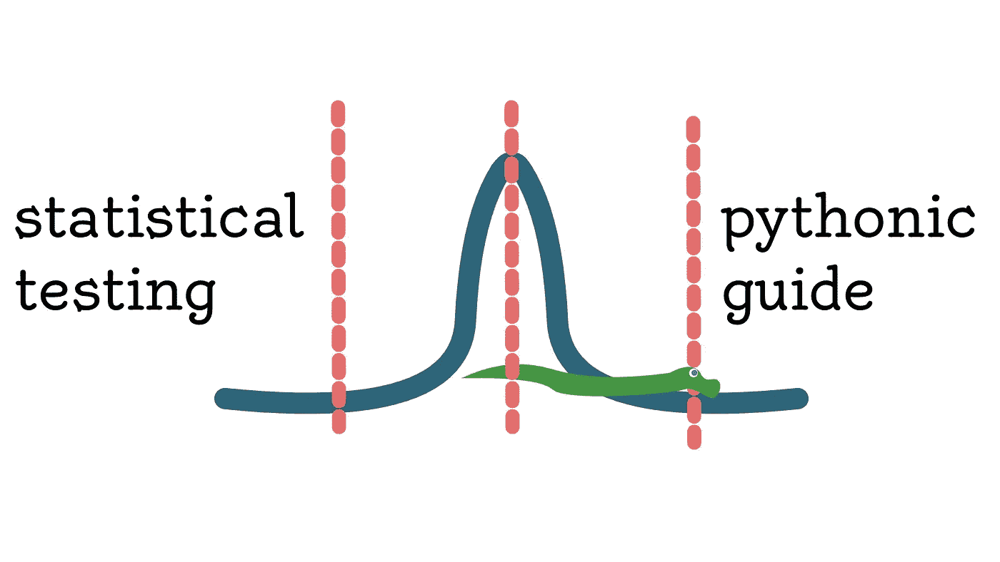

# 统计测试的 5 大准则

> 原文：<https://towardsdatascience.com/5-great-guidelines-for-statistical-testing-in-python-8ee9d8d85a41?source=collection_archive---------15----------------------->

## 使用统计测试时，我最喜欢遵循的一些规则。

(图片由作者提供)

# 介绍

统计测试是数据科学家经常需要完成的任务，比数据科学家可能做的许多其他工作更容易出错。也就是说，在大多数情况下，没有像机器学习模型那样的验证。大多数时候，我们的概率是对我们假设的验证，也没有回溯检查来查看我们的概率是否正确。如果是这样的话，那么我们怎么知道我们的研究是否有统计学意义呢？

有一些方法可以避免大多数数据科学家可能熟悉的统计测试中的许多常见陷阱，这可以使工作变得非常可信和真实。一项测试可能不准确、不正确，甚至可能产生误导有几个原因——尽管在统计上是真实的。

# №1:寻找坏数据

很容易，在验证和处理任何类型的分析时，最重要的事情就是坏数据。糟糕的数据几乎可以摧毁任何目标，无论是机器学习还是科学推理。在分析案例中，发现坏数据的可怕气味要困难得多，因为观察值通常是关于整个群体的，而不是几个样本。

坏数据很容易扭曲许多功能的有效性。这是因为当涉及到互联网上争论的数据时，往往会有不完整、缺失或不准确的观察结果。大多数数据不是通过观察小组收集的，有时甚至不是从临床上收集的。在处理这些数据的过程中，清理和排序不良数据以使其更适合统计数据是最重要的步骤之一。记住这一点，在尝试测试任何东西之前，确保您的数据准备妥当可能是个好主意！

# №2:运用你的判断力

假设是假设的情况，可能是真的，也可能不是。不管假设检验表面上听起来如何，

> 仅仅因为一个假设被接受并不意味着它就是事实。

例如，我们可以想象一种奇怪的相关性，比如游泳池死亡和车祸死亡。根据我们的判断，我们可能会说，这两者不可能有关联。然而，可能有一些数据可能会产生这两者密切相关的错觉。在统计学中，巧合总是一个需要考虑的重要概念。你所做的研究和其他研究的不同之处在于，尽管你已经否定了一个假设，但你的研究可能看起来是现实而重要的。

在大多数情况下，我认为这其中很大一部分实际上是探索和理解您可能正在处理的数据。如果您对某个功能只有大概的了解，除了其名称之外可能一无所知，那么您可能希望了解更多关于数据的信息，以便在使用数据之前就可以对其中的值做出假设。更好地理解大量数据的最佳方式是直接去找数据分发者，他们通常可能有关于数据的更多信息，例如谁被观察了，他们何时被观察，以及每个特征可能意味着什么。此外，对于数据的属性，可能会有您以前从未见过的更有趣的见解。

我过去使用的另一个策略是，当数据在另一个领域或类似领域中被审查时，这个策略就派上用场了。过去，我一直在研究一些关于迷幻药在临床环境中缓解精神健康问题的效果的数据。虽然这是我感兴趣的事情，因为我发现精神健康是我自己生活中非常私人的事情，但我真的没有太多关于迷幻药世界的知识，甚至不知道数据表中有一半的药物存在！我所做的是补救这个问题，得到独特的特征和观察，并开始研究基本上每一个术语。我还发现了更多关于精神健康领域、临床试验的信息，并与世界上从事这方面工作的一些最重要的专业人士见了面。

深入研究您的数据，更多地将观察结果视为帐户和记录，可以将您的数据科学提升到一个新的水平。不仅如此，我认为它还能激发人们对一些他们可能从未考虑过的事物的新兴趣，这可能会导致更长期和有益的研究！生活在我们所生活的时代的最大好处是，很多这方面的知识也可以从你的键盘上找到！

# №3:忽略异常值

如果您处理的连续值中有许多值超过平均值的两个标准偏差，那么您最好放弃它们，而不是尝试处理它们。在某些情况下，这可能意味着数据只是有很高的方差。这可能会有问题，因为这些异常值在统计上非常重要。

此外，您正在测试的掩码可能包含一个异常值，该异常值可能指示不存在的显著性。这是非常危险的，因为在相对较小的样本中，一个超出范围的值可能会完全改变结果。在连续机器学习的许多情况下，模型知道如何处理异常值，甚至是与正常值略有不同的值，并且可以比简单的统计测试更好地处理它们。这使得这条重要的准则更需要记住，因为作为机器学习工程师，这可能是我们直接迎合的概念。

# №4:了解更多关于您正在进行的测试的信息

有许多数学分布可用于统计检验。在某些情况下，一些测试实际上可能比其他测试更有可能产生更准确的结果。也就是说，至少了解一点你正在使用的统计测试的类型是非常重要的。这是真的，因为它可以帮助您更好地理解您可能需要对前面的操作的数据做什么，并且使解释结果和理解为什么会出现这些结果变得容易得多。

可能最流行的统计检验类型是独立 T 检验。这个测试建立在 t 分布的基础上。对 t 分布的透彻理解对于理解其测试的目标肯定是非常重要的。虽然知道分布函数的公式可能不那么重要，但至少对它们是什么以及它们的用途有一个坚实的理解是很重要的。对于 T 分布，我们可以通过概率密度函数来观察 T 的回报，然后通过将该统计量与自由度一起推入正则化的下不完全 beta 函数，即累积分布函数，来获得 P 值。理解这些概念对理解统计学非常重要，理解这两个概念将使您处于正确的位置，以准确地测试一些数据！

# №5:对于某些测试，删除缺失值

在许多情况下，为了保存观测值而替换缺失的数据可能弊大于利。在假设检验和分析领域尤其如此，因为数据和统计通常对样本的变化更加敏感。例如，您可能有一个 t 分布，其中一组新值具有统计显著性，但是，由于平均值和标准差是大多数连续分布的两个主要组成部分，因此完全有可能改变数据的这两个特征。

通常，每当缺失的观测值被连续数据填充时，这是用平均值来完成的。虽然这当然不会改变均值或标准差，但它会改变 T 检验的自由度，而不会提供任何观察结果。出于这个原因，根据对观察值的影响，以及您是否已经知道您希望测试什么特性，通过只使用可靠的观察值来删除丢失的值并纠正过程通常可能是一个更好的主意。

# 目标

我认为所有这些有趣的话题和指导方针都在酝酿之中，可能有必要指出假设检验的实际目标是什么，因为我认为它经常会被误解。此外，我认为曲解假设检验的目的也会导致更多的一厢情愿，并有可能使结果产生偏差。有成百上千种方法可以有意或无意地改变统计数据。我认为错误传达测试结果的价值是一件危险的事情，因为它不仅会导致无用的研究，还会导致不正确的论文、研究或愤怒的商人收拾你的桌子。

统计测试的目标永远不应该是证明一个假设。这种思维方式假设有一种方法可以改变结果，除非我们自己观察数据并用一个动态的独立变量进行实验，否则目标是证明假设或零假设是否正确。以证明你的研究为目标可以让你把关于你的假设的发现转化为证明你的假设是正确的，即使事实并非如此。我认为这是在进行科学测试时要记住的一件重要的事情，并且理解证明假设并不是一切在处理统计数据时肯定会派上用场。

# 结论

统计测试可能是一个非常清晰和乏味的训练。当数据中最微小的变化都可能产生完全错误的结果并导致无效的假设结论时，这一点尤其正确。这可能是一个很大的压力，然而，寻找你的数据并遵循一些观察技巧的基本规则可以完全缓解这个问题，并可以迅速使你的研究更有意义和有效。在这方面，最常被忽视的问题无疑是数据处理和数据争论。这通常是数据科学工作中最乏味的部分，因此很容易理解为什么有些人想要避免它。然而，这些步骤对于得出准确的科学结论是非常重要的，甚至更重要的是获得晋升。感谢您的阅读！