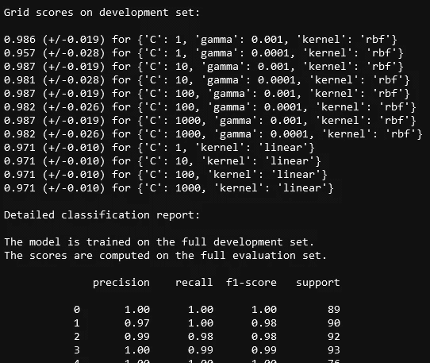

# 每个数据科学家都应该使用的 5 种超参数优化方法

> 原文：<https://towardsdatascience.com/5-hyperparameter-optimization-methods-you-should-use-521e47d7feb0?source=collection_archive---------28----------------------->

## [入门](https://towardsdatascience.com/tagged/getting-started)

## 网格搜索，连续减半和贝叶斯网格搜索…


照片由[马库斯·温克勒](https://unsplash.com/@markuswinkler?utm_source=unsplash&utm_medium=referral&utm_content=creditCopyText)在 [Unsplash](/?utm_source=unsplash&utm_medium=referral&utm_content=creditCopyText) 上拍摄

在每个数据科学项目中，搜索超参数空间以获得最佳性能指标是可能的，也是推荐的。寻找最佳超参数组合是你不想错过的一步，因为它可能会给你精心构思的模型带来它所需要的最终提升。

我们中的许多人默认使用 Scikit-learn 中实现的完善的 GridSearchCV。然而，事实是，根据具体情况，替代的优化方法可能更合适。在本文中，我们将讨论五个选项，并对每个选项进行深入的解释，以及如何在实践中使用它们的指南。

```
**Table Of Contents**
· [How to find my models’ hyperparameters](#20eb)
· [Grid Search](#ec67)
· [Successive Halving](#3163)
· [Bayesian Grid Search](#e190) 
· [Visualizing hyperparameter optimization results](#82f5)
```

# 预热

在开始寻找我们的最佳模型之前，我们想先找到一个数据集和一个模型。

对于数据集，我们将使用一个名为 `datasets`的包，它允许我们轻松下载 500 多个数据集:

我们选择使用[亚马逊美国评论](https://huggingface.co/datasets/viewer/?dataset=amazon_us_reviews&config=Video_Games_v1_00)。目标是使用客户评论来预测其目标特征(归因的星级数)。

下面，我们将定义模型，并尝试优化其超参数:

如果您不熟悉[管道](/4-scikit-learn-tools-every-data-scientist-should-use-4ee942958d9e)，请不要犹豫，看看我们以前的文章！

# 如何找到我的模型的超参数

在我们进入优化部分之前，我们首先需要知道我们的模型的超参数是什么，对吗？为此，有两种简单的方法:

1.  特定型号的 Scikit-learn 文档您可以简单地查找您的 Scikit-learn 型号的文档。您将看到超参数的完整列表，包括它们的名称和可能的值。
2.  使用一行代码，您还可以使用 `get_params`方法来查找给定估计器的所有参数的名称和当前值:

```
model.get_params()
```

既然我们知道如何找到我们的超参数，我们可以继续我们不同的优化选项😉

# 网格搜索

## 这是什么？

网格搜索是一种基于尝试有限数量的超参数值的每个可能组合的优化方法。换句话说，为了决定哪种值的组合能给出最佳结果，我们要考虑所有的可能性，并使用特定的性能指标来衡量每个结果模型的性能。在实践中，网格搜索通常与训练集上的交叉验证相结合。

说到网格搜索，Scikit-learn 给了我们两种选择:

## 穷举网格搜索( [GridSearchCV](https://scikit-learn.org/stable/modules/generated/sklearn.model_selection.GridSearchCV.html)

第一个版本是一个经典版本，它详尽地遍历了超参数值的所有可能组合。得到的模型被逐一评估，并挑选出表现最好的组合。

为了可视化你的网格搜索的结果并获得最佳的超参数，请参考文章结尾的[段落](https://medium.com/p/521e47d7feb0/edit)。

## 随机网格搜索( [RandomizedSearchCV](https://scikit-learn.org/stable/modules/generated/sklearn.model_selection.RandomizedSearchCV.html#sklearn.model_selection.RandomizedSearchCV) )

网格搜索的第二种变体更具选择性。不是遍历超参数的每个可能的组合，而是在可能的估计量中进行选择。事实上，并不是所有的参数值都被尝试过。从作为自变量给出的某个统计分布中抽取选定的固定数量的参数组合。

这种方法提供了选择我们能够承受的计算成本的灵活性。这是通过自变量 `n_iter`固定采样候选数或采样迭代数来实现的。

这里有几点需要提及:

*   **列表**被**统一采样**
*   如文档中所述:

如果所有参数都以**列表**，**显示，则执行无替换**采样。如果至少有一个参数作为**分布**给出，则使用**替换采样**。

*   建议**对连续参数**使用连续分布，以充分利用随机化。这方面的一个很好的例子是上面使用的均匀分布，用于对 TF-IDF 矢量器选择的最大文档频率进行采样。
*   使用 n_iter 控制结果和计算效率之间的权衡。增加 n_iter 总是会得到更好的结果，尤其是在涉及连续分布的情况下。
*   任何函数都可以作为分布传递，只要它实现了用于值采样的 `rvs`方法(随机变量样本)。

# 连续减半

## 这是什么？

scikit-learn 提供的第二种超参数调整方法是连续减半。这种方法包括在越来越多的资源上迭代地选择性能最佳的候选者。

事实上，在第一次迭代中，在少量资源上测试了最大数量的参数组合。随着迭代次数的增加，只有表现最好的候选项被保留。基于它们在大量资源上的性能来比较它们。

💡**在实践中，资源可以是什么？**大多数时候，资源是训练集中的*个样本*。然而，可以选择另一个自定义数字参数，如随机森林算法中的树的数量，将其作为参数传递。

与第一种网格搜索类似，有两种变体:**halvinggridsearccv**和 **HalvingRandomSearchCV** 。

## 连续等分网格搜索([halvinggridsearccv](https://scikit-learn.org/stable/modules/generated/sklearn.model_selection.HalvingGridSearchCV.html#sklearn.model_selection.HalvingGridSearchCV))

scikit-learn 上的连续减半估计器仍处于试验阶段。因此，为了使用它们，您需要有最新版本的 sci kit-learn“0 . 24 . 0”并需要实验功能:

```
from sklearn.experimental import enable_halving_search_cv
```

一旦完成，代码与 GridSearchCV 的完全相似:

为了最大限度地利用连续减半并根据您的需求定制计算成本，有许多相关的论据可供参考:

*   **资源**:您可以利用这个参数来定制每次迭代增加的资源类型。例如，在上面的代码中，我们可以将其定义为随机森林中的树的数量:

甚至是 TFIDF 矢量化中的要素数量:

但是，请确保从 param_grid 字典中删除资源类型。

*   **因子**:此参数为**减半**参数。通过为此参数选择某个值，我们可以选择被选中的候选项的比例以及每次迭代所使用的资源数量:

> n _ 资源 _ { I+1 } = n _ 资源 _i *因子
> 
> n _ 候选人 _ { I+1 } = n _ 候选人 _i /因子

*   **积极消除**:由于在每次迭代中使用的资源量都要乘以**因子**，因此最多只能有 **i_max** 次迭代

> (n _ 资源 _ { i _ max } = n _ 资源 _ { 0 } * factor^{i_max})≤max _ n _ 资源

如果资源的数量不够多，那么在最后一次迭代中剩余的候选数量就不够少。在这种情况下，攻击性淘汰论是有意义的。事实上，如果设置为 True，第一次迭代会执行多次，直到候选项的数量足够少。

## 随机连续减半( [HalvingRandomSearchCV](https://scikit-learn.org/stable/modules/generated/sklearn.model_selection.HalvingRandomSearchCV.html)

就像随机网格搜索一样，随机连续减半类似于常规连续减半，只有一个例外。在这种变型中，从参数空间中随机采样固定选择数量的候选者。这个数字作为一个名为 **n_candidates** 的参数给出。让我们回到我们的代码。如果我们希望应用随机连续减半，相应的代码将是:

# 贝叶斯网格搜索

我们将在本文中讨论的第三个也是最后一个方法是**超参数贝叶斯优化**。为了在 Python 中使用它，我们使用了一个名为 scikit-optimize 的库。该方法被称为[**BayesSearchCV**](https://scikit-optimize.github.io/stable/modules/generated/skopt.BayesSearchCV.html#skopt.BayesSearchCV)**，如[文档](https://scikit-optimize.github.io/stable/auto_examples/sklearn-gridsearchcv-replacement.html)中所述，它*利用贝叶斯优化，其中被称为“代理”的预测模型被用于对搜索空间建模，并被用于尽快达到良好的参数值组合*。**

****随机网格搜索和贝叶斯网格搜索有什么区别？****

**与随机网格搜索相比，该方法的优点是考虑了搜索空间的结构以优化搜索时间。这是通过在记忆中保留过去的评估，并使用该知识来采样最有可能给出更好结果的新候选人来实现的。**

**现在我们对这个方法有了一个清晰的整体概念，让我们继续具体的部分，编码部分。我们将使用一个名为 [scikit-optimize](https://pypi.org/project/scikit-optimize/) 的库。**

**我应该提一下:**

**1-如果您使用 scikit-optimize 的最新版本才能正常工作，您可能需要将 scikit-learn 版本降级为“0.23.2”(我建议您在新环境中这样做):**

```
pip install scikit-learn==0.23.2
```

**2-此外，为了避免任何进一步的错误，请确保通过以下命令安装最新的开发版本:**

```
pip install git+https://github.com/scikit-optimize/scikit-optimize.git
```

**现在我们模型的实际代码应该是:**

# **可视化超参数优化结果**

**为了获得所有候选人表现的完整报告，我们只需要对上面列出的所有方法使用属性 cv_results_ 即可。生成的字典可转换为数据框以提高可读性:**

```
import pandas as pd
results = pd.DataFrame(grid_search.cv_results_)
```

**要获得其他结果项，您只需要以下几行代码:**

## **获胜的候选人:**

```
best_model = grid_search.best_estimator_
```

## **超参数的最佳组合:**

```
params = grid_search.best_params_
```

## **在测试集上尝试最佳候选项后的最佳得分:**

```
score = grid_search.best_score
```

## **网格搜索报告**

**如果你希望在搜索过程中得到实时报告，scikit-learn 的开发人员会好心地发布一段现成的代码来做这件事。结果看起来像这样:**

****

**作者截图**

# **最后的想法**

**当谈到超参数优化时，Python 提供了大量现成的工具供您选择。你可以选择适合你的方法，并根据你的需要进行实验。最佳模型性能和最佳搜索时间之间的权衡通常是对选择影响最大的因素。在任何情况下，重要的是不要忘记这一步，让您的模型有最好的机会表现良好。**

**你可以在这个 [**Github 库**](https://github.com/amal-hasni/hyperparameter_optimization) 中找到所有聚集在一个地方的 Python 脚本。如果您有任何问题，请不要犹豫，在回复部分留言，我们将非常乐意回答。**

**感谢您坚持到现在，注意安全，我们将在下一篇文章中再见！😊**

# **更多文章阅读**

**[](/4-scikit-learn-tools-every-data-scientist-should-use-4ee942958d9e) [## 4 sci kit——每个数据科学家都应该使用的学习工具

### 复合估算器和变压器

towardsdatascience.com](/4-scikit-learn-tools-every-data-scientist-should-use-4ee942958d9e) [](/classification-model-for-source-code-programming-languages-40d1ab7243c2) [## 源代码语言的分类模型

### 大约 97%的准确率

towardsdatascience.com](/classification-model-for-source-code-programming-languages-40d1ab7243c2) 

# 参考

*   [sci kit-learn . org/stable/auto _ examples/model _ selection/plot _ grid _ search _ digits . html](https://scikit-learn.org/stable/auto_examples/model_selection/plot_grid_search_digits.html)
*   [sci kit-learn . org/stable/modules/generated/sk learn . model _ selection。GridSearchCV.html](https://scikit-learn.org/stable/modules/generated/sklearn.model_selection.GridSearchCV.html)
*   [scikit-learn.org/stable/modules/grid_search.html](https://scikit-learn.org/stable/modules/grid_search.html)
*   [scikit-learn . org/stable/auto _ examples/model _ selection/plot _ successful _ halving _ heat map . html # sphx-glr-auto-examples-model-selection-plot-successful-halving-heat map-py](https://scikit-learn.org/stable/auto_examples/model_selection/plot_successive_halving_heatmap.html#sphx-glr-auto-examples-model-selection-plot-successive-halving-heatmap-py)
*   [scikit-learn . org/stable/modules/grid _ search . html # aggressive-elimination](https://scikit-learn.org/stable/modules/grid_search.html#aggressive-elimination)**