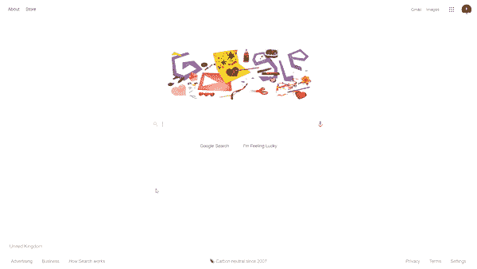

# 下一个 NLP 项目的 5 个想法

> 原文：<https://towardsdatascience.com/5-ideas-for-your-next-nlp-project-c6bf5b86935c?source=collection_archive---------23----------------------->

## [自然语言处理笔记](https://towardsdatascience.com/tagged/nlpnotes)

## 产生一些想法

[史丹利戴](https://unsplash.com/@stanleydai?utm_source=medium&utm_medium=referral)在 [Unsplash](https://unsplash.com?utm_source=medium&utm_medium=referral) 上的照片

自然语言处理(NLP)是人工智能(AI)的一个分支，涉及计算机和自然语言之间的交互。本质上，通过计算分析和表示自然语言，计算机能够理解自然语言，并以类似于人类的方式做出响应。

作为一个初学任何新技术的人，动手实践是学习过程中很重要的一部分。虽然我认为理论知识非常重要，但我不认为它在孤立的情况下是有效的，因为理论并不总是转化为现实世界的场景。采取一种实用的方法是目前为止最好的方式来测试你自己，同时获得在真实环境中工作的经验。

事不宜迟，下面是你下一个 NLP 项目的 5 个想法:

## 头号对话式人工智能

聊天机器人和语音助手属于对话式人工智能的范畴。对话式人工智能允许人工智能(AI)以类似人类的方式与自然语言进行交互。

聊天机器人在企业中有各种各样的使用案例。一些例子包括:

*   客户支持——在线聊天机器人在回答常见问题方面表现出色，因此它们正在取代客户旅程中的许多人工代理。
*   **医疗保健—** [英国的 Babylon Health](https://www.babylonhealth.com/) 是一个很好的例子****展示了对话式人工智能如何让医疗保健服务对患者来说更加实惠和方便。****
*   ******人力资源流程** —随着新冠肺炎的封锁，许多人在家工作，但公司仍在招聘，这意味着员工培训和入职仍是必要的。这些过程可以通过对话式人工智能进行优化。****

## ****#2 自动完成和自动更正****

****“自动完成”和“自动更正”在很多情况下都对我有所帮助。我敢肯定，我们都在智能手机上输入了“omw”，它会自动变为“在我的路上！”或者快要拼错一个单词时，自动更正功能会帮你扭转局面。****

****谷歌的搜索引擎是自动完成和自动更正的一个很好的例子。当我们在搜索引擎机制中输入一些东西时，谷歌会搜索互联网并返回最相关的结果。****

********

****作者 Gif****

****这些技术帮助用户找到更准确的结果，令人疯狂的是，我们大多数人每天都在使用谷歌，因此我们希望一旦我们点击搜索框，这些功能就会出现。为了不断满足客户的期望，自动完成和自动更正都是 NLP 的有价值的应用程序，可以与许多企业集成，因此这是一个非常值得实施的项目。****

## ****#3 文本生成****

****从技术上讲，文本生成属于自然语言生成(NLG)，它是自然语言处理(NLP)的一个子领域。维基百科将 NLG 描述为“一个将结构化数据转化为自然语言的软件过程。它可用于为组织生成长格式内容以自动化自定义报告，以及为 web 或移动应用程序生成自定义内容。”【**来源** : [维基百科](https://en.wikipedia.org/wiki/Natural-language_generation)。****

## ****#4 命名实体识别****

****命名实体识别是信息提取的一个子任务，它试图定位非结构化文本中提到的命名实体并将其分类成预定义的类别，例如人名、组织、位置、医疗代码、时间表达式、数量、货币值、百分比等。【**来源** : [维基百科](https://en.wikipedia.org/wiki/Named-entity_recognition)。****

****命名实体识别(NER)在任何需要对大型文档进行高级概述的情况下都非常有价值。通过实施 NER，您可以轻松地收集正文的要点，并开始根据某些标准(如与其他文本的相关性或相似性)对文档进行分组。一些使用案例包括:****

*   ******客户协助** —客户的请求将被分类到合适的标题中，并提取关键字来确定请求的优先级，以帮助加快响应时间。****
*   ******招聘**——我们可以使用 NER 来总结申请人的简历，并开始将他们分为合适的雇员和不合适的雇员，而不是让人类解析大量的简历。****

## ****#5 情感分析****

****在[情感分析入门](/getting-started-with-sentiment-analysis-731531ec880d)中，我指出“情感分析的目标是使用自然语言处理和机器学习对主观数据进行解释和分类。”。这类问题的许多例子都是使用客户反馈和 twitter 数据来执行的，但是您可以使用任何类型的文本来表达他们的观点或体验。****

****我在以前的博客中已经广泛地讨论了情感分析，我的第一个 NLP 项目是一个情感分析项目。查看下面的 Github 库。****

**** [## kurtispykes/twitter 情绪分析

### 推特已经成为紧急时刻的重要沟通渠道。智能手机的普及使得…

github.com](https://github.com/kurtispykes/twitter-sentiment-analysis) 

## 包裹

在这个时代，项目可能比简历更可行。如果你希望学习一项新技术或进入一个新领域，参与一个项目是取得成功的最佳途径。一定要从错误中吸取教训，当你遇到困难时，不要害怕寻求帮助。

感谢阅读！在 [LinkedIn](https://www.linkedin.com/in/kurtispykes/) 和 [Twitter](https://twitter.com/KurtisPykes) 上与我联系，了解我在数据科学、人工智能和自由职业方面的最新动态。

## 相关文章

 [## 情绪分析:预测一条推文是否是关于一场灾难

### 探索自然语言处理

towardsdatascience.com](/sentiment-analysis-predicting-whether-a-tweet-is-about-a-disaster-c004d09d7245)  [## 面向 NLP 爱好者的 7 个免费在线资源

### 一定要将它们加入书签

pub.towardsai.net](https://pub.towardsai.net/7-free-online-resources-for-nlp-lovers-26b1e0bba343)  [## 2021 年获得数据科学职位的提示

### 遵循这个指南

towardsdatascience.com](/tips-to-land-a-data-science-role-in-2021-465dbb409f19)****