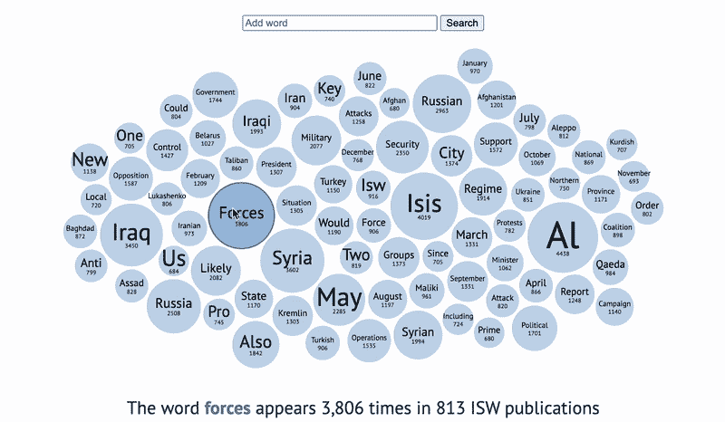
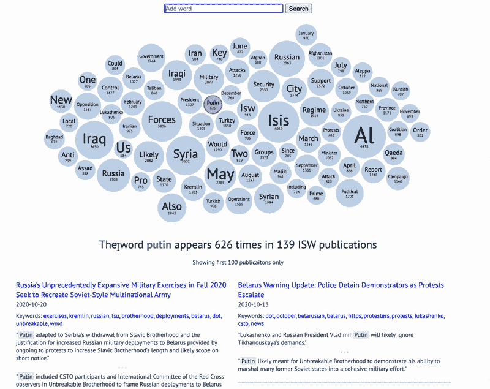
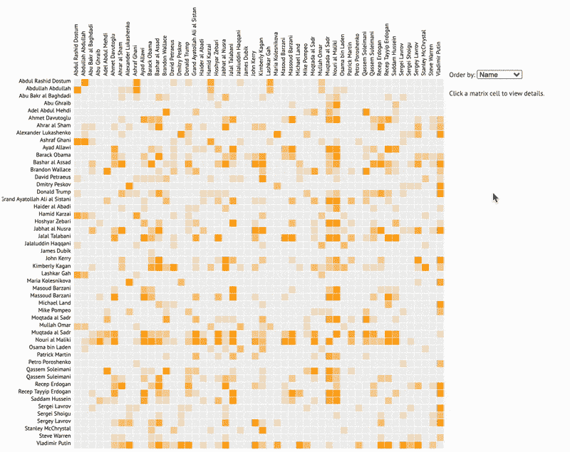
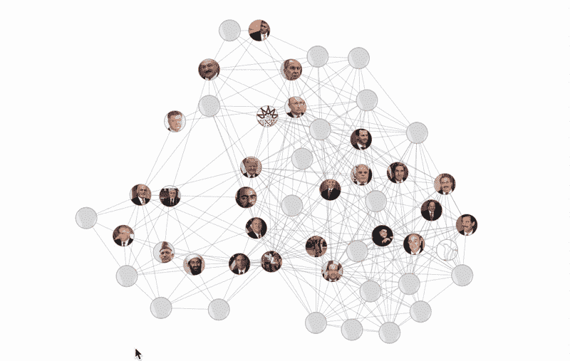
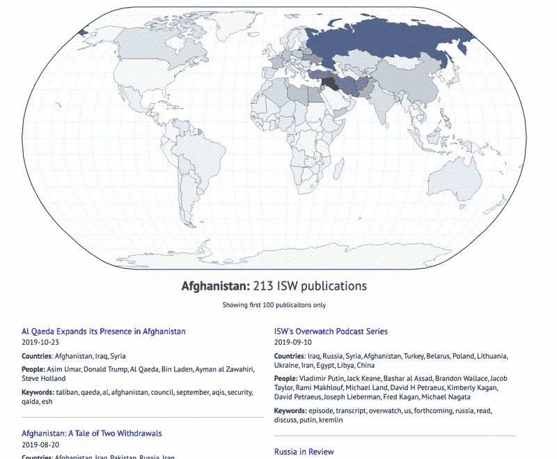
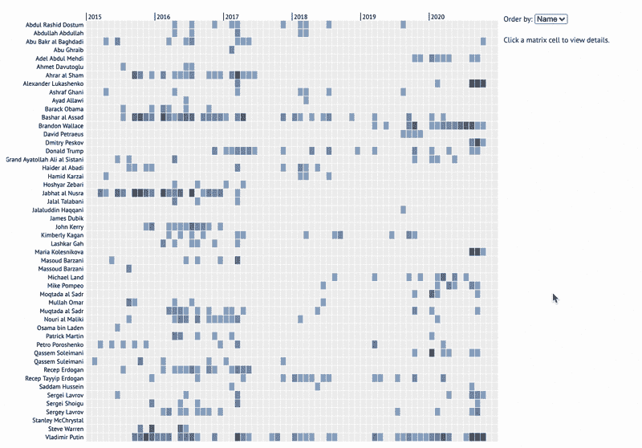

# 5 个用于浏览在线出版物的交互式图表

> 原文：<https://towardsdatascience.com/5-interactive-charts-for-exploring-online-publications-cf9a289d5d24?source=collection_archive---------40----------------------->

## 使用文字气泡、网络图和地图来发现大量文章中的内容

使用可搜索单词气泡图查找正在撰写的内容。(图片由作者提供)

*要查看本文中包含的图表的实时版本，以及用于创建它们的代码，请在这里* *查看我的 GitHub 项目资源库* [*。*](https://github.com/rhammell/isw-visuals)

在处理文本数据集时，掌握内容的“谁、什么和哪里”可能是一个挑战。对于大量的在线文章来说尤其如此。

文章呈现的非结构化文本使得从整体上检查集合变得困难。相反，机器学习和数据科学技术可以解析出关键信息——标题、日期、关键词、名称、位置——以创建更容易导航的结构化数据集。

在本文中，我将重点介绍五个用于可视化这些结构化数据集之一的交互式图表，目的是探索其中存在的趋势和关系。

# 数据集

[ISW 数据集](https://www.kaggle.com/connerbrew2/isw-web-scrape-and-nlp-enrichment?select=isw_products.json)包含来自[战争研究所](http://www.understandingwar.org/)发表的 1700 多篇文章的数据。ISW 的文章涵盖了来自世界各地的广泛的政治话题，并被情报专业人士用来了解最新的时事。

数据集的创建记录在另一篇[文章](/something-from-nothing-use-nlp-and-ml-to-extract-and-structure-web-data-3f49b2f72b13)中，其中描述了用于收集文章的网络搜集过程，以及用于丰富文章的自然语言处理技术。请参阅本文，了解该数据集存在哪些字段。

ISW 文章中的许多重要信息都与有新闻价值的事件中的人物、地点和日期有关。下面的图表旨在以一种简单易懂、直观的方式发现这些信息。

# 可搜索单词气泡

当探索一个大的文本数据集时，首要目标是找出哪些单词在其中使用得最频繁。了解这一点可以洞察内容的整体主题和任何报道模式。

[可搜索单词气泡图](https://rhammell.github.io/isw-visuals/word-bubble.html)将单词云的视觉效果与关键词搜索的结果结合在一起:

点击查看现场演示[。(图片由作者提供)](https://rhammell.github.io/isw-visuals/word-bubble.html)

## 它是如何工作的

*   单个单词显示为圆形节点，根据它们在文章集合中出现的频率来确定大小。
*   单词和次数显示在节点内。
*   只需在搜索栏中键入新单词，即可将其添加到图表中。
*   点击一个节点将显示其搜索结果，显示该词出现的每篇文章和单个句子。

图表最初由数据集中被识别为关键词的词填充，这些词是使用 NLP 技术为每篇 ISW 文章提取的。

仅通过查看上面的图表，就可以开始推断 ISW 数据集中的趋势——它集中于涉及中东的故事，俄国是一个主导话题，许多与冲突相关的术语被重复使用。

有了这些初步的见解，就有可能更深入地探究一个话题。点击“俄罗斯”节点将显示所有提到该词的文章，突出显示的句子给出了报道内容的即时背景。

很容易看出这种图表的好处。它为用户提供了两全其美的东西——关于数据集包含什么的初始线索，以及进一步搜索感兴趣的特定项目的能力。

# 共生矩阵

ISW 数据集包含从每篇文章中提取的人名。光是这些名字的列表就提供了关于收藏主题的信息，但更有趣的是它们之间的关系。

一个[共现矩阵](https://rhammell.github.io/isw-visuals/co-occurrence.html)可视化了一篇文章中两个人被提及的频率:

看现场演示[这里](https://rhammell.github.io/isw-visuals/co-occurrence.html)(图片由作者提供)

## 它是如何工作的

*   该矩阵沿 X 轴和 Y 轴排列有人名。
*   每个彩色单元格代表两个相应的人在同一篇 ISW 文章中被提及的次数，颜色越深的单元格代表的次数越多。
*   点击任何一个单元格都会在侧边菜单中显示两个人的名字和照片，以及他们出现的所有文章的列表。
*   行和列可以按字母顺序或总提及次数重新排序。

知道两个人在同一篇文章中被写了多少次有助于理解他们的关系。一起频繁提及可能表明他们通过主题联系在一起，或者经常涉及相同的新闻事件。

很容易跟踪任何一个人的专栏，以确定与他们相关的每个人。点击每个单元格并阅读链接的文章可以让用户更好地了解个人之间的关系。

感兴趣的人，那些和许多其他人有联系的人，在图表上以密集填充的列和行突出出来。例如，弗拉德米尔·普京和其他人一起被广泛地写了出来，他在图表上的单元格被填满了。

# 网络链路图

共现矩阵非常适合显示一对一的联系，但可能不是跟踪贯穿整个组的一串联系的最佳方法。

一个[网络链接图](https://rhammell.github.io/isw-visuals/force-directed.html)将多人之间的联系可视化:

看现场演示[这里](https://rhammell.github.io/isw-visuals/force-directed.html)(图片由作者提供)

## 它是如何工作的

*   每个人都被表示为一个包含他们照片的圆形节点
*   连接节点的线条表示这两个人一起出现在至少一篇 ISW 文章中
*   将鼠标悬停在节点上以突出显示其连接。单击并拖动以将节点固定到位。双击以取消固定。

一个所有人之间的所有联系同时显示出来的视图有它自己的好处。一旦找到感兴趣的人，就可以很快看到与他们有联系的每个人。将鼠标光标移动到这些人身上，就可以很容易地看到他们的次级联系。

锁定节点的位置允许用户开始在空间上组织网络。将关键节点拉向边缘，或者将相似的人群聚集在一起，可以帮助直观地解析信息。

# 世界地图

ISW 数据集还包括从每篇文章中提取的国家名称。大部分内容都与事件发生的地点有关，因此能够按位置搜索文章非常有用。

一张互动的[世界地图](https://rhammell.github.io/isw-visuals/world-map.html)让用户可以准确地看到哪些国家被写得最多:

看现场演示[这里](https://rhammell.github.io/isw-visuals/world-map.html)(图片由作者提供)

## 它是如何工作的

*   地图国家根据国家在数据集中被提及的次数进行颜色编码，颜色越深的国家被提及的次数越多。
*   将鼠标放在任何一个国家上，可以看到它的名字和被提及的次数，点击它可以显示链接和文章的详细信息。

这个图表简单但有效。在没有数据集的任何先验知识的情况下，很容易看出大多数报道集中在中东和俄罗斯。只需点击几下鼠标，就能找到与感兴趣的国家相关的文章。

# 入库时间线

知道“谁”被写是一回事，但是知道“什么时候”他们被写也能提供很多洞察力。

一条[入库的时间线](https://rhammell.github.io/isw-visuals/timeline.html)将人们被描写的年月形象化:

看现场演示[这里](https://rhammell.github.io/isw-visuals/timeline.html)(图片由作者提供)

## 它是如何工作的

*   图表的 Y 轴列出了人名。X 轴显示一个分格的时间线，其中每个单元格代表一年中的一个月。
*   单元格按计数着色，颜色越深代表该人当月被提及的文章越多。
*   点击任一单元格将在侧边菜单中显示所选人员的姓名和照片，以及他们出现的文章列表。
*   名字可以按字母顺序排列，也可以按数量排列。

使用从上述文章中提取的相同名称，以及它们出现的文章的出版日期，可以跟踪这些年来的报告趋势。

快速浏览一下图表，趋势就很明显了。例如，对约翰·克里的报道主要存在于 2016 年，当时他担任国务卿。谢尔盖·拉夫罗夫从 2017 年到 2019 年有两年的时间，那时他根本没有被写过。

对于任何给定的人，对他们的报告何时开始、何时停止以及存在的任何差距都是显而易见的。该图表对任何希望探索其数据集中的长期趋势的用户都是有益的。

# 拿走

以上图表都是视觉效果的例子，旨在使数据更容易获取和理解。它们有助于将太大而无法手动探索的数据集转换成更容易接近的小块。

使用这些图表在您自己的基于文本的数据集中发现信息。在这里 看看他们每个人的源代码 [*。*](https://github.com/rhammell/isw-visuals)