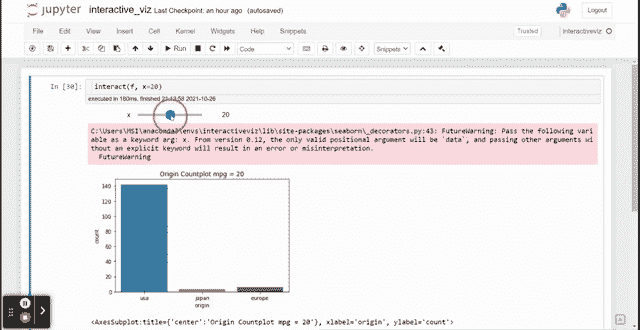
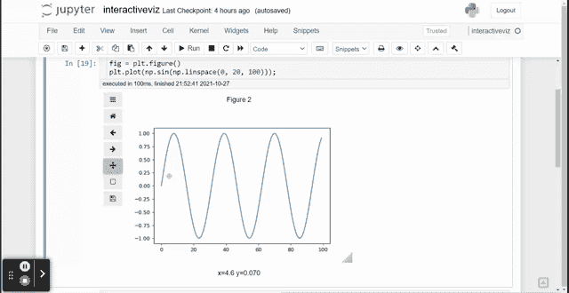

# 5 个有趣的 Jupyter 交互式可视化扩展

> 原文：<https://towardsdatascience.com/5-interesting-jupyter-interactive-visualization-extensions-ab030c8d0eb9?source=collection_archive---------6----------------------->

## Jupyter 环境中有趣的交互式数据可视化工具


作者图片

可视化是数据分析的重要组成部分。如果没有可视化，我们将很难从数据中总结信息。然而，有时我们希望有一个动态的可视化来简化我们的分析活动。

幸运的是，Jupyter Notebook 有许多可视化扩展，我们可以使用它们从您的笔记本中创建交互式可视化。这些扩展是什么，如何使用它们？让我们探索五个有趣的 Jupyter 交互式可视化扩展。

# 1.ipywidgets

Jupyter extensions[ipywidgets](https://github.com/jupyter-widgets/ipywidgets)是一个交互式 HTML Jupyter widgets 笔记本。该软件包允许您创建一个小部件，通过交互式 GUI(如滑块、复选框、文本字段等)来控制您的数据。如果我们想在 Jupyter Notebook 上手动创建一个基于 GUI 的可视化，这是非常有用的。

首先，我们需要安装扩展包。

```
pip install ipywidgets
```

使用 ipywidgets，我们可以定制 Jupyter 笔记本小部件。让我们探索一下可用的基本小部件。

```
from ipywidgets import interact#Basic ipywidgets interact would generate UI from the functiondef f(x):
    return x
```

ipywidgets 扩展与基础交互，从函数生成 UI。生成的 UI 将取决于传递给我们的数据类型。让我们尝试传递整数数据。

```
interact(f, x=10)
```


作者图片

传递整数值将返回 slider UI。接下来，让我们使用布尔数据。

```
interact(f, x=True)
```


作者图片

布尔值将返回复选框。最后，让我们使用字符串值。

```
interact(f, x='hi')
```


所有的 UI 都很棒，但是如何将它应用到可视化中呢？我们需要创建我们的函数来返回所有的交互式可视化。让我们用 Seaborn 包把它和 ipywidgets 结合起来。

```
import seaborn as sns
import matplotlib.pyplot as pltmpg = sns.load_dataset('mpg')def f(x):
    img = sns.countplot(mpg[mpg['mpg']<x]['origin']) 
    plt.title('Origin Countplot mpg = {}'.format(x))
    return img
```



作者 GIF

当我们移动滑动条时，我们将执行函数，当我们用滑块 ipywidget 过滤它时，返回“原点”的计数图。如果你想了解更多关于 ipywidgets 的功能，你可以在这里[阅读。](https://github.com/jupyter-widgets/ipywidgets)

# 2.熊猫-侧写

[Pandas-Profiling](https://pandas-profiling.github.io/pandas-profiling/docs/master/rtd/pages/introduction.html) 是一个探索性的软件包，可以在我们的 Jupyter 笔记本上生成交互式 HTML 报告。熊猫概况的基本报告显示在下面的 GIF 中。


作者 GIF

正如我们从 GIF 中看到的，生成的报告是 Jupyter 笔记本中的一个交互式 HTML 报告。你如何生成这个？让我们用样本数据来尝试一下。

首先，我们需要安装 Pandas-Profiling 包。

```
#Installing via pip
pip install -U pandas-profiling[notebook]#Enable the widget extension in Jupyter
jupyter nbextension enable --py widgetsnbextension#or if you prefer via Conda
conda env create -n pandas-profiling
conda activate pandas-profiling
conda install -c conda-forge pandas-profiling#or if you prefer installing directly from the source
pip install [https://github.com/pandas-profiling/pandas-profiling/archive/master.zip](https://github.com/pandas-profiling/pandas-profiling/archive/master.zip)#in any case, if the code raise an error, it probably need permission from user. To do that, add --user in the end of the line.
```

安装完软件包后，我们就可以生成报告了。让我们使用之前的 mpg 样本数据。

```
#Importing the function
from pandas_profiling import ProfileReport#Generate the report. We would use the mpg dataset as sample, title parameter for naming our report, and explorative parameter set to True for Deeper exploration.profile = ProfileReport(mpg, title='MPG Pandas Profiling Report', explorative = True)profile
```

过了一段时间，报告就会出现，您就可以研究 HTML 了。


作者图片

报告选择如上图所示。您可以尝试所有选项来探索数据。如果你想更深入地挖掘这个包，你可以阅读下面我以前的文章。

[](/fantastic-pandas-data-frame-report-with-pandas-profiling-a05cde64a0e2) [## 带有熊猫档案的神奇熊猫数据框报告

### 将您的基本报告提升到下一个级别

towardsdatascience.com](/fantastic-pandas-data-frame-report-with-pandas-profiling-a05cde64a0e2) [](/data-frame-eda-packages-comparison-pandas-profiling-sweetviz-and-pandasgui-bbab4841943b) [## 数据框 EDA 软件包比较:Pandas Profiling、Sweetviz 和 PandasGUI

### 哪些熊猫数据框 EDA 包适合你？

towardsdatascience.com](/data-frame-eda-packages-comparison-pandas-profiling-sweetviz-and-pandasgui-bbab4841943b) 

# 3.ipympl

Jupyter-Matplotlib 或 [ipympl](https://github.com/matplotlib/ipympl) 是一个 Jupyter 笔记本扩展，支持在 Jupyter 笔记本中进行交互式 Matplotlib 可视化探索。

如果我们需要使用 matplotlib 进行快速可视化，这种探索是简单而强大的。我们先试着安装包。

```
pip install ipympl
```

当你安装完这个包之后，你需要在你的 Jupyter 笔记本中使用下面这个神奇的命令来启用 ipympl 扩展:`%matplotlib widget`。

让我们用示例数据尝试一下 matplotlib 扩展。

```
%matplotlib widgetimport matplotlib.pyplot as plt
import numpy as npfig = plt.figure()
plt.plot(np.sin(np.linspace(0, 20, 100)));
```



作者 GIF

正如您在上面的图像中看到的，我们的 matplotlib 可视化变成了一个交互式可视化，您可以在绘图中平移和缩放。

我们可以用数据集传递另一种 matplotlib 绘图。让我们用之前的 mpg 数据集来试试。

```
fig = plt.figure()
plt.scatter(mpg['mpg'], mpg['horsepower'])
```


作者 GIF

只要可视化基于 matplotlib 包，我们就可以在绘图中传递交互式小部件。这就是为什么它可以与另一种 matplotlib 可视化一起工作。

您可以使用 ipympl 实现类似于 ipywidgets 的其他小部件；不过，我觉得 ipywidgets 包已经涵盖了很多功能。如果您对 ipympl 小部件感兴趣，您可以探索一下[示例](https://github.com/matplotlib/ipympl/blob/master/examples/ipympl.ipynb)。

# 4.itables

如果你想要一个交互式的熊猫数据框架表，你可能需要安装 [itables](https://github.com/mwouts/itables) 包扩展。该包允许您在数据框中进行简单的探索。


作者 GIF

如何启用这个扩展？让我们先安装软件包。

```
pip install itables
```

当您完成软件包的安装后，您只需要运行下面的代码。

```
from itables import init_notebook_mode
init_notebook_mode(all_interactive=True)
```

您的数据框将自动具有类似于上述 GIF 的交互式扩展。如果只想显示一个系列或数据框，可以使用下面的代码。

```
from itables import showshow(mpg[['mpg', 'name']])
```


作者图片

# 5.ipycanvas

你想拥有一个可以在 Jupyter 笔记本上玩的交互式画布吗？如果是这样，那么您应该尝试一下 [ipycanvas](https://github.com/martinRenou/ipycanvas) 包扩展。这些扩展允许你在你的 Jupyter 笔记本中创建一个可绘制的画布。让我们先安装软件包。

```
pip install ipycanvas orjson
```

安装包后，让我们试着从[笔记本示例](https://hub.gke2.mybinder.org/user/martinrenou-ipycanvas-dmhnu9b2/lab/tree/examples/hand_drawing.ipynb)启动一个手绘画布。

```
from ipywidgets import Image,ColorPicker, IntSlider, link, AppLayout, HBox, RoughCanvas, hold_canvaswidth = 800
height = 800canvas = RoughCanvas(width=width, height=height)drawing = False
position = None
shape = []def on_mouse_down(x, y):
    global drawing
    global position
    global shapedrawing = True
    position = (x, y)
    shape = [position]def on_mouse_move(x, y):
    global drawing
    global position
    global shapeif not drawing:
        returnwith hold_canvas(canvas):
        canvas.stroke_line(position[0], position[1], x, y)position = (x, y)shape.append(position)def on_mouse_up(x, y):
    global drawing
    global position
    global shapedrawing = False

    with hold_canvas(canvas):
        canvas.stroke_line(position[0], position[1], x, y)
        canvas.fill_polygon(shape)shape = []canvas.on_mouse_down(on_mouse_down)
canvas.on_mouse_move(on_mouse_move)
canvas.on_mouse_up(on_mouse_up)canvas.stroke_style = '#749cb8'picker = ColorPicker(description='Color:', value='#749cb8')link((picker, 'value'), (canvas, 'stroke_style'))
link((picker, 'value'), (canvas, 'fill_style'))HBox((canvas, picker))
```


作者图片

在上面的图片中，我正在玩我用上面的代码创建的画布。你可以试着点击画布，画一些有趣的东西。

如果你还想看看 ipycanvas 能做什么，你可以在这里阅读整个文档[。](https://ipycanvas.readthedocs.io/en/latest/?badge=latest)

# **结论**

Jupyter Notebook 是数据科学家使用最多的 IDE 之一，因为它提供了多功能性。数据可视化等活动通常也在笔记本上完成。为了帮助这项活动，我概述了五个有趣的 Jupyter 扩展交互可视化。它们是:

1.  ipywidgets
2.  熊猫-侧写
3.  ipympl
4.  itables
5.  ipycanvas

希望有帮助！

在我的[**LinkedIn**](https://www.linkedin.com/in/cornellius-yudha-wijaya/)**或 [**Twitter**](https://twitter.com/CornelliusYW) 上访问我。**

# **如果您喜欢我的内容，并希望获得更多关于数据或数据科学家日常生活的深入知识，请考虑在此订阅我的[简讯。](https://cornellius.substack.com/welcome)**

> ***如果您不是作为中等会员认购，请考虑通过* [*我的推荐*](https://cornelliusyudhawijaya.medium.com/membership) *进行认购。***