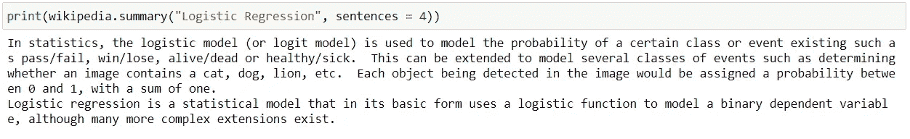
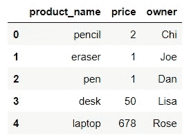
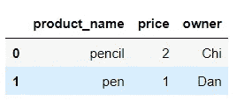
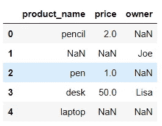
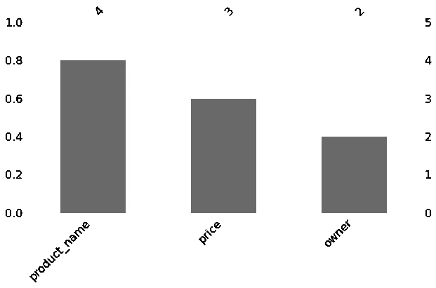
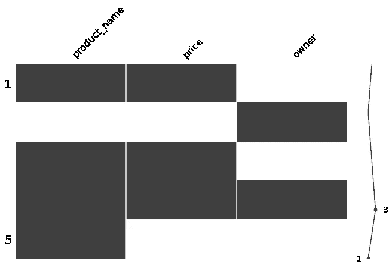
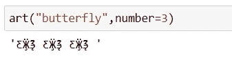
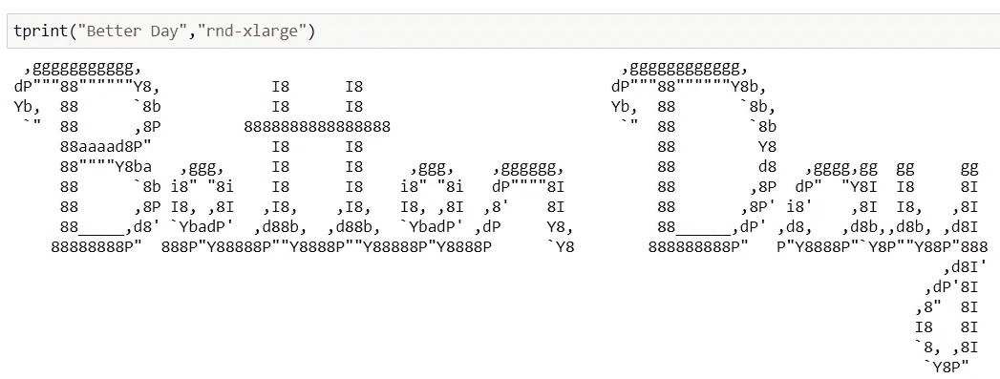
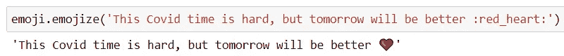
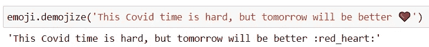

# 你可能错过的 5 个有趣的 Python 库

> 原文：<https://towardsdatascience.com/5-interesting-python-libraries-that-you-might-have-missed-3ee7cb4f099e?source=collection_archive---------23----------------------->


[约书亚·科尔曼](https://unsplash.com/@joshstyle?utm_source=medium&utm_medium=referral)在 [Unsplash](https://unsplash.com?utm_source=medium&utm_medium=referral) 上拍照

# 介绍

每周，我的团队都会举行一次分享会，在会上我们分享、教授和学习与数据相关的一切。我知道 Python 有很多强大的软件包，可以帮助我们更容易地编码。然而，在我为一次团队会议所做的研究中，我发现有这么多我从未见过的有趣的模块/库。在这篇文章中，我想和大家分享一些有用的软件包。

现在，让我们看看这里有什么！

# 维基百科(一个基于 wiki 技术的多语言的百科全书协作计划ˌ也是一部用不同语言写成的网络百科全书ˌ 其目标及宗旨是为全人类提供自由的百科全书)ˌ开放性的百科全书

你有没有遇到过这样的情况:你正在解决一个问题，但是却在纠结一些你不理解或者不知道它们是什么意思的术语？我有过，很多次。这就是为什么当我看到这个模块的时候，我想:“哦。我真幸运！”。相信我，会有帮助的。

首先，安装`wikipedia.`,然后，如果您希望获得您想知道的任何内容的特定数量的摘要句子，只需将它作为参数传递给下面的`summary()`函数。例如，我在下面做的是找出逻辑回归的解释。

```
!pip install wikipedia
import wikipedia
```



图 1:我试图找出什么是逻辑回归

# Pandasql

你是 Python 的新手，你想用更简单、更类似于你的东西来操作数据，比如 SQL？试试`pandas`套餐。它允许您使用 SQL 语法查询 pandas 数据帧。

安装`pandasql`并导入`sqldf`。下面是一个简单的数据框，向您展示这个有用的包是如何工作的。

```
!pip install -U pandasql
from pandasql import sqldfdata = {'product_name': ['pencil', 'eraser', 'pen', 'desk', 'laptop'],
        'price': [2, 1, 1, 50, 678], 
        'owner': ['Chi','Joe','Dan','Lisa','Rose']}df = pd.DataFrame(data)
df
```



图 2:一个简单的数据集

选择 ***product_name*** 包含 ***pen*** 的数据。

```
query = '''Select * from df where product_name like "pen%"'''
sqldf(query)
```



图 3:用 sqldf 查询后

# 米辛戈

处理缺失值是我们在每个分析或数据科学项目中需要处理的不可或缺的任务。这个库使得可视化缺失数据变得比以往更加方便。

让我们再次创建一个包含空值的简单数据集，看看这个包是如何工作的。

```
data = {'product_name': ['pencil', np.nan, 'pen', 'desk', 'laptop'],
        'price': [2, np.nan, 1, 50, np.nan], 
        'owner': [np.nan,'Joe',np.nan,'Lisa',np.nan]}
df = pd.DataFrame(data)
df 
```



图 4:具有空值的数据

只用一行代码就可以用条形图和矩阵来可视化缺失值。

```
mi.bar(df, figsize = (10,5)) 
```



图 5:展示每列中缺失值的条形图

```
mi.matrix(df, figsize = (11,4))
```



图 6:显示缺失值的矩阵

图 5 和图 6 显示了缺失值的数量。在图 6 中，我们甚至可以在每一列中看到这些缺失的位置。

这个库值得更深入地研究。强烈推荐！

# 艺术

好的。有些人可能认为这不是一个有用的包，但不要否认这是一个有趣的包。它让像编码这样严肃的事情变得更加有趣。

```
!pip install art
from art import *
```

安装导入`art`包后，还有很多有趣的东西可以探索。

## 1.art()函数

该函数在正常模式下返回一幅或多幅艺术作品作为`str`。看看这个美丽的:



图 7: art()函数

## 2.tprint()函数

这个函数打印 ASCII 文本，并且每次刷新时图片都是随机的。



图 8: tprint()函数

# 表情符号

表情符号是我想分享的另一个有趣的包。这个有没有用还得看。但对我来说，它帮助我进行情绪分析，我必须区分积极和消极。表情符号确实有帮助。

我下面例子中的红心表情符号帮助你知道这是一个乐观的信息。你可以用`demojize.`反过来分析这个符号

```
!pip install emoji
import emoji
```



图 9:积极向上的红心



图 10:解码红心

很酷，对吧？

# 结局

每天学习新东西是很棒的。如果你有什么要分享的，请随时回复。