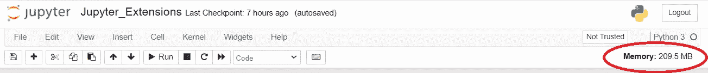
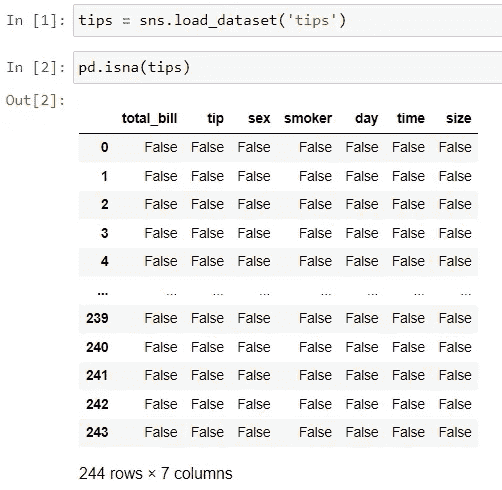
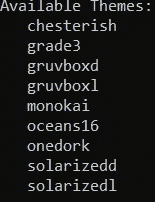
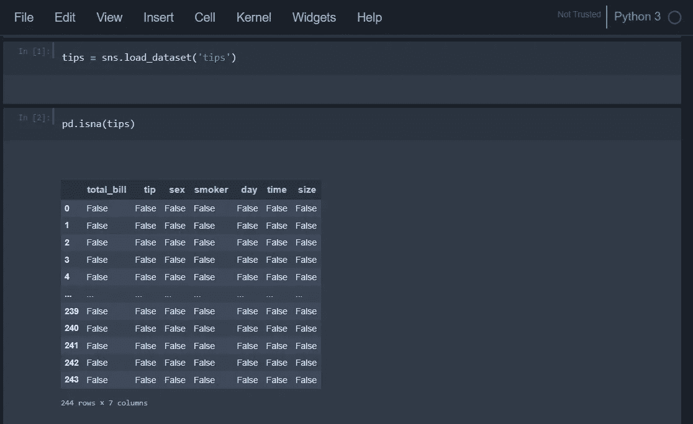
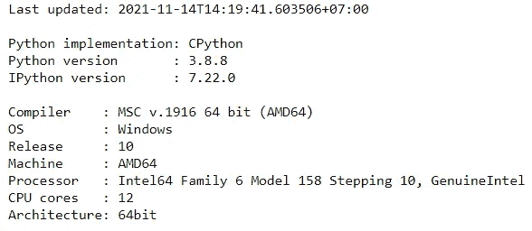
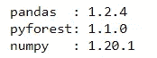

# 5 款 Jupyter 扩展，提高您的工作效率

> 原文：<https://towardsdatascience.com/5-jupyter-extensions-to-improve-your-productivity-8d7977340439?source=collection_archive---------10----------------------->

## 这些软件包将扩展 Jupyter 笔记本的功能


克里斯托夫·高尔在 [Unsplash](https://unsplash.com?utm_source=medium&utm_medium=referral) 拍摄的照片

Jupyter Notebook 是许多数据专家分析数据和开发机器学习模型的流行 IDE，因为它的可用性和实用性。该笔记本已经是一个初学者友好的 IDE 使用，并可以进一步扩展，以提高您的数据活动的生产力与一点点调整。

出于以上原因，我想在本文中概述我的五个 Jupyter 扩展来提高您的工作效率。让我们开始吧！

# 1.jupyter-资源-使用

您是否遇到过 Jupyter 笔记本因为内存问题而变慢或崩溃的情况？当我们探索占用大量内存的大数据或繁重的建模计算过程时，这种情况经常发生。

为了控制内存问题，我们可以使用 [jupyter-resource-usage](https://github.com/jupyter-server/jupyter-resource-usage) 扩展来显示笔记本中的内存使用情况。这个扩展工作很简单；您当前笔记本服务器和子服务器中的所有资源都将显示在右上方。让我们试着安装扩展。

```
pip install jupyter-resource-usage
```

当你完成软件包的安装后，试着重启 Jupyter 并访问你的 Jupyter 笔记本。内存显示现在应该在您的笔记本中可用。



作者图片

如果你想限制分配的资源，你可以使用这里介绍的各种方法来控制它们。

# 2.pyforest

每当您在一个新的环境中工作或者开发一个新的项目时，您必须导入所有需要的包。这不是一个交易破坏者，但有时重新导入所有的包并不愉快。这就是为什么 [pyforest](https://github.com/8080labs/pyforest#frequently-asked-questions) 被开发出来。

pyforest 扩展是一个从 [Bamboolib](https://bamboolib.com/) 开发者那里自动导入的流行 python 包。这个扩展将你的工作流程转变为自动导入如此流行的包，如`pandas`、`numpy`、`sklearn`等等。你可以点击查看列表[。](https://github.com/8080labs/pyforest/blob/master/src/pyforest/_imports.py)

让我们尝试安装 pyforest 扩展。

```
pip install --upgrade pyforest
python -m pyforest install_extensions
```

完成软件包安装后，您应该重新启动 Jupyter 以使 pyforest 自动导入生效。让我们看看扩展是否发生了。



作者图片

从上面的图片可以看出，我没有导入任何 seaborn 或 pandas 包，但是我可以在我的 Jupyter 笔记本中自动使用它。pyforest 扩展会自动导入这个带有流行缩写的包(seaborn 是 sns，pandas 是 pd，等等。).

您不需要担心内存分配，因为 pyforest 最初并不导入所有的包，而是在您执行使用特定包的代码时只导入所需的包。

# 3.jupyter-主题

顾名思义， [jupyter-themes](https://github.com/dunovank/jupyter-themes) 是 jupyter 笔记本的扩展，可以改变主题。这个扩展也改变了我们的绘图，降价，熊猫数据框，等等。所以，主题的改变不仅仅局限于 Jupyter 笔记本的背景。

让我们试着安装 jupyter 主题。您可以使用下面的代码来安装这个包。

```
pip install jupyterthemes
```

安装后，您可以通过 CLI 访问 jupyter-themes 来更改 jupyter 笔记本主题。首先，让我们在命令提示符下使用下面的代码来看看有哪些主题可用。

```
jt -l
```



作者图片

默认有九个主题可供我们选择。让我们尝试其中一个主题，比如说“切斯特主义”。

```
jt -t chesterish
```

要查看 Jupyter 笔记本中的更改，您需要重新启动服务器。之后，你会看到你的笔记本类似下图。



作者图片

如果您想将主题重置为默认主题，可以使用下面的代码进行重置。

```
jt -r
```

你仍然可以用 jupyter-theme 做很多事情，比如控制颜色、单元格宽度、隐藏特定的工具栏等等。你可以在他们的[页面](https://github.com/dunovank/jupyter-themes)上阅读所有的命令。

# 4.jupyter-通知

[jupyter-notify](https://github.com/shoprunner/jupyter-notify) 扩展是一个 jupyter 笔记本扩展，用于在我们的手机运行完毕时通知我们。当运行耗时的建模过程或清理活动，并且您想在等待时做些别的事情时，此扩展非常有用。

首先，我们需要使用下面的代码来安装这个包。

```
pip install jupyternotify
```

安装完这个包后，您需要通过运行下面的神奇命令代码将通知加载到您的 Jupyter 笔记本中。

```
%load_ext jupyternotify
```

设置已准备就绪；让我们试着运行笔记本并得到通知。例如，我们将使用下面的代码。

```
%%notify
import time
time.sleep(2)
print('Finish Trying Notifiy')
```


作者图片

在单元格中使用神奇的命令`%%notify`,当我们运行完代码时，我们会得到类似上图的通知。如果您希望在通知中包含特定的消息，您可以像下面的示例一样添加该消息。

```
%%notify -m "Execution done"

time.sleep(2)
print('Finish Trying Notifiy')
```


作者图片

在 magic 命令后添加`-m`参数将允许您编辑消息。如果您需要得到特定消息的通知，这将会很有帮助。

# 5.水印

[水印](https://github.com/rasbt/watermark)扩展是一个神奇的命令，允许我们通过 Jupyter 笔记本环境打印硬件、版本、时间和更多信息。如果我们在探索过程中很快需要这些信息，这是很有帮助的。

要安装这个包，我们需要使用下面的代码。

```
pip install watermark
```

安装完这个包之后，我们可以通过运行下面的代码在笔记本中加载这个扩展。

```
%load_ext watermark
```

让我们试试 Jupyter 笔记本的扩展功能。首先，我们可以运行下面的代码来获取硬件信息。

```
%watermark
```



作者图片

默认情况下，神奇的命令`%watermark`会给我们硬件信息。我们可以使用水印获取很多信息，例如，我们在 Jupyter 笔记本环境中导入的包版本。

```
%watermark --iversion
```



作者图片

如果你想知道所有可用的命令，你可以访问主[页面](https://github.com/rasbt/watermark)。

# 结论

Jupyter Notebook 是数据专家最常用的 IDE 之一，为了提高使用这个 IDE 的效率，我概述了我的五个扩展；它们是:

1.  jupyter-资源-使用
2.  pyforest
3.  jupyter-主题
4.  jupyter-通知
5.  水印

希望有帮助！

在我的[**LinkedIn**](https://www.linkedin.com/in/cornellius-yudha-wijaya/)**或 [**Twitter**](https://twitter.com/CornelliusYW) 上访问我。**

> ***如果您喜欢我的内容，并希望获得更多关于数据或数据科学家日常生活的深入知识，请考虑在此订阅我的* [***简讯。***](https://cornellius.substack.com/welcome)**

> ***如果您不是中等会员认购，请考虑通过* [*我的推荐*](https://cornelliusyudhawijaya.medium.com/membership) *进行认购。***