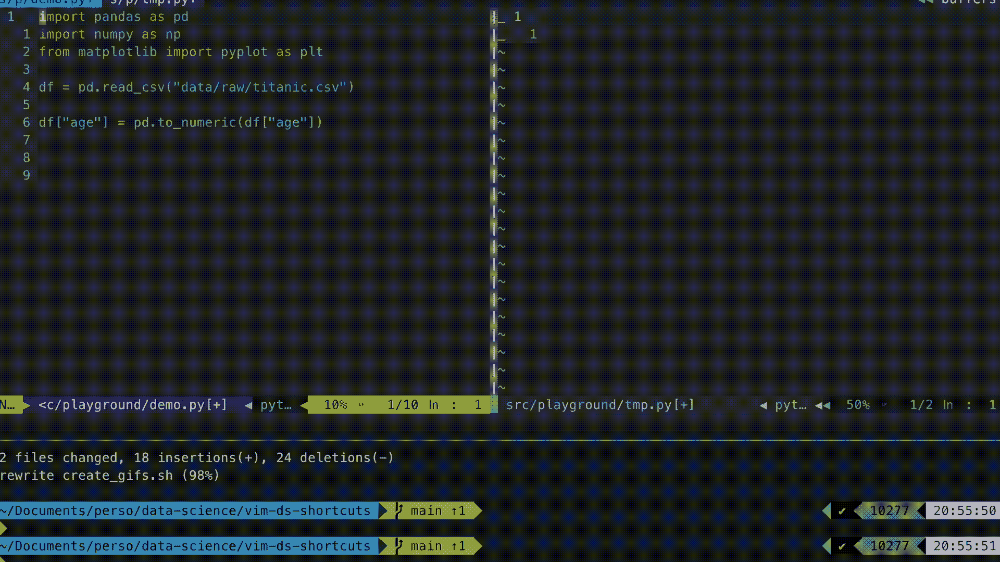
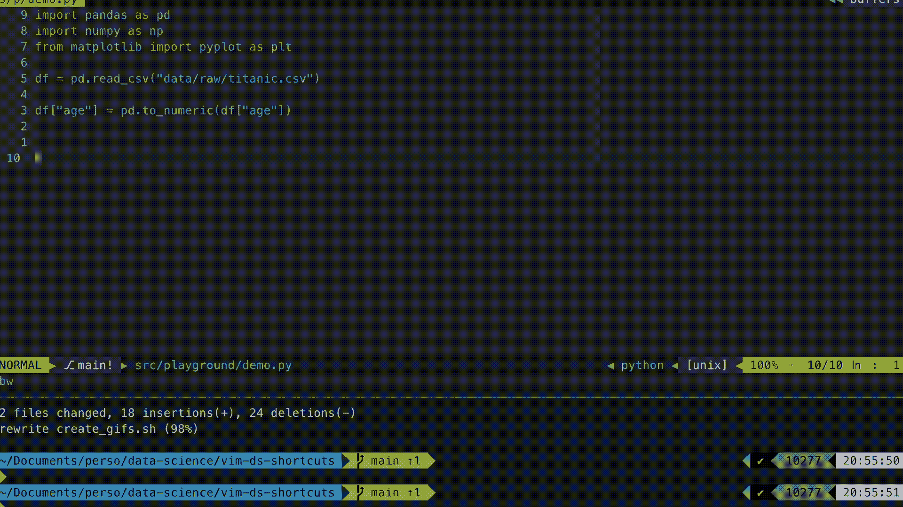
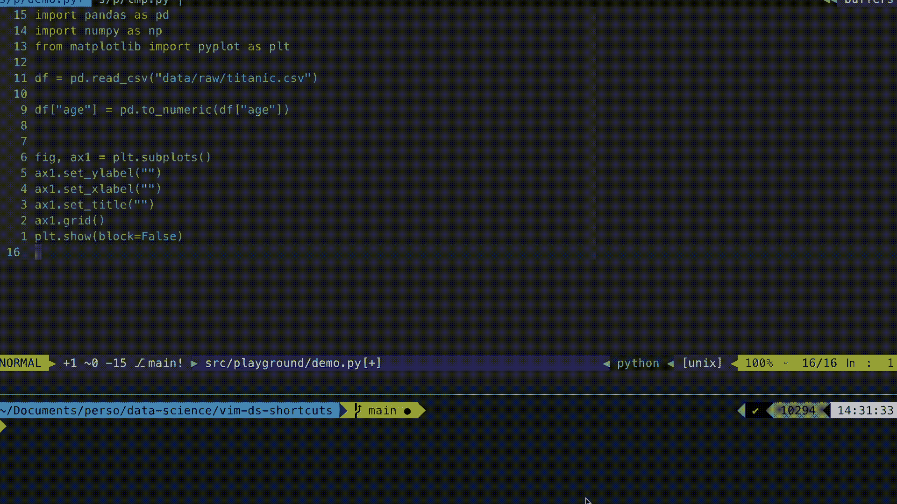
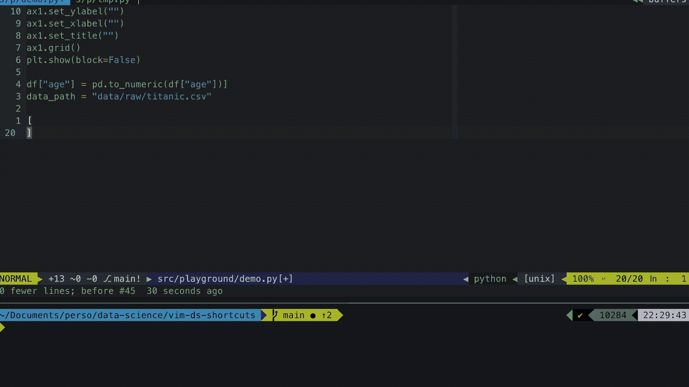
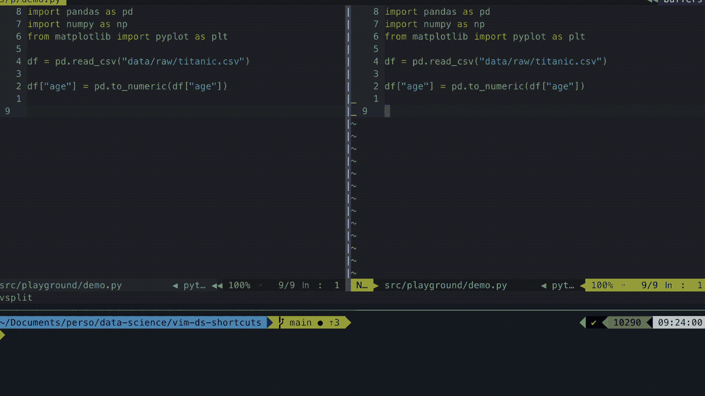
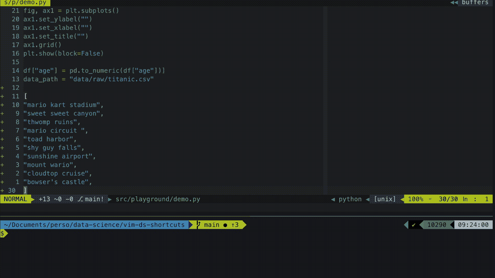

# 为您的数据科学日常工作提供 5 项黑仔 Vim 功能

> 原文：<https://towardsdatascience.com/5-killer-vim-features-for-your-data-science-daily-routine-ec814fc6c090?source=collection_archive---------15----------------------->

## 用这些简单的建议提高你的工作效率

照片由[安德鲁·尼尔](https://unsplash.com/@andrewtneel?utm_source=medium&utm_medium=referral)在 [Unsplash](https://unsplash.com?utm_source=medium&utm_medium=referral) 上拍摄

尽管被称为“21 世纪最性感的工作”，但数据科学的日常工作也包括无聊和重复的任务。

在你的文件顶部一次又一次地写相同的导入，手动格式化同事通过电子邮件发送的值列表，或者绘制可疑列以了解数据的错误，这些步骤是我们日常工作的一部分，事实是，它们占用了你大量的时间。

在本文中，我将介绍一些 vim 特性，它们确实帮助我消除了数据科学工作流中的摩擦。一些特性是普通的 vim，其他的需要额外的插件。这篇文章旨在引发思考。对我最有效的可能对你来说不是最相关的。如果你想最大限度地利用它，只需要花几分钟来确定你的工作流程中的摩擦，你将有希望通过调整下面描述的技巧来写下你自己的捷径。

## 1.登记册的使用和滥用

你可以把寄存器看作是拥有多个剪贴板的一种方式，每个剪贴板都与一个标识符相关联，这样以后就可以很容易地访问它。寄存器的命令采用`"<register-name><vim-command>`的形式。

例如，`"ap`允许你粘贴寄存器`a`的内容。在从事数据科学项目时，我经常在寄存器`i`中提取常见的导入，这样我就不必跨脚本手动复制粘贴了。这个过程展示在下面的 gif 中。

展示寄存器的使用。vim 命令以黄色突出显示。作者 Gif。

我也有一个寄存器，它包含了`"p`中的基本绘图指令。我几乎每天都用它。这比不断搜索正确的语法要方便得多。

寄存器对于存储基本的 matplotlib 命令也非常方便。作者 Gif。

寄存器的另一个优点是:它们在 vim 会话中是持久的！

## 2.Vim 保守得最好的秘密:行自动完成

这是一个我一直在使用的普通 vim 命令，但令人惊讶的是，vim 用户并不太了解它，`ctrl-x ctrl-l`允许你自动完成一整行。在数据科学项目中非常方便，例如，对各种列应用类似的转换是很常见的。

请注意，自动完成会考虑任何打开的缓冲区的内容。当您想要快速插入一个已经在不同脚本中定义的路径时，这非常方便。

行自动完成。作者 Gif。

## 3.全能的宏

一开始，Vim 宏可能有点令人畏惧，但是一旦您开始使用这个特性，您会想在此之前您实际上是如何工作的。宏用于存储动作序列，以便该序列可以多次应用。可以用命令`q<macro-identifier>`启动宏。定义您的动作后，宏用命令`q`关闭。然后你可以用`@<macro-identifier>`调用你的宏。

让我们看看这在一个具体的例子中是如何工作的。我经常使用宏来快速格式化我通过电子邮件收到的或从网上收集的数据。在下面的例子中，目标是将一组无格式的字符串转换成一个 python 列表。

使用 vim 的宏将无格式值转换成 python 列表。作者 Gif。

## 4.模糊文件查找器

[ctrlp.vim](https://github.com/ctrlpvim/ctrlp.vim) 是一个 vim 插件，它允许你快速检索文件、缓冲区等……感谢模糊匹配。在处理可能有几十个文件的大型项目时，这是最有用的。

默认情况下，可以使用`ctrl-p`调用插件。只需输入文件名的几个字母，您就可以检索脚本。

用模糊匹配查找文件。作者 Gif。

## 5.绝对的 git 插件

[逃犯](https://github.com/tpope/vim-fugitive)是 vim 的一个神奇的 git 插件。引用他的作者:

> “亡命天涯太牛逼了，竟然违法。这就是为什么它被称为逃犯”。

逃犯允许您从 vim 命令栏调用任何 git 命令。为了更快地跟踪代码，我在我的。vimrc

下面是我在实践中如何使用它的演示:

终极 git 插件。作者 Gif。

## 你想要更多吗？

我的开发设置实际上依赖于 vim 和一个叫做 tmux 的屏幕多路复用器的联合使用。vim + tmux 组合的关键特性是可以直接从 vim 向您的终端发送代码行。与 ipython 相关联，这提供了一个高度交互的环境，非常适合数据科学固有的繁重探索任务。**如果你想了解更多，请查看这篇** [**帖子**](/boosting-your-data-science-workflow-with-vim-tmux-14505c5e016e) **。**

感谢阅读！如果您喜欢这类内容，[请在 Medium](https://greghor.medium.com/) 上关注我。你也可以通过使用我的[附属链接](https://greghor.medium.com/membership)加入 Medium 来支持我的写作。