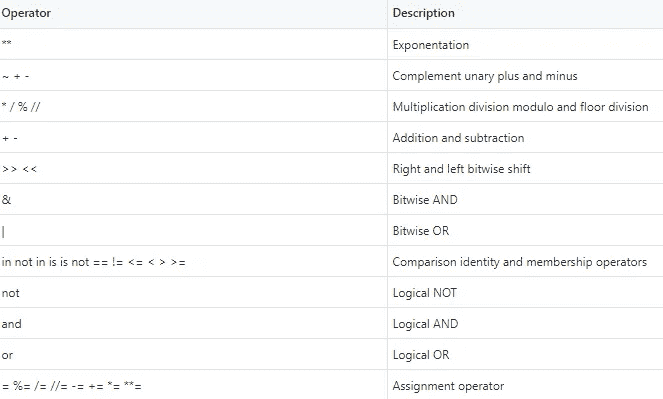

# 5 个鲜为人知的 Python 特性

> 原文：<https://towardsdatascience.com/5-lesser-known-python-features-19989db6e13e?source=collection_archive---------11----------------------->

## 以及编码示例

**Python** 是目前全球**使用最广泛的编程语言**之一。它的**简洁明了的语法**使得 Python 程序非常容易读写，确保了快速的学习曲线。此外，Python 有“电池包”——多个库(标准库和第三方库)，这将极大地方便程序员的工作。

更好的是，在过去的几年里， **Python 在数据科学和机器学习领域也变得非常流行**，成为❤️.这些快速发展的领域中使用最多的语言虽然可以很快达到基本的编程水平，但掌握 Python 语言肯定需要一些时间。在本文中，我们将**详细解释 5 个鲜为人知的 Python 特性**，这不仅有助于您更好地理解 Python 的工作原理，还能帮助您发现解决常见编程挑战的不同方法。

Max Langelott 在 [Unsplash](https://unsplash.com/?utm_source=medium&utm_medium=referral) 上拍摄的照片

# 1.带有 for 和 while 循环的 Else 语句

我们习惯于将 else 子句与 if 语句结合使用；然而， **for 和 while 语句也可以有一个 else 子句**。对于循环语句，**else 块仅在循环自然终止的情况下运行**，这意味着它不会因 break 语句或异常而终止。

下面，您可以找到两个例子来了解 else 子句如何处理循环语句。在第一个示例中，for 循环遍历列表**的每个元素，而不会过早终止**，因为不满足 if 条件，因此不执行 break 语句。在这种情况下，**else 块被执行**。

然而，在下一个例子中，for 循环没有到达迭代器的末尾，**通过 break 语句**提前终止。结果，**不执行 else 块**。

# 2.三元运算符

**在 Python 2.5 中引入，三元运算符是 if-else 语句**的简化单行版本，允许简洁地测试条件。该运算符计算一个语句，并根据该语句是真还是假来执行操作。

三元运算符具有以下语法，通常用于确定变量的值，如下所示。

> [当 _ 真]if[条件]else[当 _ 假]

三元运算符有助于精简您的代码；然而，如果条件以及真和假表达式非常复杂，它们可能很难阅读。

# 3.表达式中的运算符优先级

如果 Python 在对表达式求值后显示的结果与预期的不同，那么在很多情况下，原因可能是错误地考虑了运算符优先级。重要的是要记住，在 Python 中，一些元素优先于其他元素。

下表显示了在 Python 中工作时我们必须考虑的运算符优先级。

接下来，有几个例子展示了 Python 中优先级是如何工作的，遵循上表中给出的规则。

如上所示，在 Python 中，比较运算符的优先级高于逻辑运算符。然而，重要的是要记住它并不适用于熊猫，在熊猫中逻辑操作符的优先级高于比较操作符。因此，我们需要用括号将每个布尔表达式括起来，以避免错误。

有关更多详细信息，请参见官方 Python 文档(6.17 节运算符优先级)

  

# 4.没有人

**None 是表示没有值**的关键字。在 Python 中，只有一个 None 对象，这意味着 None 的所有引用都指向同一个对象。记住 **None 是 Python 函数**的默认值是很重要的。您可能知道，Python 中有一些函数会返回值，如 **len()** 、 **min()** 或 **eval()。**

但是，还有其他函数(或者方法！)不返回任何内容，换句话说，它们不返回任何内容。例如函数 **print()** 或列表方法**。追加()**。

与内置函数一样，在创建自己的函数时，**并不强制编写 return 语句**。如果未指定，Python 将返回 None(默认值),表示没有有意义的返回值。

# 5.函数参数:*args 和**kwargs

**参数*args 和**kwargs 允许您向函数传递多个位置或关键字参数**。当我们不能预先确定必须传递给函数的参数的确切数量时，它们特别有用。

**解包操作符*** 允许您向函数传递不同数量的位置参数。在下面的例子中，我们向函数 variable_arguments 传递了五个不同的位置参数。正如您在下面看到的，所有参数都被打包到一个名为 args 的元组中。

此外，我们可以在函数中使用 for 语句来遍历元组的所有元素，如下所示。注意，在这种情况下，我们选择了不同于 args 的另一个名称，这也是有效的。

同样，**解包操作符**允许您向函数**传递不同数量的位置参数。在这种情况下，参数被打包到一个名为 kwargs 的字典中。

和以前一样，我们可以使用 for 循环来迭代字典的元素。

重要的是要记住，您可以将标准、*args 和**kwargs 参数组合到同一个函数中(参见下面的示例)；但是，它们必须按以下顺序提供。

> some_func( fargs，*args，**kwargs)

尤其相对于 C 或 Java 等其他编程语言，Python 的学习曲线非常陡峭；然而，仍然有许多高级特性需要您在 Python 世界中积累丰富的经验后才能掌握。

有关 Python 编程的更多信息，您可以在这里查看我以前的一篇文章。

</10-python-built-in-functions-you-should-know-fbd5c879e0ab>  </the-python-standard-library-modules-you-should-know-as-a-data-scientist-47e1117ca6c8>  

感谢阅读！

阿曼达💜