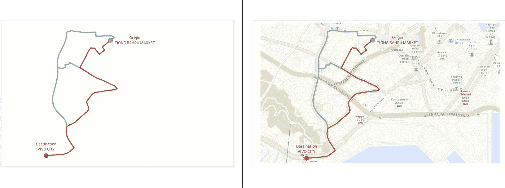
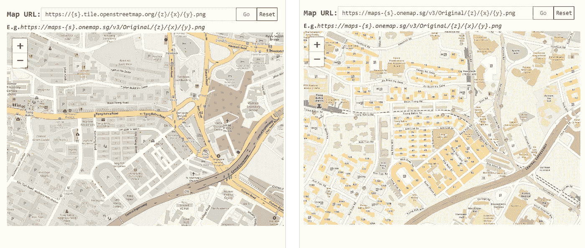

# 5 个鲜为人知的小贴士、技巧和窍门。使用案例+演示。

> 原文：<https://towardsdatascience.com/5-lesser-known-tableau-tips-tricks-hacks-with-use-case-demo-463f98fbdc7e?source=collection_archive---------21----------------------->

## 你都认识吗？

虽然其他媒体作者和 Tableau 用户有他们自己的黑客列表可以分享，但这里是我版本的 Tableau 变通方法列表，它们对我的个人用例很有效，其中一些是我纯属巧合发现的。希望下面的 **5 个 Tableau 变通方法**对一些阅读本文的 Tableau 用户会有帮助，我几乎没有找到相关的文档🙃

# 1.将背景图像绘制为底图

虽然我在我写的另一篇文章中简要地分享了这一点，但它之前被掩盖了，所以我决定在这里重申这一点。

**用例:绘制交通路线的自定义图层**

按作者分类的图像|渲染运输路线的 Tableau 工作表|未渲染任何底图

有时底图服务可能没有您想要的详细信息，或者在某些情况下无法访问所需的底图服务，**绘制背景地图图像就是这样一种替代方法**。为了尽量减少麻烦，请随意访问我创建的 Tableau 实用程序 web 应用程序: [Tableau 数据实用程序](https://tableau-data-utility.onrender.com/)

在**选项卡下【空间→CSV】**:

作者图片| Web 应用程序的标题栏

一直滚动到底部，你最终会看到这个:

按作者分类的图像|预览 web 应用程序上的功能|以上内容使用户能够导出地图图像，以便在 Tableau 仪表盘中用作背景底图

继续将地图定位到您想要的视图，并选择**【导出地图图像】**。此后，在 Tableau 仪表板中，从标题菜单中选择“导入背景图像”，并输入所需的坐标— **注意:在 web 应用程序上，记下地图图像下方呈现的坐标，因为这些坐标与您应该为背景图像绘制的坐标完全相同。**

按作者分类的图像|将背景图像绘制为底图时，这些坐标对应于 Tableau 中的精确坐标

**表格结果:**

按作者分类的影像|(左)不带底图的路径|(右)带有导入的地图影像的路径

**注意:**要更改希望从 Tableau 实用程序中导出的底图的选择，请随意输入另一个底图 URL，如下所示:

作者提供的图像|(左)使用默认底图|(右)使用备选地图服务，即[one Map](https://docs.onemap.sg/maps/index.html)-请注意，用户的输入必须是 [XYZ 底图切片服务](https://developers.planet.com/docs/basemaps/tile-services/xyz/)也称为 Slippy 地图

# 2.用参数切换工作表视图

为了节省仪表板上的额外空间，我经常在工作中使用书中的另一个老技巧，包括在同一个仪表板上的两个视图之间切换。

**用例:**为相同的数据点呈现不同的图表类型

*   **第一步。**创建一个**参数【选择图表】**
*   **第二步。**创建一个**计算出的** **字段** **【折线图】**
*   **第三步。**创建一个**计算出的** **字段** **【条形图】**

图片作者|创建参数**【选择图表】**、计算字段**【折线图】**和计算字段**【条形图】**

此后，继续拖动两个计算字段，如下所示:

作者截屏|将**【折线图】**计算字段拖到折线图工作表的筛选器上|将**【条形图】**计算字段拖到条形图工作表的筛选器上|两个字段都设置为**“至少 1”**

现在你知道了:

作者的屏幕截图|演示使用参数值在折线图和条形图之间切换

# 3.使用 RANK()创建排序的图表布局

一些 Tableau 用户可能会注意到，尽管使用了仪表板标题中的排序选项，**但是每当数据源更新自身时，图表布局就会恢复到无序和未排序的状态**。

按作者排序的图像 Tableau 工作簿上显示的相应排序图标

为了确保图表保持排序，创建一个名为**【销售排名】**的单独字段:

Image by Author |假设要排序的度量值是 SUM([Sales])，用 RANK()函数包装该实体

此后，拖动**【销售额排名】**字段，如下所示:

作者截屏|将字段**【销售排名】**改为离散。|继续将其拖动到尺寸字段**【子类别】**的前面

因此，下次数据源再次更新时，上面的条形图仍将保持其排序形式**(仅供参考:要隐藏[Rank Sales]列，只需右键单击并取消选择该字段的“Show Header”。)**

# 4.使用❝Join Calculation❞映射数据源

在某些包含不同国家数据源的数据可视化中，经常会遇到不同编码的国家名称。

**用例:**从两个不同的数据源映射国家名称

令人欣慰的是，Tableau 使用户能够 **❝Create a 加入 Calculation❞** ，这使用户能够利用 Tableau 的公式和方程，通过单个计算字段来映射不同的数据源。下面说明了如何做到这一点:

作者插图| **(1)** 在数据源页面上，在两个不同的数据源之间选择**【创建连接计算】**|**(2)**在计算中使用 IF-ELSEIF-ELSE 公式在两个数据源之间映射**【美国】****【中国大陆】**|**(3)**在实际的 Tableau 工作簿中，**美国**和

使用上面的实现，实际的数据源不需要修改，但仍然可以根据需要进行映射。

# 5.在显示器中使用上标和下标

虽然 Tableau 中没有呈现上标或下标的内置功能，但它支持显示包含上标和下标数字符号的 ASCII 字符。

图片作者| 1 我过去的 Tableau 仪表板目前部署在 [Tableau Public](https://public.tableau.com/app/profile/charmaine.chui/viz/HowDoesSGUseitsLand/how_SG_uses_its_land) |红色轮廓表示脚注引用的上标符号的用法

为了让其他 Tableau 用户的生活更轻松，如果你想在你的仪表盘上实现上标和下标符号，可以在我的 GitHub 上获取我在[创建的 JavaScript 工具。**只需双击它，在任何支持 JavaScript 的浏览器(Chrome，Edge)中运行**。](https://gist.githubusercontent.com/incubated-geek-cc/cf051097ef241a25a5138484d2d15107/raw/618e9f8a8bec13a5a36d5c882f054742e582e5dc/TableauScriptingTool.html)

作者截图|继续将需要转换的字符输入到相应的文本字段，并选择按钮**【转换】**，如上图所示|然后将符号复制并粘贴到 Tableau 中

## 这就结束了我的 5 个 Tableau 的列表！希望您发现这很有用，如果您对数据分析或其他与 Tableau 相关的内容❤感兴趣，请[关注我的 Medium](https://medium.com/@geek-cc)

<https://geek-cc.medium.com/membership>  

## 👩‍💻以下是其他一些你可能感兴趣的 **Tableau 技巧&招数**(每篇文章的 Tableau 工具已经部署在: [Tableau 数据实用工具](https://tableau-data-utility.glitch.me/)):

</how-to-plot-a-custom-map-image-on-tableau-dashboard-in-just-3-easy-steps-no-calculations-required-8db0d41680c4>  </leverage-on-d3-js-v4-to-build-a-network-graph-for-tableau-with-ease-cc274cba69ce>  </selective-formatting-of-numbers-in-tableau-f5035cc64b68>  </superscript-and-subscript-in-tableau-why-and-how-you-can-implement-it-764caf0cc932>  </underrated-combined-functionalities-of-tableau-point-linestring-polygon-mapping-b4c0568a4de2> 