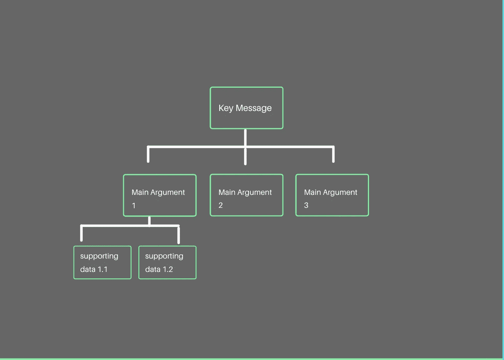

# 麦肯锡教给我的 5 条经验将使你成为更好的数据科学家

> 原文：<https://towardsdatascience.com/5-lessons-mckinsey-taught-me-that-will-make-you-a-better-data-scientist-66cd9cc16aba?source=collection_archive---------0----------------------->

## 如何在数据世界中脱颖而出

丹·迪莫克在 [Unsplash](https://unsplash.com?utm_source=medium&utm_medium=referral) 上拍摄的照片

数据科学是近年来最热门的领域之一，吸引了大量人才加入顶级公司数据科学团队的竞争。有很多文章教你如何[准备 DS 面试](/the-ultimate-interview-prep-guide-for-data-scientists-and-data-analysts-18621db1da47)以及“从其他面试者中脱颖而出”，但是这个旅程肯定不会止于被录用。获得工作机会仅仅是第一步；然而，没有多少人谈论一旦你通过面试并加入公司，你如何从其他*雇佣的*数据科学家中脱颖而出。

在麦肯锡工作的几年里，我有幸与麦肯锡和我服务过的顶级公司的无数聪明的数据科学家一起工作，并观察到了那些获得合作伙伴和客户最高评级和赞扬的人的共同特点。可能会让你们中的一些人感到惊讶，表现最好的数据科学家不一定是那些构建最奇特的模型或编写最高效代码的人(当然，他们必须通过相当高的技术技能才能被聘用)，而是那些除了分析能力之外还拥有许多重要的**【软技能】**的人。本文将我在麦肯锡工作期间的经验和观察总结为 5 条经验，这将帮助你成为一名更好的数据科学家。

GIF by GIPHY

作为一个热爱精确的数据人，我想指出的是，尽管“数据科学家”这个头衔涵盖了当今行业中的各种工作，但在本文中，我主要关注的是给数据科学家的提示，这些提示会以任何形式影响业务决策(而不是那些更注重研究的“核心数据科学”角色)。

# 第一课。自上而下的沟通是关键

自上而下的沟通，或称金字塔原则，是由麦肯锡合伙人芭芭拉·明托创造并推广的，被许多人视为商业(甚至个人生活)中最有效的沟通结构。尽管这是战略顾问等一些人的第二天性，但许多数据科学家在这种沟通方面犯了错误。这个想法很简单:当你试图传达一个想法/论点时，如果你以一个**关键信息**开始，然后是几个**主要论点**来支持这个关键信息，这是最有效和最容易让观众理解的；如果需要，每个参数后面可以跟有**支持数据**。

采用自上而下的沟通是有利的，原因如下:

1.  关键的要点是放在前面和中间:如果你在一封电子邮件/备忘录的开头看到了 **TLDR** ，或者在一篇研究论文的开头看到了执行摘要，你就会明白这一点的重要性。提前传达关键信息将确保你的听众得到一个大概的想法，即使他们没有抓住所有的细节。
2.  演示/沟通可以很容易地针对不同的受众进行定制:您可以准备一套沟通，并将其保持在“关键信息”的水平上，为 c 级高管提供主要论点，并为同行和其他对杂草感兴趣的分析型受众提供详细信息。

不幸的是，对于数据科学家来说，他们的工作大部分时间都在进行深入的分析，这种沟通结构可能不是自然形成的，可能是违反直觉的。我经常看到数据科学家以深入的细节开始演讲或交流，却没有让观众理解关键信息。

**如何实践**:实践这一点的一个简单方法是在会前根据这个结构记下你的想法，以便在交流你从分析中得出的关键发现时让自己保持在正确的轨道上。经常后退一步问自己你实际上在试图解决什么问题也是有帮助的；这应该是你传达的关键信息。

作者图片

# 第二课。自己做“翻译”

如果你看看麦肯锡建议的公司数据组织的[蓝图，它强调了一个被称为“翻译者”的角色的重要性，该角色被认为是业务和数据团队之间的沟通桥梁，将分析性见解转化为业务的可操作性见解(我假设这个角色部分是由于我在上面提出的观点的挫败感而产生的)。我敢肯定，作为一名数据科学家，你已经被要求“像向一个五岁的孩子解释一样解释它”或“用简单的英语解释它”。从其他人中脱颖而出的数据科学家正是能够做到这一点的人——充当他们自己的翻译；如果被问到，他们可以向既没有分析背景也没有时间阅读白皮书的首席执行官们很好地解释他们的 ML 模型，并且他们总是可以将他们的分析结果与业务影响联系起来。这些数据科学家因以下原因而受到重视:](https://www.mckinsey.com/industries/financial-services/our-insights/building-an-effective-analytics-organization)

1.  很难从非分析型的人那里得到“翻译”:麦肯锡确实试图培养一批战略顾问成为不同分析研究的“翻译”；但在我看来，从来没有成功过。原因很简单:为了准确解释复杂分析的关键要点并准确反映警告，你需要一种分析心态和深刻的理解，这是通过几周的分析训练营培训无法实现的。例如，如果你不知道肘方法，你如何解释你为 K-means 选择的聚类数？不知道 SSE 是什么怎么解释肘法？。作为一名 DS，你花在教授这门不太成功的速成课程上的时间，或许更应该花在打造自己的沟通风格和自己翻译上。
2.  如果 DS 能够解释他们自己的分析，精确性的损失是可以避免的:我相信大多数人都玩过“电话”游戏或它的变体。信息传递的时间越长，就越难保持其准确性。现在想象同样的过程发生在你的分析工作上；如果你依赖他人来解释/翻译你的工作，当信息到达最终用户时，它可能会偏离现实。

GIF by GIPHY

**如何实践:**与朋友(最好是没有任何分析背景的朋友)一起实践，向他们解释你的模型/分析(当然不要透露任何敏感信息)。这也是在你的方法中发现知识缺口的好方法；就像《大讲解员》[理查德·费曼](https://en.wikipedia.org/wiki/Richard_Feynman)认为的那样，如果你不知道如何用简单的方式解释某件事，很多时候是因为你自己还没有理解好。

# 第三课。以解决方案为导向是第一法则

这不仅限于数据人才；对于在*的人来说，这是一家公司的任何*职能/角色所必不可少的。能够发现问题并提出担忧当然非常有价值，但更令人赞赏的是提出潜在解决方案的能力。如果没有一个以解决方案为导向的人在房间里，讨论可能经常会陷入困境，而不是试图找出前进的道路。

在大多数顶级咨询公司，以解决方案为导向是首要原则，在我看来，这种方法也应该适用于技术领域。作为一名数据科学家，当人们由于缺乏分析背景而提出荒谬的数据要求时，您可能会经常遇到令人沮丧的情况。我见过无数的 DS 不知道如何处理这些情况，并且因为总是唱反调而在利益相关者管理方面失败。不要把他们拒之门外，要以解决方案为导向，用你对数据和分析工具的更好理解，帮助他们重新定义问题并限制范围。

面向解决方案并不意味着你永远不能对任何事情说不，或者总是必须有已经起草好的完美解决方案；这意味着在你说的每一个“不”字后面，你都应该有一个“但是……怎么样？”。

**如何实践:**当你遇到问题时，在向你的团队或经理报告之前，花点时间想想你可能解决问题的方法。在解决问题时发挥你的创造力，不要害怕成为提出新解决方案的人。从你的工作流中扩展出来，了解更多关于业务和其他团队的工作也是有帮助的。了解全局通常有助于将点点滴滴联系起来，引导你找到创造性的解决方案。

GIF by [GIPHY](https://gph.is/2RVc9FE)

# 第四课。在商业环境中建模时，可解释性胜过精确性

> 没有人真的想预测客户流失，每个人都在试图理解客户流失

如今，当每一家公司都在建立模型来预测客户流失时，很难退一步问自己为什么我们要在第一时间预测客户流失。公司希望预测客户流失，以便找到可行的解决方案来防止客户流失。因此，如果你的模型告诉首席执行官“**网站访问量的立方根**是表明客户流失的最重要特征之一”，他能利用这些信息做什么呢？可能没什么…

作为一名数据科学家，像你们中的许多人一样，我过去只关注准确性，作为建模时的成功衡量标准。但是我逐渐意识到，如果不能将其与业务影响联系起来，通过添加不可解释的功能和微调超参数将准确率从 96%提高到 98%对业务毫无意义(同样，这仅适用于面向业务的 DS，对于 ML 的某些领域，这种提高可能意味着全世界)。

如果模型是一个黑箱，也很难从高管那里获得信任。模型是一种在一天结束时指导商业决策的工具，所以它的价值很大程度上基于它的实用性和可解释性也就不足为奇了。

**如何实践:**在构建模型或执行分析时，始终将业务影响牢记在心。在建立模型时，避免将随机的交互特征扔向模型，并希望其中一个能够坚持下来；相反，在开始构建模型之前，应该对特征工程阶段进行充分的考虑。写下来自模型/分析的业务建议也将帮助您重新评估您在构建模型时所做的设计选择。

# **第五课。确保有一个假设，但不是和一个假设结婚**

作者图片

从特性探索到探索性数据分析(EDA)，将假设作为大多数分析的起点非常重要。如果没有假设，你就不知道如何为 EDA 分割数据，或者先测试哪些特性。没有假设，甚至没有必要进行 AB 测试(这就是为什么它被称为假设测试)。但我时常观察到，数据科学家在没有明确假设的情况下钻研低头分析阶段，后来迷失在兔子洞里。或者更常见的情况是，数据科学家将假设构建过程完全留给团队成员，而不了解数据，后来意识到没有足够的数据来测试这些假设。在我看来，最好的方法是让数据科学家从一开始就参与这些假设集思广益会议，并使用假设来指导和优先考虑后续分析。

假设固然重要，但它们应该是起点，而不是终点。一次又一次，我看到许多数据科学家(或与数据科学家一起工作的人)坚持一个假设，尽管有相互矛盾的发现。这种对最初假设的“忠诚”会导致数据窥探和篡改数据以符合特定的叙述。如果你熟悉“[辛普森悖论](https://en.wikipedia.org/wiki/Simpson%27s_paradox#:~:text=Simpson's%20paradox%2C%20which%20also%20goes,when%20these%20groups%20are%20combined.)”，你就能理解数据在讲述“错误故事”中的力量。优秀的数据科学家应该能够保持数据的完整性，并使叙述符合数据，而不是相反。

如何实践:为了想出好的假设，建立商业理解和敏锐度是很重要的。在探索数据的过程中，请记住这些假设来指导你，但是当数据告诉你一个与你最初的“有根据的猜测”不同的故事时，请虚心接受。拥有良好的商业意识也将有助于你在这个过程中调整你最初的理论，并根据数据调整你的叙述。

当谈到面向业务的角色时，人们往往认为人才可以分为两类:分析型和战略型，好像这两种能力位于光谱的相反两端。好吧，我告诉你一个秘密，最好的分析人才是那些也了解事情的战略/业务方面，并了解如何与业务利益相关者沟通的人，战略角色中最好的人才对分析和数据有一定的理解。