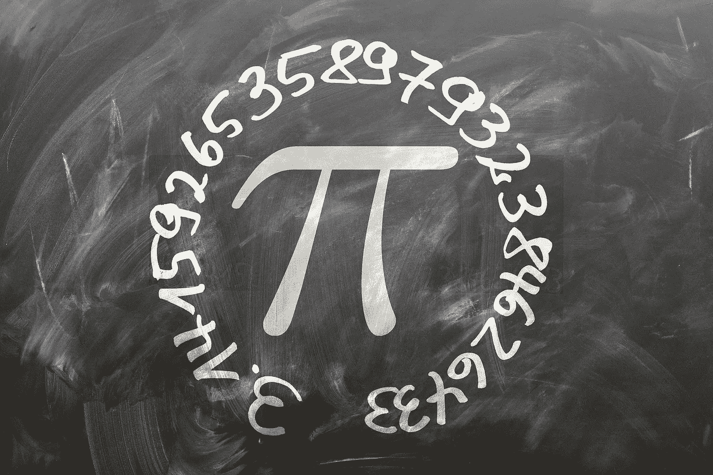

# Python 中生成加权随机数的 5 个层次

> 原文：<https://towardsdatascience.com/5-levels-of-generating-weighted-random-numbers-in-python-80473c9b0df?source=collection_archive---------7----------------------->

## 像技术领导一样赢得算法面试



图片由 [Gerd Altmann](https://pixabay.com/users/geralt-9301/?utm_source=link-attribution&utm_medium=referral&utm_campaign=image&utm_content=1453836) 从 [Pixabay](https://pixabay.com/?utm_source=link-attribution&utm_medium=referral&utm_campaign=image&utm_content=1453836) 拍摄

在 Python 中获得一个随机数很简单，因为有一个名为`random`的内置模块。但是加权随机数呢？

> ***我们来看一个真实的面试问题:***

*有一个字典如下:*

```
*my_nums = {'A': 5, 'B': 2, 'C': 2, 'D': 1}*
```

*键是四个字母，值是它们的权重。*

*请设计一个可以根据权重随机生成字母的函数。*

*(换句话说，这个函数应该有 50%的概率生成“A”，20%的概率生成“B”，20%的概率生成“C”，10%的概率生成“D”。)*

如果你对 Python 非常熟悉，可能知道我们可以用 Python 3.6 引入的一个叫做`random.choices()` 的方法，或者 Numpy 中类似的方法来解决问题。

但是，技术面试不是为了测试你能不能记住一个特殊的 API。它旨在测试你是否能自己设计并实现一个算法。所以，面试官可能会问你:

> "你能自己设计并实现这个方法吗？"

其实这是一个非常好的面试问题。因为不同水平的程序员对它会有不同的想法。所以区分初级和高级 Python 开发人员是很容易的。

本文将深入探讨这个问题的 5 种不同解决方案，从最直观但效率低下的方法到最佳答案。

# 第一级:最直观但效率低下的方法

如果我们的候选列表包含每个字母的期望数目，这将成为一个简单的问题。

如上所示，最直观的解决方案是生成一个列表，其中包括基于字母权重的每个字母的预期数量，然后从该列表中随机选择。

但是，如果有很多字母，并且它们的权重是更大的数字，这种解决方案显然不是很高效。因为我们会浪费很多时间来生成列表。

# 级别 2:避免生成大的列表

实际上，前面的解决方案的列表是不必要的。

因为总重量是 10 (5+2+2+1)。我们可以先生成一个 1 到 10 之间的随机整数，然后根据这个数返回一个字母:

上面的代码避免了像前面的解决方案那样生成列表，因此效率更高。

但是我们必须写很多代码，这看起来很难看。

# 第三级:避免写太多代码

事实上，我们不必将`r`与所有范围进行比较。

如下面的例子，我们可以从`r`中依次减去一个权重，任何时候结果小于或等于零，我们返回它:

# 第 4 级:用数学技巧让它更快

很明显，对于前面的解决方案，`r`越快达到 0，我们的算法就越有效。

*那么，如何才能让* `*r*` *更快的达到 0 呢？*

直观来看，如果`r`一直减去当前最大权重，会更快达到 0。所以，在运行`weighted_random()`函数之前，我们可以按照权重从大到小对`my_nums`进行排序。

如果你知道数学期望，我们可以用它来证明这个想法。

例如，以下是条目顺序不同的`my_nums`词典。对于每一个字典，让我们计算它的数学期望，得到一个随机的字母需要多少步。

## 1.最佳订单

`{A:5, B:2, C:2, D:1}`

e = 5/10 * 1+2/10 * 2+2/10 * 3+1/10 * 4 = 19/10

## 2.最差的订单

`{B:2, C:2, A:5, D:1}`

e = 2/10 * 1+2/10 * 2+5/10 * 3+1/10 * 4 = 25/10

## 3.最差订单

`{ D:1, B:2, C:2, A:5}`

e = 1/10 * 1+2/10 * 2+2/10 * 2+5/10 * 5 = 34/10

如上所示，将权重从大到小排序的最佳顺序需要最少的平均步骤才能得到结果。

# 级别 Python 的应用方式

到目前为止，我们的解决方案已经足够好了。但仍有空间让它变得更好。

事实上，第 4 级解决方案引入了一个新的耗时步骤。因为我们首先要对字典进行排序。当这是一本更大的字典时，它完全不够高效。

在引擎盖下，内置的 Python 函数`random.choices()`应用了一个[更聪明的想法](https://docs.python.org/dev/library/random.html#random.choices)。它使用累积权重而不是原始权重。由于累积权重是升序排列，我们可以使用二分搜索法更快地找到位置。

基于我们的问题，让我们来实现这个伟大的想法:

现在，这个解决方案应用了 Python 的`random.choices()`方法的相同思想。(对了，我们可以在 GitHub 上查看这个内置方法的[源代码](https://github.com/python/cpython/blob/main/Lib/random.py)。)

如果我们能在这个层面设计我们的解决方案，我们肯定会在技术面试中胜出。

# 结论

要想在技术面试中胜出，仅仅记住一个特殊的内置方法是不够的。你需要知道它是如何在引擎盖下工作的，如果你能自己实现它就太好了。

***感谢阅读。如果你喜欢，请关注***[***me***](https://yangzhou1993.medium.com/follow)***，成为*** [***中等会员***](https://yangzhou1993.medium.com/membership) ***享受更多关于编程和技术的精彩文章！***

***更多有趣的 Python 帖子给你:***

[](https://medium.com/techtofreedom/the-art-of-writing-loops-in-python-68e9869e4ed4) [## 用 Python 写循环的艺术

### 简单比复杂好

medium.com](https://medium.com/techtofreedom/the-art-of-writing-loops-in-python-68e9869e4ed4) [](https://medium.com/techtofreedom/5-uses-of-asterisks-in-python-3007911c198f) [## Python 中星号的 5 种用法

### 编写更优雅代码的强大武器

medium.com](https://medium.com/techtofreedom/5-uses-of-asterisks-in-python-3007911c198f)