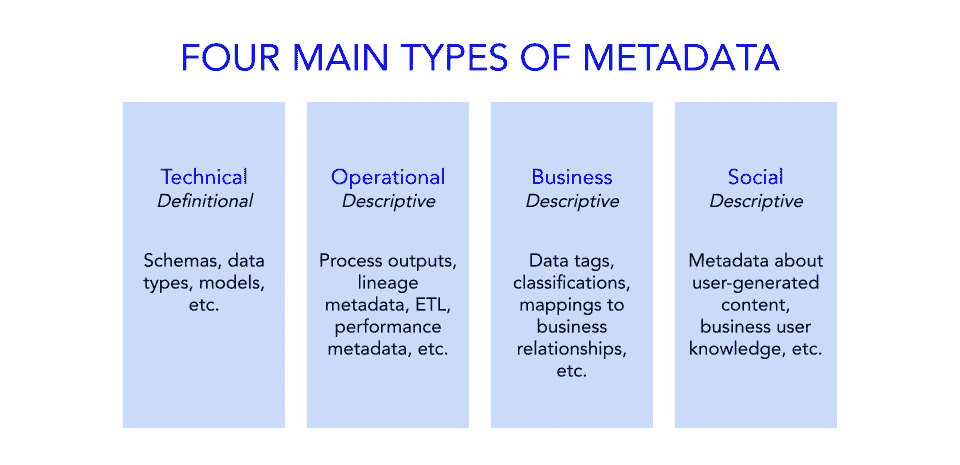

# 2021 年 Gartner 数据和分析峰会的 5 个“元”要点

> 原文：<https://towardsdatascience.com/5-meta-takeaways-from-the-gartner-data-and-analytics-summit-2021-2cc6cdf037b2?source=collection_archive---------23----------------------->

## 关于活动元数据，您应该知道什么，以及如何使用它来构建前瞻性数据堆栈

马克西姆·霍普曼在 [Unsplash](https://unsplash.com/?utm_source=unsplash&utm_medium=referral&utm_content=creditCopyText) 上的照片

我很高兴能参加今年 6 月初举行的 [Gartner 数据&分析峰会](https://www.gartner.com/en/conferences/apac/data-analytics-australia/agenda)，我参加了 50 多场会议，重点讨论帮助数据和分析领导者满足当今和未来需求的策略和讨论。

在这些会议中，一个反复出现的概念是活动元数据:似乎正在推动 2021 年主要趋势的隐藏力量:增强数据目录、自主数据操作、数据结构和数据网格、数据和分析治理以及数据工具的消费化。

在本文中，我将解开活动元数据的基础，并列出有助于您利用活动元数据构建前瞻性数据堆栈的 5 个要点。

# 1.扩充数据目录现在是企业必备的东西

我们喜欢将现代数据堆栈视为神奇的解决方案，但即使是拥有现代基础架构的现代数据团队也常常难以找到并记录他们的数据。

今天的数据团队正面临着这些编目挑战:

*   他们对哪些数据存储在哪里知之甚少。
*   他们往往花更多的时间寻找数据，而不是实际分析数据。
*   他们发现很难在业务用户之间跨数据资产共享上下文。

今天的传统数据目录不能很好地解决这些问题。

然而，机器学习-增强数据目录会主动抓取和解释元数据来解决这些问题。它们支持实时数据发现、数据资产的自动编目以及更好的数据环境，所有这些都显著缩短了从问题到洞察的时间。

*不确定什么是机器学习数据目录(MLDC)？* [*在此了解更多*](https://atlan.com/what-is-a-machine-learning-data-catalog-mldc/) *。*

图片由 [Atlan](https://atlan.com/) 提供。

# 2.活动元数据是自主数据操作的关键

> *“Gartner 预计，到 2023 年，利用活动元数据、机器学习和数据结构来动态连接和自动化数据管理流程的组织将减少其数据交付时间，并对价值产生 30%的影响。”*
> 
> *—罗伯托·托雷斯、* [*CIO 潜*](https://www.ciodive.com/news/gartner-data-trends-2020-rita-sallam/587790/)

传统的数据目录只是被动地包含和组织技术元数据，即关于组织数据的基本信息。然而，主动元数据无处不在地寻找、丰富、编目和使用所有这些类型的元数据，采用传统的“被动”技术，使之真正面向行动。

这有助于组织最大化其数据的价值，并在目录深入研究用户活动、跨数据资产的联系等时找到更深入的见解。因此，激活元数据是建立为组织中不同数据用户工作的[数据操作框架](https://atlan.com/what-is-dataops/)的第一步，也是最重要的一步。

# 3.激活元数据对于启用数据结构至关重要

数据结构是一个统一的环境，由一个架构和运行在该架构之上的数据服务组成，可帮助组织管理其数据。可以把它想象成一个跨越所有不同数据源和端点的“织物”。

> *“数据结构利用对现有的、可发现的和可推断的元数据资产的持续分析，来支持跨所有环境(包括混合和云计算平台)的集成和可重用数据的设计、部署和利用。”*
> 
> *— Ashutosh Gupta，* [*Gartner*](https://www.gartner.com/smarterwithgartner/data-fabric-architecture-is-key-to-modernizing-data-management-and-integration/)

数据结构不是一种现成的工具或技术。相反，它由各种工具、资源和流程组成。数据结构是一个新兴的设计框架，它识别并连接来自不同应用程序的数据，以发现可用数据点之间独特的、与业务相关的关系。

目前，没有任何独立的工具或解决方案能够充当成熟的数据结构体系结构。相反，起点是投资元数据管理解决方案。这些需要支持元数据的摄取、共享、管理、激活和用知识图表示。获取正确的元数据是为数据系统设置可组合数据结构的第一步。

# 4.元数据管理工具的消费化

现代数据堆栈发展迅速且多样化。很容易在几秒钟内以很少的开销进行扩展，但在为数据带来治理、信任和上下文方面可能会很痛苦，这就是活动元数据在生态系统中不可或缺的地方。

过去，数据目录和管理工具是为像数据工程师和科学家这样的技术用户构建的。但是这些平台正变得越来越消费化，或者意味着每个人都可以在日常工作中使用。

> 技术含量较低的业务人员现在希望快速访问和使用值得信赖的数据，而不是通过向工程师发送电子邮件，而是通过简单的自助服务工具。

这些用户不是负担，而是提供了一个新的视角，这对于组织了解如何使用和组织他们的数据是一个很大的优势。

随着越来越多的业务用户投入到数据中，企业开始意识到缩短数据发现和准备时间以及提供大量上下文来帮助技术水平较低的用户产生和实施其见解的重要性。这就是为什么传统的数据管理工具开始让位于现代的元数据管理工具(例如我的公司 [Atlan](https://atlan.com/) )，这些工具专注于出色的最终用户体验，就像我们在 Slack 等现代企业技术产品中看到的一样。

这些现代工具不仅更容易被业务用户使用，而且还极大地提高了数据工程团队的生产力。这符合由 Slack 和 concept 等新工具引领的企业技术消费化的大趋势。

# 5.数据分析和治理能力正在融合

为了理解和信任数据，数据不能在[的筒仓](https://atlan.com/what-are-data-silos/)中。当没有人知道谁在寻找特定的数据集以及寻找的原因时，多层次的层次结构和管理会使数据问题变得更糟。

这就是为什么治理数据不仅仅是对数据访问施加限制，还包括使数据民主化，并确保数据在正确的时间到达正确的用户手中。

> *数据治理的最终目标是支持更顺畅、更快速的决策。*

今天，我们看到了一种融合，数据治理正在成为数据分析管道中的一个活跃部分。治理现在不是一个好的奖励，而是现代数据生态系统的必备功能，这些生态系统需要开放，更易于所有人访问，而不损害数据安全性或合规性。

**觉得这个内容有帮助？在我的时事通讯《元数据周刊》上，我每周都写关于活动元数据、数据操作、数据文化和我们的学习建设的文章。** [**在此订阅。**](https://metadataweekly.substack.com/)

**这篇文章是我和同事合写的，** [**斯瓦米**](https://www.linkedin.com/in/swaminathankumar1) **&** [**拉巴尼**](https://www.linkedin.com/in/labani-biswas-53229965/) **。**