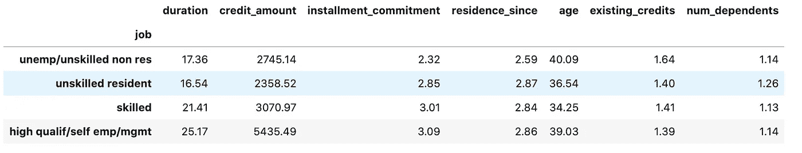
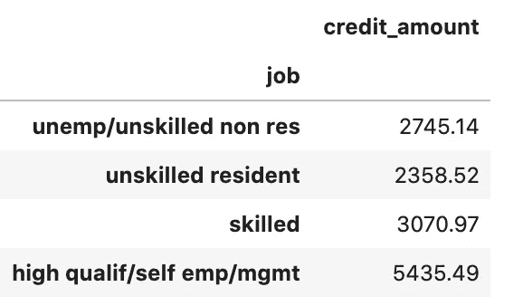
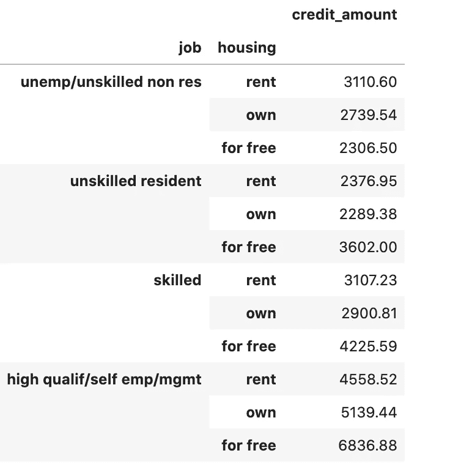
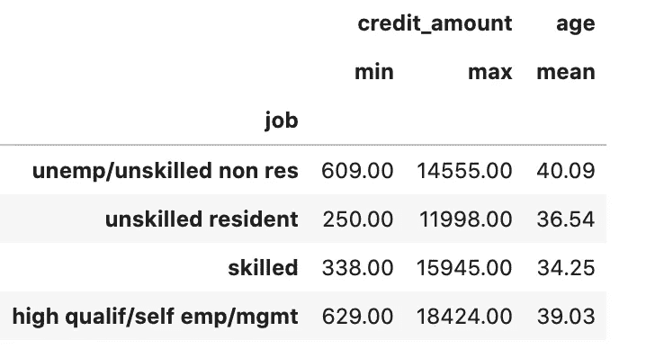
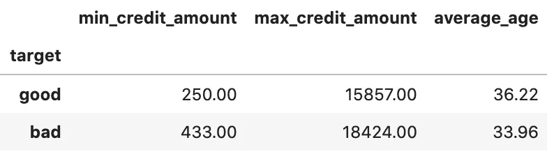
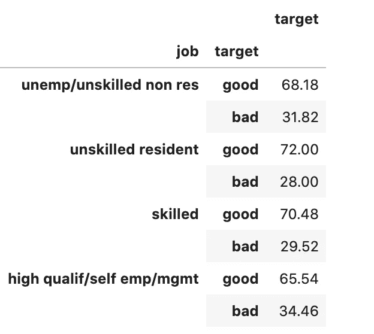
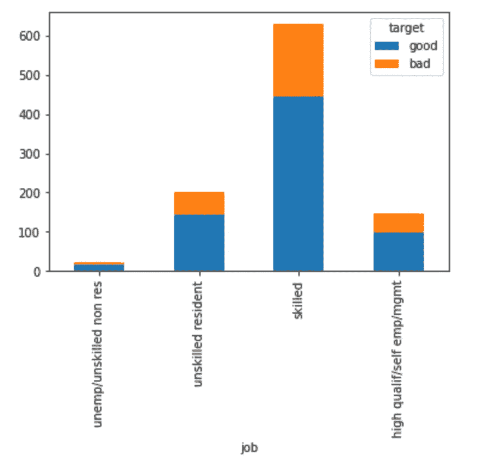
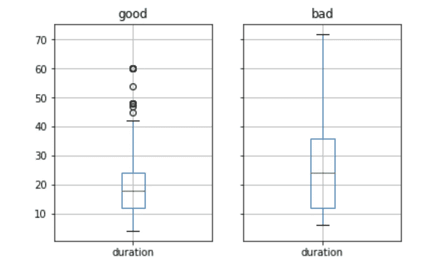

# 熊猫小组 5 分钟指南

> 原文：<https://towardsdatascience.com/5-minute-guide-to-pandas-groupby-929d1a9b7c65?source=collection_archive---------31----------------------->

## 使用这个有用的工具开始数据分析

由 [Camylla Battani](https://unsplash.com/@camylla93?utm_source=unsplash&utm_medium=referral&utm_content=creditCopyText) 在 [Unsplash](https://unsplash.com/s/photos/questions?utm_source=unsplash&utm_medium=referral&utm_content=creditCopyText) 拍摄的照片

数据分析从根本上讲就是用数据寻找问题的答案。当我们对一组数据执行一些计算或统计时，通常在整个数据集上这样做是不够的。相反，我们通常希望将数据分组，进行计算，然后比较不同组的结果。

> 数据分析从根本上讲就是用数据寻找问题的答案。

假设我们是一个数字营销团队，正在调查最近转化率下降背后的潜在原因。随着时间的推移，将转换率作为一个整体来看不太可能导致我们找到可能的原因。相反，我们希望比较不同营销流、活动、品牌和时间段的转化率，以确定指标的差异。

Pandas 是非常受欢迎的 python 数据分析库，它有一个 [GroupBy](https://pandas.pydata.org/docs/user_guide/groupby.html) 函数，提供了一种高效的方法来执行这种数据分析。在下一篇文章中，我将通过代码示例简要介绍 GroupBy 函数，以了解该工具的核心特性。

# 数据

在本教程中，我将使用 openml.org 网站上的一个名为“credit-g”的数据集。该数据集由许多提出贷款申请的客户的特征和一个表示贷款是否已偿还的目标变量组成。

数据可以在这里[下载](https://www.openml.org/d/31)，或者使用 Scikit-learn API 导入，如下所示。

# 基本用法

该函数最基本的用法是简单地将`GroupBy`添加到整个数据帧中，并指定我们想要进行的计算。这将生成按您选择的段分组的所有数字变量的汇总。这是快速获取整个数据集摘要的有用方法。

在下面的代码中，我按照作业类型对所有东西进行了分组，并计算了所有数值变量的平均值。输出显示在代码下方。

汇总所有数值变量。图片作者。

如果我们想更具体一些，我们可以取数据帧的一个子集，只计算某些列的统计数据。在以下代码中，我只选择了 credit_amount。

按工作类型列出的贷方金额。图片作者。

我们也可以根据多个变量进行分组。在这里，我计算了平均信贷金额的工作和住房类型。

按工作和住房状况列出的平均信贷额。图片作者。

# 多重聚合

能够为变量计算多个聚合通常非常有用。`[DataFrameGroupBy.**agg**](https://pandas.pydata.org/pandas-docs/version/0.23/generated/pandas.core.groupby.DataFrameGroupBy.agg.html)` 功能让这一切成为可能。

在下面的代码中，我计算了每个工作组的信用额度的最小值和最大值。

按工作类型列出的最低和最高信用额。图片作者。

也可以对不同的列使用不同的聚合。在这里，我计算了 credit_amount 的最小和最大金额，以及每种工作类型的平均年龄。

按工作类型分列的最低和最高 cedit 金额和平均年龄。图片作者。

# 命名聚合

`[pd.NamedAgg](https://pandas-docs.github.io/pandas-docs-travis/user_guide/groupby.html#groupby-aggregate-named)`函数允许您为多个聚合提供名称，从而提供更清晰的输出。

NamedAgg 函数提供了更清晰的输出。图片作者。

# 自定义聚合

还可以对 groupby 应用自定义函数来扩展可能的聚合。

例如，如果我们想计算每种工作类型的好贷款和坏贷款的百分比，我们可以使用下面的代码。

按工作类型划分的好贷款和坏贷款的百分比。图片作者。

# 测绘

我们可以将内置的 pandas 绘图功能添加到 GroupBy 中，以便更好地可视化趋势和模式。

我扩展了在上一节中创建的代码，创建了一个堆叠条形图，以更好地显示每种工作类型的好贷款和坏贷款的分布。

使用 GroupBy 生成堆积条形图。图片作者。

除了使用 GroupBy 在同一个图表中创建比较之外，我们还可以在多个图表中创建比较。

用一行代码生成多重图。图片作者。

pandas GroupBy 函数是一个工具，作为一名数据科学家，我几乎每天都使用它来执行探索性数据分析。这篇文章是关于这个函数的基本用法的一个简短的教程，但是还有许多更强大的方法可以用来分析数据。

pandas 文档包含了对 GroupBy 函数的所有可能特性和用法的更详细的描述。这可以在这个[环节](https://pandas.pydata.org/docs/user_guide/groupby.html)找到。

本教程的完整笔记本和代码可以在这个 [Github 库](https://github.com/rebecca-vickery/machine-learning-tutorials/blob/master/data-analysis/pandas_grouby.ipynb)中找到。更多有用的 pandas 方法、函数和技巧，请看我以前的文章。

 [## 关于熊猫你不知道的 10 件事

### 直到现在…

towardsdatascience.com](/10-things-you-didnt-know-about-pandas-d20f06d1bf6b)  [## Python 中快速数据分析的技巧和诀窍

### 用 python 快速总结和描述数据集

towardsdatascience.com](/tips-and-tricks-for-fast-data-analysis-in-python-f108ad32fa90) 

感谢阅读！

[**我每月发一份简讯，如果你想加入请通过这个链接注册。期待成为您学习旅程的一部分**](https://datacademy.eo.page/h7g4c)