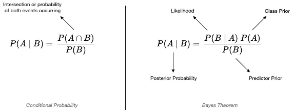
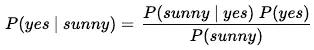
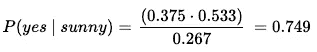
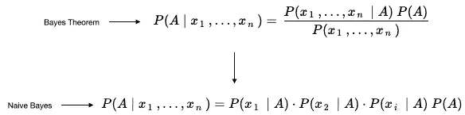

# 5 分钟机器学习

> 原文：<https://towardsdatascience.com/5-minute-machine-learning-naive-bayes-f48472670fdd?source=collection_archive---------6----------------------->

## 贝叶斯定理和朴素贝叶斯


图片来自 Unsplash.com，作者: [@markbertulfo](https://unsplash.com/@markbertulfo)

朴素贝叶斯是一组简单有效的机器学习算法，用于解决各种分类和回归问题。如果你已经有一段时间没有上统计课了，或者看到“贝叶斯”这个词让你感到不安，那么这可能是一个很好的 5 分钟介绍。我将在 5 分钟内用一个健身房新年决心的例子来解释贝叶斯定理和朴素贝叶斯。我还将在我的 [GitHub](https://github.com/aviolante/quick_ml_series/blob/master/02_quick_ml_naive_bayes.py) 中包含一些使用 [Scikit-learn](https://scikit-learn.org/stable/modules/naive_bayes.html) 的简单 python 代码。我们开始吧！

## 贝叶斯定理快速介绍

为了解释朴素贝叶斯，我们需要首先解释贝叶斯定理。贝叶斯定理的基础是[条件概率](https://www.statisticshowto.com/probability-and-statistics/statistics-definitions/conditional-probability-definition-examples/)(图 1)。事实上，贝叶斯定理(图 1)只是计算条件概率的一种替代或逆向方法。当联合概率、***【P(A∩B)】***较难计算或如果逆或贝叶斯概率、***【P(B | A)***较容易计算时，则贝叶斯定理可以应用。



图 1 —条件概率和贝叶斯定理

让我们快速定义一下贝叶斯定理中的一些术语:

*   ***类先验或先验概率:*** 事件 A 在对事件 b 一无所知之前发生的概率。
*   ***预测先验或证据:*** 与类先验相同，但用于事件 b
*   ***后验概率:*** 得知事件 b 后事件 A 的概率。
*   ***可能性:*** 后验概率的反转。

## 贝叶斯定理 vs 朴素贝叶斯:区别是什么？

这一切和朴素贝叶斯有什么关系？你需要知道贝叶斯定理和朴素贝叶斯的区别在于，朴素贝叶斯假设条件独立，而贝叶斯定理不假设条件独立。这意味着所有输入要素之间的关系是独立的。也许不是一个伟大的假设，但这就是为什么算法被称为“幼稚”。这也是算法非常快的一个原因。即使算法是“幼稚的”,它仍然可以胜过复杂的模型，所以不要让它的名字阻止你。下面我将展示贝叶斯定理和朴素贝叶斯之间的符号差异。让我们首先为我们在 Globo Gym 的朋友做另一个贝叶斯定理的例子。

## 应用贝叶斯定理的步骤

这里有一个简单的例子，将与所有的新年决心相关。Globo Gym 想要预测在给定天气条件下会员是否会去健身房***(attend = yes | weather)***。

***步骤 1-查看或收集“原始”数据。***

我们有这样的数据，其中每一行都代表会员在天气条件下参加 Globo Gym 的情况。所以观察 3 是在外面阴天的时候去健身房的会员。

```
 weather attended
0   sunny      yes
1   rainy       no
2   snowy       no
3  cloudy      yes
4  cloudy       no
```

***第二步-将长数据转换成频率表***

这提供了天气状况下的出席总数。

```
 attended
          no  yes
weather
cloudy     1    3
rainy      2    1
snowy      3    1
sunny      1    3
```

***第 3 步-行和列求和以获得概率***

```
weather probabilities
cloudy = 4/15 or 0.267
rainy  = 3/15 or 0.20
snowy  = 4/15 or 0.267
sunny  = 4/15 or 0.267attendance probabilities
no  = 7/15 or 0.467
yes = 8/15 or 0.533
```

查看我们的**类先验概率**(出席概率)，平均一个会员有 53%的可能去健身房。仅供参考，这正是大多数健身房的商业模式:希望很多人注册，但很少参加。然而，我们的问题是，在给定的天气条件下，会员去健身房的可能性有多大。

***第五步——将频率表中的概率应用于贝叶斯定理***

图 2 显示了我们用贝叶斯定理表示法提出的问题。让我们从上面的频率表中给图 2 中的每个概率赋值，然后重写等式，这样就清楚了。



图 2 -假设天气晴朗，出席概率的贝叶斯定理

***可能性*** *: P(晴|是)=* 3/8 或 0.375(总晴**和**是除以总是)

***类先验概率*** *: P(是)=* 8/15 或 0.533

***预测器先验概率****:**P(sunny)=*4/15 或 0.267



图 3 -带值的贝叶斯定理

图 3 显示，如果天气晴朗，一个随机成员有 75%的可能去健身房。这高于 53%的整体平均出席率！相反，下雪时去健身房的概率只有 25% (0.125 ⋅ 0.533 / 0.267)。

既然这是一个二元的例子(参加或不参加) ***P(是|晴天)*** = 0.75 或 75%，那么反过来 ***P(否|晴天)*** 就是 0.25 或 25%，因为概率必须求和为 1 或 100%。

这就是如何使用贝叶斯定理来寻找分类的后验概率。朴素贝叶斯算法与我们接下来要展示的类似。要明确的是，我们的例子中一个明显的问题是，给定天气，我们对所有成员应用相同的概率，这是没有意义的，但这只是一个有趣的例子。现在，让我们讨论额外的功能和使用朴素贝叶斯。

## 多重特征和使用朴素贝叶斯

几乎在所有情况下，模型中都有许多特征。Globo Gym 的示例特征可以是:年龄箱、会员类型、性别等。让我们展示如何将这些特性融入贝叶斯定理和朴素贝叶斯。

下面的图 4 显示了简化到朴素贝叶斯算法中的贝叶斯定理，该算法结合了多种特征。在贝叶斯定理中，您将计算给定所有特征的单个条件概率(上图)。对于朴素贝叶斯，我们通过计算每个特征的条件概率来简化它，然后将它们相乘。请记住，这就是它被称为“幼稚”的原因，因为所有的特征条件概率都是彼此独立计算的。朴素贝叶斯算法在独立性和去除分母的帮助下得到简化。你可以按照贝叶斯定理的上述步骤来应用这些简单的计算，从而得出贝叶斯定理和朴素贝叶斯之间的关系！



图 4 —简化为朴素贝叶斯的贝叶斯定理

## 结论

这是对贝叶斯定理和朴素贝叶斯的 5 分钟快速介绍。我们使用了一个有趣的例子，Globo Gym 使用贝叶斯定理预测健身房的出席率。我们解释了贝叶斯定理和朴素贝叶斯之间的区别，展示了简化的符号，并通过独立性假设展示了为什么它是“朴素”的。这里还有很多要补充的，但希望这能让你对贝叶斯定理和朴素贝叶斯算法有所了解。我会在下面的参考文献中添加一些好的读物。我希望你对朴素贝叶斯的好奇心有所增长，并把它融入到你的下一个项目中。

## 参考

1.  这家伙真棒！Jason Brownlee 的文章:[机器学习的贝叶斯定理](https://machinelearningmastery.com/bayes-theorem-for-machine-learning/)、[概率](https://machinelearningmastery.com/joint-marginal-and-conditional-probability-for-machine-learning/)和[从零开始开发朴素贝叶斯](https://machinelearningmastery.com/classification-as-conditional-probability-and-the-naive-bayes-algorithm/)
2.  免费 pdf 的*想贝氏*书[在这里](http://www.greenteapress.com/thinkbayes/thinkbayes.pdf)
3.  简单代码的 GitHub [回购](https://github.com/aviolante/quick_ml_series/blob/master/02_quick_ml_naive_bayes.py)
4.  Scikit-learn [朴素贝叶斯文档](https://scikit-learn.org/stable/modules/naive_bayes.html)