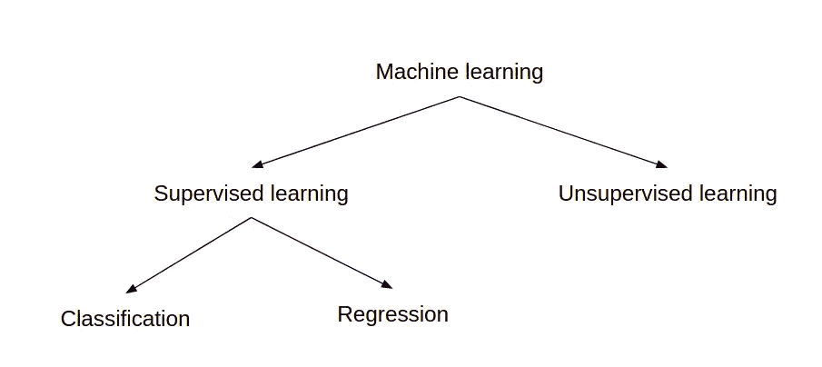
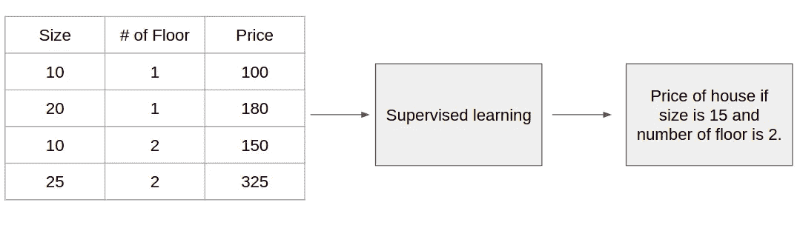
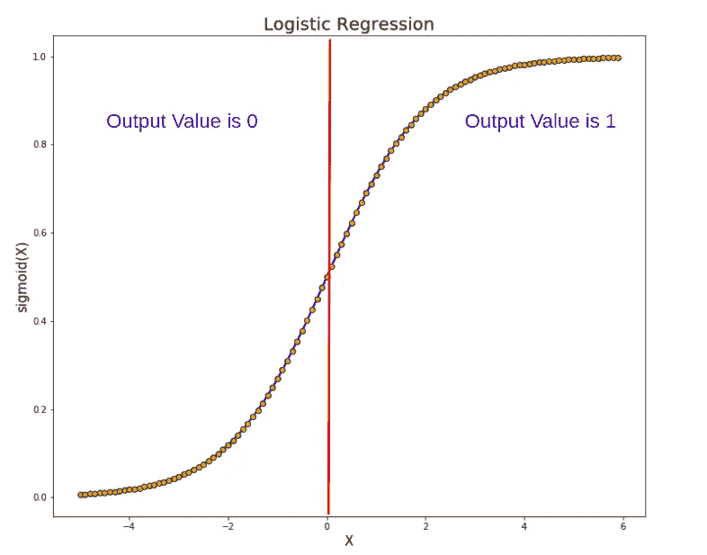
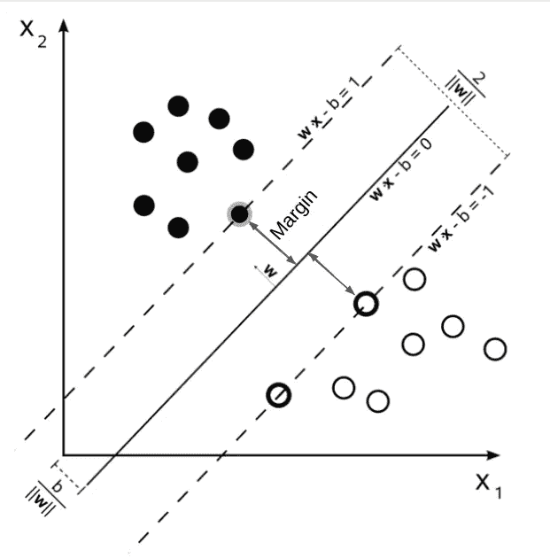
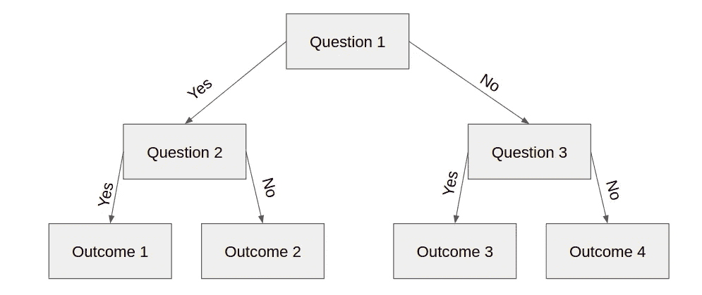
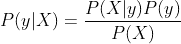
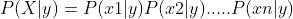
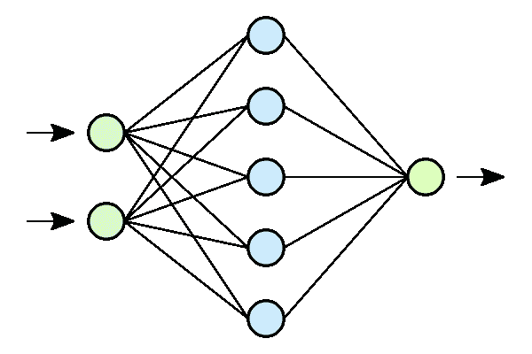
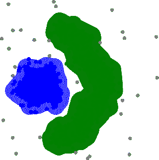

# 解释所有机器学习模型的 5 分钟备忘单

> 原文：<https://towardsdatascience.com/5-minutes-cheat-sheet-explaining-all-machine-learning-models-3fea1cf96f05?source=collection_archive---------3----------------------->

## 没有时间深入研究流行的机器学习模型？

## 解释最重要的机器学习模型

马库斯·温克勒在 [Unsplash](https://unsplash.com?utm_source=medium&utm_medium=referral) 上的照片

很多时候，恰好你过几天就要面试了，你的日程排得满满的准备。或者可能你正处于修订模式，想看看所有基本的流行机器学习模型。如果是这样的话，你来对地方了。在这篇博客中，我将简要解释一些在采访中最常被问到的机器学习模型。我还将列出与每个模型相关的重要参数，以及找到同一主题的详细解释的来源，因此如果需要，您可以更深入地了解。

由[吉菲](https://giphy.com/)

机器学习模型可以大致分为监督学习和非监督学习两类。在监督学习中，我们有两大类回归和分类。接下来的几节将对它们进行简要的解释，让您有必要的了解。

分类(按作者分类的图片)

> 注意:我提供的是模型，我认为这是最常见的模型，应该在接受任何数据科学采访之前准备好。然而，这个列表是主观的。

# 监督学习

在监督学习中，用于训练模型的数据被“标记”。这意味着每个输入的输出是已知的。例如，如果您的模型试图预测房价，您可能会有一些变量，如房子的大小、楼层数等。当您的数据被标记时，这意味着您还有一个包含房价的变量。

监督学习的例子。作者图片

上面的例子是为了回归。现在让我们仔细看看回归和分类。

# 分类

在分类中，模型的输出是离散的。例如，考虑狗与猫的图像分类，其中我们预测图像是否包含狗或猫的家庭。类别(这是模型的输出)在这里将是离散的，即狗或猫。现在，我们将浏览常用于分类的模型。

## 逻辑回归

不要迷茫；名字中有“回归”二字，但用于分类。逻辑回归使用一个方程来创建数据曲线，然后使用该曲线来预测新观察的结果。

逻辑回归(图片由作者提供)

实质上，创建了一个逻辑等式，使得输出值只能在 0 和 1 之间。

**详细** **解说**[此处](/logistic-regression-explained-9ee73cede081)

## 支持向量机

支持向量机(SVM)在用于分类的数据点之间形成边界。例如，在 2 维的情况下，SVM 将创建一个边界，使得一个类的大部分数据点落在边界的一侧，而另一个类的大部分数据点落在另一侧。

SVM(修改后的[图片](https://commons.wikimedia.org/wiki/File:Svm_max_sep_hyperplane_with_margin.png)带 CC 牌照)

所以 SVM 的目标是找到最大化利润的边界(如上图所示)。

**重要参数/概念** —内核、C、伽玛、余量

**详细解释** [**此处**](https://medium.com/machine-learning-101/chapter-2-svm-support-vector-machine-theory-f0812effc72)

## 决策图表

在决策树中，你基本上是问一些关于你的观察的问题，并沿着树向下直到你得到一个结果，如下所示。

决策树(图片由作者提供)

在上面的例子中，每个正方形被称为一个**节点，**，这里的节点数量越多，将导致数据集上的模型越过度拟合。

**重要参数/概念** —节点、叶节点、熵、信息增益

**详细解释** [**此处**](https://www.saedsayad.com/decision_tree.htm)

## 随机森林

它是一种集成学习技术，使用多个决策树来给出最终输出。随机森林基于原始数据集的[引导数据集](https://machinelearningmastery.com/a-gentle-introduction-to-the-bootstrap-method/)创建多个决策树，并在决策树的每一步随机选择变量的子集。在推理过程中，我们得到所有决策树的输出，最后，我们选择具有最多票数的输出。随机森林通常比决策树更受欢迎，因为它们可以防止过度拟合。

**重要参数/概念** —决策树的数量、引导数据的大小、随机森林特征的数量，以及决策树部分提到的所有其他内容。

**详细解释** [**这里的**](/ensemble-methods-bagging-boosting-and-stacking-c9214a10a205) (也包括其他的合奏方法)

## 朴素贝叶斯

这个模型需要很强的概率基础。它的工作是基于贝叶斯定理。

作者图片

基本上，我们试图找出“给定一个输入(X)，一个特定输出(y)的概率是多少”。我们假设每个输入变量都是相互独立的，所以 P(X|y)可以写成

作者图片

此外，对于所有可能的输出(0，1)，P(X)(出现在分母中)将保持不变。所以我们对所有可能的输出计算 P(y|X)，概率最高的输出将是模型的最终预测。

**详解** [**此处**](/naive-bayes-explained-9d2b96f4a9c0)

## 神经网络

当今最基本的机器学习模型之一。它被称为神经网络，因为它是模仿我们大脑中神经元的工作方式而设计的。神经网络发现数据集中的模式，有时甚至人类都无法识别。它们非常强大，非常有用，尤其是在处理图像、文本和音频时。

神经网络(图片来自[维基百科](https://commons.wikimedia.org/wiki/File:Neural_network.svg)带 CC 许可)

在上图中，前两个圆圈表示输入图层，中间 5 个圆圈表示隐藏图层，最后一个黄色圆圈表示输出图层。隐藏层中的每个节点代表一个线性函数和一个激活函数。

**重要参数/概念—** 学习率、损失函数、反向传播、激活函数。

**详细解释** [**此处**](/first-neural-network-for-beginners-explained-with-code-4cfd37e06eaf)

# 回归

在回归中，模型的输出是连续的。例如，考虑房价预测，我们根据房子的大小和层数来预测房子的价格。这个房价将是一个连续的变量，而不是离散的。

## 线性回归

它类似于逻辑回归。这里我们试图找到一条最符合数据的线。然后，该最佳拟合线用于预测新的数据点。

线性回归(图片来自[维基百科](https://commons.wikimedia.org/wiki/File:Linear_regression.svg)

线性回归只不过是直线或平面的方程。该等式包含每个输入变量的系数，反映每个输入变量对输出的敏感度。

**重要参数/概念—** 回归系数

**详解** [**此处**](/linear-regression-explained-d0a1068accb9)

可用于回归任务的其他重要模型有决策树、随机森林、神经网络等。因为上面我已经讲过了，所以我现在就跳过它们。

# 无监督学习

在无监督学习中，用于训练模型的数据是“未标记的”。这意味着你只有输入。在无监督学习中，我们试图仅基于输入数据来发现模式。无监督学习中使用的两种主要方法包括聚类和降维。

## 使聚集

聚类(图片由[维基百科](https://commons.wikimedia.org/wiki/File:DBSCAN-density-data.svg)提供 CC 许可)

聚类包括基于某些标准对数据点进行分组或聚类。它用于客户细分、欺诈检测、文档分类等。

一些常见的聚类技术包括 k 均值聚类、层次聚类、均值漂移聚类和基于密度的聚类。虽然每种技术在寻找聚类时使用不同的标准，但它们都旨在实现相同的目标。

**详解**[此处](/the-5-clustering-algorithms-data-scientists-need-to-know-a36d136ef68)

## 降维

它包括通过寻找/提取一组更重要的变量来减少所考虑的输入变量的数量。有两种方法通过特征消除或特征提取来减少输入特征。

最著名的降维方法之一是基于特征提取的主成分分析(PCA)。

**详细解释** [**此处**](https://medium.com/@raghavan99o/principal-component-analysis-pca-explained-and-implemented-eeab7cb73b72)

# 结论

我希望这种总结所有重要机器学习模型的尝试对你们所有人都有用。如果你认为有任何改进的余地，或者你想要一个关于任何其他模型的解释，请让我知道。如果你想了解更多关于机器学习的话题，请关注我们的 [medium](https://medium.com/@AnveeNaik) 。

*成为* [*介质会员*](https://medium.com/@AnveeNaik/membership) *解锁并阅读介质上的许多其他故事。*