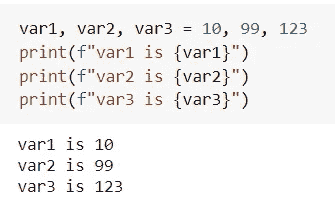

# Python 编程中最强大的 5 个一行程序

> 原文：<https://towardsdatascience.com/5-most-powerful-one-liners-you-should-know-in-python-programming-c9d49a89b7f3?source=collection_archive---------3----------------------->

## 编程；编排

## 这是您可以使用 Python 在一行中完成的事情


来自 [Pexels](https://www.pexels.com/photo/the-power-text-sign-on-a-wall-7671464/?utm_content=attributionCopyText&utm_medium=referral&utm_source=pexels) 的 [cottonbro](https://www.pexels.com/@cottonbro?utm_content=attributionCopyText&utm_medium=referral&utm_source=pexels) 摄影

**Python** 提供了一组独特的特性！

Python 程序员使用它们以更 python 化的方式快速编写代码。

在这里，我正在讨论我在 1 分钟或更短时间内掌握的 5 个最强大的单行代码(*当然你也可以*)。

> *我说的* **强大的俏皮话**是什么意思？？

这些单行代码将使你的程序干净、清晰、简短、易于理解和修改。

如果一行程序令人困惑，难以理解，那么它就不是一个 Pythonic 式的方法！所以，谨慎使用这个强大的工具！⚡️

让我们跳进来吧！

# 对于一行中的循环

根据 for 循环♻️的用途，有两种方法可以将其压缩到一行中。

*   如果 for 循环体只有一条语句，那么只需将所有内容写在一行中。

例如，印刷从 10 到 15 的所有数字的方块可以在一行中实现，

```
for k in range(10,16): print(k**2)
```


一行中的 For 循环|作者图片

*   如果使用 for 循环来填充或创建列表，那么使用 list comprehension。

在上面的同一个例子中，所有数字的平方列表可以创建为，


使用列表理解|图片作者

在这份快速阅读材料中，列举的理解，它的优点和缺点都用有趣的例子详细说明了。👇

</3-python-tricks-for-better-code-511c82600ee1>  

# 在一行中分配多个变量

在 Python 中，可以在一行中将多个值赋给多个变量。举个例子，



一行中的多个变量赋值|作者图片

此外，您可以分配不同类型的值，如整数，浮点，字符串。🔸 🔹
例如，


在一行中分配多个变量|作者图片

更进一步，可以将多个值赋给单个变量。举个例子，


为单个变量分配多个值|按作者排序的图像

正如您在上面看到的，分配给单个变量的所有值构成了一个元组。

# 交换一行中的值

与其他编程语言不同，Python 在交换两个变量的值时消除了临时变量。

因此，两个变量的值可以在一行中交换。举个例子，


交换一行中的变量值|按作者排序的图像

这不仅限于两个变量，而是可以用任意数量的变量来完成。🏆这是一个有三个变量的例子，


交换多个变量值的一行程序|作者图片

关于交换值的更多信息可以在这里找到— [***3 省时的 Python 窍门***](/3-time-saving-python-tricks-a017f4215aeb) 。

# 删除一行中的重复项

使用 *Python 数据结构*💡高效地删除重复️in 单行。

当您有一个重复值的列表时，这里有一个优雅的技巧来删除重复值。简单来说，把列表转换成集合就完成了！

举个例子，


在 Python | Image by Author 中移除一行中的重复项

# 在一行中导入所有库

这一行代码在我的代码中总是节省了几行。⏳

> pyforest 就是解决方案！！

`***pyforest***`是一个 python 包，它在一行中导入了所有常用的包。它不是预装的，因此只有第一次使用时，你需要安装它。

```
pip install pyforest
```

与其将每个库都导入到你的程序中，不如写在一行下面，这样你就可以避免所有思考和导入所需库的麻烦。

```
import pyforest
```

导入`pyforest`后，`pd.DataFrame()`、`np.arange()`、`sns.countplot()`、`sys.exit()`等常用 Python 包中的所有函数都可以直接使用。

`dir(pyforest)`会给你`pyforest`导入的 ***105*** 包的完整列表。🍀


Pyforest 导入的包列表|图片作者

总结一下，

我发现在使用 Python 进行数据分析以及复杂的自动化任务时，这些一行程序非常方便。其中一些比如`pyforest`不管任务是什么都有用(*我不建议使用它，因为如果你在协作项目*中工作，它会降低代码的可读性)，而其他比如`for`循环一行程序在某些情况下是好的。

🚩使用一行程序时，你应该记住 PEP-8 关于一行中最大字符数的准则，即 79 个字符。

现在你可以通过 [***在这里报名***](https://medium.com/@17.rsuraj/membership) 成为媒介会员，阅读我和其他作家发表的所有故事。如果你这样做，我会得到你的费用的一小部分。欢迎加入我的[邮件列表](https://medium.com/subscribe/@17.rsuraj)来了解我写作的最新进展。

**感谢您的阅读和投入时间！！**