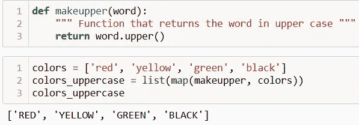
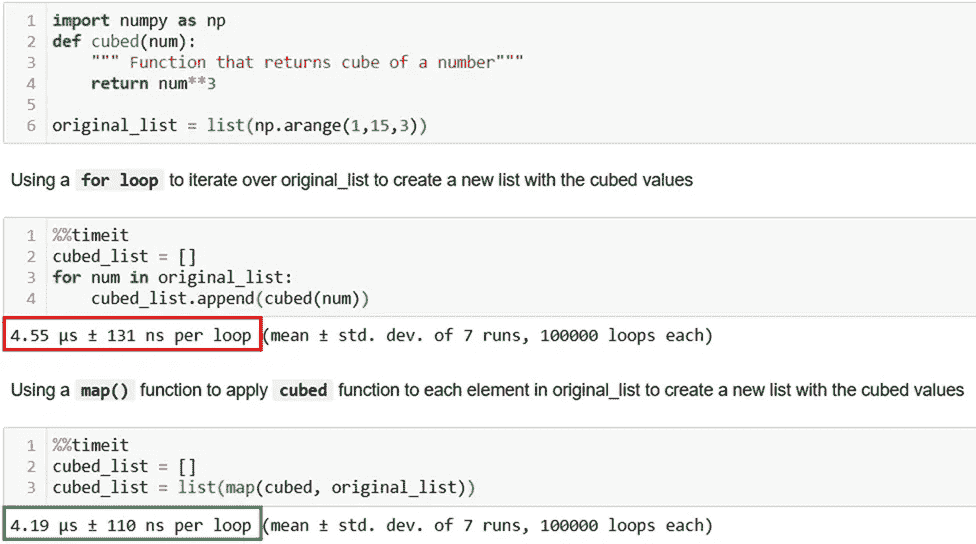
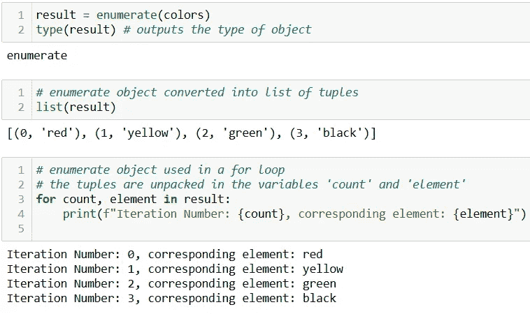
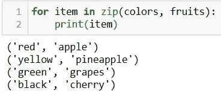
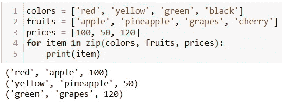
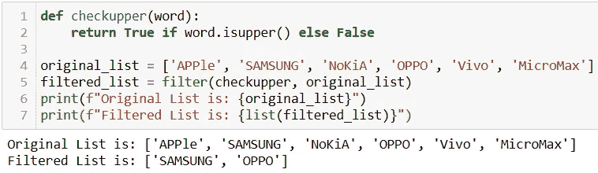
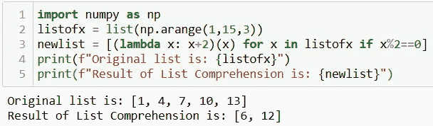

# Python 编程中最可靠的 5 个函数

> 原文：<https://towardsdatascience.com/5-most-reliable-functions-you-should-know-in-python-programming-654db1bb89f?source=collection_archive---------13----------------------->

## 编程；编排

## Python 函数提高了您的生产力，保持您的代码干净、清晰、简短！


照片来自 [Pexels](https://www.pexels.com/photo/123-let-s-go-imaginary-text-704767/?utm_content=attributionCopyText&utm_medium=referral&utm_source=pexels)

**Python** 提供了一堆内置函数！

Python 程序员使用它们快速、清晰地以更 python 化的方式编写代码。

在这里，我正在讨论我在 1 分钟或更短时间内掌握的 5 个最强大、最快的内置函数(*当然你也可以*)。⏳

我在我的项目中经常使用它们来使代码更快，更容易理解。

这些内置函数将使你的程序干净、清晰、简短、易于理解。

让我们跳进来吧！

# 地图功能

函数对 iterable 中的每一项应用指定的函数。其语法本身是不言自明的。

```
map(function,iterable)
```

例如，让我们创建一个函数来返回一个大写的输入单词。然后将这个函数映射到列表中的每一项。



Python | Image 中 map()函数最简单的例子作者

就是这样！函数`makeupper()`应用于列表`colors`中的每个项目。

在我的上一个项目中，函数`map()`比一个`for`循环对列表中的每一项应用复杂函数要快 1.5 倍的⚡。

下面是一个简单函数的执行时间比较⏳。



按作者比较 map()函数和循环|图像的执行时间

随着执行速度的加快，`map()`函数提高了代码的可读性。

# 枚举函数

有时，在使用迭代器时，我们还需要计算迭代次数。♻️

> enumerate()是解决方法！！

[***enumerate()***](https://docs.python.org/3/library/functions.html#enumerate)函数为 iterable 添加一个计数器，并以枚举对象的形式返回。这个对象可以直接在`for`循环中使用，甚至可以转换成元组列表。

下面是它的语法:
`enumerate(iterable, start=0)`

一个`iterable`必须是一个序列或者一些支持迭代的对象。由于 *Python 是一种 0 索引语言*，迭代计数器默认从 0 开始。当然，您可以更改迭代计数器的起始数。

让我们继续上一个函数中的颜色示例。

```
colors = ['red', 'yellow', 'green', 'black']
result = enumerate(colors)
```

在这个例子中，`result`是一个枚举对象，可以直接在`for`循环中使用，甚至可以转换成一个列表。



作者在 Python | Image 中枚举()函数

# Zip 功能

zip()函数用于使用多个容器的相似索引，以便它们可以作为单个实体使用。

语法和定义一样简单:


它从每个容器或 iterable 中产生一个包含一个条目的元组。

让我们举一个两个列表的例子。

```
colors = ['red', 'yellow', 'green', 'black']
fruits = ['apple', 'pineapple', 'grapes', 'cherry']
```

在 for 循环中使用 zip()函数，



Python |作者图片中的 zip()函数

[***zip()***](https://docs.python.org/3/library/functions.html#zip)常用于假设容器长度相等的情况。但是，如果容器长度不同，当最小的容器用完时，`zip()`功能停止。下面是一个例子👇

使用 zip()函数当容器具有不同的大小或长度时，



Python 中的 zip()函数具有不同大小的 iterable | Image by Author

您可以通过`zip()`函数传递列表、元组、集合或字典。

# 过滤功能

通常，我们需要处理一个 iterable 并提取那些满足给定条件的项。

> filter()可以节省您的时间和精力！！

`filter()`从一个 iterable 中提取元素，比如 list，提取的元素所在的元组是函数返回 true 的元组。

下面是一个语法:
`filter(function, iterable)`

为了更容易消化，我们举个例子。让我们创建一个函数来检查单词是否大写。然后使用`filter()`从 iterable 中提取所有大写的单词。



作者在 Python | Image 中使用 filter()函数

这里是关于 [***滤镜()***](https://docs.python.org/3/library/functions.html#filter) ***的官方文档。***

🚩学习如何使用 [**三元条件**](/3-python-tricks-for-better-code-511c82600ee1) 在单行中定义函数。

# λ函数

Lambda 函数用于创建匿名函数，即没有名称的函数。当我们需要创建一个函数来执行单个操作时，它们非常有用，并且可以用一行代码编写。它的语法是:

```
lambda parameters: expression
```

🎯Lambda 函数可以有任意数量的参数，但只能有一个表达式。

例如，`lambda x: x+2`

就是这样！！刚才我创建了一个函数，它有一个输入参数`x`并添加了`2`。

然而，正如您所看到的，这是一个匿名函数，不能在后面的阶段调用。因此，要在程序中随时调用它，lambda 函数可以像这样赋给一个函数对象，

```
add2 = lambda x: x+2
```

调用这个函数与调用用 def 关键字定义的函数完全一样。举个例子，

```
add2(10) # It will return 12 as output
```

Lambda 函数在某些情况下可以是一个很好的一行程序，例如 [**列表理解。**](/3-python-tricks-for-better-code-511c82600ee1)



Lambda 函数作为列表理解|作者图片中的一行程序

如上图所示，`newlist`是使用 lambda 函数用一行代码生成的。

总结一下，

我发现在使用 Python 进行数据分析以及复杂的自动化任务时，这些内置函数非常方便。其中一些如`zip()`、`map()`在很多情况下是有用的，而其他如`Lambda`函数在某些情况下是最好的一行程序。

🚩5 个最强大的一行程序甚至可以进一步提高你的编码。

</5-most-powerful-one-liners-you-should-know-in-python-programming-c9d49a89b7f3>  

现在可以通过 [***在这里报名成为中会员***](https://medium.com/@17.rsuraj/membership) 阅读我和其他作家发表的所有故事。如果你这样做，我会得到你的费用的一小部分。请随意加入我的[电子邮件列表](https://medium.com/subscribe/@17.rsuraj)来保持对我写作的更新。

**感谢您的阅读和投入时间！！**