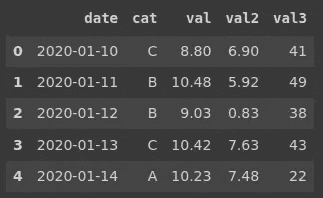
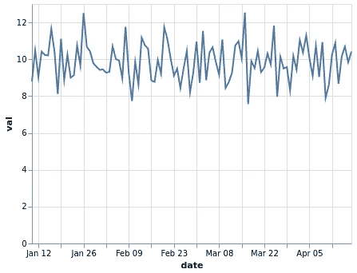
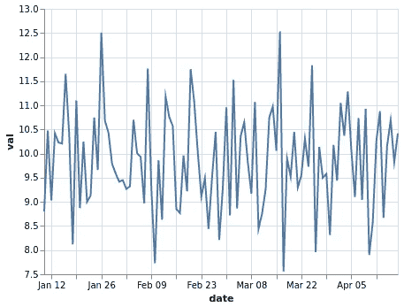
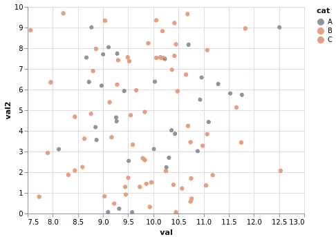
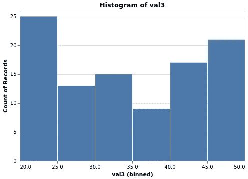
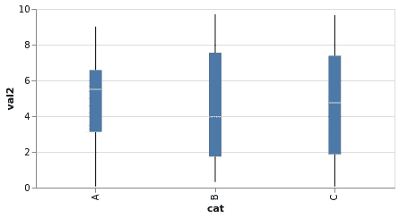
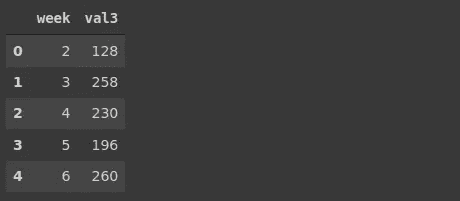
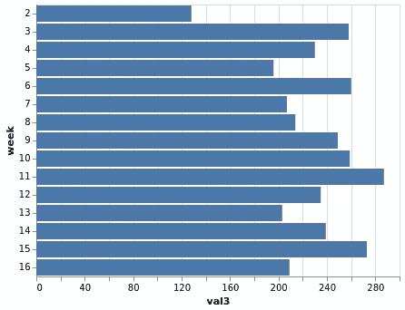

# 为了更好地进行数据分析，5 个必须知道的数据可视化

> 原文：<https://towardsdatascience.com/5-must-know-data-visualizations-for-better-data-analysis-5b40a082c471?source=collection_archive---------22----------------------->

## Altair:Python 的统计可视化库


帕斯卡尔·贝纳登在 [Unsplash](https://unsplash.com/s/photos/painting?utm_source=unsplash&utm_medium=referral&utm_content=creditCopyText) 上的照片

数据可视化是数据科学不可或缺的一部分。这对于探索和理解数据非常有用。在某些情况下，可视化在传达信息方面也比简单的数字好得多。

使用数据可视化技术可以很容易地发现变量之间的关系、变量的分布以及数据中的底层结构。

在本文中，我们将介绍数据分析中常用的 5 种基本数据可视化类型。我们将使用 Altair 库，它是 Python 的统计可视化库。

如果你喜欢其中一个用于数据可视化任务的库，我以前曾用 [Seaborn](/8-must-know-data-visualizations-for-better-data-analysis-9752953dd703) 和 [ggplot2](/7-must-know-visualizations-for-better-data-analysis-1ed6a440f7fe) 写过类似的文章。我建议浏览所有内容，因为在同一项任务中比较不同的工具和框架将有助于您更好地学习。

让我们首先创建一个用于示例的样本数据帧。

```
import numpy as np
import pandas as pddf = pd.DataFrame({
   'date':pd.date_range(start='2020-01-10', periods=100, freq='D'),
   'cat':pd.Series(['A','B','C']).sample(n=100, replace=True),
   'val':(np.random.randn(100) + 10).round(2),
   'val2':(np.random.random(100) * 10).round(2),
   'val3':np.random.randint(20,50, size=100)
})df = df.reset_index(drop=True)df.head()
```



(图片由作者提供)

数据帧由 100 行和 5 列组成。它包含日期时间、分类和数值。

## 1.线形图

线形图显示了两个变量之间的关系。其中之一通常是时间。因此，我们可以看到一个变量是如何随时间变化的。股票价格、每日气温是线图派上用场的一些用例。

下面是如何用 Altair 创建一个简单的线图。

```
import altair as altalt.Chart(df).mark_line().encode(
    x='date', y='val'
)
```



(图片由作者提供)

我们来详细说明一下语法。我们首先将数据传递给一个顶级图表对象。下一个函数指定了绘图的类型。encode 函数指定在绘图中使用哪些列。因此，我们在编码函数中写的任何东西都必须链接到数据帧。

Altair 提供了更多的函数和参数来生成更多的信息或定制的图。我们将在下面的例子中看到它们。

为了使上面的线图看起来更好，我们可以使用 scale 属性调整 y 轴的数值范围。

```
alt.Chart(df).mark_line().encode(
   alt.X('date'),
   alt.Y('val', scale=alt.Scale(zero=False))
)
```



(图片由作者提供)

为了使用 scale 属性，我们用 X 和 Y 编码指定列名(例如 alt。x)。零参数设置为“假”以防止轴从零开始。

## 2.散点图

散点图也是关系图。它通常用于可视化两个数值变量的值。我们可以观察它们之间是否有关联。

我们可以创建“val”和“val2”列的散点图，如下所示。

```
alt.Chart(df).mark_circle(size=40).encode(
   alt.X('val', scale=alt.Scale(zero=False)),
   alt.Y('val2'),
   alt.Color('cat')
)
```



(图片由作者提供)

我们使用颜色编码来根据“cat”列分隔数据点。mark_circle 函数的 size 参数用于调整散点图中点的大小。

## 3.柱状图

直方图用于可视化连续变量的分布。它将值范围划分为离散的箱，并计算每个箱中数据点的数量。

让我们创建一个“val3”列的直方图。使用了 mark_bar 函数，但是我们以函数生成直方图的方式指定了 x 和 y 编码。

```
alt.Chart(df).mark_bar().encode(
   alt.X('val3', bin=True),
   alt.Y('count()')
).properties(title='Histogram of val3', height=300, width=450)
```



(图片由作者提供)

我们还使用了 properties 函数来定制大小和添加标题。

## 4.箱形图

箱形图提供了变量分布的概况。它显示了值是如何通过四分位数和异常值分布的。

我们可以使用 Altair 的 mark_boxplot 函数创建一个盒图，如下所示。

```
alt.Chart(df).mark_boxplot().encode(
  alt.X('cat'),
  alt.Y('val2', scale=alt.Scale(zero=False))
).properties(height=200, width=400)
```



(图片由作者提供)

A 中的值的范围小于其他两个类别。方框内的白线表示中间值。

## 5.条形图

条形图可用于可视化分类变量。每个类别都用一个条形表示，条形的大小与该类别的值成比例。

例如，我们可以使用条形图来可视化“val3”列的每周总计。让我们首先用熊猫图书馆计算每周总数。

```
df['week'] = df['date'].dt.isocalendar().weekweekly = df[['week','val3']].groupby('week', as_index=False).sum()weekly.head()
```



(图片由作者提供)

第一行从日期列中提取周数。第二行按周对“val3”列进行分组，并计算总和。

我们现在可以创建条形图。

```
alt.Chart(weekly).mark_bar().encode(
   x='val3:Q', y='week:O'
)
```



(图片由作者提供)

## 结论

我们已经介绍了 5 种基本但非常实用的可视化类型。它们都是探索数据集和揭示变量之间关系的基础。

使用 Altair 可以创建更复杂、信息量更大和定制的可视化效果。它在数据转换和过滤方面也非常高效和强大。

如果你想更详细地学习和练习 Altair，这里是我以前写的 4 篇系列文章。

*   第一部分:牛郎星简介
*   [第二部分:过滤和转换数据](/altair-statistical-visualization-library-for-python-part-2-4c8ce134e743)
*   [第三部分:互动情节和动态过滤](/altair-statistical-visualization-library-for-python-part-3-c1e650a8411e)
*   [第 4 部分:定制可视化效果](/altair-statistical-visualization-library-for-python-part-4-9ec970fb12e8)

感谢您的阅读。如果您有任何反馈，请告诉我。