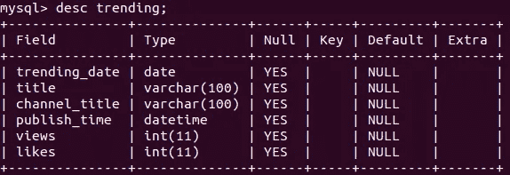

# SQL 的 5 个必须知道的日期和时间函数

> 原文：<https://towardsdatascience.com/5-must-know-date-and-time-functions-of-sql-3079cdb1a71e?source=collection_archive---------35----------------------->

## 实例实用指南


[自由股票](https://unsplash.com/@freestocks?utm_source=unsplash&utm_medium=referral&utm_content=creditCopyText)在 [Unsplash](https://unsplash.com/s/photos/time?utm_source=unsplash&utm_medium=referral&utm_content=creditCopyText) 上的照片

SQL 是一种编程语言，关系数据库管理系统(RDBMS)使用它来管理带有标记行和列的表格形式的数据。

我们编写 SQL 查询从关系数据库中检索数据。查询可以像从表中检索所有条目一样简单。然而，这并不是一个理想的场景。

SQL 允许编写高级查询来过滤和转换数据。我们只能以期望的格式检索我们需要的数据。这比检索所有数据然后应用过滤和转换要高效得多。

SQL 还提供了许多函数和方法来执行数据分析，同时从数据库中获取数据。从这个意义上说，SQL 也可以被认为是一种数据分析工具。

在这篇文章中，我们将讨论 5 个用于日期和时间的函数。我将使用 MySQL 作为 RDBMS。尽管大多数 SQL 语法在不同的 RDBMSs 中是通用的，但重要的是可能会有一些小的差异。

我创建了一个 SQL 表，其中包含一些关于美国 YouTube 上热门视频的数据。这是 Kaggle 上可用的[数据集](https://www.kaggle.com/datasnaek/youtube-new?select=USvideos.csv)的一小部分。该表被称为“趋势”，它包含以下关于 2018 年 1 月趋势视频的数据。



趋势表(作者图片)

## 1.日期函数

date 函数提取日期时间表达式的日期部分。例如，publish_time 列包含日期和时间部分。

```
mysql> select publish_time from trending
    -> limit 3;+---------------------+
| publish_time        |
+---------------------+
| 2018-01-01 15:30:03 |
| 2018-01-01 01:05:59 |
| 2018-01-01 14:21:14 |
+---------------------+
```

我们可以使用 date 函数提取 publish_time 列的日期部分。

```
mysql> select date(publish_time) from trending
    -> limit 3;+--------------------+
| date(publish_time) |
+--------------------+
| 2018-01-01         |
| 2018-01-01         |
| 2018-01-01         |
+--------------------+
```

## 2.时间函数

时间函数类似于日期函数，但它提取时间部分。

```
mysql> select time(publish_time) from trending
    -> limit 3;+--------------------+
| time(publish_time) |
+--------------------+
| 15:30:03           |
| 01:05:59           |
| 14:21:14           |
+--------------------+
```

## 3.Datediff 函数

顾名思义，datediff 函数计算两个日期之间的差值。该表包含视频的发布和趋势日期。datediff 函数可用于查找它们之间的差异。

例如，以下查询返回视频发布和成为趋势之间差异的前 3 个值。

```
mysql> select datediff(trending_date, date(publish_time)) as diff
    -> from trending
    -> order by diff desc
    -> limit 3;+------+
| diff |
+------+
|   28 |
|   27 |
|   26 |
+------+
```

datediff 函数接受两个日期作为其参数。因为 publish_time 列包含日期和时间，所以我们应用 date 函数来访问它的日期部分。order by 子句按降序对差异进行排序。最后，我们通过将限制设置为 3 来显示前三行。

我们还可以根据发布日期和流行日期之间的差异对视频进行分组。以下查询根据视频数量返回发布日期和趋势日期之间的前 3 个差异。

```
mysql> select count(*) as qty,
    -> datediff(trending_date, date(publish_time)) as diff
    -> from trending
    -> group by diff
    -> order by qty desc
    -> limit 3;+-----+------+
| qty | diff |
+-----+------+
| 833 |    3 |
| 823 |    4 |
| 790 |    5 |
+-----+------+
```

大多数视频在发布后的 3、4 或 5 天内成为热门。

## 4.Now 和 curdate 函数

它们都是用来访问当前日期的。它们可以方便地计算一个观测值有多长时间了。now 或 curdate 函数可以与 datediff 函数一起使用，如下所示。

```
mysql> select avg(datediff(now(), date(publish_time)))
    -> as avg_time
    -> from trending;+-----------+
| avg_time  |
+-----------+
| 1110.5513 |
+-----------+
```

我们计算了这些趋势视频的平均存在时间。在我们的情况下，这不是很有用，因为我们知道表中的所有视频都是在 2018 年 1 月发布的。然而，知道如何使用这些功能是很重要的。

## 5.工作日

有许多函数可以访问日期或时间的各个部分，如月份名称、星期、工作日、年份等等。我选择 weekday 函数作为例子。

我们可以根据工作日对视频的流行日期进行分组。

```
mysql> select count(*) as qty, weekday(trending_date) as wday
    -> from trending
    -> group by wday;+-----+------+
| qty | wday |
+-----+------+
| 780 |    0 |
| 793 |    1 |
| 614 |    2 |
| 634 |    3 |
| 818 |    4 |
| 820 |    5 |
| 816 |    6 |
+-----+------+
```

weekday 函数返回工作日索引。似乎更多的视频在周末而不是工作日成为热门。

再来做一个例子。顾名思义，weekofday 函数计算日历周。我们可以将它应用于趋势日期，如下所示。

```
mysql> select count(*) qty, weekofyear(trending_date) as week_of_year
    -> from trending
    -> group by week_of_year;+------+--------------+
| qty  | week_of_year |
+------+--------------+
|  494 |            1 |
|  949 |            2 |
| 1360 |            3 |
| 1352 |            4 |
| 1075 |            5 |
|   45 |            6 |
+------+--------------+
```

## 结论

我们已经介绍了 SQL 的基本日期和时间函数。你可以在 MySQL [文档](https://dev.mysql.com/doc/refman/8.0/en/date-and-time-functions.html)中看到这些函数的完整列表。

这些函数非常重要，因为时间和日期是数据分析和处理的两个关键因素。

感谢您的阅读。如果您有任何反馈，请告诉我。