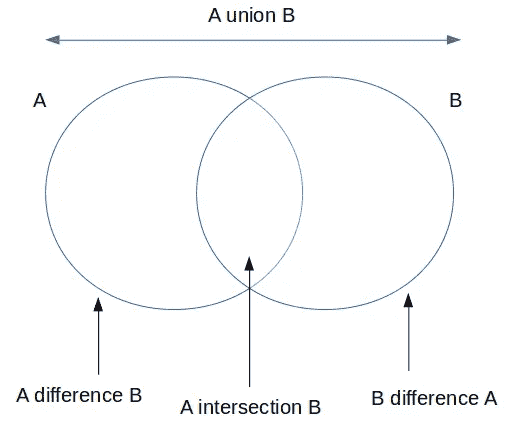

# Python 集合上的 5 个必备操作

> 原文：<https://towardsdatascience.com/5-must-know-operations-on-python-sets-827d5b81465a?source=collection_archive---------17----------------------->

## 集合是 Python 的核心数据结构之一


蒂姆·福斯特在 [Unsplash](https://unsplash.com/s/photos/unique?utm_source=unsplash&utm_medium=referral&utm_content=creditCopyText) 上的照片

数据结构是 Python 脚本的构建块。它们以特定的方式保存或包含数据，以使脚本更有效地工作。因此，学习如何与数据结构交互是至关重要的。

集合是 Python 中的核心数据结构之一。集合是具有以下特征的对象的集合:

*   集合是无序的
*   集合包含不同的元素
*   集合中的元素必须是不可变的

由于集合是无序的，我们不能在集合上执行像索引和切片这样的操作。我们不能将可变对象(如列表)作为集合中的一个元素。集合的一个常见用例是从集合或序列中删除重复的元素。

在本文中，我们将讨论集合的 5 种常用运算。让我们从创建一个集合开始。我们可以在其他集合上使用 set 构造函数来创建一个集合。

```
mylist = ['A', 'A', 'B', 'A', 'C', 'B']
myset = set(mylist)print(myset)
{'A', 'B', 'C'}
```

我们已经基于列表创建了一个集合。该集合仅包括列表中的唯一元素。set 构造函数也可以应用于 numpy 数组。

```
import numpy as np
a = np.random.randint(0, 5, size=20)
myset = set(a)print(a)
[4 0 4 3 1 1 3 0 0 1 3 4 0 3 2 4 1 4 3 3]print(myset)
{0, 1, 2, 3, 4}
```

## 1.添加和删除元素

添加或删除元素是一个简单的操作。分别使用 add 和 remove 方法。

```
myset.add(5)print(myset)
{0, 1, 2, 3, 4, 5}
```

如果我们试图添加一个已经在集合中的元素，集合将保持不变，我们不会得到警告或错误。

```
myset.add(4)print(myset)
{0, 1, 2, 3, 4, 5}
```

remove 方法的用法是一样的。

```
myset.remove(4)print(myset)
{0, 1, 2, 3, 5}
```

## 2.更新集合

用另一个集合更新一个集合意味着将第二个集合中的元素添加到第一个集合中。考虑以下两组。

```
myset = set([0, 1, 2, 3, 5])myotherset = set([3, 4, 5, 6, 7])
```

我们可以用“myotherset”更新“myset ”,如下所示:

```
myset.update(myotherset)print(myset)
{0, 1, 2, 3, 4, 5, 6, 7}
```

update 方法非常有用，因为我们不需要担心两个集合中相同和不同的元素。

我们还可以用列表和元组等其他集合来更新集合。

```
myset = set([0, 1, 2, 3, 5])
mylist = [1, 2, 10,11,12]
myset.update(mylist)print(myset)
{0, 1, 2, 3, 5, 10, 11, 12}
```

## 3.组合集合

update 方法就地工作，这意味着它修改原始集合。在某些情况下，我们需要在不更新原始集合的情况下组合多个集合。union 方法返回两个集合的组合，因此我们可以将它赋给一个新变量。

```
myset = {'A', 'B', 'C'}
newset = {'B', 'C', 'D', 'E'}
newset2 = {1, 2, 3}combinedset = myset.union(newset).union(newset2)print(myset)
{'A', 'B', 'C'}print(combinedset)
{'A', 1, 2, 'D', 'E', 3, 'B', 'C'}
```

我们得到集合的组合(即并集),但原始集合保持不变。

在上例中，我们还看到了创建集合的不同方式。可以在花括号(" {} ")内传递元素来创建 set。

## 4.比较集合

两个集合可以根据它们包含的元素进行比较。issuperset 和 issubset 方法可用于比较两个集合。

假设我们有两个集合 A 和 B，如果 A 包含 B 中的所有元素，那么 A 是 B 的超集，在这种情况下，B 是 A 的子集。

```
A = {1, 2, 3, 4, 5}
B = {1, 4, 5}
C = {1, 4, 6}A.issuperset(B)
TrueB.issubset(A)
TrueA.issuperset(C)
False
```

集合 C 中的一个元素不在集合 A 中。因此，A 不是 C 的超集。

如果两个集合包含相同的元素，它们可以被认为是彼此的超集和子集。

```
D = {1, 4, 5}E = {1, 4, 5}D.issuperset(E)
TrueD.issubset(E)
True
```

## 5.交集与差异

集合的概念非常类似于数学中的维恩图。



(图片由作者提供)

我们可能对一组中的元素感兴趣，而对另一组中的元素不感兴趣。类似地，我们可能需要找到两个集合中的元素。差分和交集方法可分别用于执行这些操作。

```
A = {1, 2, 3, 4, 5}
B = {3, 4, 5, 6, 7, 8}A.difference(B)
{1, 2}A.intersection(B)
{3, 4, 5}B.difference(A)
{6, 7, 8}
```

在寻找交集时，集合的顺序无关紧要。但是，差额是根据订单计算的。A 与 B 的不同之处在于包含了 A 中有而 B 中没有的元素，反之亦然。

## 结论

我们已经通过例子演示了在集合上执行的 5 种常见操作。有更多的方法可以应用于集合。然而，对于大多数情况，我们在本文中介绍的内容已经足够了。

感谢您的阅读。如果您有任何反馈，请告诉我。