# 数据科学中熊猫的 5 个必备功能

> 原文：<https://towardsdatascience.com/5-must-know-pandas-functions-for-data-science-d29d04653190?source=collection_archive---------8----------------------->

## 大多数数据科学项目都在使用熊猫


斯蒂芬·莱昂纳迪在 Unsplash[拍摄的照片](https://unsplash.com?utm_source=medium&utm_medium=referral)

每个数据科学项目都是从数据分析开始的。当我们谈到数据分析时，熊猫是最受重视的玩家。Pandas 是一个 python 库，也因面板数据分析而闻名。

在本文中，我将分享一些你必须知道的得心应手的熊猫功能。这些是处理数据集中不同操作的最有用的函数。

我将参考的本文数据集是 Kaggle 的房价预测数据。你可以从[这里](https://www.kaggle.com/shree1992/housedata)下载。

先来看看我们的数据。

```
import pandas as pd
df = pd.read_csv("House data.csv")
```

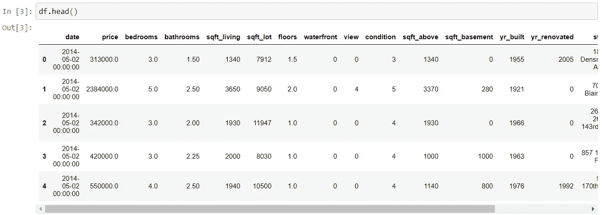

资料截图

这是我们数据的样子。由于这是房价预测数据——我们有卧室、浴室、地板和其他因素，可以帮助我们决定任何规格的房子的价格。

现在让我们对这些数据应用一些 pandas 函数。

# 1.Count()函数

假设您想快速检查表中是否有空值。在这种情况下，count 函数为我们提供了其中有值的单元格的计数。

```
df.count()
```

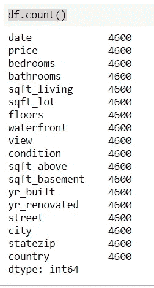

计数功能

好消息是，我们的数据集中没有空值。所以，让我们指定一个空值，看看变化。

```
df.at[0,'price']= np.nan
```

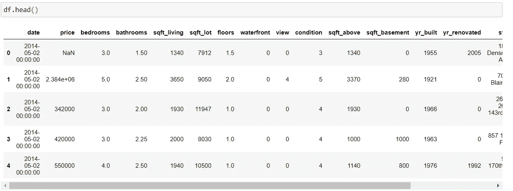

分配空值后

现在，如果我检查计数，我会得到下面的结果。

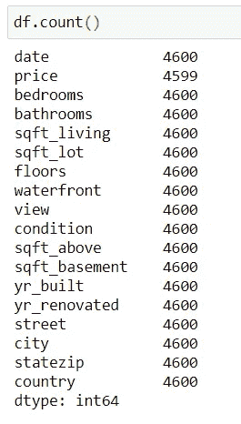

用 null 计数

# 2.idxmin()和 idxmax()函数

这些函数返回满足所需条件的特定行的索引。

比方说想得到房价最低的房子的详细信息。应用数据子集化方法可以有多种方式。但是，最有效的方法是使用这些函数。

```
df.loc[df['price'].idxmin()]
```

通过运行上面的代码，我可以得到房子的详细信息，它的价格是最低的，如下所示。

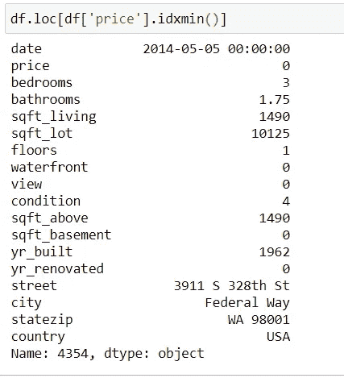

所以，我们在联邦路市以零价格买了一栋三居室的房子。😁

我知道这是数据错误，因为我们在玩开源虚拟数据。但是，我认为你得到了东西。:)同样我们可以用`idxmax()`来得到最高价格的房子。

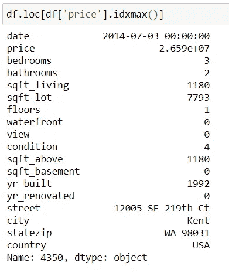

如果呢？你有不止一个房子的最低或最高价格。在这种情况下，这些函数将返回第一个匹配项。在下一篇文章中，我们将看到如何处理这种情况。😉

# 3.cut()函数

假设你有一个连续值的变量。但是，根据您的业务理解，这个变量应该被视为分类变量。

cut()函数可以帮助您存储连续变量，方法是对它们进行排序，然后将它们存储在数据范围存储桶中。

在这个数据中，我想做一桶价格数据，因为价格值的范围是从 0 到 26590000。如果我能把它桶起来，那么做决定会容易一点。

```
pd.cut(df["price"], 4)
```

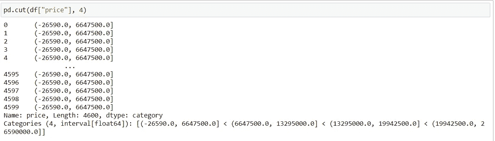

分桶数据

您还可以为每个存储桶分配标签，如下所示。

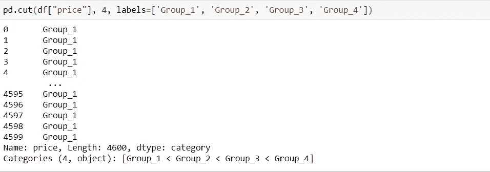

看起来不错！对吗？我们可以用它替换 price 列，也可以创建一个新的列。

# 4.数据透视表()

每个 excel 的人一定都在他们的数据中使用过这个函数。我们可以对熊猫做同样的事情。

假设我们想根据不同的卧室找到每个城市的平均房价。

```
**df.pivot_table(index="city" , columns="bedrooms" ,values="price" , aggfunc="mean")**
```

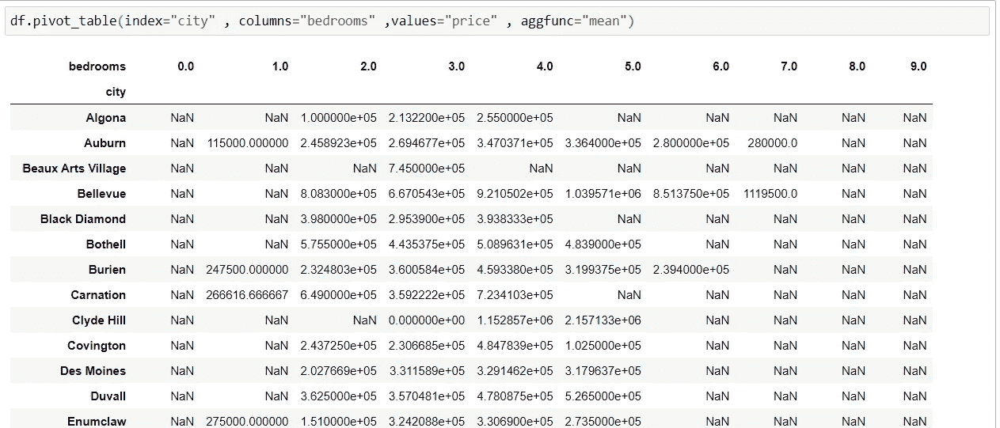

这里您可以找到空值，因为这是不必要的—每个城市都有两个卧室。这要看数据。

# 5.nsmallest()和 nlargest()函数

我们已经看到了如何使用 idxmin()和 idxmax()函数来获得最小和最大观察值。

如果呢？你想得到前 3 个最高价格的房子数据。在这种情况下，这些功能可以节省我们的时间。

```
df.nlargest(3, "price")[["city","price"]]
```

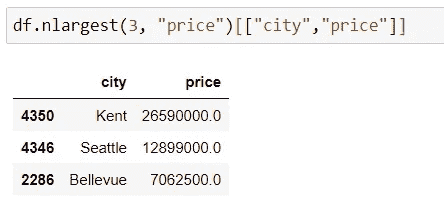

```
df.nsmallest(3, "price")[["city","price"]]
```

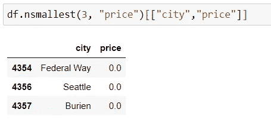

开始了。我们现在有三个城市的房价为零。:)

# 结论

嗯，那些是一些令人惊奇的熊猫功能。这些函数在您的日常数据科学任务中非常方便。

我希望你喜欢这篇文章。更多精彩文章敬请期待！

谢谢你的阅读！

以下是我的一些最佳选择:

[https://better programming . pub/10-python-tricks-that-wow-you-de 450921d 96 a](https://betterprogramming.pub/10-python-tricks-that-will-wow-you-de450921d96a)

[https://towards data science . com/7-amazing-python-one-liners-you-must-know-413 AE 021470 f](/7-amazing-python-one-liners-you-must-know-413ae021470f)

[https://towards data science . com/5-data-science-projects-the-you-can-complete-over-the-weekend-34445 b 14707d](/5-data-science-projects-that-you-can-complete-over-the-weekend-34445b14707d)

> *走之前……*

如果你喜欢这篇文章，并希望**关注**更多关于 **Python &数据科学**的**精彩文章**——请点击这里[https://pranjalai.medium.com/membership](https://pranjalai.medium.com/membership)考虑成为中级会员。

请考虑使用[我的推荐链接](https://pranjalai.medium.com/membership)注册。通过这种方式，会员费的一部分归我，这激励我写更多关于 Python 和数据科学的令人兴奋的东西。

还有，随时订阅我的免费简讯: [**普朗加尔的简讯**](https://pranjalai.medium.com/subscribe) 。