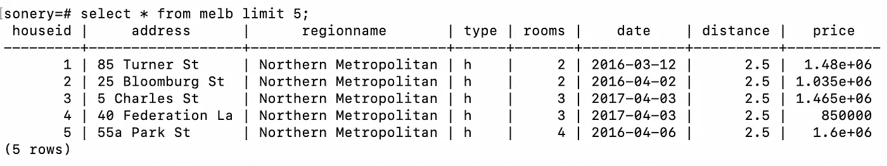

# 用于字符串操作的 5 个必备 SQL 函数

> 原文：<https://towardsdatascience.com/5-must-know-sql-functions-for-string-manipulation-8b22526e6144?source=collection_archive---------15----------------------->

## 处理文本数据是数据分析的一个重要部分


照片由 [Aaron Burden](https://unsplash.com/@aaronburden?utm_source=unsplash&utm_medium=referral&utm_content=creditCopyText) 在 [Unsplash](https://unsplash.com/s/photos/writing?utm_source=unsplash&utm_medium=referral&utm_content=creditCopyText)

SQL 用于管理关系数据库中的数据。然而，它提供的不仅仅是查询数据库。SQL 函数还允许高效地执行数据分析和操作。

因为大量的原始数据是以文本形式出现的，所以拥有多种操作字符串的方法是非常重要的。原始数据通常不是最理想的格式。我们操纵它们来创造有用的和信息丰富的特征。

在本文中，我们将介绍 5 个使用字符串的 SQL 函数。举例来说，我将使用 Kaggle 上的一小部分墨尔本房产[数据集](https://www.kaggle.com/dansbecker/melbourne-housing-snapshot)。

我创建了一个名为 melb 的表。让我们先来看看数据集。



(图片由作者提供)

数据集包含一些待售房屋的信息。

**注**:关系数据库管理系统有 MySQL、SQL Server、PostgreSQL 等几种。尽管它们大多采用相同的 SQL 语法，但可能会有一些细微的差别。在本文中，我们将使用 PostgreSQL。

## 1.串联

串联一个字符串基本上就是将多个字符串组合成一个。在我们的数据集中，我们可以将 address 和 region name 列组合起来创建一个完整的地址。

我们可以使用 concat 函数来执行这项任务。

```
SELECT CONCAT(address, ', ' , regionname) AS full_address 
FROM melb 
LIMIT 5; full_address
-----------------------------------------
85 Turner St, Northern Metropolitan
25 Bloomburg St, Northern Metropolitan
5 Charles St, Northern Metropolitan
40 Federation La, Northern Metropolitan
55a Park St, Northern Metropolitan
```

我们也可以使用“||”操作来连接字符串。

```
SELECT address || ', ' || regionname AS full_address
FROM melb 
LIMIT 5;
```

limit 关键字限制要显示的行数。

## 2.裂开

一个字符串可能包含多条信息。在这种情况下，我们可能需要从字符串中提取一部分，并将其作为一个单独的特征。

地址栏包含门牌号。让我们用它来创建一个名为门牌号的新列。

```
SELECT SPLIT_PART(address, ' ', 1) AS house_number 
FROM melb 
LIMIT 5;house_number
--------------
85
25
5
40
55a
```

split_part 函数有 3 个参数。第一个是列名。第二个是定义分割点的字符，在我们的例子中是空格。第三个参数表示拆分后我们需要哪个部分。门牌号在地址的开头，所以我们取第一部分。

## 3.替换

replace 函数允许用一组新的字符替换字符串的一部分。当我们需要标准化一些文本时，它就派上了用场。

例如，我们可以将地址列中的“st”字符替换为单词“street”。

```
SELECT address, REPLACE(address, 'St', 'Street') AS new_address 
FROM melb 
LIMIT 5; address      |     new_address
-----------------+---------------------
85 Turner St     | 85 Turner Street
25 Bloomburg St  | 25 Bloomburg Street
5 Charles St     | 5 Charles Street
40 Federation La | 40 Federation La
55a Park St      | 55a Park Street
```

## 4.左边和右边

left 和 right 函数可用于从字符串中提取一部分。我们根据字符的数量来定义要选择的部分。例如，带有 5 的 left 函数将从左侧返回前 5 个字符(即从头开始)。

```
SELECT LEFT(regionname, 5) AS region_5 
FROM melb 
LIMIT 5;region_5
----------
North
North
North
North
North
```

右函数的工作方式类似。

## 5.喜欢

like 其实是一个 SQL 运算符，不是函数。然而，在处理字符串时，它是一个非常有用的工具。我们可以用它来过滤与另一个字符串或一系列字符“相似”的字符串。

例如，我们可以过滤包含字符串“Park”的地址。

```
SELECT address 
FROM melb 
WHERE address LIKE '%Park%' 
LIMIT 5; address
----------------
55a Park St
49 Park St
159 Park St
17 Parkhill Dr
93 Parkmore Rd
```

“%”代表任何字符。因此，我们正在过滤以任何字符开头和结尾的地址。它必须在某个地方包含“公园”。

like 运算符区分大小写。我们很可能用“公园”得到不同的地址。让我们试试。

```
SELECT address 
FROM melb 
WHERE address LIKE '%park%' 
LIMIT 5; address
-----------------
18 Spark St
14 Riverpark Dr
1 Riverpark Dr
23 Oakpark Dr
```

## 结论

文本数据是数据分析的重要组成部分。因此，我们需要有效的方法和技术来处理字符串。我们在本文中介绍的内容可以帮助您操作或更新字符串。您还可以使用这些函数从字符串中提取一条信息。

感谢您的阅读。如果您有任何反馈，请告诉我。