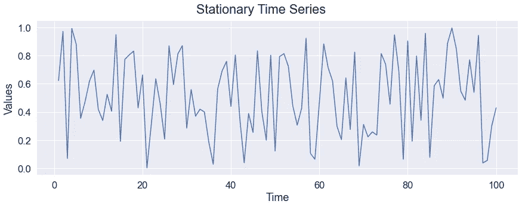
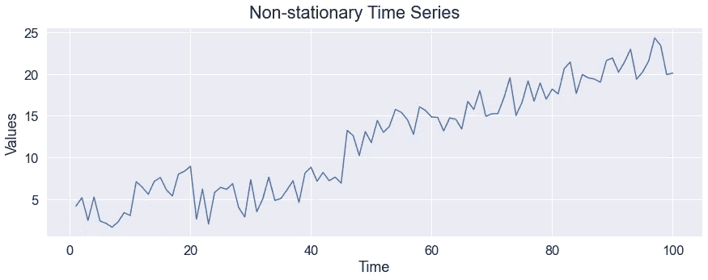
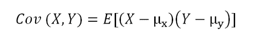
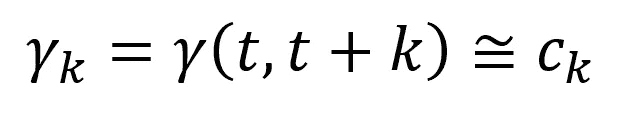
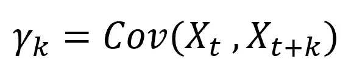
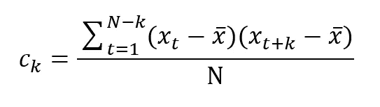
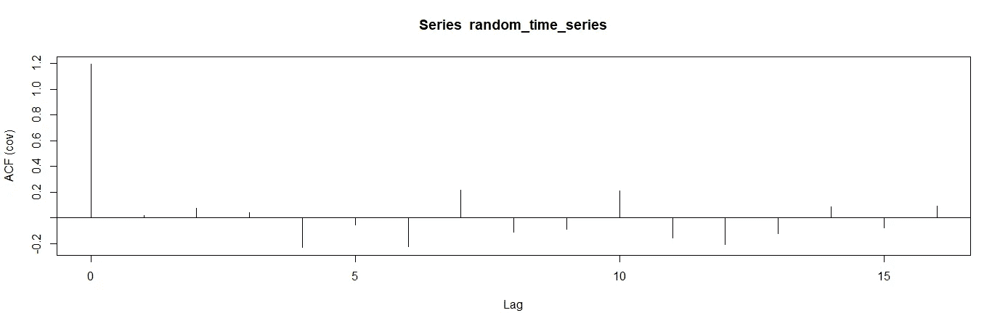
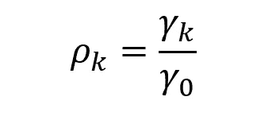
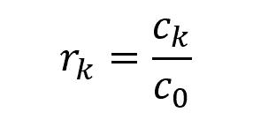
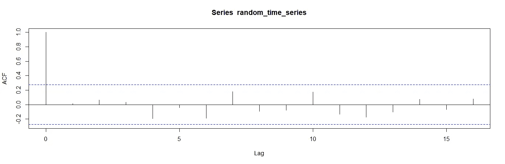

# 时间序列分析中 5 个必须知道的术语

> 原文：<https://towardsdatascience.com/5-must-know-terms-in-time-series-analysis-bf2455b2a87?source=collection_archive---------1----------------------->

## 数据科学的基础部分


马克西姆·霍普曼在 [Unsplash](https://unsplash.com/s/photos/stock?utm_source=unsplash&utm_medium=referral&utm_content=creditCopyText) 上的照片

时间序列是按时间顺序排列的一系列观察或测量结果。谈论时间序列时，首先想到的画面通常是股票价格。然而，时间序列是普遍存在的。

一个地理位置的年降雨量、超市产品的日销售量、工厂的月耗电量、化学过程的每小时测量值都是时间序列的例子。

时间序列分析是数据科学的一个基本领域，有着广泛的应用。如果你成为这方面的专家，你获得数据科学家工作的机会可能会大大增加。

在这篇文章中，我们将回顾时间序列分析中 5 个必须知道的术语和概念。

# 1.确定性和随机过程

我们最好从区分确定性过程和随机过程开始讨论。

可以计算确定性过程中的时间相关值。例如，两年后你的储蓄账户里会有多少钱可以通过最初的存款金额和利率计算出来。我们不能真正谈论确定性过程中的随机性。

另一方面，随机过程基于随机性。我们不能计算随机过程中的未来值，但我们可以谈论未来值在一个范围内的概率。

2022 年加州的降雨量有 90%的可能性是 21 英寸。我的假设是基于加州降雨量的概率分布，当然，我的假设带有随机性。

从这个意义上说，随机过程可以被认为是按时间排序的随机变量的集合。那么，时间序列就是一个随机过程的实现。

# 2.平稳性

我们刚刚把时间序列定义为一个随机过程的实现。平稳性意味着生成时间序列的过程的统计特性不会随时间而改变。

在平稳的时间序列中，我们无法观察到均值或方差的系统变化。假设我们从平稳时间序列中取两个间隔，如下所示:

*   从时间 t 到时间 t + N 的 N 次观察
*   从时间 t + k 到 t + N + k 的另外 N 个观察值

这两个区间的统计特性非常相似。这两个区间的均值或方差没有系统性差异。

因此，平稳的时间序列不具备

*   季节性
*   趋势
*   周期性波动

下图显示了一个平稳的时间序列。这些值可能是由随机噪声产生的，但我们没有观察到趋势或季节性。



(图片由作者提供)

下图显示了一个非平稳时间序列。我们可以清楚地观察到增加的趋势。



(图片由作者提供)

# 3.自协方差函数

我们首先要明白协方差是什么意思。

协方差是两个随机变量之间线性相关性的度量。它比较两个随机变量相对于其平均值(或期望值)的偏差。

随机变量 X 和 Y 之间的协方差公式:



X 和 Y 的协方差

如果 X 和 Y 的值以相同的方向变化(即它们都增加或减少)，它们之间的协方差将为正。

如果你想了解更多，我试着更详细地解释协方差和相关性:

[](https://medium.com/swlh/covariance-vs-correlation-explained-34d1b4142e28) [## 协方差与相关性—已解释

### 举例详细说明

medium.com](https://medium.com/swlh/covariance-vs-correlation-explained-34d1b4142e28) 

回到我们关于自协方差的讨论，回想一下时间序列是一个随机过程的实现，它可以被定义为一系列随机变量(X₁、X₂、x₃……)。

假设我们有一个平稳的时间序列，让我们从这个时间序列中取两个随机变量:

*   Xₜ
*   Xₜ ₊ ₖ

k 是这两个随机变量之间的时间差。这两个随机变量之间的自协方差函数为:



自协方差函数

因为我们假设平稳性，所以自协方差函数仅取决于时间差(即 k 的值)。平稳时间序列的性质在时间上移动时不会改变。

cₖ是滞后 k 时自协方差函数的估计

换句话说，这个时间序列的以下部分的属性是相同的。

*   从 Xₜ到 Xₜ ₊ ₖ
*   从 Xₜ ₊ ₙ到 Xₜ ₊ ₙ ₊ ₖ

# 4.自协方差系数

我们现在已经了解了自协方差函数。下一步是自协方差系数，它在时间序列分析中非常重要。

不同时滞的自协方差系数定义为:



无法精确计算有限时间序列的自协方差函数，因此我们计算估计值 cₖ，如下所示:



x-bar 值是样本平均值。

假设我们想要计算具有 50 个值(k=5，N=50)的时间序列的滞后 5 的自协方差系数。

上述等式的分子是针对 X₁对 X₆、X₂对 X₇、…、X₄₀对 X₄₅.而计算的然后，我们将所有组合的总和除以 50。

我们可以使用 acf 程序很容易地计算 R 中的自协方差系数。

让我们首先创建一个有 50 个值的随机时间序列。

```
random_time_series <- ts(rnorm(50))plot(random_time_series)
```


随机时间序列(图片由作者提供)

我们可以如下计算自协方差系数:

```
acf(random_time_series, type="covariance")
```



不同时滞的自协方差系数(图片由作者提供)

# 5.自相关函数

自协方差系数的值取决于时间序列中的值。不同时间序列的自协方差系数之间没有标准。

我们可以用自相关函数(ACF)来代替。滞后 k 处的自相关系数可计算如下。



自相关系数

我们用滞后 k 时的自协方差系数除以滞后 0 时的自协方差系数。

类似地，自相关系数的估计可以计算如下:



自相关系数的估计

> 自相关系数的值总是在-1 和 1 之间。

在 R 中，我们也可以使用 acf 例程来计算自相关系数。

```
acf(random_time_series)
```



ACF 图(图片由作者提供)

自相关系数总是从 1 开始，因为 C₀ / C₀等于 1。

蓝色虚线表示显著性水平。正如我们在图中观察到的，不同时间滞后之间的相关值非常低，因为我们随机生成了该数据。

> ACF 图也称为相关图。

时间序列分析广泛应用于数据科学中。我们已经介绍了时间序列分析的 5 个基本术语和概念。

当然，这一领域还有更多的内容，因为时间序列数据有其自身的动态性，需要特定的分析技术。

你可以成为[媒介会员](https://sonery.medium.com/membership)来解锁我的作品的全部访问权限，以及媒介的其余部分。如果您使用以下链接，我将收取您的一部分会员费，无需您支付额外费用。

[](https://sonery.medium.com/membership) [## 通过我的推荐链接加入 Medium-Soner yl DRM

### 作为一个媒体会员，你的会员费的一部分会给你阅读的作家，你可以完全接触到每一个故事…

sonery.medium.com](https://sonery.medium.com/membership) 

感谢您的阅读。如果您有任何反馈，请告诉我。