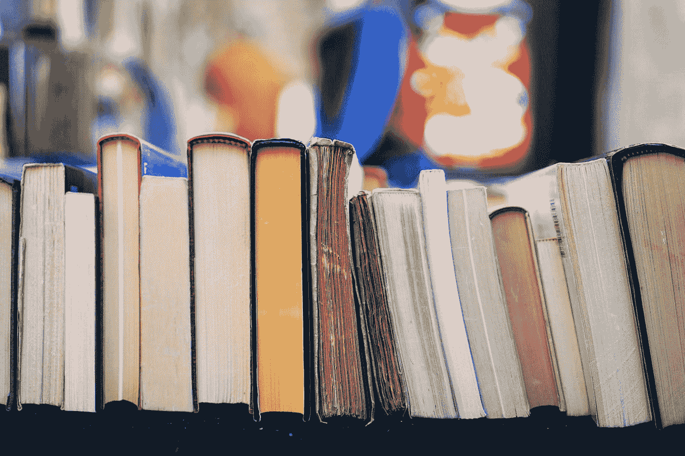

# 你应该考虑阅读的 5 本新的数据科学书籍

> 原文：<https://towardsdatascience.com/5-new-data-science-books-that-you-should-consider-reading-c90aec1d5b0d?source=collection_archive---------4----------------------->

## 了解这些书的最新情况

汤姆·赫曼斯在 [Unsplash](https://unsplash.com?utm_source=medium&utm_medium=referral) 上的照片

今天，有一百多万种方法可以学习你想要的任何新技能。你可以去 youtube 寻找视频，你可以去 Medium 阅读一些有用的文章，或者你可以听播客，边做其他事情边学习。

但是，自从有了书面语言以来，其中一种学习方法就是书本。在我看来，书籍是信息的瑰宝，无论你想学什么，都有可能有一本书或几本书在谈论它。书籍是我最喜欢和最可靠的信息来源之一，不管是旧的还是新的。

它们可能不是每个人都喜欢的学习方法，但我们都承认，在某个时候，我们都会回去找一本书来查找信息。书籍不会神奇地教你一项技能；就像任何其他形式的学习一样，你需要付出努力并愿意学习，这样你就可以充分利用任何书籍或学习资源。

 [## 数据科学行话 101:作为数据科学家你需要知道的 10 个术语

### 理解基础数据科学术语的指南

towardsdatascience.com](/data-science-lingo-101-10-terms-you-need-to-know-as-a-data-scientist-981aa17d5cdf) 

可以说，数据科学拥有无限数量的在线和离线学习资源。而你只能预测，资源的数量会随着领域的变大而变大。在过去的几年里，有那么多的数据科学书籍以你喜欢的语言出版。

在本文中，我将向您推荐 2020 年和 2021 年出版的 5 本新的数据科学书籍，我觉得无论您是数据科学新手还是已经在该领域工作了一段时间，这些书籍都非常值得一读。

# №1:数据科学:初学者数据科学完全指南 [Sabra Deal](https://www.google.com/search?hl=en&sxsrf=ALeKk03oWFaNgPKL4cGrO9mH21NhnK-ReA:1618438518531&q=inauthor:%22Sabra+Deal%22&tbm=bks)

不可否认的是，数据科学每天都在不断吸引新的聪明人加入。老实说，我不认为这种趋势会很快放缓。这份清单上的第一本书是针对这个领域的初学者的。

我最喜欢这本书的一点是，当你需要学习的主要信息只用 62 页解释时，它是多么的轻。这本书并不是要给你成为数据科学大师所需的所有细节。相反，您可以将这本书视为一份详细的、高水平的数据科学路线图，供任何对什么是数据科学以及如何成为数据科学家感到困惑的人使用。

这本书涵盖了数据科学中使用的主要语言和术语，从数学、统计学到机器学习和人工智能。基本上，如果你对数据科学完全陌生，这本书是很好的第一步。

 [## 您现在可以开始学习的 5 门在线数据科学课程

### 在家舒适地学习数据科学的所有基础知识。

towardsdatascience.com](/5-online-data-science-courses-you-can-start-now-748e4a2b5403) 

# №2:测量和数据科学[加博尔·佩李策](https://www.google.com/search?hl=en&sxsrf=ALeKk02I9V25M_6MZut63XMKb57B0O5wQw:1618438516858&q=inauthor:%22G%C3%A1bor+P%C3%A9celi%22&tbm=bks)

数据科学是一个广阔的领域，几乎在生活的所有方面都有应用，从最简单的推荐一本书或一部电影到医学和医疗保健中的关键应用。任何数据科学项目中使用的数据都是根据应用程序以不同方式收集的。

有些是从传感器收集的；其他的是从网上收集的。由于来源的多样性，有不同的方法对数据进行测量。[测量和数据科学](https://www.google.com/books/edition/Measurement_and_Data_Science/kJIYEAAAQBAJ?hl=en&gbpv=0&kptab=overview)涵盖了数据和测量主题的所有基础知识和更多内容。

本书的不同章节介绍了匈牙利测量和信息系统部进行的研究，并总结了将经典和理论测量与数据处理相结合的结果。这本 371 页的书将让你熟悉所有你需要知道的数据科学中的度量。

# №3:数据科学之旅:并行学习 R 和 Python[张乃龙](https://www.google.com/search?hl=en&sxsrf=ALeKk01madQd1XeHnobmNw6mHs3jnnTkGw:1618438528810&q=inauthor:%22Nailong+Zhang%22&tbm=bks)

数据科学中最常用的两种编程语言是 Python 和 r。它们都是有用的语言，可以为该领域提供很多东西。然而，在数据科学项目的流程中，如果您使用 R 来执行某些任务，那么它们会更有效，反之亦然。

对于任何数据科学家来说，编写和理解用两种语言编写的代码都是一项有用的技能。这个列表中的下一本书可以让你同时学习和使用 R 和 Python，如果你决定独立学习它们，这会节省你大量的时间和精力。

这本 216 页的书将带你学习这两种编程语言，重点是数据科学，而不是抽象和一般的语法。您将学习如何用两种语言同时执行统计、优化、构建预测模型等。

 [## 6 个网页抓取工具，让收集数据变得轻而易举

### 任何数据科学项目的第一步都是数据收集。

towardsdatascience.com](/6-web-scraping-tools-that-make-collecting-data-a-breeze-457c44e4411d) 

# №4:由[何西阿·德罗斯基](https://www.google.com/search?hl=en&sxsrf=ALeKk035JBHCPcejZTXjRy9BXSp0K8LTaA:1618438551352&q=inauthor:%22Hosea+Droski%22&tbm=bks)撰写的初学者数据分析指南

正如我常说的，数据科学就是关于数据的，任何数据科学项目中的一个重要步骤是数据收集和分析。[初学者数据分析指南](https://www.google.com/books/edition/Data_Analytics_Guide_For_Beginners/2YVHzgEACAAJ?hl=en&kptab=overview)专注于教你如何从不同来源收集原始数据，并从中提取有用的信息。

数据分析是您的项目做出正确预测并帮助您的客户或企业做出正确决策的关键流程。这本书将教授数据分析的所有基础知识，从数据挖掘到处理大数据和可视化结果。

此外，这些书涵盖了数据收集的一个重要方面，如网络搜集和使用机器学习来收集数据和形成替代数据集。最后，这本书深入探讨了数据管理和商业智能，总共 124 页。

# №5:Charu c . Aggarwal 的《线性代数与机器学习优化》

促使人们远离数据科学的一个原因是，数据科学是建立在基础代数和概率概念之上的。对数学的恐惧是真实的，这就是为什么许多人会告诉我，他们不想成为数据科学家，因为数学太难了。

但是，数学是几乎所有技术领域的核心引擎，不仅仅是数据科学。数学，更准确地说是线性代数的一个主要用途是在机器学习模型的优化过程中。[线性代数与机器学习优化](https://www.google.com/books/edition/Linear_Algebra_and_Optimization_for_Mach/EdTkDwAAQBAJ?hl=en&gbpv=0&kptab=overview)涵盖了高效优化机器学习模型所需的所有线性代数。

这本书深入探讨了线性代数在机器学习优化中的应用。它涵盖了如何执行许多重要的应用程序，如奇异值分解(SVD)，图形分析，矩阵分解，等等。它还涵盖了为什么机器学习模型需要优化，以及何时和如何这样做。这本书是我们清单上最长的一本书，将近 500 页。

 [## 给数据科学新手的 7 条建议

### 让您的学习之旅更加轻松。

towardsdatascience.com](/7-tips-for-data-science-newbies-d95d979add54) 

# 外卖食品

当我第一次开始研究生学习时，我的导师在一个房间里有我所见过的最大的藏书。这些书不仅在书架上，而且到处都是。事实上，他找到了一种利用书籍来保持办公桌隐私的方法。这些书从门到他的椅子形成了一个迷宫。

记得有一次问他，为什么不捐旧书或者只用数字的。他说，对我来说，书不仅仅是学习一个话题的方式；而是学习一种新的人格。这就像你在窥探作者的内心。

从小到大，书籍——无论是印刷品还是电子书——一直是我生活中不可或缺的一部分。比起从其他途径获得的信息，我仍然更相信从书中获得的信息。今天，我列出了我认为非常有前途的 5 本书，我相信每个人都应该阅读的新数据科学书籍。