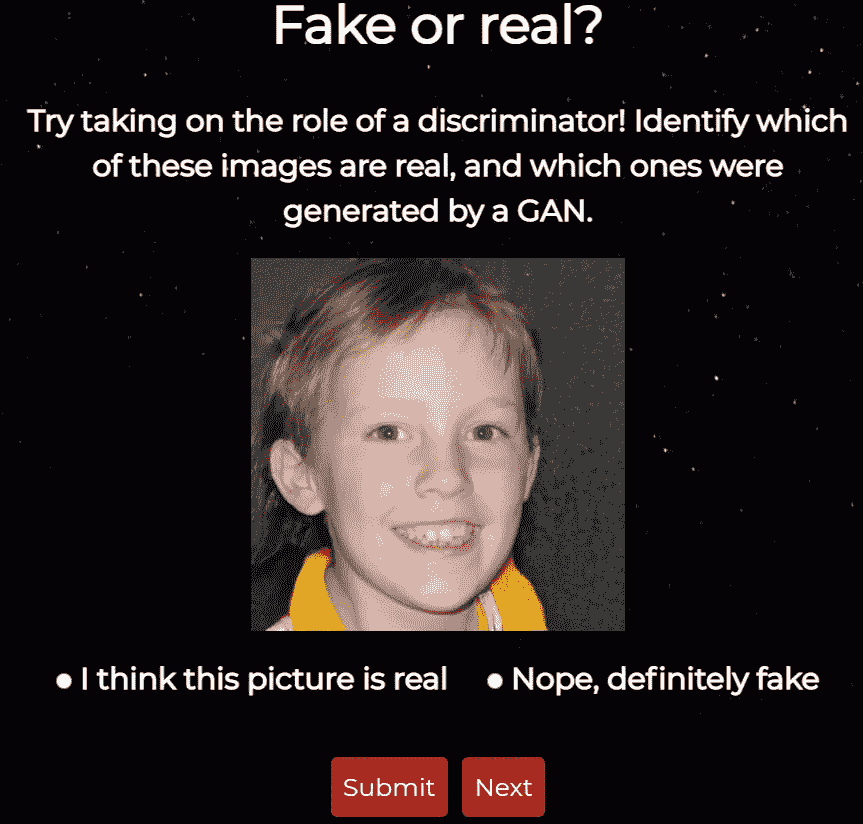
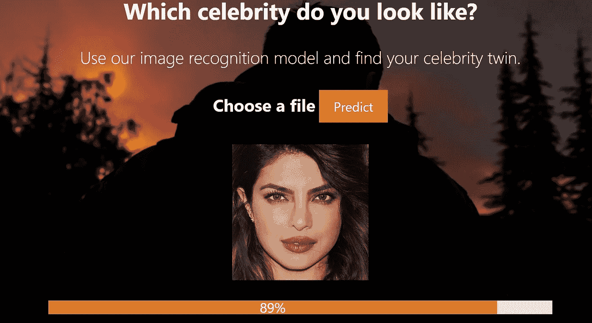

# 我的 5 个最佳数据科学组合项目

> 原文：<https://towardsdatascience.com/5-of-my-best-data-science-portfolio-projects-8cd7f81f1b1?source=collection_archive---------3----------------------->

## 我做过的最好的数据科学项目

Bram Naus 在 [Unsplash](https://unsplash.com/s/photos/portfolio?utm_source=unsplash&utm_medium=referral&utm_content=creditCopyText) 上拍摄的照片

作为一名初学者进入数据科学行业，你需要证明你拥有从事这项工作所必需的技能。

如果你没有任何正式的数据科学资格，最好的方法是建立数据科学项目。

当你在你的投资组合中展示这些项目时，它会给潜在的雇主信心，让他们相信你能够胜任这份工作。

然而，并不是所有的数据科学项目都适合放在你的投资组合中。有些项目太普通太简单了——比如泰坦尼克号数据集上的**机器学习**，或者波士顿房价数据集上的**线性回归**。

展示这样的项目实际上对你的投资组合弊大于利。他们给人的印象是，你是一个新手，只学过初级数据科学课程，无法展示其他技能。

## 那么，你应该在你的作品集里展示什么样的项目呢？

展示讲述故事的项目。做一些你热爱的事情。

## 人们喜欢故事。

招聘人员会收到数百份求职简历。

要脱颖而出，你需要展示一些能吸引他们注意力的东西。

如果你的招聘人员是非技术人员，他们不会理解你 GitHub 存储库中的一堆代码。

你需要建立一些他们可以互动的东西，或者借助数据讲述一个他们可以理解的故事。

这将使你的申请在数百份简历中脱颖而出。

这也表明你对自己的工作充满激情。

我过去从事过无数的数据科学项目。

当我还是编程新手的时候，我就开始了其中的一些。老实说，大部分都很糟糕。

我回顾我的一些项目，意识到我的编码实践很糟糕。我本可以做得更好的。

然而，正是这些项目帮助我获得了第一份数据科学实习工作。这些也是我仍然收到消息和问题的项目。因为人们记得他们。它们是独一无二的，它们讲述了一个故事。

# 项目 1: [好莱坞女性形象分析](/the-bechdel-test-analyzing-gender-disparity-in-hollywood-263cd4bcd9d)

克里斯蒂娜@ wocintechchat.com 在 [Unsplash](https://unsplash.com/s/photos/two-women-talking?utm_source=unsplash&utm_medium=referral&utm_content=creditCopyText) 上的照片

我想出了这个项目的想法时，看了一个节目名为简的处女。

节目中有一个小插曲谈到媒体中的性别差异。

有一种测试被称为 Bechdel 测试，用来衡量女性在小说作品中的代表性。只有满足以下条件，影片才能通过 Bechdel 测试:

*   电影里至少要有两个女人
*   他们互相交谈
*   关于一个男人以外的东西

我认为通过分析来回答以下关于好莱坞电影的问题会很有意思:

*   女性导演的电影通过 Bechdel 测试的几率更高吗？
*   电影的类型对它能否通过 Bechdel 测试有影响吗？
*   随着时间的推移，女性在好莱坞的代表性有所提高吗？
*   通过 Bechdel 测试的电影是否比未通过测试的电影评级更高？

这是我的第一个真实数据分析项目。我开始借助互联网上提供的多个数据集来回答所有这些问题。

我展示了数据清理、操作、分析和可视化等技能。

一旦我完成了这个项目，我就写了一篇关于它的[文章](/the-bechdel-test-analyzing-gender-disparity-in-hollywood-263cd4bcd9d)，并且把所有的代码和结果都发布到了网上。

# 项目 2: [一款区分真假面孔的应用](/real-face-or-ai-generated-fake-d95b30c1f86f)

作者形象

我被人工智能应用程序创造虚假面孔的能力迷住了。

在这个项目中，我收集了一个真实和虚假人脸的数据集。然后，我做了一个测验，让你辨别一张脸是假的还是真的。

你可以参加我的测验，只要你愿意。每次刷新页面或点击*next*，系统将随机选择一幅图片并呈现给你。你所需要做的就是猜测它是一个人工智能生成的图像还是一个真实的图像。

演示的技能:Javascript、HTML、CSS、Flask、Python

# 项目 3: [对 YouTube 不和的情绪分析](https://www.natasshaselvaraj.com/sentiment-analysis-twitter-youtube/)

由 [Pablo Rebolledo](https://unsplash.com/@prvelasco89?utm_source=unsplash&utm_medium=referral&utm_content=creditCopyText) 在 [Unsplash](https://unsplash.com/s/photos/fight?utm_source=unsplash&utm_medium=referral&utm_content=creditCopyText) 上拍摄的照片

从 12 岁开始，我就喜欢看 YouTube 视频和戏剧频道。

最近，一场巨大的争议浮出水面，涉及到两个受欢迎的 YouTubers 用户——詹姆斯·查尔斯和塔蒂·威斯布鲁克。

这两位有影响力的人都发现自己陷入了一场非常公开的纠纷，这场纠纷导致他们失去了数百万粉丝和品牌交易。

为了更好地了解公众对他们的看法，我认为对这两个有影响力的人进行分析会很有趣。

我从 Twitter 和 YouTube 上搜集数据，建立了一个情绪分析模型，以了解公众对这场争斗的看法。我想看看人们站在哪一边，以及人们对这场争论的看法是否会随着时间的推移而改变。

展示的技能:数据采集、API 使用、Python、情感分析、数据可视化

# 项目四:[名人形象识别模型](/a-complete-deep-learning-portfolio-project-9c5dc7f3f2ef)

作者图片

有没有想过你的名人模仿者是谁？

你只需要上传一张你自己的照片，然后点击“预测”按钮。

深度学习模型将为你提供与你最相似的名人的预测。

展示的技能:Javascript、HTML、CSS、Flask、Python、模型部署、Keras

# 项目 5: [用 Python 进行客户细分](/customer-segmentation-with-python-31dca5d5bdad)

Unsplash 上的粘土银行图像

该项目是列表中唯一一个具有业务应用程序的项目。

我在 Kaggle 上使用了一个数据集，并提出了一个 K 均值聚类模型，以得出不同的消费者细分市场。

这是一个非常流行的无监督学习数据集，许多人已经用它来建立分割模型。

为了将我的分析与其他分析区分开来，我分析了最后构建的不同部分。我根据细分市场的行为建立了消费者档案，并针对每个细分市场的客户提出了不同的营销策略。

展示的技能:Python，K 均值聚类，PCA，聚类解释，数据分析

# 结论

Coursera 上有超过 400 万人注册了吴恩达的机器学习课程。

每一个有抱负的数据科学家都会在简历上有一门这些入门级别的机器学习课程。

然而，如果你不能在现实生活中应用你所学的技能，这些课程就没有任何意义。

它们也不足以向招聘人员证明你有胜任这份工作的必要技能。

要让自己与众不同，你需要打造一些与众不同的东西。构建一个最终用户可以使用的应用程序，或者围绕您的项目写一篇博文。

创建这些项目并在网上分享帮助我接触到来自世界各地的人们。

由于这些项目，我收到了许多工作邀请、合作机会和自由职业邀请。

参与这些项目还帮助我提高了数据科学和编程技能。

每当我想出一个项目想法时，我都会写下构建项目所涉及的不同步骤。然后，我画一张我想要的最终产品的图。

一路上我遇到了很多困难，但是我从克服困难中学到了很多。事实上，我的大部分编程知识都来自我参与的这些个人项目。

本文到此为止，感谢阅读！

> 用心创造，用心建设——克里斯·伊斯兰大教堂