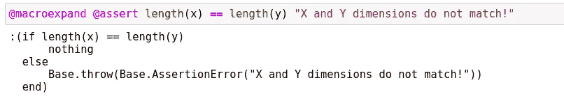

# 5 我最喜欢的朱莉娅·麦可斯

> 原文：<https://towardsdatascience.com/5-of-my-favorite-julia-macros-528d2dd8f0e3?source=collection_archive---------20----------------------->

## 我最喜欢在 Julia 编程语言中使用的一些宏的概述！


(src =[https://pixabay.com/images/id-637062/](https://pixabay.com/images/id-637062/)

# 介绍

Julia 编程语言为数据科学领域带来了全新的特性集。而且很多便利的特性已经被重新认识到，尤其是在数据科学应用中，至少对我来说是这样。我非常喜欢 Julia 编程语言中来自 Lisp 和元编程世界的一个特性，那就是添加了宏。这些不仅方便元编程，而且在更广泛的意义上也非常适合使用。它们可以作为使用某些函数的快捷方式，无需调用就可以自动将值转换成表达式。因为我非常喜欢 Julia 中的宏，所以我想展示一些我最喜欢的宏，您可能想在自己的 Julia 编程中尝试一下！

> [笔记本](https://github.com/emmettgb/Emmetts-DS-NoteBooks/blob/master/Julia/5%20Of%20my%20favorite%20macros.ipynb)

# №1:代码 _llvm

code_llvm 宏在我看来棒极了。它可以用来查看 Julia 在后端使用的实际 llvm 代码。这对于从底层角度分析 Julia 代码的性能非常有用。此外，我认为这是一个学习更多关于 Julia 编译器及其工作原理的好方法。该宏采用一个方法或表达式，并返回用于获取返回结果的 llvm 代码。例如，考虑以下函数:

```
function ThisIsAFunction(n)
    n = n + 5
    n - 1
    for z in 1:n
        n -= 1
    end
    return(n)
end
```

这个函数会取任何值，然后用增量的方法把它减 1 到零。这是在加上 5，然后减去 1 之后的结果，所以这是一个非常愚蠢的函数，但是它将演示 code_llvm 宏的循环和操作:

```
[@code_llvm](http://twitter.com/code_llvm) ThisIsAFunction(20)
```


作者图片

# №2:断言

下一个我非常喜欢的宏是 assert 宏。该宏用于在不满足条件时提供快速抛出。这主要用于测试。我不确定我是在哪里听到的，也许是在学校，但是你不应该在代码中使用 assert 来抛出。我必须承认，我不确定这句话的有效性，也不知道我最初是从哪里听到的——但我怀疑我是从我的教授那里听到的。无论如何，我们可以通过首先提供一个需要满足的条件，然后提供一个错误语句来使用这个宏。也许我们不应该在真正的包开发中使用它，而应该在测试中使用它的原因是因为它的错误返回总是相同的，只有字符串文本识别什么是错误的。使用这个宏时，抛出的总是 AssertionError。考虑以下阵列:

```
y = [5, 10, 15]
x = [5, 10]
```

假设我们希望这些长度相同:

```
[@assert](http://twitter.com/assert) length(x) == length(y) "X and Y dimensions do not match!"
```


作者图片

# №3:宏扩展

Julia 的 Base 中另一个非常酷的宏是 macroexpand 宏。此宏可用于将宏视为一组符号。符号在很多方面都是 Julian 元编程的骨干，这是一种通过将宏制作成符号来使事情更上一层楼的简单方法。这可以对宏有一个更广泛的理解，因为乍一看，人们可能把宏看作是功能等同物，但事实并非如此。有了这个宏，就很容易明白为什么宏在 Julia 的元编程中如此盛行。

```
[@macroexpand](http://twitter.com/macroexpand) [@assert](http://twitter.com/assert) length(x) == length(y) "X and Y dimensions do not match!"
```



如果我们将其断言为一个新的变量 alias，然后检查其类型，我们会看到这会返回一个表达式:

```
z = [@macroexpand](http://twitter.com/macroexpand) [@assert](http://twitter.com/assert) length(x) == length(y) "X and Y dimensions do not match!"
typeof(z)
```


这意味着我们可以将这个表达式与其他元编程方法一起使用，比如 eval:

```
eval(z)
```

# №4:测试宏

Julia 中的测试是用一种完全不同于其他编程语言的方法来完成的。如果你问我，我主观上喜欢它们的实现，因为我认为这是保持测试有组织的好方法。如果您想了解更多关于如何测试 Julia 包的内容，我实际上写了一整篇文章，您可以在这里查看:

[](/how-to-test-your-software-with-julia-4050379a9f3) [## 如何用 Julia 测试你的软件

towardsdatascience.com](/how-to-test-your-software-with-julia-4050379a9f3) 

Julia 中的测试利用宏使测试变得更快更方便。这也使得测试包端变得更加容易，因为你的测试交给 Julia 是一个表达式，这意味着它可以以任何方式分析和运行它，而不需要解析你的代码。在 Julia 中，我们可以通过使用@testset 宏并提供一个名称来启动一个测试集:

```
[@testset](http://twitter.com/testset) "Numbers" beginend
```

然后我们可以通过使用 test 宏来测试一些条件，它类似于 assert，但会将其布尔值返回给 testset 宏。

```
using Test
[@testset](http://twitter.com/testset) "Numbers" begin
   x = 5
    y = 5
    [@test](http://twitter.com/test) x == y
end
```

当我们运行这个程序时，我们得到了一些非常酷的、组织良好的、全面的关于我们的测试是如何运行的输出。这是非常方便的，有这一切自动生成到一个表格，并与我们的集合的标题组织，没有打印的必要。看一看:


# №5:评估聚合

Julia 库中另一个很棒的宏是 evalpoly 宏。这个宏计算一个多项式∑*k**ZK*-1*c*[*k*的系数`c[1]`、`c[2]`。换句话说，系数是由 z 的幂按升序提供的。用来计算这些数字的代码非常高效，我肯定会说它是科学计算的一个伟大工具！

```
[@evalpoly](http://twitter.com/evalpoly)(3, 1, 0, 1, 5, 1, 2)
```


# (加分)№6:内嵌

内嵌数学本质上更有效率。在 Julia 中，使用 inline 和 noline 宏很容易控制这一点。如果您希望执行大量的线性代数，这些宏肯定会派上用场，因为这些宏的应用会严重降低您的内存消耗。一般来说，内联处理大多数数组可能是一种好的做法，尤其是如果您希望在项目中节省大量内存的话:

```
@inline foo_in(n) = (n, Vector{Int}(n))
@noinline foo_ni(n) = (n, Vector{Int}(n))  
**function** ft_in(n)
        s= 0
        **for** i= 1:n
         jj,v = foo_in(i)
        s+=sum(v)
        **end
**        s 
**end**  
**function** ft_ni(n)
        s= 0
        **for** i= 1:n
         jj,v = foo_ni(i)
        s+=sum(v)
        **end
**        s
 **end**  
@time ft_in(1000)
   0.001948 seconds (1.00 k allocations: 3.962 MiB)  
@time ft_ni(1000)
   0.002083 seconds (2.00 k allocations: 3.992 MiB)
```

# 结论

宏是 Julia 编程语言中非常有用的特性。它们不仅可以作为调用方法的“快捷方式”，还可以用来将正则代码自动转换成表达式。不用说，这在许多不同的应用程序中都很方便，比如测试应用程序。我希望这篇文章是有趣的，并且可能让你熟悉一些你可能不知道的新的宏！非常感谢您的阅读！