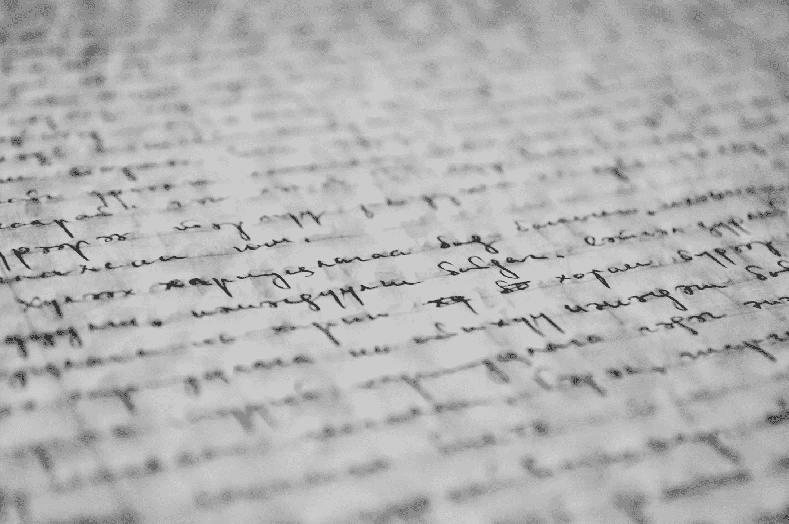
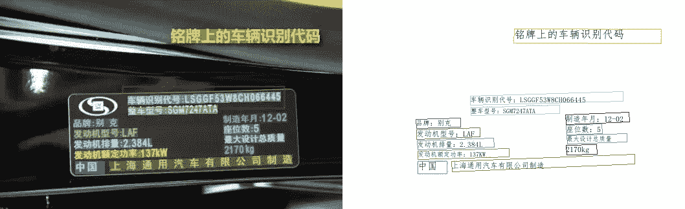
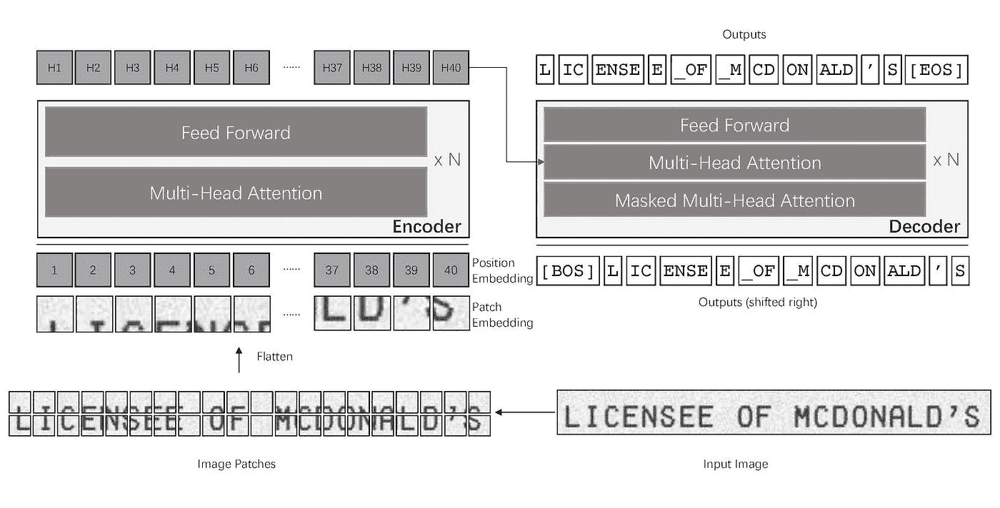
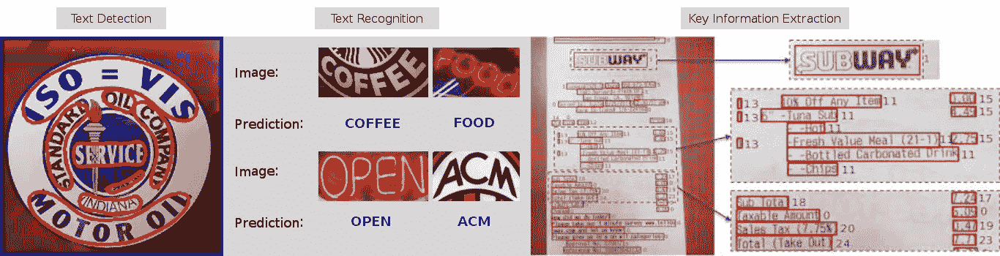
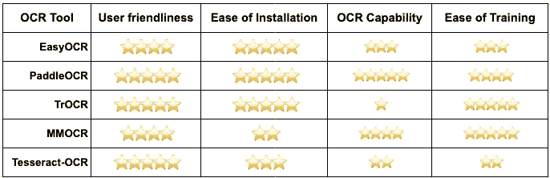

# 您可以使用 5 种开源工具来训练和部署 OCR 项目

> 原文：<https://towardsdatascience.com/5-open-source-tools-you-can-use-to-train-and-deploy-an-ocr-project-8f204dec862b?source=collection_archive---------2----------------------->

## 第一部分:如果你正在做文本检测，你应该知道这些工具



图片来自[pexels.com](https://www.pexels.com/photo/black-text-on-gray-background-261763/)

```
Part I  - 5 open-source tools you can use to train your own data and  deploy it for your next OCR project!
Part II - From labelling to serving your OCR model! (Coming soon)
```

在很多情况下，我们需要检测图像中的文本。

1.  为了实现运营数字化，银行需要将所有文书工作存储到云数据库中。为此，文档必须被扫描并转换成机器可读的格式。
2.  在房地产行业，购房者和代理商通常以纸质形式填写他们的协议表格。要在云中保存表格，你需要 OCR 软件，该软件将文本转换成机器可读的文件。
3.  在 Edtech 初创公司中，有一些严重依赖 OCR。举个例子， [Photomath](https://photomath.com/en/) ，一家将问题分解成简单步骤来帮助人们理解数学的初创公司。该应用程序为用户提供了扫描他们在纸上的问题并通过扫描将其翻译成机器可读格式的便利。

OCR 可以使用传统的计算机视觉技术或更先进的深度学习技术来完成。本文的重点将只放在使用深度学习模型的工具上。作为奖励，我还将包括脚本，让您一次体验所有的模型。

# EasyOCR

<https://github.com/JaidedAI/EasyOCR>  

EasyOCR 是一款开源的、随时可用的 OCR，支持近 [80 种语言](https://www.jaided.ai/easyocr/)。您可以选择用您自己的数据训练模型(您可以遵循他们的[示例数据集](https://www.jaided.ai/easyocr/modelhub/)来格式化您自己的数据集)或使用[现有模型](https://www.jaided.ai/easyocr/modelhub/)来为您自己的应用服务。

以下脚本可用于运行代码:

```
# installation
pip install easyocr# import
import easyocr# inference
reader = easyocr.Reader(['en'])
result = reader.readtext(img_path)
```

这里有一个快速测试，看看这个 OCR 软件有多准确。下图来自 pexels.com，OCR 工具会检测图片中的文字。在一个完美的模型中，它应该能够输出“让这一天变得伟大！”。


照片由 [Alexas Fotos](https://www.pexels.com/@alexasfotos?utm_content=attributionCopyText&utm_medium=referral&utm_source=pexels) 从 [Pexels](https://www.pexels.com/photo/illuminated-qoute-board-2255441/?utm_content=attributionCopyText&utm_medium=referral&utm_source=pexels) 拍摄

结果如下:

你可以看到结果并不完美。它误解了字母 G，把 H 误认为是小写字母 H。

# PaddleOCR



图片来自[来源](https://github.com/PaddlePaddle/PaddleOCR/blob/release/2.3/doc/imgs_results/ch_ppocr_mobile_v2.0/test_add_91.jpg)。下[阿帕奇牌照 2.0](https://github.com/PaddlePaddle/PaddleOCR/blob/release/2.3/LICENSE) 。

<https://github.com/PaddlePaddle/PaddleOCR>  

PaddleOCR 是中国百度团队开发的开源产品。我使用这个软件工具已经有一段时间了，我真的很惊讶这个团队做了多少工作来使这个免费的产品像市场上任何商业 OCR 软件一样强大。框架中使用的模型使用最先进的(SOTA)技术(如 CML 知识提炼和复制粘贴数据扩展策略)和大量打印和手写图像进行训练。这使得它成为最强大的开源 OCR 软件之一。下面是一些你可以用开源代码做的事情:

1.  您可以在您的应用程序中使用他们现有的模型。它们还提供了一个极其轻量级但功能强大的模型，称为 PP-OCRv2，这样您就不需要担心大内存问题。
2.  他们支持多种语言，如中文，英语，韩语，日语，德语等。
3.  他们有多种工具来支持您进行数据标注。例如，它们为您提供 PPOCRLabel 来快速标记图像中的文本。由于数据对于训练 OCR 模型非常重要，他们还有一个名为 Style-text 的工具，可以让您快速合成图像，以便您有更多的图像来训练您的模型，使其在生产环境中使用起来更加强大。
4.  您可以使用提供的脚本对数据集上的模型进行微调。

你可以这样使用它:

```
# installation
pip install paddleocr paddlepaddle# import
from paddleocr import PaddleOCR# inference
ocr = PaddleOCR(use_angle_cls=True, lang='en')
result = ocr.ocr(img_path, cls=True)
```

让我们使用上面的同一个图像来检查模型性能:

令人惊讶的是，从一个之前已经在类似图像上训练过的模型中看到如此精确的输出。

# TrOCR



图片来自[来源](https://camo.githubusercontent.com/dd6287135427538254c94fe33edadcc1e810f30723c6edb93e733b8ae1c2cc7e/68747470733a2f2f7062732e7477696d672e636f6d2f6d656469612f46414464545845566741417354574c3f666f726d61743d6a7067266e616d653d343039367834303936)。根据麻省理工学院的许可。

<https://huggingface.co/transformers/model_doc/trocr.html>  <https://github.com/microsoft/unilm/tree/6f60612e7cc86a2a1ae85c47231507a587ab4e01/trocr>  

TrOCR 最初是由、吕腾超、等人在 [TrOCR:基于变压器的光学字符识别中提出的。它是基于图像转换器编码器和自回归文本解码器(类似于 GPT-2)开发的。代码已经包含在著名的 Huggingface 库中，因此我们可以直接从库中使用训练好的模型。](https://arxiv.org/abs/2109.10282)

```
# installation
pip install transformers# import
from transformers import TrOCRProcessor, VisionEncoderDecoderModel
from PIL import Image# inference
model_version = "microsoft/trocr-base-printed"
processor = TrOCRProcessor.from_pretrained(model_version)
model = VisionEncoderDecoderModel.from_pretrained(model_version)

image = Image.open(img_path).convert("RGB")

pixel_values = processor(image, return_tensors="pt").pixel_values
generated_ids = model.generate(pixel_values)
generated_text = processor.batch_decode(generated_ids, skip_special_tokens=True)[0]
```

与其他两个模型不同，这些模型只输出最终的文本输出，而不输出文本位置。该模型是用于文本识别的，所以你不应该期望它检测图像中的文本。运行上述脚本后，您将收到的输出是“MASKAY”。正如所料，结果很差，因为管道中没有文本检测模型。

# MMOCR

<https://github.com/open-mmlab/mmocr>  

图片来自[来源](https://github.com/open-mmlab/mmocr/blob/main/resources/illustration.jpg)。下[阿帕奇牌照 2.0](https://github.com/open-mmlab/mmocr/blob/main/LICENSE) 。

MMOCR 是另一个开源 OCR 工具，它是在著名的 [OpenMMLab](https://openmmlab.com) 项目下开发的。该项目由香港中文大学的团队开发，已成为计算机视觉领域的领先项目之一。

它支持多种 SOTA 模式，还允许您进行培训和部署。这个开源工具的亮点之一是它能够在同一管道中提供除其他模块(文本检测和识别)之外的关键信息提取模型。[关键信息提取](https://arxiv.org/pdf/2103.14470.pdf)解决了用户必须匹配某个模板才能从文档中提取数据的问题。传统的方法很难使用带有未知模板的文档。

一旦我们安装了工具(是的，它没有前两个工具方便)，我们就可以用它来检测我们的样本图像并测试它的性能。我们得到与 PaddleOCR 类似的结果，只是感叹号没有出现在“GREAT”的末尾。总的来说，这个工具将几乎所有的东西都放在一个管道中，所以使用起来非常强大。

# 宇宙魔方光学字符识别

<https://github.com/tesseract-ocr/tesseract>  <https://pypi.org/project/pytesseract/>  

对于之前做过 OCR 项目的人来说，你应该对这个库非常熟悉。这里有一点关于宇宙魔方光学符的历史:

> Tesseract 最初是由布里斯托尔的惠普实验室和科罗拉多州格里利的惠普公司在 1985 年到 1994 年间开发的，1996 年做了一些修改以移植到 Windows，1998 年做了一些 c++化。2005 年，宇宙魔方被惠普开源。从 2006 年到 2018 年 11 月，它由谷歌开发。—来自[https://github.com/tesseract-ocr/tesseract](https://github.com/tesseract-ocr/tesseract)

python-pytesserac 是 tesserac-OCR 引擎的包装器。使用它非常简单。由于该模型自 2019 年 12 月 26 日以来一直没有更新，并且使用了一个非常简单的 LSTM 模型，因此结果可能不如该方法的其他部分理想。尽管如此，该模型可以使用新的数据进行[训练](https://tesseract-ocr.github.io/tessdoc/)，这样你就可以根据自己的需要对其进行定制。

为了测试这个工具，我使用了上面同样的图片。尽管用 [OpenCV](https://opencv.org/) 对图像进行了预处理，我还是得到了一个空的结果。该工具似乎不能很好地处理场景中的文本。对于背景相对干净的普通文档，性能应该更好。

# 摘要

以下是不同开源 OCR 工具的比较:



按作者分类的表格

这个评级完全基于我自己对开源工具的体验。他们每个人都有自己的优势。我们的项目要求我们根据一组特定的需求选择正确的工具。

如果你想试一试，这是 Colab 笔记本！

作者代码

# 下一步是什么？

在为现实世界服务部署时，不能完全依赖开源工具。特别是对于一些应用，需要 99%以上的准确率。为了实现这一点，我们可以从我们的业务中收集数据，并在训练开源工具之前对它们进行标记。我的下一步将向您展示 Label Studio 如何简化整个过程。从贴标签到服务模特，我全包了！

如果您没有读过我的 Label Studio 文章，请在这里阅读:

</a-free-and-powerful-labelling-tool-every-data-scientist-should-know-ce66473c7557>  

请关注我并喜欢我的帖子，以获得该系列的最新更新。

# 关于作者

Woen Yon 是新加坡的一名数据科学家。他的经验包括为几家跨国企业开发先进的人工智能产品。

Woen Yon 与一些聪明人合作，为当地和国际初创企业主提供网络解决方案，包括网络爬行服务和网站开发。他们非常清楚构建高质量软件的挑战。如果你需要帮助，请不要犹豫，给他发一封电子邮件到 wushulai@live.com。

他喜欢交朋友！在 [LinkedIn](https://www.linkedin.com/in/woenyon/) 和 [Medium](https://laiwoenyon.medium.com/) 上随时与他联系

<https://laiwoenyon.medium.com/> 