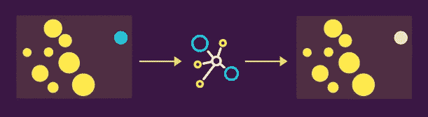

# 每个“数据爱好者”都必须知道的 5 种异常检测技术

> 原文：<https://towardsdatascience.com/5-outlier-detection-methods-that-every-data-enthusiast-must-know-f917bf439210?source=collection_archive---------3----------------------->

## 异常检测方法(视觉和代码)


来自[源](https://unsplash.com/photos/W8KTS-mhFUE)的修改图像

**异常值**是那些与总体的[样本](/8-types-of-sampling-techniques-b21adcdd2124)中的其他数据点有强烈*(不同属性)*差异的观察值。在这篇博客中，我们将经历 *5 种离群点检测技术，每个“数据爱好者”* ***都必须*** ***知道*** *。但在此之前，让我们看看并了解离群值的来源。*

## 数据集中异常值的可能来源是什么？

数据集中可能存在异常值有多种原因，如人为错误*(错误的数据输入)*、测量错误*(系统/工具错误)*、数据操作错误*(错误的数据预处理错误)*、采样错误*(从不同来源创建样本)等*。重要的是，检测和处理这些异常值对于学习一个健壮的和可推广的机器学习系统是重要的。


z 得分

**Z 值** *(也称标准值)*是统计学中的一个重要概念，表示**某一点距离均值**有多远。通过应用 z 变换，我们移动分布，使其平均值为单位标准差**0。*例如，Z 值为 2 意味着数据点距离平均值有 2 个标准偏差。***

*此外，任何数据点的 z 分数都可以按如下所示计算—*

> z 得分(I)=(x(I)-平均值)/标准差

它假设数据呈正态分布，因此数据点的百分比位于-/+1 标准偏差之间。是~68%，-/+2 stdev。是大约 95%和-/+3 标准偏差。就是~99.7%。因此，如果 **Z 值是> 3，我们可以安全地将该点标记为异常值。** *参考下图*


带有异常标记的正态分布|图片由作者提供

*你可以使用 python 来实现它，如下所示—*

```
*import numpy as np**data = [1, 2, 3, 2, 1, 100, 1, 2, 3, 2, 1]* *threshold = 3**mean = np.mean(data)
std = np.std(data)**z_score_outlier = [i for**i in**data if (i-mean)/std > threshold]
print (z_score_outlier)
>> 100   (outlier)*
```

*在 Python 中也可以使用 Scikit learn 和 Scipy 提供的内置函数。(链接在* ***资源部分*** *)*


力线

在**局部异常因素** (LOF)中，这个想法围绕着**局部区域**的概念。这里，我们计算并比较焦点的**局部密度和它的邻居的局部密度。**如果我们发现焦点的局部密度与其邻居相比非常低，这将暗示焦点在该空间中是孤立的，并且是潜在的异常值。该算法取决于超参数 K，该超参数 K 决定了在计算局部密度时要考虑的邻居数量。该值介于空间中的 0 *(无邻居)*和总点数*(所有点都是邻居)*之间。

局部密度函数定义为平均可达距离的倒数*，其中**平均可达距离**定义为从焦点到邻居中所有点的平均距离。*

> **LOF =邻居的平均局部密度/焦点的局部密度**

如果，

*   *LOF ≈ 1 密度与邻国相似*
*   *LOF < 1 密度高于邻国(正常点)*
*   *LOF > 1 密度比邻国低(异常)*

此外，下图显示了空间中样本焦点*(深蓝色)*的 LOF 和局部密度的计算。这里 K=3 *(邻居)*，d *(距离)*可以计算为欧几里德，曼哈顿等。


*您可以使用 python 的 Scikit-learn 库来实现它，如下所示—*

```
*from sklearn.neighbors import LocalOutlierFactor**data = [[1, 1], [2, 2.1], [1, 2], [2, 1], [50, 35], [2, 1.5]]**lof = LocalOutlierFactor(n_neighbors=2, metric='manhattan')
prediction = lof.fit_predict(data)
>> [ 1,  1,  1,  1, -1,  1]*
```

*请随意探索超参数调谐库等。(链接在* ***资源部分*** *)*

> 此外，如果你想继续享受阅读与数据科学和机器学习相关的精彩文章，你可以通过我的[推荐链接](https://prakhar-mishra.medium.com/membership):)购买中级会员资格


ABOD 和凸包方法

我已经有一篇关于离群点检测的几何模型的非常详细的博客文章，其中我主要关注于**基于角度的技术 *(ABOD)*** *和* **基于深度的技术*(凸包)*** *。你可以在这里查看 ABOD*<https://blog.paperspace.com/outlier-detection-with-abod/>**。下图显示了检测异常值的两种技术的图示视图—**

****

*隔离森林*

***隔离森林**是一种基于树的算法，它试图根据决策边界*(就像我们对决策树一样)*的概念找出离群值。这里的想法是**继续在随机阈值和特征上分割数据，直到每个点都变得孤立** *(这就像在数据集上过度拟合决策树)。*一旦隔离完成，我们就把在这个过程中很早就被隔离的点分出来。我们将这些点标记为潜在的异常值。如果您直观地看到这一点，那么一个点离多数越远，就越容易被隔离，而隔离属于一个组的点将需要更多的切割来隔离每个点。*

**如果你在下图中看到，我们随机选择特征和值到我们切割的地方。经过 4 次切割后，我们能够分离出异常点，这意味着这些节点会在我们的树构建阶段很早就出现。**

**

*隔离森林流程|作者图片*

**您可以使用 python 的 Scikit-learn 库来实现它，如下所示—**

```
**from sklearn.ensemble import IsolationForest**data = [[1, 1], [2, 2.1], [1, 2], [2, 1], [50, 35], [2, 1.5]]**iforest = IsolationForest(n_estimators=5)
iforest.fit(data)**actual_data = [[1, 1.5]]
iforest.predict(actual_data)
>> 1   (Normal)**outlier_data = [[45, 55]]
iforest.predict(outlier_data)
>> -1   (Outlier)**
```

**请随意探索超参数调谐库等。(链接在* ***资源部分*** *)**

**

*自动编码器*

***自动编码器**是一种神经网络架构，被训练来重现输入本身。它包括两个可训练的组件，即编码器和解码器。其中编码器的目标是学习输入的潜在表示*(原始维度到低维度)*，解码器的目标是学习从该潜在表示*(低维度到原始维度)*中重构输入。因此，为了让 autoencoder 正常工作，这两个组件应该针对各自的任务进行优化。*

**自动编码器广泛用于检测异常情况*。这种工作方式背后的一个典型直觉是，如果特征空间中的一个点远离大多数点*(这意味着它拥有不同的属性，例如——狗图像聚集在特征空间的某个部分周围，而牛图像离该集群相当远)，*在这种情况下，自动编码器学习狗分布*(因为与牛相比，狗图像的数量将非常高——这就是为什么它是异常的，因此模型将主要专注于学习狗集群)。*这意味着，模型将能够或多或少地正确重新生成狗的图像，导致低损失值，而对于牛的图像，它将生成高损失*(因为这是它第一次看到的奇怪的东西，并且它已经学习的权重主要是重建狗的图像)。*我们使用这些重建损失值作为异常得分，因此得分越高，输入异常的几率就越高。*

*在下图中—将**绿点视为狗**，将**蓝点视为牛**。我们用这种输入分布来训练我们的系统，并期望它输出相同的结果。但我们可以看到，该模型或多或少完美地重新生成了黄色圆点，但不太适合蓝色圆点*(因为它不在黄色圆点的相同特征范围内)**

**

*Autoencoder |图片作者培训流程*

*在下图中——在推理过程中，当我们给我们的模型一个黄点时，它能够重新生成误差较小的点*(正常点的信号)*，而对于蓝色点，它返回较高的误差*(异常/异常值的信号)*，因为无法重新生成相同的点。*

**

*自动编码器的推理流程|按作者排序的图像*

*你可以使用 python 的 PyOD 库来实现它。我推荐你关注这篇 [*的博文*](https://h1ros.github.io/posts/anomaly-detection-by-auto-encoder-deep-learning-in-pyod/) *同样适用。(链接在* ***资源部分*** *)**

**

*在使用入度数 (ODIN)的**异常值检测中，我们计算每个数据点**的**入度。这里，入度被定义为该点所属的最近邻集的数量。该值越高，该点属于空间中某个密集区域的置信度越高。然而，另一方面，较小的值意味着它不是许多最近邻集的一部分，在空间中是孤立的。你可以把这种方法看作是 KNN 的逆方法。***

**

*使用度数内数字(ODIN) |图像的离群点检测*

*在该图中，我们设置 k 的值*(最近邻点)* =3，红点仅属于蓝点的一个最近邻集，而所有其他点都是多于一个最近邻集的一部分。因此，我们得出结论，红点是一个离群值。*

**你可以使用 python 的包离群库来实现它，如下所示—**

```
**import package_outlier as po**data = [[1, 1], [2, 2.1], [1, 2], [2, 1], [50, 35], [2, 1.5]]**result = po.LocalOutlierFactorOutlier(data)* *print (result)**
```

**请随意探索超参数调谐库等。(链接在* ***资源部分*** *)**

> *另外，如果你对研究论文感兴趣，你可以[查看我写的一些研究论文摘要](https://medium.com/analytics-vidhya/summarizing-nlp-research-papers-dbd12965aa0a)。*

# *资源*

1.  *https://pypi.org/project/pyod/*
2.  *sci kit-Learn:[https://scikit-learn.org/stable/index.html](https://scikit-learn.org/stable/index.html)*
3.  *包装异常值:[https://pypi.org/project/package-outlier/](https://pypi.org/project/package-outlier/)*

*我希望你喜欢读这篇文章。如果你愿意支持我成为一名作家，可以考虑注册[成为](https://prakhar-mishra.medium.com/membership)的媒体成员。每月只需 5 美元，你就可以无限制地使用 Medium。*

*这篇博客到此为止。感谢您的宝贵时间！*