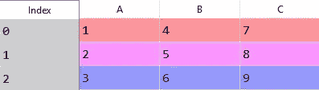
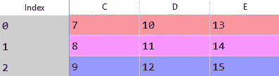
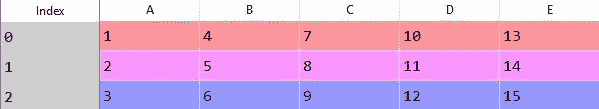

# 5 熊猫的功能科学家必须知道的鼓舞人心的数据

> 原文：<https://towardsdatascience.com/5-pandas-functions-inspiring-data-scientists-must-know-dff59580b307?source=collection_archive---------19----------------------->

## 数据科学家日复一日使用熊猫函数


照片来自 Unsplash，作者: [Erik Mclean](https://unsplash.com/photos/eQ7v8A49oVs)

不，它不是来自中国的巨大的黑白相间的吃竹子的熊。

Pandas 是 Python 中的一个库，专注于数据操作和分析。该库提供了各种用于操作和更改数据结构和数据集的函数。

## **你为什么需要了解熊猫？**

1.  **数据科学家 80%的工作是清理数据集。使用移除或更改值的函数来清理数据集。这些功能的很大一部分来自熊猫图书馆。**

2.当数据科学家被问到…

> "*你会推荐一位鼓舞人心的数据科学家首先学习哪种编程语言*"

在一个 [Kaggle 调查](https://www.google.ca/search?q=top+programming+languages+should+inspriing++data+scientists&tbm=isch&ved=2ahUKEwi28vjA0_zuAhUMf6wKHbCzC5wQ2-cCegQIABAA&oq=top+programming+languages+should+inspriing++data+scientists&gs_lcp=CgNpbWcQA1CJ6gNYzpgEYIeeBGgAcAB4AIABb4gBvguSAQQxNi4ymAEAoAEBqgELZ3dzLXdpei1pbWfAAQE&sclient=img&ei=rjIzYLbjOoz-sQWw567gCQ&bih=1076&biw=2133&safe=active#imgrc=FHAH_I6v7xxzPM)， **79%的人说 Python** 。

Python 正迅速成为那些进入数据科学领域的人学习的首选语言，了解其最强大的库之一已成为一项要求。

所以说了这么多，让我们来看看本质，看看熊猫的 5 个功能，科学家们需要知道的鼓舞人心的数据。

# 1) .行，列

。loc 可能是熊猫图书馆中最重要和最常用的功能。该函数用于索引数据框以访问特定的行或列。

的输入参数。loc[]包含要作为第一个输入索引的行，以及要作为第二个输入索引的列。这些输入可以是整数，也可以是标签。

让我们通过一些例子来展示这个函数的功能并付诸实践。

## 代码示例:



df

1.  **返回 B 列的 6**

```
df.loc[2,'B']
```

**2。返回 C 列的所有内容**

```
df.loc[:,'C']
```

**3。返回第 1 行的所有内容**

```
df.loc[1,:]
```

**4。从 B 列返回 4&5**

```
df.loc[0:1,'B']
```

# 2) .合并( )

就像 SQL 中的连接一样，pandas 中的合并功能基于索引或键列将数据帧合并在一起。

输入参数包括:

*   on-这是您输入要进行连接的列的位置。
*   方式-选择所需的连接类型。可以从{ *'左'，'右'，*，*，【外'，*，*，【内'，* }中选择。默认情况下是一个“*内部联接*”。

理解合并是很重要的，因为你经常会处理多个数据集。

您会遇到这样的情况:一个数据集有您需要的一列，而另一个数据集有您需要的另一列。不要来回地看每一个，将它们组合起来要容易得多。

## 代码示例:



df1，df2 相应地

**1。将两个数据帧连接在一起**

```
df1.merge(df2, on = ['C'], how = 'inner')
```

**结果:**



# 3) .应用( )

的。apply()函数正如其名所示。它将函数应用于列或行。

的输入。apply()是一个特殊的函数。该函数可能已经存在于 Python 中，或者您可以创建自己的函数。

让我来演示一下这两者。

## 代码示例:


**1。计算 C 列中所有值的平方**

```
df['C'].apply(np.sqrt) #uses the square root function from numpy
```

**2。将 A 列中的每个数字加 2**

```
df['A'].apply(lambda x: x + 2)
```

**3。创建您自己的函数，如果值大于 5，则返回 True，否则返回 False。应用于整个数据框。**

```
def above(x):
   if x > 5:
      return True
   else:
      return Falsedf.apply(above)
```

# 4) .groupby()

更高级的熊猫功能之一。groupby()根据列中的值创建不同的组。

主输入参数是**‘by’**，它等于您要分组的列。

假设我有一个 1000 人的数据框架，包括他们居住的国家和他们的工资。如果我想查看同一个国家所有人的工资，我可以使用。groupby()函数，其中“by”等于国家/地区列。

此外。groupby()函数通常与聚合函数一起使用。这些包括总和、平均值、最小值、最大值等。

因此，如果我们想查看每个国家的平均工资，代码应该是这样的…

```
df.groupby(by = ['Country']).mean()
```

# 5) .drop_duplicates()

很抱歉告诉你，你从网上得到的数据并不总是完美的。您下载的大多数数据集都会有缺失值、列中不正确的类型和重复值。

。drop_duplicates()处理了其中的一个问题，我将让您来猜测是哪个问题。

的输入参数。drop_duplicates()包括:

*   子集-它不会删除整个数据框中的重复项，只会移除您输入的列中的重复项。
*   保留—确定要保留哪些副本。***‘第一个’***:除去第一个出现的重复项。 ***【最后一个】*** :除去最后一个出现的重复项。 ***【假】*** :丢弃所有重复的。

```
df.drop_duplicates(subset = ['C'], keep = 'first')
#removes duplicate values from column C
```

# 奖金:。read_csv()

在使用上述任何函数之前，您需要将数据集导入 Python。

您找到的大多数数据集都位于 CSV(逗号分隔值)文件中，要将该数据集导入 Python，您可以使用。读取 csv()函数。

主要输入参数是数据集的文件路径。

```
import pandas as pd #this imports the pandas library in Python
df = pd.read_csv(C:\Documents\dataset.csv) 
```

# 最后一条建议

如果你还没有使用 Python，你迟早会使用的。

据报道，2020 年，LinkedIn 上 90%的数据科学招聘广告都提到了 Python。

Python 很大程度上与其最著名的库 Numpy 和 Pandas 有关。这意味着如果公司要求你了解 Python，他们也要求你了解它的库。

现在，当然，还有更多你应该知道的熊猫的功能，但是这 5 个功能通常每天都在使用，并且是理解熊猫的其他功能的很好的基础。

[**与 1k+人一起加入我的电子邮件列表，免费获得完整的 Python for Data Science 备忘单小册子。**](http://pages.christopherzita.com/pythoncheatsheets)