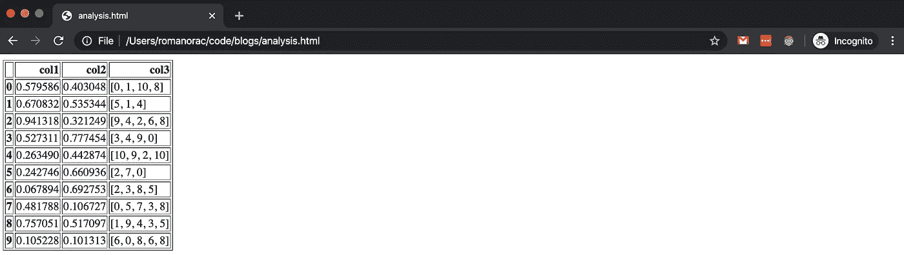
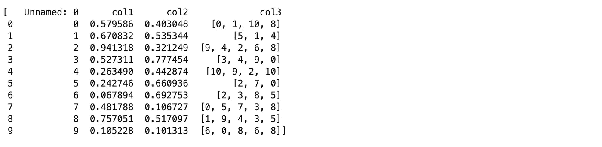
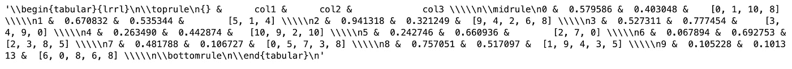
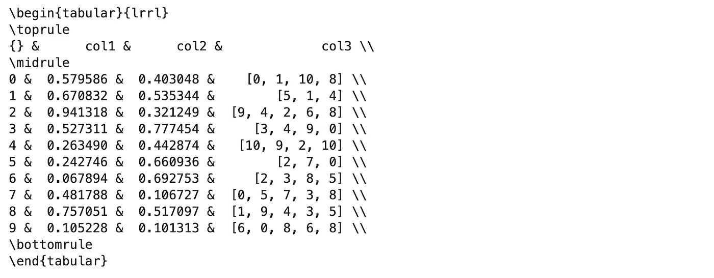
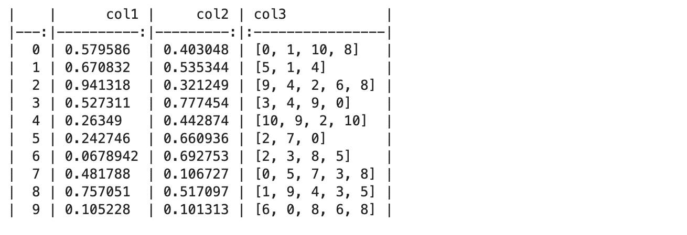
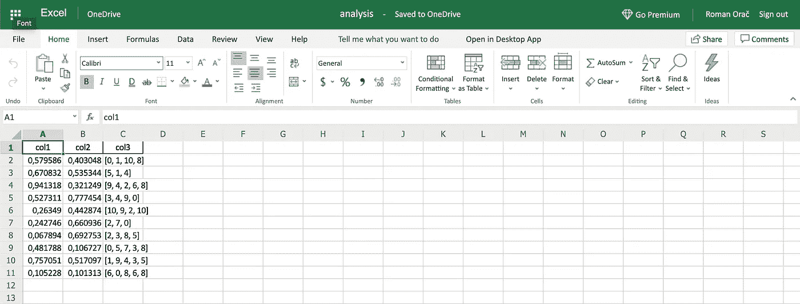
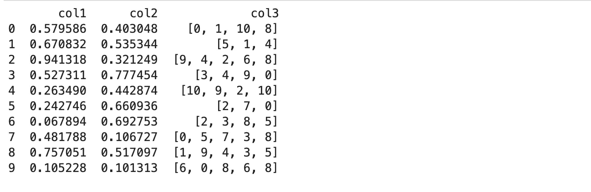

# 你应该知道的 5 个熊猫展示技巧

> 原文：<https://towardsdatascience.com/5-pandas-presentation-tips-you-should-know-about-d9e484c97f2a?source=collection_archive---------27----------------------->

## 当你需要与他人分享你的分析时，这些建议会对你有所帮助


由[希德·巴拉钱德朗](https://unsplash.com/@itookthose?utm_source=medium&utm_medium=referral)在 [Unsplash](https://unsplash.com?utm_source=medium&utm_medium=referral) 上拍摄的照片

这些建议将帮助你与他人分享你的分析。无论你是学生、数据科学家还是博士研究员，每个项目都以某种形式的报告结束。希望这是 Confluence 上的一个帖子，GitHub 上的 Readme 或者一篇科学论文。

没有必要将数据帧中的值逐个复制粘贴到另一个软件中。Pandas 的格式化功能可以将一个数据帧转换成多种格式。

# 介绍

让我们用随机值创建一个 10 行 3 列的数据帧。

```
n **=** 10
df **=** pd**.**DataFrame(
    {
        "col1": np**.**random**.**random_sample(n),
        "col2": np**.**random**.**random_sample(n),
        "col3": [[random**.**randint(0, 10) **for** _ **in** range(random**.**randint(3, 5))] **for** _ **in** range(n)],
    }
)
```

# 1.用 HTML 共享结果



用 HTML 展示熊猫数据框架(图片由作者制作)。

熊猫数据帧可以用 to_html 函数转换成 HTML。如果您需要通过 HTML 发送自动报告，这很有用。您还可以在 pandas-analytics-server 上创建一个 API，这样您就可以在 web 浏览器中跟踪数据帧中的最新值。

注意，lxml 包是必需的。你可以用:pip install lxml 来安装它。

```
df_html **=** df**.**to_html()**with** open('analysis.html', 'w') **as** f:
    f**.**write(df_html)
```

甚至还有一个 read_html 函数，使您能够将 html 解析回熊猫数据帧。我还没有用通用的 HTML 试过——如果能用就好了。

```
df_list **=** pd**.**read_html('analysis.html')
df_list
```



从 HTML 加载数据帧(图片由作者制作)。

# 2.撰写科学论文

大多数高质量的研究论文都是使用 LaTeX——一种高质量的排版系统——撰写的。许多 LaTeX 作者制作一个数据帧的截屏，然后将它包含在他们的论文中，其他人花费相当多的时间将数据帧值格式化为 LaTeX 表。

如果我告诉你熊猫体内有一种可以帮你负重前行的功能，你会怎么想？让我们看看例子。

```
df**.**to_latex()
```



将熊猫数据帧转换为 Latex(图片由作者制作)。

您可以将它与 print 一起使用，以获得格式良好的输出。

```
**print**(df**.**to_latex())
```



乳胶熊猫数据框的漂亮印刷(图片由作者制作)。

# 3.撰写自述文件

Github 对存储库中的 README 和 Wiki 使用 Markdown 格式化语言。一个好的自述文件会让你的项目更容易被其他人使用。在 GitHub 上制作一个一步一步的例子是很常见的，但是手动格式化熊猫数据帧来降低价格会花费很多时间。熊猫保护了我们。

```
**print**(df**.**to_markdown())
```



降价中的熊猫数据框(图片由作者制作)。

# 4.Excel 电子表格

Excel 是商业世界事实上的标准。有了熊猫，我们可以轻松阅读 Excel 电子表格。它有一个将数据帧转换成 Excel 电子表格的功能。

注意，xlwt 和 openpyxl 包是必需的。你可以用 pip 安装它们。

```
df**.**to_excel('analysis.xlsx', index**=**False)
```



Excel 中的熊猫数据框(图片由作者制作)。

```
pd**.**read_excel('analysis.xlsx')
```


从 Excel 中读取熊猫数据帧(图片由作者制作)。

# 5.编写文档

在代码中编写注释时，将 DataFrame 转换为字符串可能很有用。

```
**print**(df**.**to_string())
```



Python 字符串中的熊猫数据帧(图片由作者制作)。

# 结论

这些是我在做我的分析的最后陈述时经常使用的一些熊猫陈述技巧。

你学到新东西了吗？请在下面的评论中告诉我。

# 在你走之前

```
- [Intro to Machine Learning with PyTorch](https://imp.i115008.net/c/2402645/788201/11298) [Course]- [Deep Learning Nanodegree](https://imp.i115008.net/c/2402645/788202/11298) [Course]- [Free skill tests for Data Scientists & Machine Learning Engineers](https://aigents.co/skills)- [Correlation Analysis 101 in Python](https://dataanalysis.substack.com/p/correlation-analysis-101-in-python)
```

上面的一些链接是附属链接，如果你通过它们进行购买，我会赚取佣金。请记住，我链接课程是因为它们的质量，而不是因为我从你的购买中获得的佣金。

在[推特](https://twitter.com/romanorac)上关注我，在那里我定期[发关于数据科学和机器学习的推特](https://twitter.com/romanorac/status/1328952374447267843)。


照片由[Courtney hedge](https://unsplash.com/@cmhedger?utm_source=medium&utm_medium=referral)在 [Unsplash](https://unsplash.com/?utm_source=medium&utm_medium=referral) 上拍摄