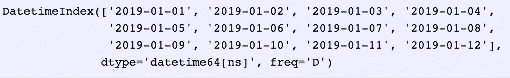
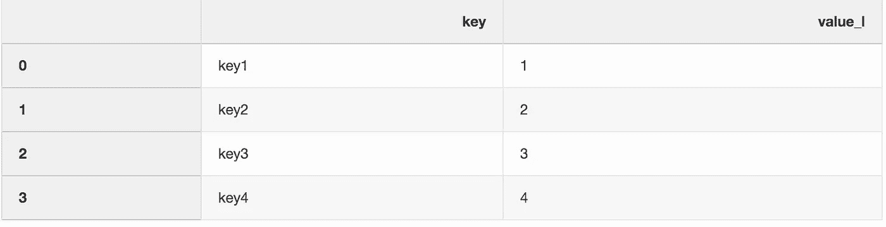
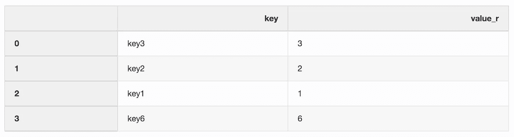
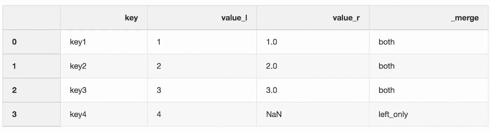
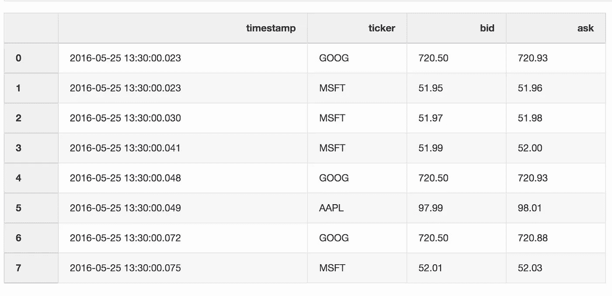
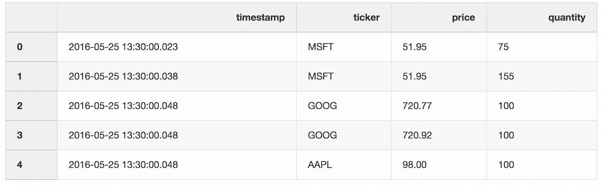
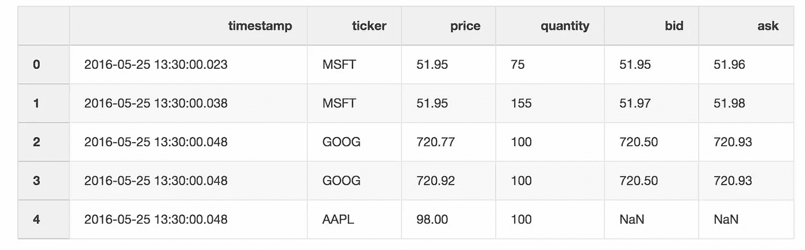
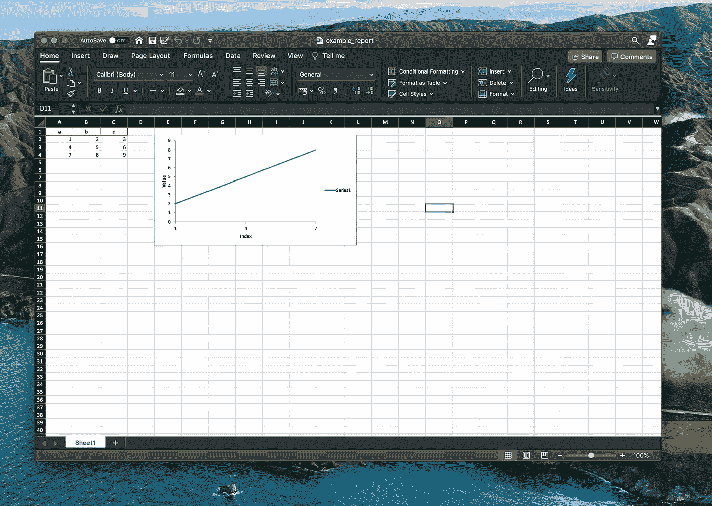

# 你应该在 2021 年开始使用的 5 个熊猫技巧

> 原文：<https://towardsdatascience.com/5-pandas-tricks-you-should-start-using-in-2021-d32dbdecca70?source=collection_archive---------38----------------------->

## 用一个最好的新年决心开始新的一年:多了解熊猫。


照片由[迈克尔·佩恩](https://unsplash.com/@mpayne66?utm_source=medium&utm_medium=referral)在 [Unsplash](https://unsplash.com?utm_source=medium&utm_medium=referral) 上拍摄

andas 无需介绍，因为它已经成为 Python 中事实上的数据分析工具。作为一名数据科学家，我每天都使用熊猫，它总能以更好的方式实现我的目标，让我感到惊讶。

对于熊猫新手— [熊猫](https://pandas.pydata.org/)为 Python 编程语言提供了高性能、易于使用的数据结构和数据分析工具。

> 熊猫这个名字来源于术语“面板数据”，这是一个计量经济学术语，指的是包括同一个人在多个时间段的观察结果的数据集。

在这篇文章中，我将向你展示 5 个熊猫的小技巧，它们会让你在以下情况下更有效率:

*   用熊猫数据框连接数据，
*   处理日期和时间，
*   制作 Excel 报表，
*   将数据帧存储到磁盘。

我们开始吧。

<https://romanorac.medium.com/pandas-data-analysis-series-b8cec5b38b22>  

# 1.日期范围


在 [Unsplash](https://unsplash.com?utm_source=medium&utm_medium=referral) 上由 [Waldemar Brandt](https://unsplash.com/@waldemarbrandt67w?utm_source=medium&utm_medium=referral) 拍摄的照片

当从数据库或外部 API 获取数据时，通常需要指定查询的开始日期和结束日期。

操作日期可能会很棘手，但别担心，熊猫会掩护我们的！

有一个 [data_range](https://pandas.pydata.org/pandas-docs/stable/reference/api/pandas.date_range.html) 函数，返回按天、月或年等递增的日期。它也和时间一起工作。

假设您需要一个按天递增的日期范围。

```
date_from **=** "2019-01-01"
date_to **=** "2019-01-12"
date_range **=** pd**.**date_range(date_from, date_to, freq**=**"D")
date_range
```



熊猫日期范围函数的输出。

让我们将生成的 date_range 转换为开始和结束日期，这可以直接传递给 API 或数据库查询。

```
**for** i, (date_from, date_to) **in** enumerate(zip(date_range[:**-**1], date_range[1:]), 1):
    date_from **=** date_from**.**date()**.**isoformat()
    date_to **=** date_to**.**date()**.**isoformat()
    **print**("%d. date_from: %s, date_to: %s" **%** (i, date_from, date_to)# the output with date_from and date_to
1\. date_from: 2019-01-01, date_to: 2019-01-02
2\. date_from: 2019-01-02, date_to: 2019-01-03
3\. date_from: 2019-01-03, date_to: 2019-01-04
4\. date_from: 2019-01-04, date_to: 2019-01-05
5\. date_from: 2019-01-05, date_to: 2019-01-06
6\. date_from: 2019-01-06, date_to: 2019-01-07
7\. date_from: 2019-01-07, date_to: 2019-01-08
8\. date_from: 2019-01-08, date_to: 2019-01-09
9\. date_from: 2019-01-09, date_to: 2019-01-10
10\. date_from: 2019-01-10, date_to: 2019-01-11
11\. date_from: 2019-01-11, date_to: 2019-01-12
```

# 2.与指示器合并


照片由[派恩瓦特](https://unsplash.com/@pinewatt?utm_source=medium&utm_medium=referral)在 [Unsplash](https://unsplash.com?utm_source=medium&utm_medium=referral) 上拍摄

Pandas 有一个[合并](https://pandas.pydata.org/pandas-docs/stable/reference/api/pandas.DataFrame.merge.html)功能，顾名思义，它用一个数据库风格的连接合并两个数据帧。

> 合并两个数据集是将两个数据集合并为一个数据集，并根据公共列对齐每个数据集的行的过程

如果你和我一样，你也用过很多次 merge 函数。但让我惊讶的是，我并不知道**指标**的说法。

指示符参数向数据帧添加一个`_merge`列，告诉您该行来自哪个数据帧:

*   左侧数据帧，
*   右侧数据帧，
*   或者两个数据帧。

当使用更大的数据集来验证合并操作时,`_merge`列非常有用。

让我们定义两个数据帧，并用合并指示器将它们合并。

```
left **=** pd**.**DataFrame({"key": ["key1", "key2", "key3", "key4"], "value_l": [1, 2, 3, 4]})
```



左侧数据框中的行

```
right **=** pd**.**DataFrame({"key": ["key3", "key2", "key1", "key6"], "value_r": [3, 2, 1, 6]})
```



右侧数据框中的行

```
df_merge **=** left**.**merge(right, on**=**'key', how**=**'left', indicator**=**True)
```



带有合并列的 df_merge 数据帧中的条目

我们可以使用`_merge`列来检查是否有预期数量的行具有来自两个数据帧的值。

```
df_merge**.**_merge**.**value_counts()# output of values count function
both          3
left_only     1
right_only    0
Name: _merge, dtype: int64
```

# 3.最近合并


照片由[蒂姆·约翰逊](https://unsplash.com/@mangofantasy?utm_source=medium&utm_medium=referral)在 [Unsplash](https://unsplash.com?utm_source=medium&utm_medium=referral) 上拍摄

当处理股票或加密货币等金融数据时，我们可能需要将报价(价格变化)与实际交易结合起来。

假设我们希望将每笔交易与之前几毫秒发生的报价合并。我们如何通过熊猫来实现这一目标？

Pandas 有一个函数 [merge_asof](https://pandas.pydata.org/pandas-docs/stable/reference/api/pandas.merge_asof.html) ，它能够通过最近的键(在我们的例子中是时间戳)合并数据帧。数据集报价和交易取自[熊猫的例子](https://pandas.pydata.org/pandas-docs/stable/reference/api/pandas.DataFrame.merge.html)。

报价数据框包含不同股票的价格变化。通常，报价比交易多得多。

```
quotes **=** pd**.**DataFrame(
    [
        ["2016-05-25 13:30:00.023", "GOOG", 720.50, 720.93],
        ["2016-05-25 13:30:00.023", "MSFT", 51.95, 51.96],
        ["2016-05-25 13:30:00.030", "MSFT", 51.97, 51.98],
        ["2016-05-25 13:30:00.041", "MSFT", 51.99, 52.00],
        ["2016-05-25 13:30:00.048", "GOOG", 720.50, 720.93],
        ["2016-05-25 13:30:00.049", "AAPL", 97.99, 98.01],
        ["2016-05-25 13:30:00.072", "GOOG", 720.50, 720.88],
        ["2016-05-25 13:30:00.075", "MSFT", 52.01, 52.03],
    ],
    columns**=**["timestamp", "ticker", "bid", "ask"],
)
quotes['timestamp'] **=** pd**.**to_datetime(quotes['timestamp'])
```



报价数据框架中的条目

交易数据框包含不同股票的交易。

```
trades **=** pd**.**DataFrame(
    [
        ["2016-05-25 13:30:00.023", "MSFT", 51.95, 75],
        ["2016-05-25 13:30:00.038", "MSFT", 51.95, 155],
        ["2016-05-25 13:30:00.048", "GOOG", 720.77, 100],
        ["2016-05-25 13:30:00.048", "GOOG", 720.92, 100],
        ["2016-05-25 13:30:00.048", "AAPL", 98.00, 100],
    ],
    columns**=**["timestamp", "ticker", "price", "quantity"],
)
trades['timestamp'] **=** pd**.**to_datetime(trades['timestamp'])
```



交易数据框中的条目

我们通过报价器合并交易和报价，最新的报价可能比交易晚 10 毫秒。

如果报价落后于交易超过 10 毫秒，或者没有任何报价，该报价的买价和卖价将为空(本例中为 AAPL 股票)。

```
df_merge = pd**.**merge_asof(trades, quotes, on**=**"timestamp", by**=**'ticker', tolerance**=**pd**.**Timedelta('10ms'), direction**=**'backward')
```



`df_merge DataFrame`中的条目

# 4.创建 Excel 报表


卢卡斯·布拉塞克在 [Unsplash](https://unsplash.com?utm_source=medium&utm_medium=referral) 上的照片

我们可以直接在 pandas 中创建 Excel 报表(借助 XlsxWriter 库)。

这大大节省了时间——不再需要将数据帧保存为 CSV 格式，然后在 Excel 中进行复制粘贴和格式化。我们还可以添加各种[图表](https://pandas-xlsxwriter-charts.readthedocs.io/)等。

让我们定义一个数据框架，然后用它创建一个 Excel 报表。

```
df **=** pd**.**DataFrame([[1, 2, 3], [4, 5, 6], [7, 8, 9]], columns**=**["a", "b", "c"])
```

下面的代码片段创建了一个 Excel 报表。

```
report_name **=** 'example_report.xlsx'
sheet_name **=** 'Sheet1'writer **=** pd**.**ExcelWriter(report_name, engine**=**'xlsxwriter')
df**.**to_excel(writer, sheet_name**=**sheet_name, index**=**False)*# writer.save()*
```

我们还可以在 Excel 报告中添加图表。

我们需要定义图表的类型(我们示例中的折线图)和图表的数据系列(数据系列需要在 Excel 电子表格中)。

```
*# define the workbook* workbook **=** writer**.**book
worksheet **=** writer**.**sheets[sheet_name]*# create a chart line object* chart **=** workbook**.**add_chart({'type': 'line'})*# configure the series of the chart from the spreadsheet
# using a list of values instead of category/value formulas:
#     [sheetname, first_row, first_col, last_row, last_col]* chart**.**add_series({
    'categories': [sheet_name, 1, 0, 3, 0],
    'values':     [sheet_name, 1, 1, 3, 1],
})*# configure the chart axes* chart**.**set_x_axis({'name': 'Index', 'position_axis': 'on_tick'})
chart**.**set_y_axis({'name': 'Value', 'major_gridlines': {'visible': False}})*# place the chart on the worksheet* worksheet**.**insert_chart('E2', chart)*# output the excel file* writer**.**save()
```



用熊猫创建的 Excel 报表

# 5.节省磁盘空间


Photo by [铮 夏](https://unsplash.com/@xiazheng1995?utm_source=medium&utm_medium=referral) on [Unsplash](https://unsplash.com?utm_source=medium&utm_medium=referral)

当处理多个数据科学项目时，您通常会从不同的实验中获得许多预处理数据集。笔记本电脑上的小型固态硬盘很快就会变得杂乱无章。

Pandas 使我们能够在保存数据集时对其进行压缩，然后以压缩格式读回。

让我们用随机数创建一个大熊猫数据框架。

```
import numpy as npdf **=** pd**.**DataFrame(np**.**random**.**randn(50000,300))
```


带有随机数的数据帧。

当我们将这个文件保存为 CSV 格式时，它会占用硬盘上将近 300 MB 的空间。

```
df**.**to_csv('random_data.csv', index**=**False)
```

我们可以通过使用 gz 扩展名而不是 csv 将文件大小减少到 136 MB。

```
df**.**to_csv('random_data.gz', index**=**False)
```

我们不会失去任何功能，因为将 gzipped 数据读入 DataFrame 也很容易。

```
df **=** pd**.**read_csv('random_data.gz')
```

# 结论


Johannes Plenio 在 [Unsplash](https://unsplash.com?utm_source=medium&utm_medium=referral) 上拍摄的照片

如果你想运行这些例子，你可以下载 [Jupyter 笔记本](https://romanorac.github.io/assets/notebooks/2019-10-29-5-lesser-known-pandas-tricks.ipynb)。

这些技巧帮助我每天与熊猫相处时更有效率。让我在评论中知道你最喜欢的熊猫戏法是什么。

# 在你走之前

```
- [Correlation Analysis 101 in Python](https://dataanalysis.substack.com/p/correlation-analysis-101-in-python)- [Free skill tests for Data Scientists & Machine Learning Engineers](https://aigents.co/skills)- [Data Science for Business Leaders](https://imp.i115008.net/c/2402645/880006/11298) [Course]- [Intro to Machine Learning with PyTorch](https://imp.i115008.net/c/2402645/788201/11298) [Course]
```

*上面的一些链接是附属链接，如果你通过它们购买，我会赚取佣金。请记住，我链接课程是因为它们的质量，而不是因为我从你的购买中获得的佣金。*

在 [Twitter](https://twitter.com/romanorac) 上关注我，在那里我定期[发布关于数据科学和机器学习的](https://twitter.com/romanorac/status/1328952374447267843)消息。


在 [Unsplash](https://unsplash.com/?utm_source=medium&utm_medium=referral) 上由[Courtney hedge](https://unsplash.com/@cmhedger?utm_source=medium&utm_medium=referral)拍摄的照片