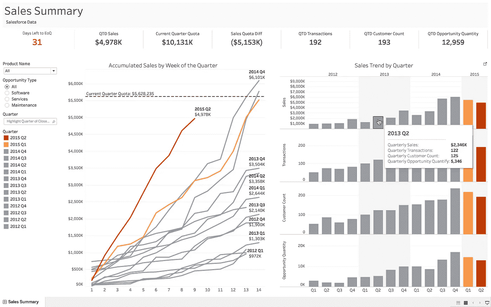
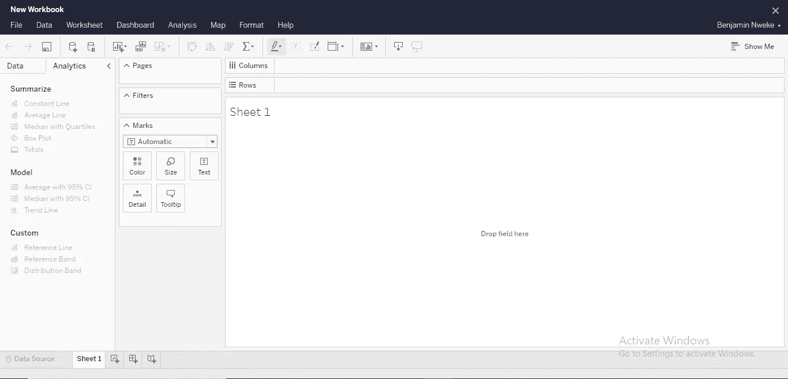

# Tableau 的 5 个强大特性将使您的数据可视化项目脱颖而出

> 原文：<https://towardsdatascience.com/5-powerful-features-of-tableau-that-will-make-your-data-visualization-projects-stand-out-37291c737ec8?source=collection_archive---------6----------------------->

## 数据可视化变得更加容易

Tableau 软件创建的可视化。知识共享许可[https://commons.wikimedia.org/w/index.php?curid=74539785](https://commons.wikimedia.org/w/index.php?curid=74539785)

世界正以超乎我们想象的速度飞速发展。世界正变得越来越由数据驱动，许多行业正在转向数据科学家，主要是商业智能来管理他们的数据库，以帮助更好的业务决策。

我在一家商业情报机构实习了六个月，根据我在各种公司的经验，商业智能正在使用先进的工具来分析原始数据并产生有用的细分信息，以提高公司的效率并增加收入。

现在，这就是数据可视化发挥作用的地方。企业处理大量数据，分析原始格式的数据通常很复杂。以彩色图形、图表、形状和绘图的形式显示数据可以提高您正在使用的数据集的质量和准确性。数据可视化的首选工具是 Tableau。

[Tableau](https://www.tableau.com/) 是一款数据可视化软件，旨在查询云数据库、电子表格、机器学习算法、社交数据库和其他数据库进展，以创建简单的面向图形的数据可视化。

我喜欢 Tableau 的一个特别之处是，使用这个工具不需要掌握复杂的 Python 或 R 知识。通过友好的拖放界面，任何人都可以理解它的功能。话虽如此，以下是 Tableau 的五个特性，它们将帮助您创建更好的数据可视化项目:

# **多功能仪表盘**

Tableau 仪表板。作者截图

好的，所有现代技术工具都有一个仪表板，或者很多人喜欢称之为主页。许多数据和编程工具都配备了仪表板，用户可以在其中进行快速更改、开发预设以及添加自定义格式和布局，这有助于提高数据分析师的速度、准确性和有效性。

Tableau 软件比你在其他数据可视化工具中看到的功能更多。开发该软件的两位来自斯坦福的研究人员看到了数据分析中的困难，并希望有一个无缝的可视化过程，可以很容易地被所有数据科学家使用，不管他们的专业是什么。

通过一个信息丰富、先进但易于使用的仪表板，用户可以部署交互式模型，应用各种格式，并为同时处理多个项目的分析师服务；您可以有效地将一个工作簿中使用的所有元素转移到另一个工作簿中。

# **数据提取和混合**

如果你有储存在数据库里的数据，请举手。我想每个人都有。好吧，AWS 怎么样？Excel？外部公司资源怎么样？事实证明，我们中的很多人都在这些资源中储存了有价值的信息。从经验来看，在将资源部署到项目进行分析之前，总是用不同的工具转换资源(需要时，我会使用 [Hevo Data](https://hevodata.com/) )是一个挑战。

Tableau 提供了许多数据源功能来连接和导入来自各种外部资源的数据。从大数据、关系数据库、云数据到 Excel 电子表格，大多数都可以通过从源文件复制文件，然后粘贴到 Tableau 工作表中，轻松地进行**部署。**

为了提高效率，您需要下载驱动程序来与数据库和服务器细节进行交互，以连接到数据连接器。Tableau 支持大量的数据连接器，因此您不需要迁移。举几个例子:Salesforce、SQL Server、Presto、FreshBook、GraphQL、MailChimp、Dropbox、Basecamp、亚马逊 S3、Apache Hive、XML、Smartsheet 等等。

# **增强的数据可视化功能**

数据可视化的主要模块用箱线图、图解、图表、表格和任何其他形式的图示来表示数据(数字、交易、统计)。Tableau 提供了不同的视觉选择，从其独特的可视化功能的巨大集合中挑选。

你还记得那些用来表示冠状病毒统计数据的华而不实的图形和图表吗？这在 2020 年很常见。我想每个人都习惯于看到它。那些吸引人的插图不断提醒你去看更新，但并不总是吸引人——基本上是复杂的原始数据和庞大的文本。

研究证明，人类更有可能通过视觉来学习和获取知识。这是一个公开的秘密，企业喜欢 data analyst 以简单、朴素和丰富多彩的图形和图表呈现数据(有用的信息)。以下是 Tableau 提供的一些可视化效果:

*   运动图表
*   柱状图
*   Choropleth 地图
*   堆叠柱
*   热图
*   亮点表
*   项目符号图

# **预测分析和预测**

Tableau 的另一个强大功能是使用时间序列和预测。我曾经做过一个项目。核心目标是预测在特定加油站购买天然气的最大客户数量。

通常，要对每天的销售业务进行接近完美的预测，需要花费大量的时间，对不同工作日的原始数据进行编码、部署和组织。你的 Python 知识可能会支持你，但它不会像 Tableau 软件那样有效和省时。

Tableau 可靠的前端和后端服务器使快速形成趋势线和预测变得容易。拖放界面使预测变得有效和高效，因为您可以选择与您正在处理的内容相关的选项。

# **询问数据特征**

Tableau 软件支持 [94%的数据仓库功能](https://www3.technologyevaluation.com/selection-tools/features-list/31918/tableau-software#:~:text=Tableau%20Software%20supports%2094%25%20of%20Data%20Warehousing%20functionalities.&text=In%20this%20module%2C%20Tableau%20Software,for%20the%20Tableau%20software%20system.)，你可以同意我的观点，来自数据科学各个方面的专业用户在这个强大的软件上处理他们的数据可视化项目。Tableau 增加了一个功能，用户可以互动，寻求解决方案，并与船上的许多人分享想法。

[询问数据](https://www.tableau.com/en-in/products/new-features/ask-data)功能。这个特性使得理解数据变得更加容易，你不需要在你的工作区附近放一本数据科学百科全书(如果他们有的话)。有一个像谷歌一样的搜索面板，但只是用于数据相关的查询。你需要做的只是用你常用的语言输入你的查询——我说的是英语或西班牙语，而不是 Python 或 JavaScript，Tableau 会给你与你的查询相关的最重要的答案。

该功能旨在改善数据科学专业人员之间的相互交流，并培养解决问题的新见解和新模式。

# 结论

如果您曾经尝试过数据可视化，并且认为它很难理解或者太复杂而无法将模块应用到您的项目中，那么您可能没有使用正确的工具。Tableau 是一款非常棒的软件，可以简化您所有的数据可视化任务，创建更好、更准确的分析。该软件提供了更多的功能和规格，使数据分析师的工作更加准确和高效。

Tableau 软件如何入门？Tableau 有四个主要产品选项可供选择: [Tableau Prep](https://www.tableau.com/products#tableau-prep) 、 [Tableau Desktop](https://www.tableau.com/products#tableau-desktop) 、[Tableau Server&Tableau Online](https://www.tableau.com/products#tableau-server-tableau-online)和 [Tableau Mobile](https://www.tableau.com/products#tableau-mobile) 。您可以选择适合您数据需求的首选产品。

在本文中，我们介绍了 Tableau 软件的五个关键特性。您可以很容易地熟悉这些功能，并使您的数据可视化项目与众不同。如果你需要帮助入门，可以看看 Tableau 平台提供的这些免费的[教程视频](https://www.tableau.com/learn/training/20212)。

## 资源

> https://www.tableau.com/

如果你喜欢这个，你可能也会喜欢:

</the-one-piece-of-advice-that-changed-my-life-as-a-data-scientist-4bb0d3e67b88>  </why-smart-data-scientists-keep-failing-basic-data-science-interviews-3a0f70f1fad8>  </sql-skills-if-mastered-will-get-you-better-data-science-opportunities-9f912d4f88d3> [## SQL 技能(如果掌握的话)会让你获得更好的数据科学机会

towardsdatascience.com](/sql-skills-if-mastered-will-get-you-better-data-science-opportunities-9f912d4f88d3)