# 作为数据科学家，你应该知道的 5 个概率分布

> 原文：<https://towardsdatascience.com/5-probability-distribution-you-should-know-as-a-data-scientist-f8abc9522af0?source=collection_archive---------7----------------------->

## 作为数据科学家对概率感到困惑？

## 必须知道概率概念和分布

照片由[龙之介·菊野](https://unsplash.com/@ryunosuke_kikuno?utm_source=medium&utm_medium=referral)在 [Unsplash](https://unsplash.com?utm_source=medium&utm_medium=referral) 上拍摄

数据科学家在采访和阅读研究论文中解决问题时，会遇到许多与概率相关的术语。因此，了解概率和概率分布的基础知识是一个有抱负的数据科学家甚至是一个经验丰富的数据科学家所必须的。这些知识将帮助你赢得面试，更好地理解数据，并开发更直观的解决方案。博客将有以下几个部分。

*   概率基础
*   随机变量
*   概率分布及其特征
*   均匀分布
*   二项分布
*   高斯分布
*   泊松分布
*   指数分布

别担心。这个列表很大，但是我已经确保了这个博客的可读性和易懂性。事不宜迟，让我们深入理解所有的概念。

由[吉菲](https://media.giphy.com/media/Wn6dI709QqqJidc5oi/giphy.gif)

# 概率基础

让我们首先理解实验、样本空间和事件的含义，因为它们在统计学中经常使用，也有助于我们理解概率的正式定义。一个**实验**是任何可以无限重复的程序，并且有一组明确定义的可能结果。例如，投掷硬币是一个实验，因为我们可以重复投掷硬币，它有两种结果(正面或反面)。一个实验的不同可能结果的集合被称为**样本空间**，在我们的例子中，它将是投掷硬币的{正面，背面}。最后，一个实验的每个试验被称为**事件**。现在我们来理解概率。**概率**是一个事件发生的可能性，用有利结果与总体结果的比率来衡量，假设所有结果的可能性相等。

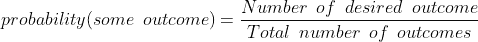

作者图片

所以在抛硬币的过程中

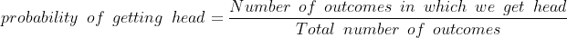

作者图片

当我们在无数次试验中考虑这个问题时，得到 head = 1/2 的概率。

# 随机变量

随机变量(RV)是为实验的每个结果赋值的函数。比如抛硬币，我们定义一个随机变量 X 为人头来时的事件，那么我们来看看这是怎么变成函数的。

> 当输出为正面时，X=1
> 
> 当输出为尾部时，X=0

所以 p(X=1) =得到人头的概率= 1/2

p(X=0) =得到尾部的概率= 1/2

为了更好地理解，我们再举一个掷三枚硬币的例子。设随机变量 X 是出现在三个硬币上的人头数。

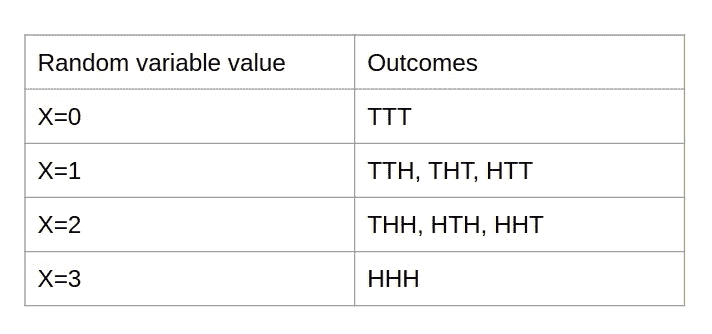

作者图片

p(X=1) =得到一个人头的概率= 3/8

# 概率分布及其特征

概率分布是描述事件发生可能性的数据点的集合。概率分布可以是离散的，也可以是连续的。在离散分布中，数据只能取某些值，而在连续分布中，数据可以取指定范围(可以是无限的)内的任何值。这个数据集合可以用图形可视化，如下所示。

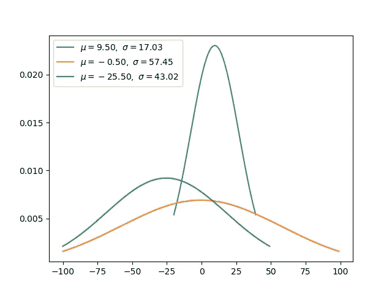

作者图片

好了，现在我对什么是概率分布有所了解了。但是它与数据科学有什么关系呢？在数据科学中，我们经常根据数据的随机抽样对总体的参数和统计关系的可靠性做出判断。对于这些情况，概率分布帮助我们做出这些判断。

每个数据分布在图上有不同的形状。因此，一定有某种度量可以帮助我们理解分布的形状，而无需在图上实际绘制数据。可以提供分布信息的指标有:均值、方差和标准差。让我们逐一了解。

## 平均

它是数据点的平均值，用μ表示。例如，如果我们有一组离散的数据{1，2，3，4，5}，那么 mean (μ)将是 3 ((1+2+3+4+5)÷5)。它用于查找一个数字，当从所有数据点中减去该数字时，转换数据的平均值将为零。

## 差异

方差是数据点和平均值之差的平方的平均值。它用σ表示。对于上面的例子，方差(σ)将是 2.5((1–3)+(2–3)+(3–3)+(4–3)+(5–3))÷5)。

## 标准偏差

它是方差的平方根，用σ表示。对于上述示例，标准差(σ)将为 1.58 (\sqrt{2.5})。它用于测量数据集中数字的分布程度。较小的标准差意味着数据点彼此更接近。

# 均匀分布

我们已经了解了什么是概率分布，它的特征是什么。现在让我们来理解均匀概率分布。均匀分布是最简单的概率分布，也称为矩形分布。这种分布具有恒定的概率。这种分布最常见的例子是掷硬币或掷骰子。

对于离散概率分布-

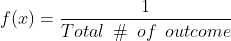

作者图片

对于连续的:

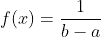

作者图片

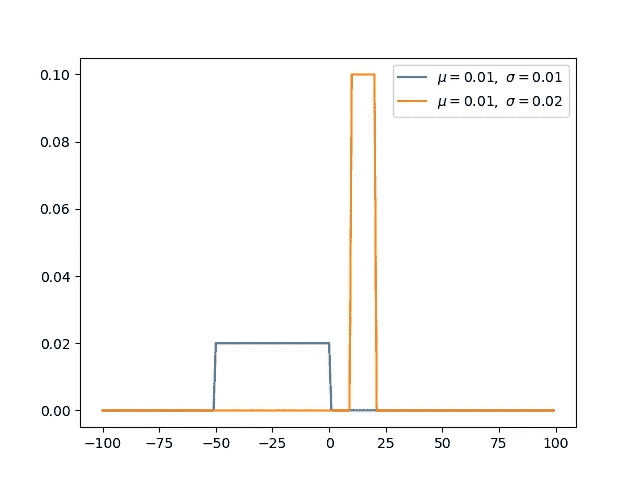

作者图片

均匀分布用于计算置信区间的自举技术。此外，蒙特卡罗模拟从生成均匀分布的伪随机数开始。

# 二项分布

在二项式分布中，随机变量被定义为独立重复试验的成功次数。设成功的概率为 **p，**，那么二项式概率分布的公式如下

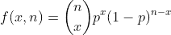

作者图片

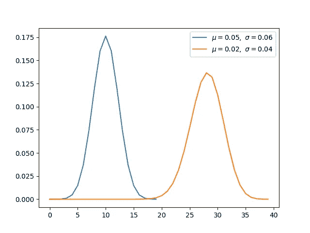

作者图片

例子:如果你买彩票，你要么赢钱，要么不赢钱。任何你能想到的有**两种可能**结果的事件都可以用二项分布来表示。在数据科学中，二项分布有利于分析二分类问题的统计量。

# 高斯/正态分布

它是最著名的分布之一，许多现实世界的现象如测量误差、人的身高、考试分数等。，遵循这个分布。这种分布的公式如下:

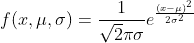

作者图片

如上所述，μ是平均值，σ是标准差。

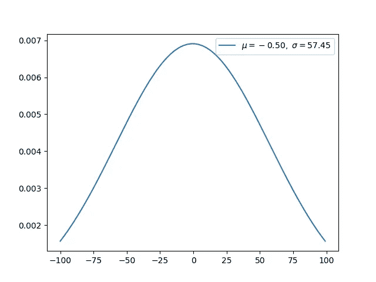

作者图片

请注意，该分布具有钟形结构，钟形的峰值出现在平均值处，而标准差与钟形的宽度有关。

当均值等于 0，标准差等于 1 时，正态分布变成标准正态分布。

这个分布在数据科学家的生活中有广泛的适用性，并且是一个必须知道的分布。有许多机器学习模型，如基于最小二乘的回归、高斯朴素贝叶斯分类器、线性和二次判别分析等。设计用于处理服从正态分布的数据集。

# 泊松分布

泊松分布通常被称为罕见事件的分布。如果你有一个以固定速率发生的事件，例如，每秒钟有 5 个人进入体育场，或者农场里每分钟有 2 个芒果成熟。那么在单位时间内观察到 **n** 个事件的概率可以使用泊松分布，使用下面的公式来计算。

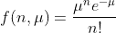

作者图片

其中μ是单位时间内的事件率。

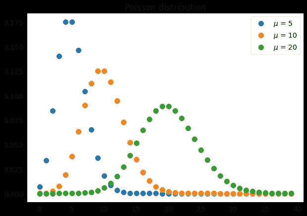

作者图片

许多现实世界的现象，如车祸、交通流量、基因突变和页面上的打字错误数量都遵循泊松分布。许多店主使用泊松分布来预测来他们商店的顾客数量。

# 指数分布

指数分布与泊松分布密切相关。如果泊松事件以固定的时间间隔发生，则两个连续泊松事件之间的时间间隔呈指数分布。两个连续泊松事件之间具有时间间隔 **t** 的概率如下

作者图片

其中，τ是两个连续泊松事件之间的平均时间间隔。

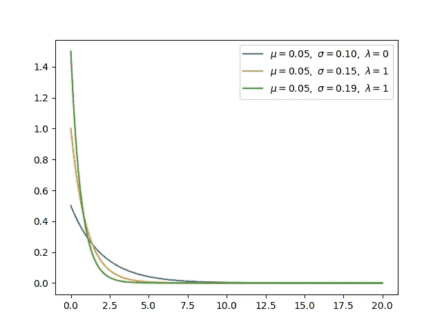

作者图片

指数分布在数据科学中的用途有限。一般来说，如果您想从泊松过程(在此过程中，您研究事件的数量)转移到时域，那么指数分布是首选分布。

# 结论

我们已经讨论了 5 种不同的概率分布，并了解了数据科学家生活中每种分布的使用案例。我希望你喜欢这篇文章，并愿意随时听取你对提高博客可读性的反馈。

*成为* [*介质会员*](https://medium.com/@AnveeNaik/membership) *解锁并阅读介质上的许多其他故事。关注我们的*[*Medium*](https://medium.com/@AnveeNaik)*，阅读更多此类博文*。