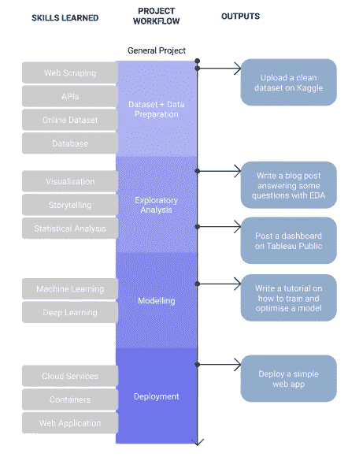
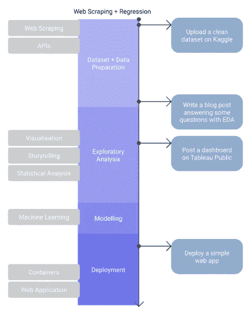
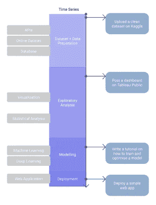
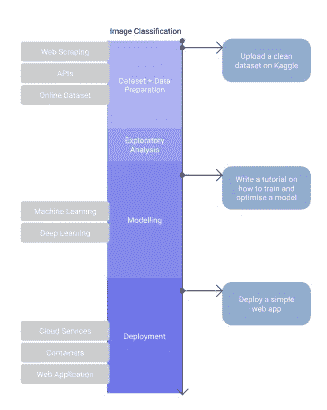
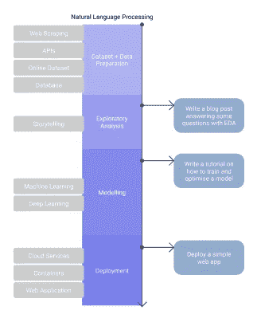
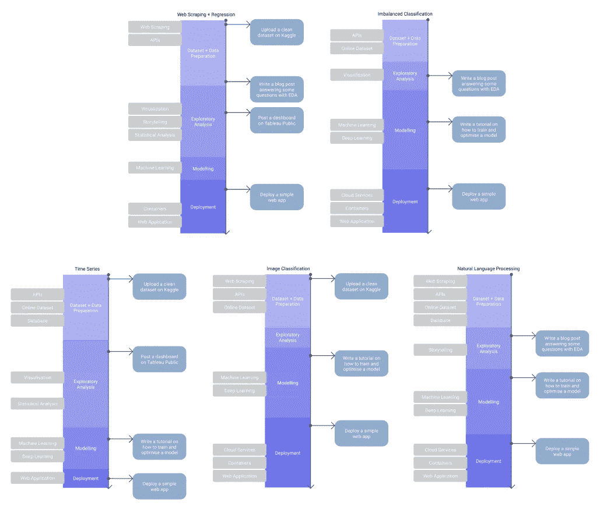

# 启动您的数据科学职业生涯的 5 个项目创意

> 原文：<https://towardsdatascience.com/5-project-ideas-91da0da17b31?source=collection_archive---------27----------------------->

## 项目成功的框架

Jo Szczepanska 在 [Unsplash](https://unsplash.com?utm_source=medium&utm_medium=referral) 上拍摄的照片

# 介绍

数据科学仍然是一个蓬勃发展的领域，需求继续超过供应，许多企业预计在未来几年内将大幅增加 IT 支出。

尽管在线课程、训练营和学位急剧增加，初级人才也随之增加，但现在仍是进入数据科学的大好时机。

有一些令人惊叹的项目想法资源，但其中许多都是由大多数新数据科学家完成的。几乎每个人都做过 Twitter 情绪分析项目(包括我自己！)，看了泰坦尼克号数据集或者做过花的图像分类。然而，**这是有充分理由的**；这些项目是展示技能的好方法，并且解决方案已经被很好地记录下来。

在本文中，我为一个好的数据科学项目提出了一个**框架**，并提供了 5 个项目想法以及它们如何适应这个框架。

# 目录

*   [剖析一个伟大的项目](#d165)
*   [关于部署的说明](#971e)
*   [网页抓取+回归](#8654)
*   [不平衡分类](#6cb2)
*   [时间序列预测](#dbdd)
*   [图像分类](#25f3)
*   [自然语言处理](#e755)

# 对一项伟大工程的剖析

## 4 个组件

任何数据科学项目都有 4 个组成部分:

1.  **数据收集和清理:**获取数据集和清理数据问题、缺失值并进行转换以允许可视化和建模的过程。
2.  **探索性数据分析(EDA):** 了解数据集，通常通过可视化。理解分布，变量和数据范围之间的关系。
3.  **建模:**建立机器学习模型来回答问题陈述的过程。
4.  **部署:**使模型可供其他人或系统交互。

## 不要忽视学习

每走一步，我们都在学习不同的技能或工具。重要的是要认识到，有些项目可能比其他项目需要更多的清洁，这意味着我们在这一领域使用更多的技能。不是每个项目都是关于模型构建的。

> 数据科学家不会花大量时间训练模型，你的一些项目应该反映这一点。

在计划项目时，我们应该始终计划我们将在整个项目中使用和学习的技能和工具。

## 大多数数据科学项目的问题是

**部署。**

大多数教程、视频和在线课程都不包含输出。当建立一个作品集时，你的努力工作被你的听众理解是很重要的。不幸的是，我们不能保证一个潜在的雇主会仔细检查你的代码，让你的工作产生的**可消化的**输出**不是 Github repo 中的代码是很重要的。**

这也有助于根据项目期间花费的时间来定制您的输出。如果你花 20 个小时去刮擦和清理一些数据，为什么不上传到 Kaggle 或者写个教程。

> 我们应该总是通过创造人们可以理解的产出来尝试从我们的工作中提取价值，这些产出可以被各种平台上的一系列受众访问。

## 将这一切结合在一起

我把这个总结在一个框架中，我会为每个项目想法修改这个框架。这不是技能和产出的详尽列表，但希望它有助于产生一些想法。

成功的数据科学组合项目的框架。图片作者。

# 关于部署的说明

在我们进入每个项目之前，我想简单谈谈部署。在工作环境中，您通常会将模型部署为云平台上的微服务；AWS，GCP 或者微软 Azure。我们在家里真的没有这种奢侈，因为这些服务是按秒收费的。他们确实有自由层，所以如果你想要一个更侧重于部署的项目，我建议看看这些。

因此，我将为所有这些项目建议相同的过程。我非常支持使用 Heroku 和 Streamlit 进行部署。如果你想展示一些额外的技能，构建一个 Docker 容器会有所帮助，这样任何人都可以在本地运行应用程序(理论上你可以将这个容器推到云平台)。

我建议[这个教程](/real-time-model-interpretability-api-using-shap-streamlit-and-docker-e664d9797a9a)，省去 Docker 部分，作为一个单独的 webapp 推送到 Heroku。

# 网页抓取+回归

构建 web 抓取项目。图片作者。

## 问题陈述

使用 Python 构建一个 web 抓取脚本，从网站抓取数据。抓取的最佳候选对象通常是房屋、车辆或家具等列表的网站。你从这些数据中得到的数据本身就是一个**回归**问题，因为我们要预测价格。

## 资料组

这是这个项目的关键部分，你的大部分时间将用于建造铲运机。抓取的数据通常是杂乱的，因此可能要花更多的时间来清理。对于第一次项目，我建议使用 BeautifulSoup 包，但如果你以前做过，请尝试 ScraPy 或 Selenium。网上有很多好的资源。

 [## 美丽的汤:用 Python 构建一个 Web 刮刀——真正的 Python

### 在本教程中，你将走过网页抓取过程的主要步骤。你将学习如何写剧本…

realpython.com](https://realpython.com/beautiful-soup-web-scraper-python/) 

## **EDA**

这也将是该项目的一大部分。如果你想在一个中型博客上展示这些情节，可以使用 Plotly 来制作美观的情节，并结合类似[数据面板](https://datapane.com/u/adam1/)的东西。

试着在这里讲一个故事例如*使用图表我们可以了解房价的哪些信息？它们会随着面积的增加而增加吗？地图有帮助吗？*

下面是我如何使用一些搜集的数据和 EDA 来写博客的一个例子:

 [## 2021 年，数据科学家和分析师必须学习技术技能

### 以数据驱动的方法理解英国市场的技术技能。

adam-shafi.medium.com](https://adam-shafi.medium.com/tech-skills-2021-5805848851c6) 

## 系统模型化

在这个项目中，建模更像是一个方框。你可以通过 EDA 和数据集提取大量的价值，当你开始建模时，你可能会对这个项目感到厌倦。

另一方面，这是一个很好的学习机会，尝试使用您以前没有使用过的模型——特别是像 XGBoost、LightGBM 或 Catboost 这样的模型，并对它们的功能有一个基本的了解。

如果你想更上一层楼，这里有一个关于堆叠回归的很棒的 Kaggle 笔记本。

## 部署

使用我在上面提到的工具，这应该相当简单。这是一个很好的项目，使用 SHAP 模型的可解释性，并添加一些额外的设计，如果你有 CSS 技能。

# 不平衡分类

项目结构分类。图片作者。

## 问题陈述

分类问题是我个人觉得最愉快的项目，然而**类的不平衡**可能是一个巨大的扳手。阶级失衡是我们试图预测的非常罕见的结果。通常，我们的模型只会预测多数类，而会低估少数类。这与欺诈检测和医疗诊断等业务问题有相似之处。

## 资料组

我建议从 Kaggle 或 API 获取数据集。有许多欺诈检测类型的数据集将会非常不平衡，您总是可以选择稍微平衡一些的数据集。如果这是你第一次做这种类型的项目，我会试着找一个**二进制分类**的问题。

## 电子设计自动化(Electronic Design Automation)

使用这个来突出显示类的不平衡，根据你的数据集，你可能无法单独从图表中找到太多东西。

## 系统模型化

这肯定会占用你大部分的时间，也是解决阶级不平衡问题的地方。过采样/欠采样很常见，但还有许多其他方法值得探索。您可能还需要广泛地调整超参数。

您可以探索本文中的方法:

 [## 应对机器学习数据集中不平衡班级的 8 个策略——机器学习掌握

### 最后更新于 2020 年 8 月 15 日你遇到过这种情况吗？您正在处理数据集。你创建一个分类…

machinelearningmastery.com](https://machinelearningmastery.com/tactics-to-combat-imbalanced-classes-in-your-machine-learning-dataset/) 

## 部署

回归问题通常更相关(房价、车价)，所以如果可能的话，你可能会想出一个更有创造性的方法来部署这个具有更多可视化的模型。

# 时间数列预测法

时间序列预测项目结构。图片作者。

## 问题陈述

给定我们已经拥有的信息，我们能预测未来的趋势吗？时间序列预测在金融领域特别流行，用于预测股票价格，在零售领域用于根据季节趋势预测销售额或订单数量。有一些数据科学家的角色是高度关注时间序列的，所以如果你打算进入其中一个，这种类型的项目可能是你的关注点。

## 资料组

股票价格预测已经做得很烂了，不容易。除非你对股票、衍生品或密码非常感兴趣，或者你有特别想研究的东西(例如新闻对股价的影响)，否则我会避开简单的股价预测问题。

网上有很多好的数据集，所以只要选择你喜欢的就行了！如果是第一次，避免多变量问题。

另一个很好的选择是和拥有小生意的朋友或家人交谈，甚至是当地的商店。例如，如果你的朋友拥有一家墨西哥卷饼店，你可以预测他们应该买多少洋葱。你必须获得许可才能共享数据，但这将是一个很好的案例研究，并为他们带来好处。理想情况下，你需要两年的数据。

## 电子设计自动化(Electronic Design Automation)

时间序列数据非常直观。数据分析师角色将经常使用商店和产品数据进行 Tableau/PowerBI 测试。这种类型的项目是展示一些额外技能的 Tableau 仪表板的绝佳候选。

## 系统模型化

ARIMA 和萨里玛模型是时间序列最基本的例子。我还建议研究一些最先进的东西，比如脸书的[先知](https://facebook.github.io/prophet/)算法。

# 图像分类

图像分类项目结构。图片作者。

## 问题陈述

我们可以训练一个模型来识别图像是什么吗？这是一个伟大的项目，因为那里有大量的资源。你可以选择使用传统的模型，但卷积神经网络大大提高了性能。

## 资料组

这个项目的伟大之处在于你可以很容易地得到一个数据集。网上有很多，但是如果你想收集你自己的，你可以使用 Bing API 或者 Google Search downloader 扩展来获得一个带有相对准确标签的数据集。

## 电子设计自动化(Electronic Design Automation)

这是相当有限的，因为没有太多的情节。

## 系统模型化

如果你想从非深度学习方法开始，我会推荐[这个教程](https://medium.com/kapernikov/tutorial-image-classification-with-scikit-learn-kapernikov-98fb4ef28127)使用维度缩减和 sklearn 模型。

要入门深度学习，官方 [Tensorflow 教程](https://www.tensorflow.org/tutorials/images/classification)真的很有帮助。确保你也用预训练的模型做实验。

为了更上一层楼，我推荐[这个关于使用 Flickr 数据集](https://machinelearningmastery.com/develop-a-deep-learning-caption-generation-model-in-python/)生成图片标题的精彩教程。

## 部署

这里的部署有点棘手，因为模型可能非常大，您需要为用户建立一种上传图像的方式。

同样值得注意的是，在这种类型的模型中，可解释性可能是一个问题，使用像 SHAP 这样的东西可以为你的项目增加很多价值。

# 自然语言处理

自然语言处理项目结构。图片作者。

## 问题陈述

NLP 是目前深度学习中最受关注的领域，这是有充分理由的。潜在的影响是巨大的，我们正在许多行业中看到真正的应用。它还允许企业大规模地了解他们的客户。

一个好的开始是考虑你想要处理什么样的 NLP 主题。这不仅仅是情感分析，在谷歌搜索代码和教程时，理解术语真的很有帮助。一个很好的起点是查看基准来理解不同的任务名称，例如 http://nlpprogress.com/的[或 https://paperswithcode.com/area/natural-language-processing 的](http://nlpprogress.com/)[的](https://paperswithcode.com/area/natural-language-processing)

## 资料组

一旦你对问题有了想法，就该考虑数据集了。由于其相当直观的 API 和庞大的数据量，许多人都为此去了 Twitter。另外，[这个](https://datasets.quantumstat.com/)对于 NLP 数据集来说确实是一个不错的资源。

在这里，我的建议是，要么追随你的兴趣，要么尝试了解你想为之工作的公司。例如，如果微软发布了一个新产品，可以使用 tweets 来捕捉情感或聚集主题吗？

NLP 也有很大的潜力来构建人们想要使用的东西。文本摘要和自动完成真的很有帮助，或者你可以走有趣的路线..这里有一个在 Reddit 上使用 GPT-2 的非常有趣的例子。

## 电子设计自动化(Electronic Design Automation)

一旦你有了数据集，你就可以做一些真正有趣的 EDA。我个人最喜欢的是进行维度缩减和聚类，以真正可视化模型如何理解数据。你可以在这里看到我的例子:

 [## 用 BERT 升级你的初学者 NLP 项目

### 深度学习不一定要复杂。

towardsdatascience.com](/text-classification-with-bert-2e0297ea188a) 

## 系统模型化

预训练模型是最好的选择。如果你已经做过，我会避免使用单词袋+ sklearn 模型。探索 [HuggingFace](https://huggingface.co/) 图书馆，其中有大量的艺术模型。我还建议不要太纠结于每个模型是如何工作的(尽管理解 Transformer 架构很重要！)

## 部署

根据你的项目，这里有一些有趣的解决方案。如果你喜欢简单的东西，用拥抱脸，我建议你也用 SHAP 来解释这个模型。

然而，如果您已经构建了具有真实用例的东西，您可能想要使用 AWS 探索更复杂的部署方法。

# 结论

项目对比。图片作者。

不同的项目需要不同的技能，在不同的领域需要更多的时间。

一个数据科学项目不会总是产生一个令人惊讶的模型。重要的是，你的努力不要浪费在没有人会看到的 Github 库中。如果你在某件事情上投入了大量的精力，想想你如何从中提取价值，并向世界展示。很有可能，如果你努力去做某件事，其他人也一样。

## 了解更多信息

 [## 用 BERT 升级你的初学者 NLP 项目

### 深度学习不一定要复杂。

towardsdatascience.com](/text-classification-with-bert-2e0297ea188a)  [## 2021 年，数据科学家和分析师必须学习技术技能

### 以数据驱动的方法理解英国市场的技术技能。

adam-shafi.medium.com](https://adam-shafi.medium.com/tech-skills-2021-5805848851c6) 

## 联系我

 [## 亚当·沙菲—数据科学家—凯捷| LinkedIn

### 拥有 4 年以上分析经验的数据科学家，包括管理团队、交付项目和转变…

www.linkedin.com](https://www.linkedin.com/in/adamshafi/)