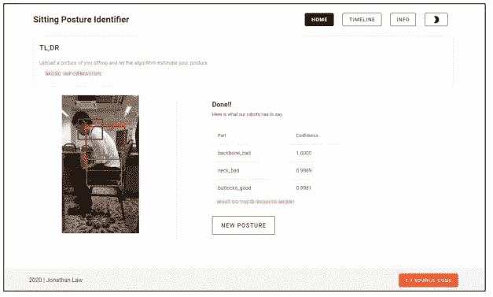
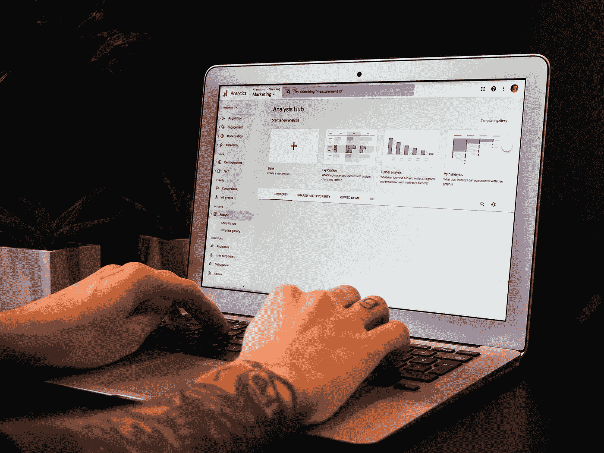

# 2022 年的 5 个项目，在数据世界中起步，给潜在雇主留下深刻印象

> 原文：<https://towardsdatascience.com/5-projects-in-2022-to-get-started-in-the-world-of-data-and-impress-potential-employers-de121a758e01?source=collection_archive---------35----------------------->

## 这是一个小项目的综合列表，我认为它会让你在 2022 年的趋势中保持领先，适合那些希望涉足数据领域的初学者

克拉克·蒂布斯在 [Unsplash](https://unsplash.com?utm_source=medium&utm_medium=referral) 上拍摄的照片

新的一年即将到来，也许学习一项新技能或获得一份新工作就在你的清单上。不要担心，我们将会看到 5 个项目，没有特定的顺序，我认为这将有助于你学习并给你的潜在雇主留下深刻印象。

初学者可以从使用 CSV 或 Excel 导出的数据开始，慢慢增加你通过 API 或 web scrappers 自动抓取数据的难度。

魔法门户:

*   [能源消耗/可持续性](#a007)
*   [网上购物/电子商务](#9310)
*   [加密货币](#e406)
*   [医疗保健](#2232)
*   [你的投资组合网站/谷歌分析](#5e5d)
*   [所以……](#82cc)

# 能源消耗/可持续性

[美国公共电力协会](https://unsplash.com/@publicpowerorg?utm_source=medium&utm_medium=referral)在 [Unsplash](https://unsplash.com?utm_source=medium&utm_medium=referral) 上拍摄的照片

如果你关注新闻已经有一段时间了，你应该听说过“碳中和”这个术语。对于那些还不知道的人，我鼓励你去读一读，了解公司正在做些什么来实现碳中和。当大公司在做他们的工作时，你也可以做你的工作，对你的家庭能源消耗进行一些数据分析。

如果你有智能电表或智能开关来测量你的能源消耗，你可以随时建立一个简单的仪表板，显示你的消耗，按天，周，甚至月。了解你的用电模式和什么耗电最多，有助于你优化账单，间接保护环境。使用仪表板制作一个季节性用电量的故事，无论是由于加热器大部分时间开着导致的冬季用电量的增加，还是炎热夏季的持续空调。这些统计数据让你的数据更加美丽。即使没有智能电表或开关，你仍然可以将每月的账单和使用情况编辑成电子表格。

# 网上购物/电子商务

[皮卡伍德](https://unsplash.com/@pickawood?utm_source=medium&utm_medium=referral)在 [Unsplash](https://unsplash.com?utm_source=medium&utm_medium=referral) 上拍摄的照片

在 Covid 爆发期间，基于[亚马逊博客帖子的在线购物在这里](https://advertising.amazon.com/blog/online-shopping-vs-in-store-shopping-2021-holiday-trends)(2021 年 10 月 27 日)仅在 2020 年就出现了增长，每年都在持续增长。Daniela Copolla 在 statista.com(2021 年 10 月 27 日)发表的另一份报告也显示了电子商务购物在过去几年的增长。

我们知道，公司一直在忙着挖掘我们购物车和购买历史中的任何东西，从中挖掘意义，诱使我们购买更多。但是你知道你的购物模式是什么吗，一旦你的工资单被发布，你有一个特殊的购买期吗？根据你最喜欢的电子商务网站，应该有方法提取你的数据，从亚马逊的订单历史报告到创建一个 Chrome 扩展，将你的订单历史页面抓取成可导出的格式，如 CSV 甚至 JSON。获取您的数据，甚至从您的家庭成员那里获取数据并进行一些可视化处理！

给你点启发，我从马来西亚一个叫[Shopee](https://shopee.com.my/)的电商平台创建了一个区分有用和无用评论的网站。
网址:[https://reviewnator.jonathanlawhh.com/](https://reviewnator.jonathanlawhh.com/)看毛巾评论[这里](https://reviewnator.jonathanlawhh.com/predict?shop_url=https%3A%2F%2Fshopee.com.my%2Fproduct%2F168659314%2F2621999411)。
博文即将发布！

# 加密货币

[行政长官](https://unsplash.com/@executium?utm_source=medium&utm_medium=referral)在 [Unsplash](https://unsplash.com?utm_source=medium&utm_medium=referral) 上拍照

不是互联网希望你思考的方式，也不是把投资的心态强加给你，而是随着趋势的增长和采用它的国家的增加，我们作为数据工作者应该在它变得炙手可热时收获它。有许多加密货币，如比特币、以太币、Dogecoin 等，并且还在不断增加。在互联网上并没有使它变得更容易，因为在采用加密货币的好处之间存在分歧。

然而，我们可以利用来自论坛、博客甚至社交媒体的可用数据做很多新的事情。已经有很多人在做加密货币预测，高点和低点的趋势，所以我们会做一些别的事情。情感分析，确定一个主题是否有大多数人同意采用加密货币，或者他们反对，使用词云的热门关键词，人们经常谈论的顶级货币是什么，是否有新货币的新兴话题。

我想强调的是，你不应该仅仅因为你发现的信息与你的观点相左，就对它不屑一顾。论坛上关于加密货币的话题和讨论可能是有毒的，有偏见的。请记住，关于人们评论的数据只是像你一样的观点，没有人是错的，忽视有效的数据只是偏见，这在这个工作领域是不理想的。

# 卫生保健

医疗保健领域的任何进步都是人类的一大飞跃。虽然对于初学者来说，医疗保健听起来像是一个令人生畏的项目，但开始并不是不可能的。医疗保健的范围不仅限于癌症、心脏病或血液检测数据，药物、护理/护士，甚至药房都属于医疗保健领域。在网上搜索，你会发现很多研究使用人工智能和数据来识别癌细胞，根据你的脉搏预测心脏病发作，甚至基因组测序聚类。

后退一步，理解医疗保健无处不在。你每天坐多久，你多久锻炼一次，你是否正确地举重。根据某些迹象和研究，深入识别患有精神疾病的人，很快你就有机会与专业人士一起实施你的解决方案！

作者的图片和网站

在 Covid 开始期间，我意识到我的坐姿已经下降，我创建了一个模型来通知我。那时我不是数据或医疗保健方面的专家，但通过与许多人交谈和不懈的尝试，我终于制作出了一个工作原型！下面是我的原型供你试用，希望对你有所启发:
原型:[https://posture.jonathanlawhh.com/](https://posture.jonathanlawhh.com/)
博文:[https://jonathanlawhh . medium . com/坐姿-姿势-标识符-使用-ai-11b96f8a8da8](https://jonathanlawhh.medium.com/sitting-posture-identifier-using-ai-11b96f8a8da8)

# 你的投资组合网站

照片由 [Myriam Jessier](https://unsplash.com/@mjessier?utm_source=medium&utm_medium=referral) 在 [Unsplash](https://unsplash.com?utm_source=medium&utm_medium=referral) 上拍摄

在你放弃并认为这都是关于软件开发之前，它不是。你可以用免费的建站软件或者简单易用的模板快速建立一个网站。然而，你的重点将是实现[谷歌分析](https://analytics.google.com/analytics/web/#/)，这很容易设置。

无论是在 2012 年还是 2022 年，帮助公司了解是什么驱使一个人进入他们的网站，他们重新访问的频率，哪个页面的浏览时间最长，以及用户的保留率或跳出率是公司想要的一项宝贵技能。有什么比在你的网站上实现它，展示你的其他项目和分享你的网站链接更好的开始方式呢？使用[Google Analytics dashboard](https://analytics.google.com/analytics/web/#/)并了解招聘人员或雇主在哪里点击你的个人资料以及哪个页面更吸引他们，这有助于你改进网站，同时将 Google Analytics 添加到你的简历中。

这是我的个人网站，可能会对你有所启发！

# 所以…

这些是我会推荐给 2022 年尝试接触数据的人的几个项目。即使你对这些项目不感兴趣，也要找到你真正喜欢的东西，我相信如果你有足够的热情，你会成功并享受这个过程。

祝一切顺利，愿新年对我们仁慈！