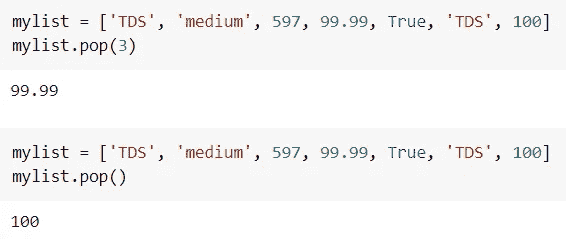

# 轻松掌握 Python 列表的 5 种方法

> 原文：<https://towardsdatascience.com/5-promising-ways-to-easily-master-the-lists-in-python-bed64cd43bc1?source=collection_archive---------29----------------------->

## 编程；编排

## 5 分钟掌握 Python 列表的简单而有前途的方法！


照片由[尼克·费因斯](https://unsplash.com/@jannerboy62?utm_source=unsplash&utm_medium=referral&utm_content=creditCopyText)在 [Unsplash](https://unsplash.com/s/photos/5-directions?utm_source=unsplash&utm_medium=referral&utm_content=creditCopyText) 拍摄

**List——Python 中内置的类似数组的数据结构！**

列表是 Python 中最常用的数据结构之一，它是可变的，是相同或不同数据类型元素的有序序列。

这里是关于 Python list 的 5 个必须知道的调整和技巧，我只用了 5 分钟就掌握了(*当然你也可以*)。⏳

使用这些方法，我可以无缝地编写我的代码，并与每个人分享这个有趣的片段。

列表由方括号`[ ]`中的值定义。在`[ ]`里面的每个元素被称为一个项目。

```
mylist = ['TDS', 'medium', 597, 99.99, True, 'Learn']
```

💡你可以从这个 [**要点**](#cfdb) 中复制所有的列表方法并跟着做！答案已经在下面提到了。

有了有趣的例子，让我们开始吧！

# 索引、反向索引和切片

Index 是 iterable 中项的位置。由于 list 是可迭代的，所以可以通过将索引放入`[ ]`来访问 List 中的项目。

因为 Python 是一种 **0** 索引语言，即索引从 **0** 开始。

例如，下面列表的第一个元素可以通过使用其索引作为 **0** 来检索。

```
mylist = ['TDS', 'medium', 597, 99.99, True, 'Learn']mylist[0] # output --> 'TDS'
```

然而，很多时候，我们感兴趣的是获得列表的倒数第二或最后一个元素。在这种情况下，我们可以使用反向索引。

在反向索引中，索引从列表末尾的-1 开始。下图阐明了这个概念。


Python 列表中的索引和反向索引|按作者排序的图片

下面是一个使用索引和反向索引生成相同结果的示例。


如何在 Python List | Image by Author 中使用索引和反向索引

接下来，
切片✂️是通过从现有列表中选择或提取少量项目来创建新列表的方法。从现有列表中访问一系列项目有几种语法。下图对它来说不言自明。


如何使用 Python 列表切片|作者图片

如果使用负整数进行切片，就会出现反向索引的情况。

# 在列表中添加新项目

通常，我们需要将一个元素或元素列表添加到现有列表中。

> 。append()，。扩展()和。insert()是解决方案

Python 列表方法`**.append()**`将其参数作为单个元素添加到列表的末尾。


Python 列表追加|按作者排序的图像

每增加一次，`mylist`的长度增加 1。

在上面例子的最后一行中，另一个列表 *['D '，' B']* 作为一个单项添加，其原始数据类型列表在`mylist`的末尾。

但是，如果你要在`mylist`的末尾加上列表*【D】【B】*的每一个元素，那么`list.extend()`就是你最好的朋友。

Python 列表方法`**.extend()**`遍历它的参数(如果参数是可迭代的，则遍历*，并将每个元素添加到列表中。在这种情况下，列表的长度随着其参数中元素的数量而增加。*


Python 列表扩展|作者图片

当你想在列表中添加一个元素时，`list.extend()`看起来比`list.append()`更安全。

🚩那为什么不到处用`list.extend()`？？


list.append() vs list.extend() |作者图片

由于`.extend()`基于迭代方法，它比`.append()`慢得多

这两种方法都在现有列表的末尾添加了一个新元素。

您可以使用`.insert()`方法在现有列表中的所需位置添加一个项目。💡


Python 列表插入|作者图片

在向列表中添加了一个项目之后，现在让我们来研究从列表中删除一个项目的方法。

# 从列表中删除项目

就像添加一个项目一样简单，从列表中删除一个项目甚至更简单。

> 。remove()，。pop()和。clear()随时为您服务！

列表方法`.remove()`将从列表中删除特定的项目。默认情况下，它将只移除该项的第一个匹配项。如果指定的项目不在列表中，将引发`**ValueError**`。


如何使用 Python List remove()| Image by Author

有时，我们需要从特定的索引中提取一个项目，并使用它进行进一步的处理。在这种情况下，列表方法`.pop()`绝对有用。

`.pop(index)`从列表中搜索出所述索引处的项目。如果列表为空或索引超出范围，将引发`**IndexError**`。



如何按作者使用 Python List pop() | Image

如上图所示，如果没有提到索引，`.pop()`默认返回最后一项。

list 方法`.clear()`从列表中移除所有项目，并返回一个空列表。

```
mylist = ['TDS', 'medium', 597, 99.99, True, 'TDS', 100] mylist.clear() 
mylist
#***Output***: []
```

但是，使用关键字`**del**`，可以永久删除该列表。

# 检查列表中是否有项目

在我的自动化项目中，每次我都需要检查列表中特定项目的存在。

而且我发现，用`**in**`和`**not in**`是比较蟒的！

这里是如何！


按作者检查列表|图像中的项目成员

# 列出理解

这是用 Python 创建列表的一种优雅方式。列表理解最流行的用法是简洁地创建列表。它的基本语法是，

```
[expression for item in iterable]
```

例如，字符串“DataScience”是一个 iterable。所以我们可以形成这个字符串的字母列表。


作者如何使用 Python | Image 中的列表理解

这里有一篇有趣的关于理解列表的详细知识的文章！！

</3-python-tricks-for-better-code-511c82600ee1>  

其他列表方法如`.copy()`、`.sort()`、`.reverse()`可以在下面的要点和本 [**必读**](/3-time-saving-python-tricks-a017f4215aeb) 中找到。

## 要点

更进一步，这里有一个简单的要点，所有的列表方法都在一个地方。

🚩寻找答案？？➡️你可以在这个 [**笔记本**](https://github.com/17rsuraj/data-curious/blob/master/TowardsDataScience/Master_Python_Lists.ipynb) 里检查你的答案！

总结一下，

我发现在使用 Python 进行数据分析以及复杂的自动化任务时，这些列表方法非常方便。其中一些如`append`、`in`和`not in`是最常用的，而其他如列表理解、`pop`在某些情况下是非常有用和有效的。

现在，你可以成为一名媒体会员，阅读我和成千上万其他作家的无限故事——只需 [***在这里注册***](https://medium.com/@17.rsuraj/membership) ***。当你这样做时，我会得到你的一小部分费用，没有任何额外的费用。请随意加入我的[邮件列表](https://medium.com/subscribe/@17.rsuraj)来了解我写作的最新进展。***

**感谢您的阅读和投入时间！！**