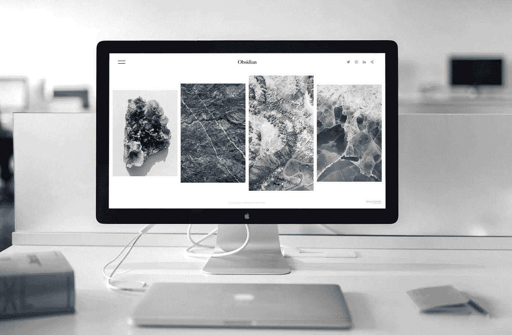
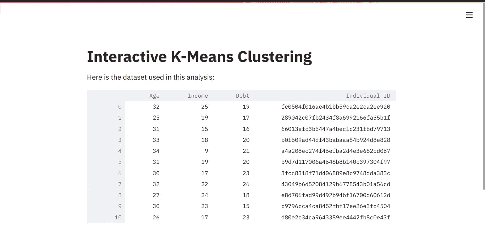
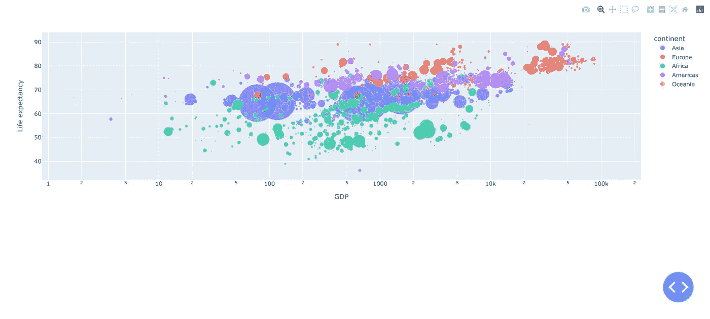
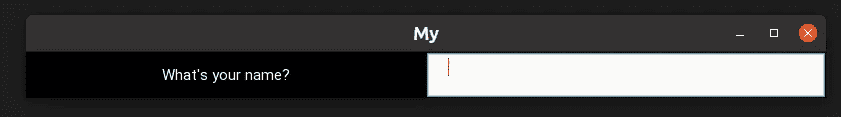
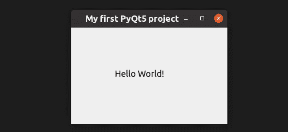
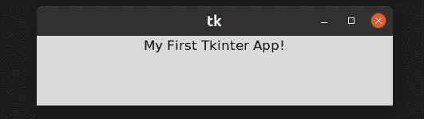

# 6 个 Python GUI 框架来创建桌面、Web 甚至移动应用程序。

> 原文：<https://towardsdatascience.com/5-python-gui-frameworks-to-create-desktop-web-and-even-mobile-apps-c25f1bcfb561?source=collection_archive---------1----------------------->

## 你可以纯粹用 Python 来构建漂亮的应用程序。



用 Python 框架开发 GUI 来自[像素](https://www.pexels.com/photo/photo-of-imac-near-macbook-1029757/?utm_content=attributionCopyText&utm_medium=referral&utm_source=pexels)的[格式](https://www.pexels.com/@format-380633?utm_content=attributionCopyText&utm_medium=referral&utm_source=pexels)的照片

没有好的用户界面，任何解决方案都是不完整的。

Python 已经在各种各样的用例中取得了成功。但是很少有人理解和欣赏它在创建图形用户界面(GUI)方面的能力。)事实上，我们有一些非凡的 python GUI 框架，可以帮助开发人员快速搭建一个界面，与他们的项目进行交互。

这篇文章将讨论 **3 跨平台 GUI 框架**和 **2 网络接口工具**。我们还将介绍一些**基本示例**和**它们的优势**，这样你就可以很好地为你的下一个项目选择正确的示例。

这里有五个你需要知道的工具来构建有用的 UI。

# 格拉迪欧

Gradio 是一个漂亮的 web UI 生成器。它是专门为机器学习项目设计的。

</python-web-apps-for-machine-learning-e29d075e6459>  

Gradio 有大约 25 种不同的小工具。每种都有自己的一套配置。您可以将每个 Python 函数包装在 Gradio 接口中，并在另一个小部件上显示其输出。

Gradio 的酷之处在于它收集反馈的能力。作为数据科学家，您经常需要收集评估者对您的模型的反馈。

Gradio 有一个标志选项。如果用户发现模型预测关闭。他们可以点击标志按钮。Gradio 将收集所有输入值、预测和其他信息。

大多数有经验的数据科学家都知道，构建和部署模型是一个高度迭代的过程。因此，反馈收集使 Gradio 成为 ML 应用原型的完美选择。

你也可以在 [Huggingface spaces](https://huggingface.co/spaces) 上免费部署你的应用。这样你就可以与更多的观众分享你的作品，并收集更多的反馈。Huggingface 只允许 Gradio 和 Streamlit 应用程序(和静态页面)在其平台上运行。

这使得 Streamlit 成为 GUI 开发的下一个最佳 Python 工具。

# 细流

Streamlit 是一个使用 Python 开发 web 应用程序的绝佳工具。它有一个声明式的编码风格，我觉得非常有用。

</secure-your-streamlit-app-with-django-bb0bee2a6519>  

你不需要了解任何 HTML、CSS 或 JavaScript，也不需要学习任何网络开发在线课程。如果你懂 Python，你已经准备好了你需要的一切。

您可以使用以下命令安装 Streamlit。

```
pip install streamlit
```

这是一个在网页上显示熊猫数据框的简单应用程序。

基本 Streamlit 示例—作者摘录。

用上述内容创建一个名为`quickstart.py`的文件。要启动 streamlit web 服务器，请运行以下命令。

```
streamlilt run quickstart.py
```

这个命令将启动一个开发服务器，在您的 web 浏览器上，您可以看到以下内容。



Streamlit 基础应用程序—作者图片

你可以在我之前关于这个主题的文章中了解更多关于 Streamlit 的信息。这个应用还有一个[现场版](https://share.streamlit.io/thuwarakeshm/streamlit-intro/main/quickstart.py#interactive-k-means-clustering)你可以看看。

</the-quick-and-easy-guide-to-create-wordclouds-in-python-7a81813e4cd5>  </how-to-create-stunning-web-apps-for-your-data-science-projects-c7791102134e>  

# 阴谋破折号

Plotly 已经存在好几年了。Dash 是一个框架，它广泛地利用 Plotly 图表用较少的代码构建 GUI。

Plotly Dash 是一款灵活的解决方案，适合各种应用。他们的网站上说，它旨在到达 Tableau 和 PowerBI 无法到达的地方。

在我看来，确实如此。

使用 PyPI 存储库中的以下单个命令安装 Plotly Dash。

```
pip install dash
```

首先，您可以使用以下内容创建一个名为`app.py`的文件，并像运行任何其他 python 脚本一样运行它。

基本情节破折号示例-作者摘录。

运行下面的代码来激活 web 服务器。它将启动一个 Flask 开发服务器，并在默认的 web 浏览器上打开它。

```
python app.py
```



基本 Plotly Dash 应用程序—图片由作者提供

你可以在我之前关于这个话题的博客文章中读到更多关于 Plotly Dash 的内容。

</plotly-dashboards-in-python-28a3bb83702c>  

Plotly Dash 和 Streamlit 是这个列表中比较成熟的技术。虽然它们在开发 web 应用程序时非常有用，但我们还有一些工具可以帮助我们用 Python 构建跨平台的应用程序。下一个是一个很好的例子。

# 基维

Kivy 是一个跨平台的 Python 软件开发框架。有了它，你可以为 Windows、OS X 和 Linux 创建桌面应用，为 iOS 和 Android 构建移动应用，并在基于 Raspberry Pi 的嵌入式设备上使用它。

你没看错。

Python 不再局限于 web 和桌面开发。你可以做很多用其他语言做不到的事情。也许，这就是为什么 Python 是 2021 年 Stackoverflow 开发者调查中[最受欢迎的技术。](https://insights.stackoverflow.com/survey/2021#technology-most-popular-technologies)

[Kivy 的文档](https://kivy.org/doc/stable/guide/basic.html)包括从安装到在 Android Marketplace 发布的详细指南。它们因平台而异。

因为我在 Ubuntu (Linux)上，所以我用 Kivy 官方的 PPA 方式安装它。下面是做这件事的说明。

```
$ sudo add-apt-repository ppa:kivy-team/kivy
$ sudo apt-get install python3-kivy
```

安装完成后，您可以创建一个包含以下内容的文件`app.py`,并运行它来查看 Kivy 的运行情况。

基本 Kivy 应用程序-作者摘录。



作者用 Kivy-Image 创建的基本 GUI。

正如你在上面的例子中看到的，Kivy 的网格布局对于在屏幕上排列 UI 元素来说非常方便。您只需指定列数并开始添加元素。Kivy 足够聪明，可以用最好的方式展示它们。

当然，Kivy 不止这些。从他们的官方文档中，你可以了解更多关于 GPU 优化、移动构建、触控支持等。这里有一个优秀的免费代码营教程，可以在 Youtube 上观看。

关于 Kivy——用于跨平台开发的 Python GUI 框架的 Freecodecamp 课程。

Kivy 是构建移动应用原型的一个很好的工具。如果你的团队不具备开发移动应用的技能，这可能是最好的选择。

# PyQt5

[PyQt5](https://pypi.org/project/PyQt5/) 是一个围绕 Qt 构建的框架。QT(和 PYQT5)支持跨功能开发。它支持 Windows、Mac、Linux 以及 iOS 和 Android 等移动平台。

除了令人印象深刻的 UI 组件之外，PyQT5 还可以与原生 OS APIs 很好地集成。PYQT5 的一大好处是 QT Designer，这是一个让您用 QT 小部件可视化地组合 UI 的工具。

您可以使用 PyPI 安装框架，如下所示:

```
pip install PyQt5
```

一个 hello world 风格的应用程序只需要几行代码就可以提供一个好看的 UI。

基本 PyQT5 示例—作者摘录



PyQT5 Hello world 示例—图片由作者提供。

QT 和 PyQT5 是成熟的框架。因为它的生态系统是巨大的，可能需要一些时间来掌握它。然而，找到免费的学习资源并不困难。

然而，PyQT5 不能免费用于商业用途。下一个是。

<https://www.pythonguis.com/pyqt5-tutorial/>  

# Tkinter

Tkinter 是一个标准的 Python GUI 库。像 Kivy 和 PyQT5 一样，Tkinter 也可以在 Windows、Linux 和 Mac OS 上运行。由于 Tkinter 使用 OS 原生元素，它们看起来和感觉上与运行它的平台上的其他东西一样。

Tkinter 相对容易学习和实现。但是它的限制是缺少高级的部件。然而，这是一个很好的工具，可以在很短的时间内将你的想法原型化。

官方 python 安装附带了 Tkinter。然而，如果你使用的是 Ubuntu，你必须按照下面的说明安装它。

```
$ sudo add-apt-repository ppa:deadsnakes/ppa
$ sudo apt-get update
$ sudo apt-get install python3.9 python3-tk
```

一旦安装了这个包，就可以执行下面的 python 脚本来启动 hello world 应用程序。

基本 Tkinter 示例—作者摘录。

上面的代码将打开一个看起来像本机的 GUI，如下所示。



Tkinter hello world 示例—图片由作者提供。

正如您所看到的，与我们以前的工具相比，这个工具非常简单。

<https://realpython.com/python-gui-tkinter/>  

# 最后的想法

在过去的几十年里，Python 已经扩展到了多个领域。今天，我们将这种优雅的编程语言用于数据科学、工作流集成、软件开发等。

Python 也完全能够进行 GUI 开发。这正是我们在这篇文章中讨论的内容。

我们在这里讨论的五个工具对几乎所有的 GUI 开发需求都有帮助。从原型到移动应用发布，到谷歌和 iOS 商店，再到网络应用。对于所有这些工具，您应该具备的唯一技能是 Python。

为正确的项目选择正确的工具是艺术。从这个列表中，我的建议如下:

*   寻找快速原型？和 Tkinter 一起去
*   需要更多小工具吗？使用 PyQT5
*   开发跨平台和移动应用？Kivy 工作很好
*   想要构建一个 web 应用程序并给予用户并发访问权限？细流太棒了
*   需要更多的灵活性？阴谋破折号是答案。

我希望这篇指南对您为下一个项目选择 Python GUI 工具有所帮助。

> *感谢你的阅读，朋友！上* [***跟我打招呼 LinkedIn***](https://www.linkedin.com/in/thuwarakesh/) *，*[***Twitter***](https://twitter.com/Thuwarakesh)*，* [***中***](https://thuwarakesh.medium.com/) *。*
> 
> *还不是中等会员？请使用此链接* [***成为会员***](https://thuwarakesh.medium.com/membership) *因为，在不为你额外付费的情况下，我为你引荐赚取一小笔佣金。*