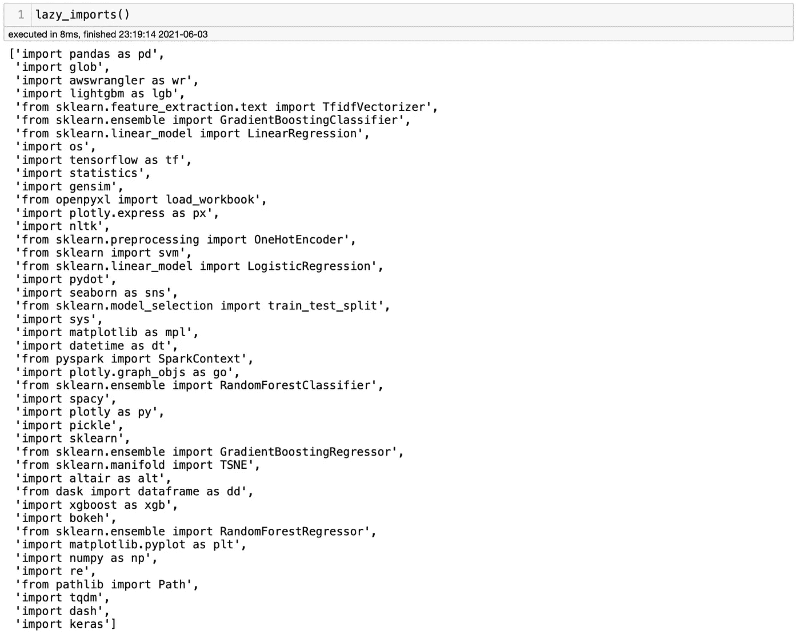
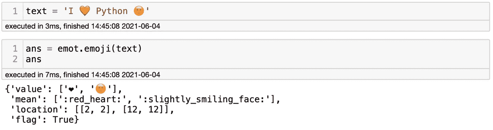
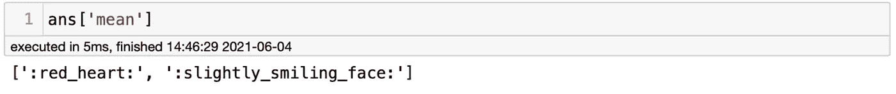
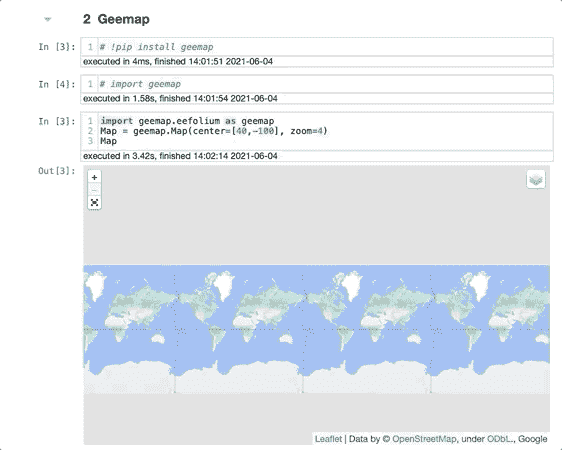
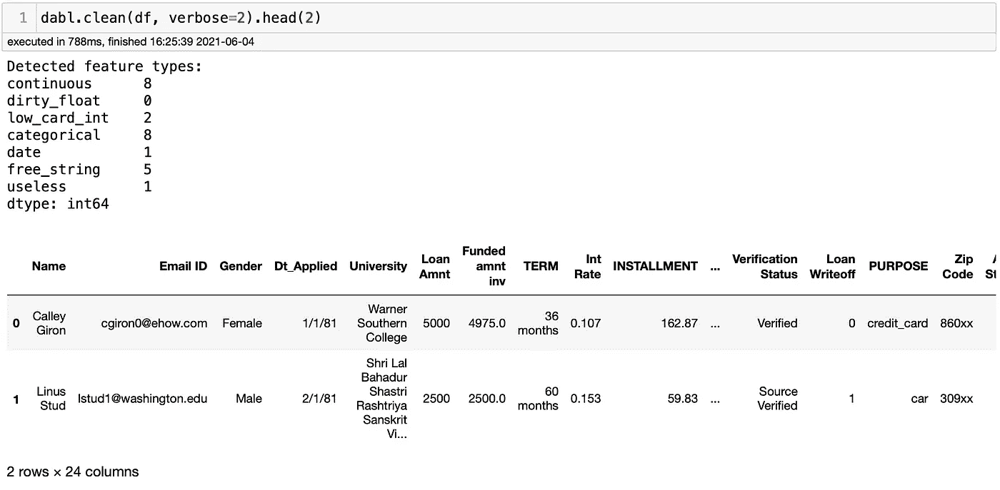
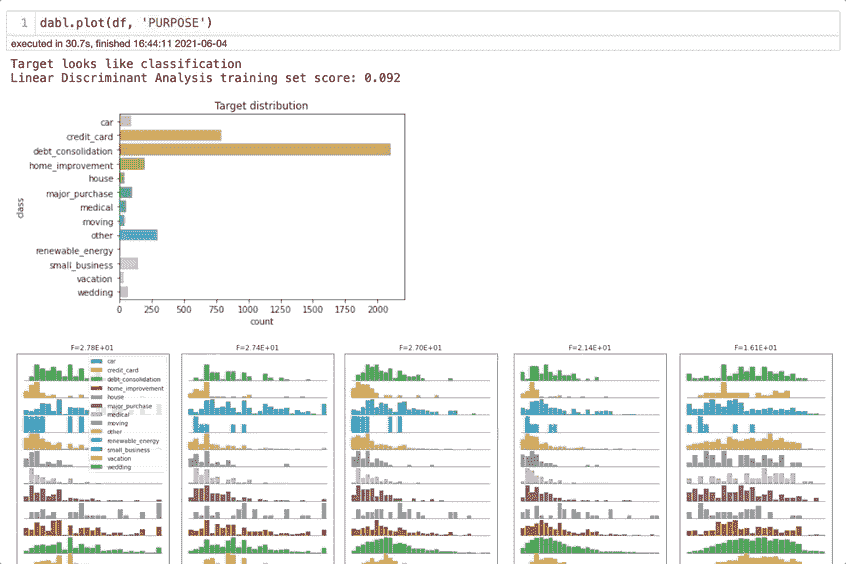
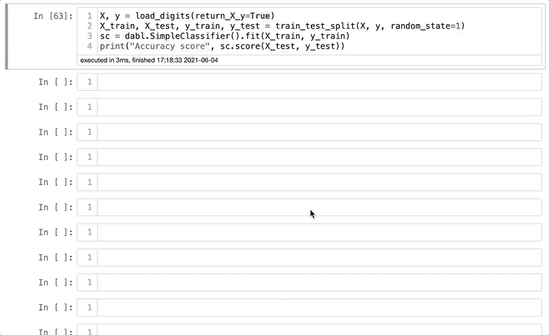
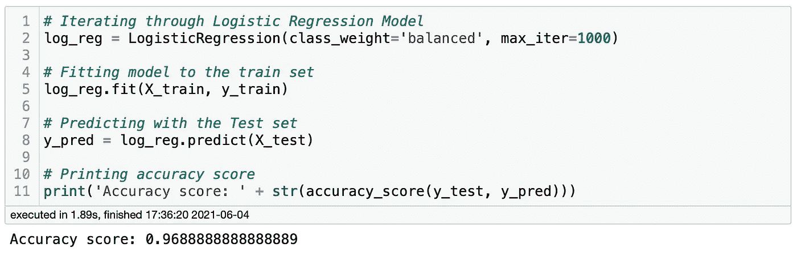
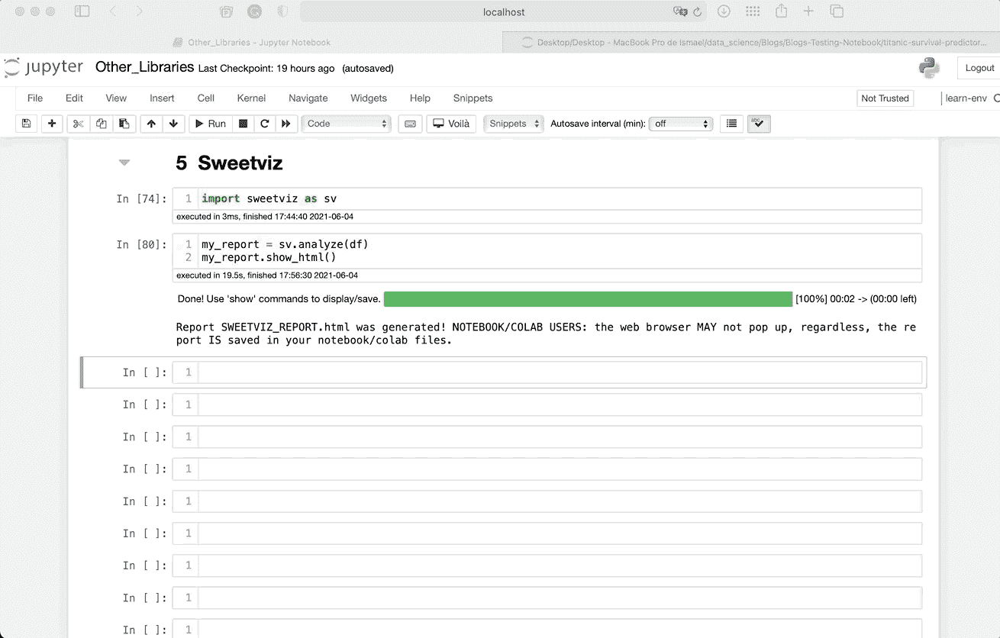
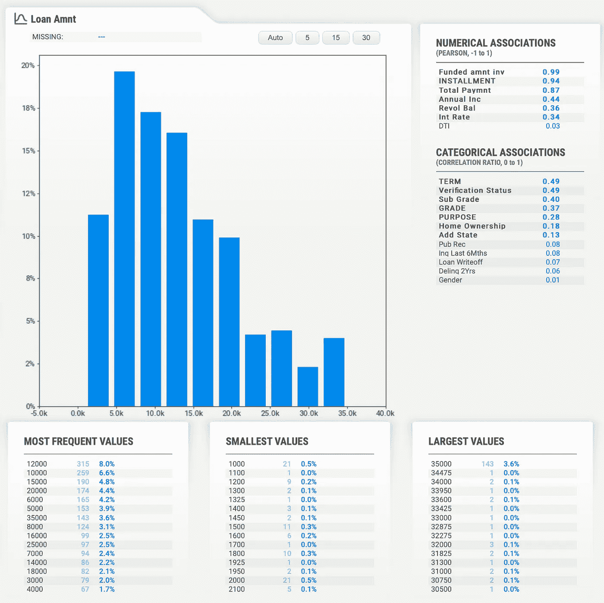

# 你不知道但应该知道的 5 个 Python 库

> 原文：<https://towardsdatascience.com/5-python-libraries-that-you-dont-know-but-you-should-fd6f810773a7?source=collection_archive---------3----------------------->

## 大蟒

## 发现 5 个你应该马上开始使用的 Python 库


克里斯蒂娜·莫里路拍摄的图片。来源:[像素](https://www.pexels.com/photo/woman-programming-on-a-notebook-1181359/)

使用 Python 最大的好处之一就是它无限的开源库。基本上什么都有图书馆。如果你读过我以前的一些博客，你可能已经注意到我是低代码库的忠实粉丝。这并不是因为我懒于输入代码，而是因为我更喜欢把时间投入到真正重要的项目上。如果一个图书馆可以解决一个问题，为什么不节省你的宝贵时间，试一试呢？今天，我将向您介绍 5 个您可能从未听说过但您应该添加到您的管道中的库。我们开始吧！

# PyForest

当你开始为一个项目输入代码时，你的第一步是什么？您可能会导入您需要的库，对吗？问题是你永远不知道你将需要多少个库，直到你需要它并得到一个错误。这就是为什么 PyForest 是我所知道的最方便的图书馆之一。PyForest 可以用一行代码将 40 个最流行的库导入到您的笔记本中。忘记努力记住如何调用每个库。PyForest 可以帮你做到。关于它我写了整整一个博客，总之你安装它，调用它，使用它！所有这些都在几秒钟内完成。化名呢？别担心。它们将以我们熟悉的别名导入。

**如何使用**

只需输入`pip install pyforest`就可以了。要将其导入您的笔记本，请键入`from pyforest import *`，然后您就可以开始使用您的库了。要检查哪些库被导入，输入`lazy_imports()`。



作者图片

上面的库都很好用。从技术上讲，它们只有在你使用时才会被导入。否则，他们不会。可以看到 Pandas、Matplotlib、Seaborn、Tensorflow、Sklearn、NLTK、XGBoost、Plotly、Keras、Numpy 等很多库。

我主要使用 PyForest 来完成我的个人项目或不会被其他人审阅的项目。如果你的代码将被其他人审查，不推荐 PyForest，因为它没有说明这些库正在被导入。

# 情感

Emot 是一个很好的库，它有可能极大地改进您的下一个 NLP 项目。它将表情符号和表情符号转化为描述性信息。例如，想象有人在 Twitter 上发布了*“我❤️python”*。那个人没有说爱这个词。相反，他们使用了表情符号。如果你在 NLP 项目中使用这条推文，你将不得不删除表情符号，并丢失一大块信息。这时候 Emot 就来了。它将表情符号和表情符号转换成文字。对于不熟悉的人来说，表情符号是用文字表达情感的方式。例如，`:)`代表笑脸，`:(`代表悲伤的脸。

**如何使用**

要安装它，你可以输入`pip install emot`，你就可以开始了。然后，您需要通过键入`import emot`将其导入到您的笔记本中。你需要决定你是否想弄清楚表情符号或表情符号的含义。对于表情符号，代码是`emot.emoji(your_text)`。让我们用一个例子来验证一下:



作者图片

上面可以看到我加了句`I ❤️ Python 🙂`用 Emot 算出来的。它返回一个包含值、描述和位置的字典。像任何字典一样，你可以把它分成几部分，集中在你需要的信息上。如果我输入`ans['mean']`，它将只返回表情描述。



作者图片

# Geemap

我把 Geemap 列入了这个名单，但是说实话，它值得一个完整的博客来讨论它。简而言之，Geemap 是一个 Python 库，允许使用 Google Earth 引擎进行交互式制图。你可能很熟悉 Google Earth 及其强大的功能，那么为什么不在你的下一个项目中使用它呢？我计划在接下来的几周内创建一个项目来探索它的所有功能。同时，这里是你如何安装和开始使用它。

**如何使用**

你可以在你的终端中输入`pip install geemap`来安装它。要将其导入您的笔记本，您可以键入`import geemap`。出于演示的目的，我将使用以下代码创建一个基于 leav 的交互式地图:

```
**import** geemap.eefolium **as** geemap
Map = geemap.Map(center=[40,-100], zoom=4)
Map
```



作者图片

正如我提到的，我还没有对它进行足够的探索，但他们有一个完整的 [GitHub 自述文件](https://github.com/giswqs/geemap)更多地讨论了它是如何工作的以及它能做什么。

# Dabl

我昨天了解了 Dabl，在做了一些研究后，我发现它值得拥有自己的博客，但让我们来谈谈基本情况。Dabl 旨在让机器学习建模对初学者来说更容易理解。为此，它为机器学习项目使用低代码解决方案。Dabl 简化了数据清理、创建可视化、构建基线模型和解释模型。让我们快速回顾一下它的一些功能。

**如何使用**

首先，要安装它，你可以在你的终端中输入`pip install dabl`。然后，你可以通过输入`import dabl`将 Dabl 导入你的笔记本。你可以离开这里了。你可以使用`dabl.clean(**data**)`来获得关于特性的信息，比如是否有什么无用的特性。它还显示了连续、分类和高基数的特征。



作者图片

您可以使用`dabl.plot(**data**)`来生成特定功能的可视化效果:



作者图片

最后，您可以使用`dabl.AnyClassifier`或`dabl.Simplefier()`用一行代码创建多个模型，就像您使用 Scikit-Learn 一样。但是，在这一步中，您必须采取一些您通常会采取的步骤，例如创建训练和测试数据集、调用、拟合和预测模型。然后，可以使用 Scikit-Learn 对模型进行评估。

```
**# Setting X and y variables**
X, y = load_digits(return_X_y=True)**# Splitting the dataset into train and test sets**X_train, X_test, y_train, y_test = train_test_split(X, y, random_state=1)**# Calling the model**
sc = dabl.SimpleClassifier().fit(X_train, y_train)**# Evaluating accuracy score**
print(“Accuracy score”, sc.score(X_test, y_test))
```



正如我们所见，Dabl 迭代了多个模型，包括虚拟分类器、高斯神经网络、不同深度的决策树和逻辑回归。最后，它展示了最佳模型。所有这些模型都在 10 秒钟内完成。很酷，对吧？我决定使用 Scikit-Learn 来测试最终的模型，以确保这个结果是可信的。结果如下:



作者图片

我用传统的方法预测得到了 0.968 的准确率，用 Dabl 得到了 0.971 的准确率。对我来说已经够近了！注意，我不必从 Scikit-Learn 库中导入逻辑回归模型，因为它已经用 PyForest 导入了。我需要坦白，我更喜欢 LazyPredict，但是 Dabl 值得一试。关于 Dabl 还有很多要展示的，我会专门为它写一个博客，提供更多的细节。敬请期待！

# **SweetViz**

Sweetviz 是一个低代码 Python 库，它可以生成漂亮的可视化效果，用两行代码就可以启动您的探索性数据分析。输出是一个交互式 HTML 文件。和我今天提到的其他库一样，SweetViz 应该有自己的博客，我很快也会发布一个。现在，让我们对它有个大概的了解。

**如何使用**

```
my_report = sv.analyze(**dataframe**)
my_report.show_html()
```



作者图片

你看到了吗？Sweetviz 能够创建一个包含整个数据集信息的 EDA HTML 文件，并将其分解，以便您可以单独分析每个要素。您可以获得与其他特征、最大值、最小值和最频繁值的数值和分类关联。可视化效果也会根据数据类型而变化。你可以用 Sweetviz 做更多的事情，但我会把它留到另一个博客上。同时，我强烈建议你尝试一下。



作者图片

# 结论

PyForest、Emot、Geemap、Dabl 和 Sweetviz 是值得了解的库，因为它们将复杂的任务变成了简单的任务。如果您使用这些库，您将节省宝贵的时间来完成重要的任务。

我建议您尝试一下，探索一下我在这里没有提到的功能。如果你知道，让我知道你发现了什么。你可以在我的 GitHub 里找到我用来测试他们[的笔记本。感谢您的阅读！](https://github.com/ismael-araujo/Testing-Libraries/tree/main/Other%20Libraries)

**你可能也会喜欢…**

[*你应该知道的 4 个很酷的 Python 库*](/4-cool-python-libraries-that-you-should-know-about-bea9619e481c)[*你应该知道的 3 个很棒的 Python 库*](/3-awesome-python-libraries-that-you-should-know-about-e2485e6e1cbe)[*你应该知道的 3 个低代码 Python*](/3-amazing-low-code-machine-learning-libraries-that-you-should-know-about-a66895c0cc08)