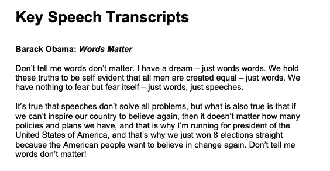
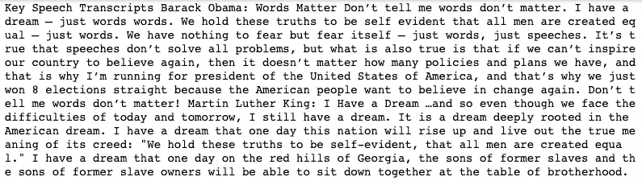
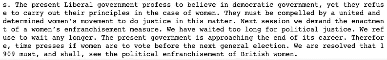
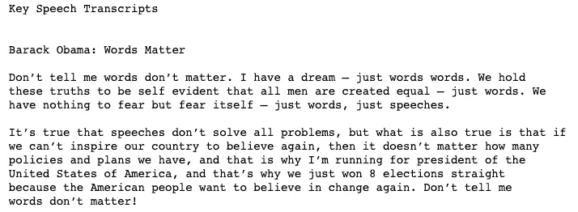
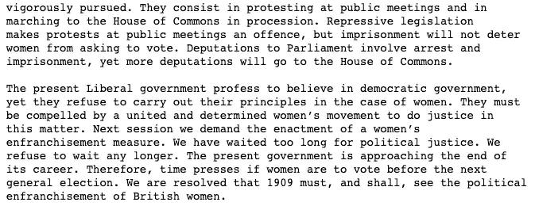
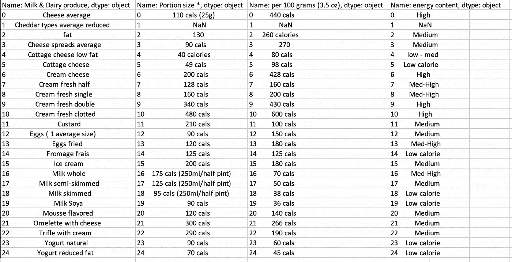

# 5 个 Python 开源工具，用于从 PDF 文件中提取文本和表格数据

> 原文：<https://towardsdatascience.com/5-python-open-source-tools-to-extract-text-and-tabular-data-from-pdf-files-9359cdde6b56?source=collection_archive---------1----------------------->

## 本文全面概述了从 PDF 文件中提取文本和表格数据的各种开源工具


里沙卜·夏尔马在 [Unsplash](https://unsplash.com/photos/R-js25Pv1LQ) 上拍摄的照片

# 介绍

作为数据科学家，我们必须尽可能多地利用组织内部或外部的可用数据源，以便以最相关的方式应对他们的问题。这些数据可能有不同的格式，有时很难处理。本文主要关注两个主要方面:文本数据抽取和表格数据抽取。

库的列表并不详尽，目标是集中于其中的 5 个，其中 3 个用于文本数据提取，2 个用于表格数据提取。在文章的结尾可以找到更多的信息。

# 文本数据提取

对于这一部分，测试数据是基于[奥巴马的演讲词 matter](https://www.bl.uk/learning/resources/pdf/makeanimpact/sw-transcripts.pdf) 。

下面是第一行和最后一行。



文件的前两段


文件的最后两段

## 石板

由于与使用 PDFMiner 相关的困难，这个包被创建为 PDFMiner 的包装器，以使文本提取更加容易。

***先决条件和实现***

```
pip install slate3k
```



从板岩中提取的第一行



从板岩中提取的第一行

从 slate3k 的结果中，我们可以注意到 pdf 文档的所有内容都被检索到了，但是在这个过程中没有考虑回车。

## [PdfMiner.six](https://stackoverflow.com/questions/26494211/extracting-text-from-a-pdf-file-using-pdfminer-in-python)

这是社区维护的原始 [PDFMiner](https://pypi.org/project/pdfminer/) 的分支，目的是让这个库能够与 python 3 一起工作。它用于信息提取，侧重于获取和分析文本数据，也可用于获取文本的确切位置、字体或颜色。

***先决条件及实现***

```
pip install pdfminer.six
```



pdfminer 摘录的前几行/段落。六



pdfminer.six 中摘录的最后几行/段落

考虑到所有回车，PdfMiner.six 按原样获取 PDF 文件的内容

## PyPDF2

该库用于多种任务，如文本提取、合并 PDF 文件、分割特定 PDF 文件的页面、加密 PDF 文件等。在本文中，我们只关注文本提取特性。

***先决条件和实现***

```
pip install PyPDF2
```

# 表格数据提取

大多数时候，企业都在寻找将 PDF 文件的数据转换成可编辑格式的解决方案。这样的任务可以使用以下 python 库来执行: ***tabula-py*** 和 ***Camelot。*** 我们用这个[食物卡路里列表](http://www.uncledavesenterprise.com/file/health/Food%20Calories%20List.pdf)来突出场景。

## 白板

这个库是 [tabula-java](https://github.com/tabulapdf/tabula-java) 的 python 包装器，用于从 PDF 文件中读取表格，并将这些表格转换成 xlsx、csv、tsv 和 JSON 文件。

***先决条件及实现***

```
pip install tabula-py
pip install tabulate
```

这是第 6 页摘录的结果



PDF 文件摘录，第 6 页

*   在 ***第 7 行*** 上，我们可以通过使用选项 ***pages="all"*** 提取所有的表格
*   在 ***第 17 行*** 上，我们将结果转换成一个 excel 文件。相反，它可以被转换成 CSV 文件，tsv 等。

这是使用 tabula 的另一种方法。我们可以使用一条指令提取信息，而不是分解步骤，这次将数据存储为 CSV 文件。

结果在内容上是一样的。唯一的区别在于文件的格式。

## 卡默洛特

可以使用 Camelot，类似于 Tabula-py，从 PDF 文件中提取表格。与 tabula-py 不同，Camelot 依赖于同样需要安装的 ***ghostscript*** 库

***先决条件和实现***

```
pip install ghostscriptpip install camelot-py
```

*   第 4 行得到一个 ***表格列表*** 类型，包含 PDF 中存在的所有表格。
*   第 7 行将显示 11，对应于文件中表的数量。
*   从第 10 行到第 12 行，我们转换每个表并显示它们的前 5 个观察值。我们还可以保存每个数据帧。我们可以使用 ***直接将每个表格保存为. csv 文件。*to _ CSV(output . CSV)**如下图

```
"""
Let convert for instance the 6th (index starts at 0) table into .csv file"""all_tables[5].to_csv**(**'table_6.csv'**)**
```

# 文章结尾

恭喜你！您刚刚学习了如何使用 ***slate*** 、 ***pdfminer.six、PyPDF tabula-py*** 和 *Camelot* 从 PDF 文件中提取文本和表格数据。现在，您可以通过使用您浏览过的库来收集更多数据，从而为您的业务带来价值。您可以在下面找到更多资源。

在 YouTube[上关注我](https://www.youtube.com/channel/UC9xKdy8cz6ZuJU5FTNtM_pQ)获得更多互动会话！

# 额外资源

[使用 Python 处理 PDF 文件](https://www.geeksforgeeks.org/working-with-pdf-files-in-python/)

[如何从 PDF 中提取表格](https://nanonets.com/blog/extract-tables-from-pdf/)

[卡梅洛特快速入门](https://camelot-py.readthedocs.io/en/master/user/quickstart.html)

再见🏃🏾