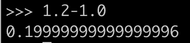
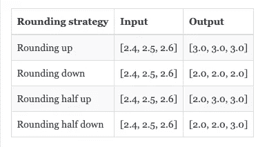
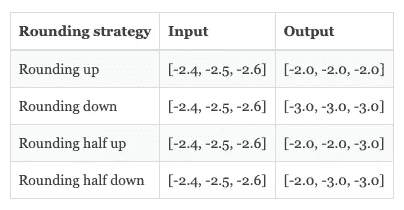
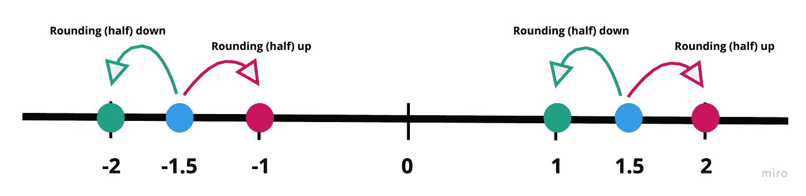
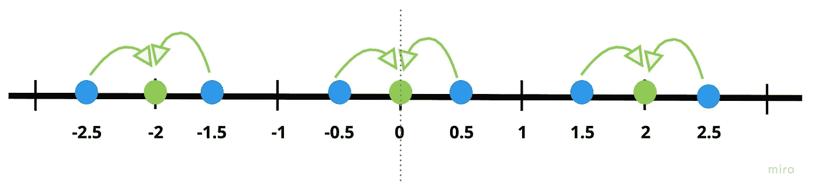
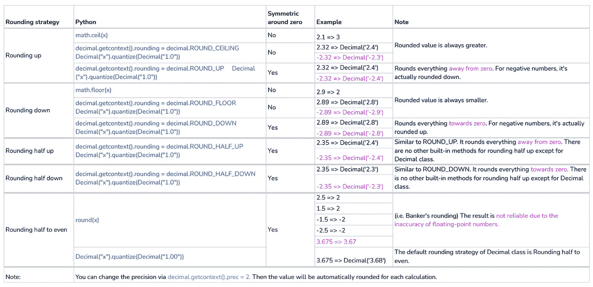

# 使用金融数据的 5 个 Python 技巧

> 原文：<https://towardsdatascience.com/5-python-tips-to-work-with-financial-data-8907e17a7c91?source=collection_archive---------15----------------------->

## 小心点！是钱的问题！


图片由[米歇尔](https://unsplash.com/@micheile)通过 [Unsplash](https://unsplash.com/photos/ZVprbBmT8QA)

我以前工作的公司有一句口号:我们是一家拥有银行牌照的科技公司。虽然这听起来像是一个公司品牌的事情，但在某种程度上这是真的。近年来，Python 已经出现在许多领域，包括但不限于数据分析、欺诈检测、用户行为预测等，在金融机构中大量使用。Quantopian 之类的交易平台也在用。

在本文中，我将根据我的个人经验，分享一些使用 Python 处理金融数据的技巧。有些需要你额外的注意，否则，你可能会损失一大笔钱！这个列表并不完整，请在下面留下你的评论来丰富它。

## 小心零金额和空金额

在 99%的情况下，您需要在金融机构中处理像 0 或空金额这样的特殊金额。开发商和金融专家之间总会讨论如何处理它们。我们应该忽略它们，保留它们，还是提出一个错误？

除了要知道这些特例的存在，还要认识到 0 和空的区别以及处理方式。例如，在我的情况下，只有空的金额是无效的，应该提出一个错误，其余的是有效的。那么我将很容易得到这样的代码:

```
if not amount:
    logger.error("Received an invalid amount")
```

但是，这段代码有潜在的风险。在 Python 中，[有几个值被认为是](https://www.programiz.com/python-programming/methods/built-in/bool) `[False](https://www.programiz.com/python-programming/methods/built-in/bool)`，包括 0 和`None`。这意味着，0 金额也将引发异常，这不是我们想要的！

更安全的方法是像这样显式地提及无效值:

```
if amount in [None, '']:
    logger.error("Received an invalid amount")
```

## 小心浮点数，它们不准确

如果你打开一个 Python 解释器，输入`1.2-1.0`，你会得到这样的结果:



(图片由[高](https://medium.com/u/2adc5a07e772?source=post_page-----8907e17a7c91--------------------------------)

如果你问一个 10 岁的孩子，他会告诉你这是错误的。Python 怎么会犯这样的“错误”？这个奇怪的数字是怎么算出来的？为什么会有微小的差别？处理大量敏感数字的程序不应该容忍这种差异。这个问题还会在测试过程中引发不一致的问题。

不是 Python 里的 bug。它与浮点数在底层系统中的表示方式有更大的关系。浮点数在硬件中表示为二进制分数。不幸的是，并不是所有的十进制部分都可以用二进制格式精确表示。例如，0.125 可以用有限位数的二进制表示:

```
0011111
```

但是，0.2 就不是这样了。大概是这样的:

```
00111110010011001100110011001101...
```

Python 不会保留无限重复的分数。无论我们保留多少位数，结果都不会准确。您可以看到 Python 中存储的实际值，如下所示:

```
>>> "{0:.20f}".format(1.2)
'1.19999999999999995559'
```

有一个[网站](https://floating-point-gui.de/)专门做这个话题。也可以阅读 [Python 文档。](https://docs.python.org/3/tutorial/floatingpoint.html)

但是应该怎么解决这个问题呢？简单的解决方法是使用`[Decimal](https://docs.python.org/3.10/library/decimal.html)`类型。`Decimal`旨在解决浮动不准确的问题。它以 10 为基数存储数字，你可以控制精度水平。由于不是以二进制存储的，`Decimal`相对来说不如浮点有效。

> 计算机必须提供一种算法，这种算法的工作方式与人们在学校学习的算法相同。

如果我们用`Decimal`做同样的计算，这次我们会得到正确的结果。请记住，你需要把 string `'1.2'`而不是 float `1.2`放进去，否则`Decimal`会把 float 转换成它等价的十进制数，从而从一开始就用错了数。

```
>>> Decimal('1.2')-Decimal('1.0')
Decimal('0.2')>>> Decimal(1.2)-Decimal(1.0)
Decimal('0.1999999999999999555910790150')
```

查看本文，了解浮点和小数的性能比较。

[](https://claudio-salvatore-arcidiacono.medium.com/dealing-with-decimal-numbers-in-python-8d2e1da2a16c) [## 用 Python 处理十进制数

### Python 被用于无数的用例。在其中的一些应用中，如数据科学应用，丢失了一些小数点…

claudio-salvatore-arcidiacono.medium.com](https://claudio-salvatore-arcidiacono.medium.com/dealing-with-decimal-numbers-in-python-8d2e1da2a16c) 

## 使用哪种舍入方法？

作为一名负责任的软件开发人员，在处理不明确的数据时，您需要三思。当处理钱的时候，我们经常需要四舍五入。舍入数字会失去精度，你应该知道这个问题和它对一个巨大的数据集的影响。永远不要低估舍入的力量。1980 年初，温哥华证券交易所的指数每笔交易都被截断到小数点后三位，而不是适当的四舍五入。累积截断导致每月 25 点的巨大损失。1983 年终于纠正了错误，数值从 524.811 改为 1098.892。

有很多舍入策略。这里没有对错。**最重要的是理解每种策略背后的原理及其副作用。**

*   向上舍入:向上舍入到不小于输入的最小整数。
*   向下舍入:向下舍入到不超过输入的最大整数。
*   四舍五入:0.5 称为平局。等于或大于 0.5 的分数总是向上舍入。这是最广为人知的舍入策略。
*   向下舍入一半:等于或小于 0.5 的分数被向下舍入。



不同舍入策略的示例—正面(图片由[高](https://medium.com/u/2adc5a07e772?source=post_page-----8907e17a7c91--------------------------------)提供)

***负数怎么样？***

上述舍入策略有一个共同的问题:舍入偏差。向上舍入(一半)有一个朝向正无限偏差的**舍入，向下舍入(一半)有一个朝向负无限偏差**的**舍入。这意味着包括负数在内的任何数字都将向上舍入到更高的值，向下舍入到更低的值。**



不同舍入策略的示例—负面(图片由[高](https://medium.com/u/2adc5a07e772?source=post_page-----8907e17a7c91--------------------------------)提供)

这导致了另一个副作用:结果是**关于零**不对称。



不对称舍入示例(图片由[高](https://medium.com/u/2adc5a07e772?source=post_page-----8907e17a7c91--------------------------------)提供)

在本例中，1.5 向上舍入为 2，而-1.5 向上舍入为-1。

***我们有完美的解决方案吗？***

为了减轻舍入偏差，发明了**四舍五入策略**。这不是我在高中学过的东西，然而，这是 IEEE-754 标准中默认的[舍入规则。该策略假设数据集中向上舍入或向下舍入的可能性相等。因此，决定以期望的精度将结(0.5)舍入到最接近的偶数。同时，它保持结果在零附近对称。](https://en.wikipedia.org/wiki/IEEE_754#Rounding_rules)



四舍五入为偶数的示例(图片由[高](https://medium.com/u/2adc5a07e772?source=post_page-----8907e17a7c91--------------------------------)提供)

这也是 Python 中`round()`方法使用的策略。

```
>>> round(1.5)
2
>>> round(2.5)
2
>>> round(-1.5)
-2
>>> round(-2.5)
-2
```

然而，`round()`对于浮动的行为有时会令人困惑。在本例中，3.675 被舍入为 3.67，而不是 3.68。这又与前一点有关浮点数的不准确性。3.765 无法准确存储在操作系统中，因此造成了这个令人惊讶的结果。使用`Decimal`类可以解决这个问题。

```
>>> round(3.675,2)
3.67
>>> round(Decimal('3.675'), 2)
Decimal('3.68')
```

四舍五入半到偶数还有一个很酷的名字:**银行家的四舍五入。它通常被银行家使用，因为从它的名字你很容易理解。主要原因是它是**无偏**正如我刚才解释的。有趣的是，没有明确的证据证明这曾经是银行业的标准。**

**Python 中如何正确舍入数字？**

除了`round()`，还有另外两个内置模块提供不同的舍入策略。`math.ceil()`仅执行上舍入，`math.floor()`仅执行下舍入。

另一个强大的模块是`Decimal`，不仅因为它精确地表示了一个浮点数，而且还可以轻松地切换到不同的舍入策略。但是`Decimal`中一些舍入策略的名称与我们之前的解释是矛盾的。为了帮助您快速搜索每个舍入策略的 Python 实现，我创建了这个 cheetsheet。



取整 cheetseet(图片由[高](https://medium.com/u/2adc5a07e772?source=post_page-----8907e17a7c91--------------------------------)拍摄)

我的很多想法都来自 Real Python 的这篇很棒的文章:

[](https://realpython.com/python-rounding/) [## 如何在 Python 中舍入数字——真正的 Python

### 在本教程中，你将学习在你舍入数字时会犯什么样的错误，以及你如何能最好地…

realpython.com](https://realpython.com/python-rounding/) 

## 在正确的时间(区域)处理财务数据

我们都知道时间就是金钱！我们不想因为忘记在 2020 年 2 月 29 日打开系统而损失金钱。实际上，今天(2021 年 10 月 31 日)是我们从中欧夏令时(CEST)切换到中欧时间(CET)的日子，即从 UTC+2 切换到 UTC +1，这也是测试您应用的时间设置的好时机。

**区分系统时区和您的应用时区**

可以让你的应用程序在不同于系统的时区运行。通常，Linux 服务器在 UTC 时区运行。如果你的应用运行在一个单独的容器中(比如 docker)，那么你可以强制它运行在不同的时区。

**如何在 Python 中管理时区？**

在 Python 中，可以定义带时区或不带时区的日期对象。没有时区的日期称为 Naive，而有时区的日期称为 Aware。默认情况下，Python 中的数据对象是简单的。

```
>>> datetime.now()
datetime.datetime(2021, 10, 31, 22, 6, 34, 626859)
```

`datetime`模块提供了`timezone`类，该类表示由 UTC 的固定偏移量定义的时区。

```
>>> from datetime import datetime, timezone, timedelta
>>> datetime.now(timezone(timedelta(hours=+2)))
datetime.datetime(2021, 10, 31, 23, 15, 28, 965657, tzinfo=datetime.timezone(datetime.timedelta(seconds=7200)))
```

这个`timezone`类有一个问题，那就是你只能定义一个固定的偏移量。然后，在夏令时的情况下，应用程序负责切换到另一个偏移量。Python 的 doc 还提到:

> 世界各地的时间调整规则更多的是政治性的，而不是理性的，经常变化，除了 UTC 之外，没有适合每一种应用的标准。

**但是有解决的办法吗？**

当然，感谢这个精彩的 Python 社区，我们有了第三方库`pytz`，它将 Olson tz 数据库引入了 Python。可以通过位置(例如欧洲/阿姆斯特丹)来定义时区，而不仅仅是硬编码偏移。图书馆将在夏令时结束时自动调整时间。

```
>>> from pytz import timezone
>>> from datetime import datetime
>>> amsterdam = timezone('Europe/Amsterdam')
>>> datetime.now(amsterdam)
datetime.datetime(2021, 10, 31, 22, 30, 26, 451405, tzinfo=<DstTzInfo 'Europe/Amsterdam' CET+1:00:00 STD>)
```

**国定假日怎么样？**

像银行这样的金融机构有时会在周末或国定假日暂停营业。Python `datatime`可以告诉我们星期一是 0，星期天是 6 的日期是星期几，以确定今天是否是周末。

```
>>> import datetime
>>> datetime.datetime.today().weekday()
6 # today is Sunday
```

但是找出每个国家所有的法定假日是一个挑战。Python 社区开发了一个`[holidays](https://pypi.org/project/holidays/)`库来包含许多国家的法定假日。这是荷兰国王日的一个例子。这种库帮助我们自动管理假期。然而，在生产中使用它们之前，有必要检查一下是否包含了您想要的所有假期。

```
>>> from datetime import date
>>> import holidays
>>> date(2021,4,27) in holidays.NL()
True>>> holidays.NL(years=2021)
{datetime.date(2021, 1, 1): 'Nieuwjaarsdag', datetime.date(2021, 4, 4): 'Eerste paasdag', datetime.date(2021, 4, 2): 'Goede Vrijdag', datetime.date(2021, 4, 5): 'Tweede paasdag', datetime.date(2021, 5, 13): 'Hemelvaart', datetime.date(2021, 5, 23): 'Eerste Pinksterdag', datetime.date(2021, 5, 24): 'Tweede Pinksterdag', datetime.date(2021, 12, 25): 'Eerste Kerstdag', datetime.date(2021, 12, 26): 'Tweede Kerstdag', datetime.date(2021, 4, 27): 'Koningsdag'}
```

**你听说过银行假日吗？**

和“银行家四舍五入”一样，另一个与银行相关的术语是银行假日。这是一个金融机构停止营业的工作日。它主要与实体分支机构相关，因为在线服务仍在继续运营。通常情况下，图书馆的国定假日已经涵盖了银行假日，所以没有必要再建一个图书馆。但是这并不能阻止社区发展新的事物，比如政府银行假日。

## 使用元组来避免改变属性

数据完整性一直是金融机构的重要话题。这是一个非常广泛和复杂的话题。简单来说，在这个上下文中，我们只指“不改变原始数据的内容”。例如，API 从客户端接收支付请求，其中包括发送者、接收者、金额、账户等信息。这个 API 应该将这个信息传递给另一个系统，而不修改这个请求上的任何内容。

从技术角度来看，避免这个问题的一种方法是使用 tuple 和 dataclass 使支付请求对象不可变。默认情况下，tuple 是不可变的，您也可以将 dataclass 对象设置为不可变的。

下面是 namedtuple 的例子。您可以将每一行映射到一个 NamedTuple 对象。如果尝试修改属性，将会收到 AttributeError 异常。

您可以在 dataclass 中用`frozen=True`做同样的事情，但是您不能轻易地将一行映射到 dataclass 对象。下面是如何在 dataclass 中做到这一点。

如果您对 NamedTuple 和 dataclass 感兴趣，可以随意阅读我以前的文章。

[](/understand-how-to-use-namedtuple-and-dataclass-in-python-e82e535c3691) [## 了解如何在 Python 中使用 NamedTuple 和 Dataclass

### 创建一个超出 __init__ 的 Python 对象

towardsdatascience.com](/understand-how-to-use-namedtuple-and-dataclass-in-python-e82e535c3691) 

## 知道屈服的力量

当数据量达到一定水平时，您开始担心性能问题。这个小技巧让程序更明智地使用内存。假设你想知道一个列表的排列:`[1,2,3,4]`。你可以创建一个函数`calculate_permutations()`，返回所有的 24 种组合。

有时候，你不一定想一次了解全部，只对下一个组合感兴趣。然后你可以利用`yield`来节省你的内存。

比较回报率和收益率

函数`calculate_permutations_return()`返回一个列表，而`calculate_permutations_yield()`返回一个生成器。两者都是可迭代的。不同的是生成器是一种可迭代的，你只能迭代**一次**。结果是即时计算的。你可以清楚地看到这两个函数的大小差异。生成器对象本身比完整的结果要小得多，并且不会随着元素数量的增加而增加。

这也和 Python 中叫做懒求值的概念有关。如果你想更深入一点，你可以阅读我的一篇文章:

[](/what-is-lazy-evaluation-in-python-9efb1d3bfed0) [## Python 中的懒求值是什么？

### 你不知道 Python 为你优化了多少代码

towardsdatascience.com](/what-is-lazy-evaluation-in-python-9efb1d3bfed0) 

Python 实际上在一个内置模块`[itertools](https://docs.python.org/3/library/itertools.html)`中处理这样的计算。这个模块创建了许多迭代器来实现高效的循环。你可以很容易地得到这样的排列:

```
import itertools
print(itertools.permutations([1, 2, 3, 4]))
```

## 结论

以下是与金融机构合作的 5 个 Python 技巧。我希望它们对你有用。我肯定我没有涵盖所有有趣的点。如果你有任何想法与我们分享，请在下面留下你的评论。