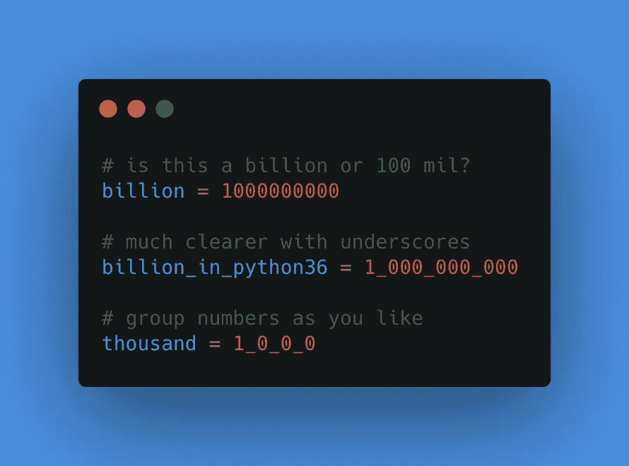
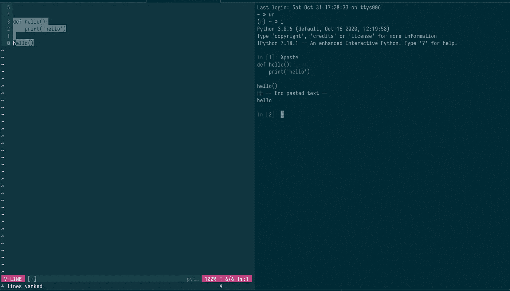
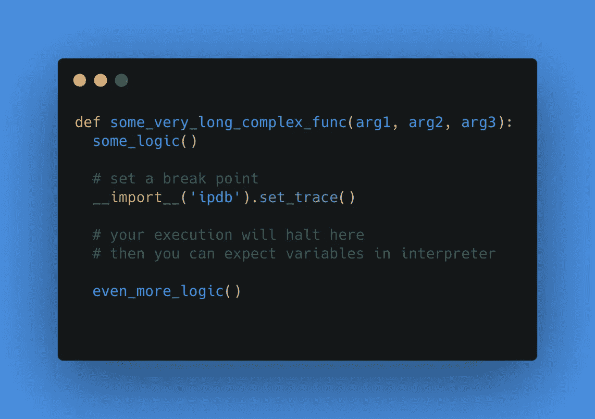
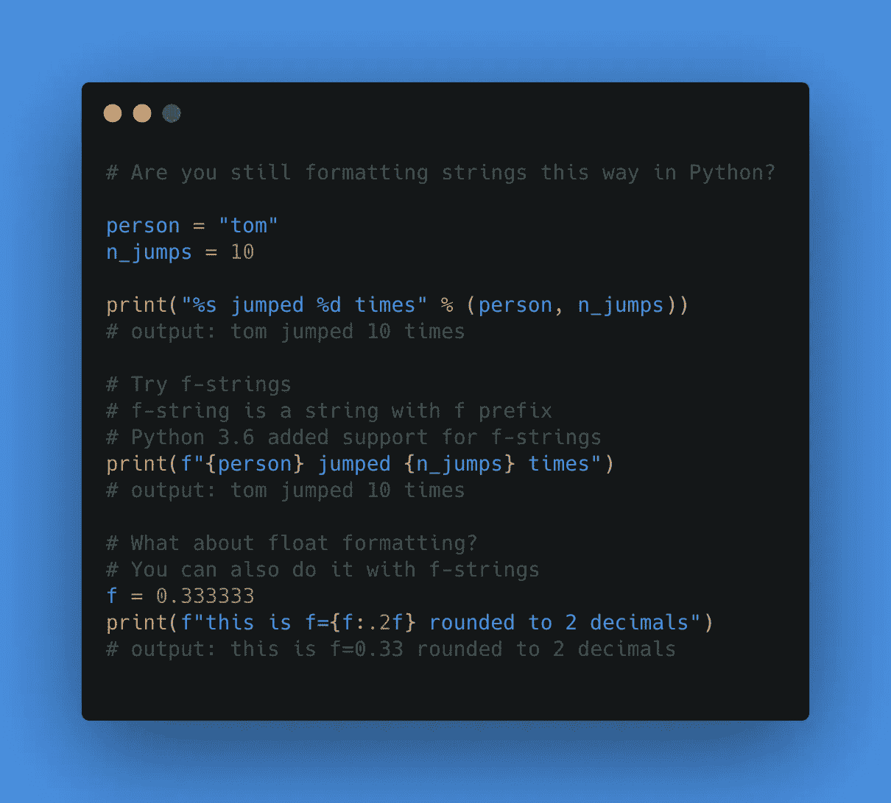

# 你应该在 2021 年开始使用的 5 个 Python 技巧

> 原文：<https://towardsdatascience.com/5-python-tricks-you-should-start-using-in-2021-1084af21c2f2?source=collection_archive---------8----------------------->

## Python 在进化。不要被落下！


迈克尔·泽兹奇在 [Unsplash](https://unsplash.com?utm_source=medium&utm_medium=referral) 上的照片

S 用最好的新年决心之一开始新的一年:**学习更多 Python** 。

您可以从这篇文章开始，在这篇文章中，我介绍了 5 个 Python 技巧，它们将使您的生活变得更加轻松。

**你会学到:**

*   如何更清晰地格式化大整数
*   IPython 中有哪些神奇的命令
*   调试代码的简单方法
*   使用文件路径的更好方法
*   字符串格式化的正确方式

## **这里有几个你可能感兴趣的链接:**

```
- [Complete your Python analyses 10x faster with Mito](https://trymito.io/) [Product]- [Free skill tests for Data Scientists & ML Engineers](https://aigents.co/skills) [Test]- [All New Self-Driving Car Engineer Nanodegree](https://imp.i115008.net/c/2402645/1116216/11298)[Course]
```

*你愿意多看一些这样的文章吗？如果是这样，你可以点击上面的任何链接来支持我。其中一些是附属链接，但你不需要购买任何东西。*

# 1.数字文本中的下划线



在数字文本中使用下划线。图像由 Roman Orac 提供

从 Python 3.6(以及更高版本)开始，您可以使用下划线来使数字更容易阅读。详见 [PEP 515](https://www.python.org/dev/peps/pep-0515/) 。

让我们看一个例子:

```
a = 1000000000
# Is variable a billion or 100 millions?# Let's use underscores to make it easier to read
a = 1_000_000_000# You can group numbers as you like
b = 1_0_9_0
```

它也适用于十六进制地址和分组位。

```
# grouping hexadecimal addresses by words
addr = 0xCAFE_F00D# grouping bits into nibbles in a binary literal
flags = 0b_0011_1111_0100_1110
```

# 2.IPython 的神奇命令



使用%paste 命令将代码粘贴到 IPython 解释器。照片由 Roman Orac 拍摄

我用 Python 开发的工作流程是有一个终端窗格，左边是 neovim，右边是 IPython 解释器。

这使得测试代码变得更容易，因为我可以从左边复制代码，并将其粘贴到右边的解释器中。

## 什么是 IPython 解释器？

它就像一个 Python 解释器，但使用了类固醇。

IPython 是多种编程语言中用于交互式计算的命令 shell，最初是为 Python 编程语言开发的，它提供了自省、富媒体、shell 语法、制表符补全和历史记录

## 从剪贴板粘贴代码到 IPython 解释器的最简单方法是什么？

您知道 IPython 支持魔法命令吗？

其中一个是%paste 命令，它通过格式化从剪贴板粘贴代码。

只需在 IPython 解释器中输入%paste。

# 3.调试 Python 代码



调试 Python 代码 IPDB。用 [carbon.sh](https://carbon.now.sh/) 制作的图像。图像由 Roman Orac 提供

PyCharm 编辑器附带了一个用于 Python 代码的内置调试器。但是如果你用的是 Visual Studio 代码，Atom，Sublime 或者 Vim 呢？

您可以使用 pdb 模块:

```
foo()import pdb; pdb.set_trace() 
# your code will stop here and interpreter will openbar()
```

Python 3.7(及更高版本)通过内置断点函数调用简化了这一过程:

```
foo()breakpoint()
# your code will stop here and interpreter will openbar()
```

详见 [PEP 553](https://www.python.org/dev/peps/pep-0553/) 。

# 4.Pathlib


照片由[爱丽丝·多诺万·劳斯](https://unsplash.com/@alicekat?utm_source=medium&utm_medium=referral)在 [Unsplash](https://unsplash.com?utm_source=medium&utm_medium=referral) 上拍摄

使用路径可能很有挑战性，尤其是当您的代码需要在多个操作系统上运行时。

幸运的是，Python 标准库有[pathlib](https://docs.python.org/3/library/pathlib.html)。

让我们看一个例子:

```
from pathlib import Pathpath = Path("some_folder")
print(path)
# output: some_folder# We can add more subfolders in a readable way
path = path / "sub_folter" / "sub_sub_folder"
print(path)
# output: some_folder/sub_folter/sub_sub_folder# make path absolute
print(path.resolve())
# output: /Users/r.orac/some_folder/sub_folter/sub_sub_folder
```

# 5.简化字符串格式



Python 中的 f 字符串格式。图像由 Roman Orac 提供

我习惯于在 Python 中使用老式的字符串格式:

```
person = 'Roman'
exercise = 0print("%d-times %s exercised during corona epidemic" % (exercise, person))# output
# 0-times Roman exercised during corona epidemic
```

直到最近，我才知道 Python 中有更好(更现代)的字符串格式化方式。

在 Python 3.6 中， [PEP 498](https://www.python.org/dev/peps/pep-0498/) 引入了文字字符串插值，简化了字符串格式。

我们可以将上面的例子改写为:

```
person = 'roman'
exercise = 0print(f"{exercise}-times {person} exercised during corona epidemic")# output
# 0-times Roman exercised during corona epidemic
```

以 f 为前缀的字符串称为 fstring。

fstrings 甚至支持数学运算:

```
print(f"{exercise+1}-times {person} exercised during corona epidemic")# Output
# '1-times roman exercised during corona epidemic'
```

但是我在电晕流行期间没有锻炼，所以在 fstring 中加上+1 只是一个谎言😂

格式化浮点值怎么样？

```
f = 0.333333
print(f"this is f={f:.2f} rounded to 2 decimals")# Output
this is f=0.33 rounded to 2 decimals
```

# 结论

许多 Python 开发人员不知道这些技巧——您不再是他们中的一员。

在过去的 10 年里，我一直在用 Python 编程，直到最近我才学到这些技巧。通过使用它们，Python 编程变得更加有趣。

# 在你走之前

在 [Twitter](https://twitter.com/romanorac) 上关注我，在那里我定期[发布关于数据科学和机器学习的](https://twitter.com/romanorac/status/1328952374447267843)消息。

