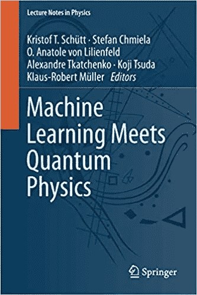
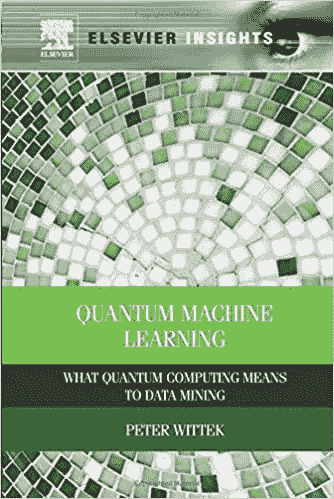
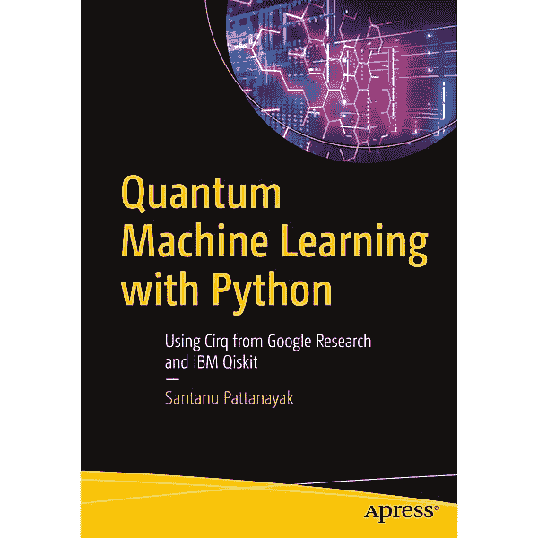

# 不容错过的 5 个量子机器学习资源

> 原文：<https://towardsdatascience.com/5-quantum-machine-learning-resources-not-to-miss-8aeff7655604?source=collection_archive---------10----------------------->

## 两个炒作之外的有用的东西

来源:图片来自 Pexels

[最近一篇有争议的论文](https://arxiv.org/pdf/2103.04913.pdf)试图从量子场的角度给**定义一种新的深度学习形式。事实上，**量子位被天真地描述为 0 和 1 之间的状态，神经网络的每个节点同样是 0 和 1 之间的值，这意味着概率或类似的东西。想象重叠是很直观的。这两个话题都被**过分夸大了(没有动机？)炒作，**虽然都是有用的技术。除了大肆宣传之外，可能还有一些将这两种方法结合起来的机会。

**事实上，这个想法并不新鲜**，一些作者已经试图重新构建现有的机器学习算法(见下表)。[机器学习算法的改进可以通过使用一些量子计算组件](https://www.nature.com/articles/nature23474)来实现，或者[量子计算可以通过使用机器学习来降低一些硬件噪声。](https://q-ctrl.com/products/open-controls/)因此，考虑两种形式的结合是值得的。如果有人想深入研究这种鸡尾酒，我在这里报告 5 个有用的资源。

这些资源是:

1.  **评论或介绍**
2.  多伦多大学彼得·魏特克博士的在线课程
3.  **量子机器学习的相关 Github/Gitlab 知识库**
4.  **相关论文列表**
5.  **书籍**

# 1.评论或介绍

由于总结已做工作(截至 2017 年)的回顾已经存在，因此建议从那里开始。由[雅各布·比亚蒙特](https://www.nature.com/articles/nature23474#auth-Jacob-Biamonte)、[彼得·魏特克](https://www.nature.com/articles/nature23474#auth-Peter-Wittek)、[尼古拉·潘科蒂](https://www.nature.com/articles/nature23474#auth-Nicola-Pancotti)、[帕特里克·瑞本斯特](https://www.nature.com/articles/nature23474#auth-Patrick-Rebentrost)、[内森·维贝](https://www.nature.com/articles/nature23474#auth-Nathan-Wiebe)和[塞思·劳埃德](https://www.nature.com/articles/nature23474#auth-Seth-Lloyd)撰写的这篇论文，重点关注*量子*基本线性代数子程序(BLAS)——如傅立叶变换、寻找特征向量和特征值等——它们在机器学习算法中大量使用，突出了使用量子而不是经典硬件的优势。的确，成就主要在计算速度上，虽然关于量子支持向量机和量子核的讨论出现了。有很好的介绍*量子退火*和*量子玻尔兹曼机*。arXiv 上有一个更新版本(2018 年),尽管你不能期待一个过于全面的总结，因为量子计算领域每周都有一场革命。然而，这两位作者是思考这两个领域结合的先驱之一。因此，尤其值得熟悉机器学习的量子计算初学者阅读。

此外，在如何做之前先想想为什么，来自 Rigetti 的 Max Henderson 在 youtube 上免费提供了一个著名的讲座，内容是“*量子计算在机器学习*中的新兴角色”。真的很推荐。

如果你想从另一个角度看问题，机器学习可以用来降低量子计算的噪音:

</dont-ask-what-quantum-computing-can-do-for-machine-learning-cc44feeb51e8>  

# 2.彼得·魏特克博士的 MOOC 视频讲座

彼得·魏特克是多伦多大学的助理教授。他于 2019 年 9 月去世，当时他们在特里舒尔山探险时遭遇雪崩。他最出名的是他的书“*量子机器学习:量子计算对数据挖掘的意义*”(稍后讨论)，以及他的[视频讲座](https://www.youtube.com/channel/UCVROlDxzfRrlRexJvvCuQeg)。事实上，他留下了一门非常好的课程，有 41 堂课(每堂课不到 10 分钟)，包括量子高斯过程和哈罗-哈西迪姆-劳埃德(HHL)算法等等。

# 3.量子机器学习的相关 Github/Gitlab 知识库

关于量子机器学习的知识库已经相当少了。首先给我留下深刻印象的是[克里希纳·库马尔·塞卡尔在他的 Gitub](https://github.com/krishnakumarsekar/awesome-quantum-machine-learning) 中收集的材料。真的有很多图片，代码(或链接到其他回购)和文件。对于 Github repo 来说，这可能太多了，但是您可能会发现一些有用的东西。

如果你正在寻找量子神经网络，这里有一些脚本[可用](https://github.com/PaddlePaddle/Quantum)。这些来自桨量子项目，旨在建立人工智能和量子计算之间的桥梁。

用于在 IBM Quantum Cloud 中实现的 [qiskit](https://qiskit.org/) 中的 HHL 代码和用于在 Rigetti 中实现的 in P [yquil](https://github.com/rigetticomputing/pyquil) 和 [Grove](https://github.com/rigetticomputing/grove) 中的代码可以在[git lab Bayesian-dl-Quantum](https://gitlab.com/apozas/bayesian-dl-quantum)上轻松访问。

# 4.相关文件清单

如果你有机器学习的背景，并且想要一些关于量子计算的混合实现的更新，我推荐来自 arXiv 和其他期刊的以下论文:

*   [混合量子计算机上的无监督机器学习(J.S. Otterbach 等人，2017)](https://arxiv.org/abs/1712.05771)
*   [有监督和无监督机器学习的量子算法(Lloyd，Mohseni & Rebentrost，2013)](https://arxiv.org/abs/1307.0411)
*   [预测波浪条件的机器学习框架(James，Zhang & O'Donncha 2017)](https://arxiv.org/abs/1709.08725)
*   [量子神经元:量子计算机上机器学习的基本构建模块(曹，Guerreschi & Aspuru-Guzik，2017)](https://arxiv.org/abs/1711.11240)
*   【量子机器学习用于量子异常检测】(刘& Rebentrost，2017)
*   [第一届机器学习中的量子张量网络研讨会会议录(NeurISP 2020)](https://tensorworkshop.github.io/NeurIPS2020/accepted_papers.html)
*   [训练深度量子神经网络(比尔等《自然通讯》2020)](https://www.nature.com/articles/s41467-020-14454-2)

如果你来自光谱的另一端，并且想知道如何在机器学习中使用你所有的物理知识

*   [量子机器学习:经典视角](https://arxiv.org/abs/1707.08561) (Ciliberto et al. 2018)
*   [作为机器学习模型的参数化量子电路](https://iopscience.iop.org/article/10.1088/2058-9565/ab4eb5/meta) [Benedetti *等* (2019)。](https://iopscience.iop.org/article/10.1088/2058-9565/ab4eb5/meta)

# 5.书

尽管有很多关于量子计算的优秀书籍，但关于量子机器学习的具体教科书仍然缺乏。

来源:《机器学习与量子物理》封面图片，作者:克里斯托夫·t·舒 tt、斯特凡·奇米拉、欧·阿纳托尔·冯·利林费尔德、亚历山大·特卡琴科、津田浩二、克劳斯-罗伯特·米勒

我唯一有信心推荐的是《机器学习遇上量子物理》[，由施普林格编辑，克里斯托夫·t·舒 tt、斯特凡·奇米拉、阿纳托尔·冯·利林费尔德、亚历山大·特卡琴科、津田浩二、克劳斯-罗伯特·米勒担任编辑。这是一个研究论文的集合(因此，**不适合初学者**)，主要集中在利用一些机器学习工具的化学量子模拟上。](https://www.amazon.com/Machine-Learning-Quantum-Physics-Lecture/dp/3030402444/ref=sr_1_1)

来源:[量子机器学习:量子计算对数据挖掘的意义](https://www.amazon.com/Quantum-Machine-Learning-Computing-Elsevier-ebook/dp/B00NPVBN0W/ref=sr_1_1?dchild=1&keywords=Quantum+Machine+Learning%3A+What+Quantum+Computing+Means+to+Data+Mining&qid=1616625124&sr=8-1)封面图片，作者彼得·魏特克

[《量子机器学习:量子计算对数据挖掘意味着什么》](https://www.amazon.com/Quantum-Machine-Learning-Computing-Mining/dp/0128100400/)爱思唯尔主编。这是彼得·魏特克写的一篇文章(我们之前提到过他关于量子机器学习的视频课程)。这是一本向你介绍量子计算和机器学习的书。如果你不知道他们两个，这是一个很好的举动。然而，我通常不鼓励试图完成所有事情的文本(因为显而易见的原因，最终仍然是介绍性的)。的确，量子机器学习上的应用真的很模糊的被提及。考虑到作者是谁，我有点失望，但我猜这是他的意图，如果你在这两个领域都是新手，为什么不呢？

来源: [*量子机器学习用 Python*](https://www.apress.com/9781484265215) 封面图片，作者 Santanu Pattanayak

[*量子机器学习用 Python*](https://www.apress.com/9781484265215) 作者 Santanu Pattanayak 编著 Apress。

与其他两个相比，它更近一些，而且肯定是在光谱的实际一边。推荐给想直奔主题的计算机科学家。

如题，它大多专注于编码。它首先介绍量子计算、量子傅立叶变换，最后介绍量子神经网络、量子张量流和 PyTorch。Cirq 和 Qiskit 里有几个伪代码抄本和一些引导脚本如题。你可以偷偷在相关的 Github repo 上看解释过的代码:

<https://github.com/Apress/quantum-machine-learning-python>  

如果你需要关于量子计算的实用文本的概述，请查看

<https://medium.com/illumination/5-books-about-quantum-computing-to-start-from-scratch-37d460a5452c>  

# 结论

量子计算和机器学习是我们这个时代的热门词汇，部分原因是真实的，部分原因是炒作。将它们结合起来可能会有一些好处，但这些好处只是轻微的增加，这一点还有待证明。另一方面，量子计算仍处于起步阶段，未来将会更加普及。因此，我预计我们将拥有在光学硬件上运行的机器学习算法。量子机器学习不会成为下一场革命，而是一种设计算法的正常方式，因为量子计算将更加普遍。

# 想连接就连接

[@ Dr _ Alex _ 克里米](https://twitter.com/Dr_Alex_Crimi)

[@阿列克里米博士](https://www.instagram.com/dr.alecrimi/)

[亚历山德罗·克里米——YouTube](https://www.youtube.com/alecrimi)

【https://web.facebook.com/dralecrimi 