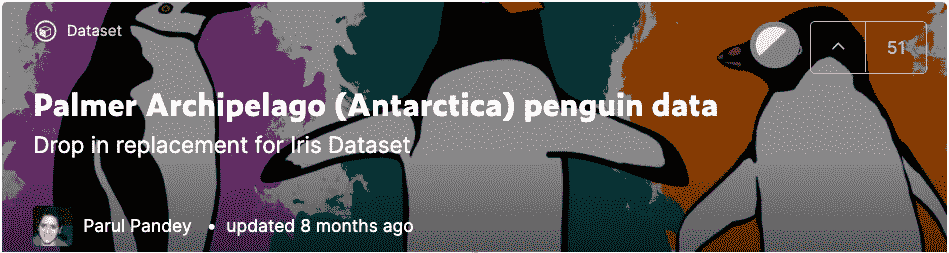
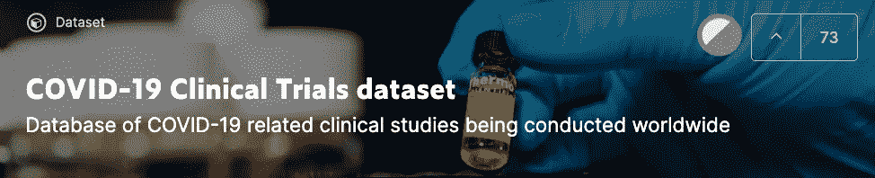

# 5 个真实世界数据集，用于磨练您的探索性数据分析技能

> 原文：<https://towardsdatascience.com/5-real-world-datasets-for-exploratory-data-analysis-21b7cc5afe7e?source=collection_archive---------7----------------------->

## 学习数据科学的最佳方式是实践

[https://www.freepik.com/vectors/data](https://www.freepik.com/vectors/data')

如果您刚刚开始学习数据科学，并且正在寻找一些很酷的数据集，那么这篇文章可能适合您。许多课程和书籍从未真正超越经典的泰坦尼克号和虹膜数据集。这并没有什么坏处，但是已经有过对这些数据集非常熟悉的例子，以至于人们也知道其中缺失值的数量或字符串列的数量。因此，这篇文章可能会成为一个新的机会，让我们了解一些需要改进的伟大数据集。

T 他的文章是寻找好数据集的完整系列的一部分。以下是该系列中包含的所有文章:

**第一部分** : [为数据分析任务获取数据集——高级谷歌搜索](/getting-datasets-for-data-analysis-tasks-advanced-google-search-b1c01f9cc324)

**第 2 部分** : [为数据分析任务寻找数据集的有用站点](/useful-sites-for-finding-datasets-for-data-analysis-tasks-1edb8f26c34d)

**第三部分** : [为深度学习项目创建定制图像数据集](/creating-custom-image-datasets-for-deep-learning-projects-6e5db76158d4)

**第 4 部分** : [毫不费力地将 HTML 表格导入 Google Sheets](/import-html-tables-into-google-sheets-effortlessly-f471eae58ac9)

**第 5 部分** : [用 Camelot 从 pdf 中提取表格数据变得很容易。](/extracting-tabular-data-from-pdfs-made-easy-with-camelot-80c13967cc88)

**第六部分** : [从 XML 文件中提取信息到熊猫数据框架中](/extracting-information-from-xml-files-into-a-pandas-dataframe-11f32883ce45)

**第 7 部分** : [5 个真实世界数据集，用于磨练您的探索性数据分析技能](/5-real-world-datasets-for-exploratory-data-analysis-21b7cc5afe7e)

# 帕尔默群岛企鹅数据

***虹膜数据集的替代物***

[https://www . ka ggle . com/parulpandey/palm er-群岛-南极洲-企鹅-数据](https://www.kaggle.com/parulpandey/palmer-archipelago-antarctica-penguin-data)

被过度使用的 Iris flower 数据集或 Fisher 的 Iris 数据集是由英国统计学家和生物学家罗纳德·费雪引入的多元数据集。帕尔默企鹅数据集是经典的 T2 虹膜数据的替代物。。该数据集包含三种企鹅的属性——阿德利企鹅、巴布亚企鹅和下颚带企鹅。对于数据探索&可视化来说，这是一个很好的介绍数据集。

数据文件夹包含两个 CSV 文件:

*   **penguins_size.csv，**其中包括物种、体质量、性别、岛屿等变量。
*   **penguins_lter.csv** :三种企鹅物种的原始组合数据。

**链接到数据集**:[https://www . ka ggle . com/parulpandey/palm er-群岛-南极洲-企鹅-数据](https://www.kaggle.com/parulpandey/palmer-archipelago-antarctica-penguin-data)

**入门笔记本**:[https://www . ka ggle . com/parulpandey/penguin-dataset-the-new-iris](https://www.kaggle.com/parulpandey/penguin-dataset-the-new-iris)

# 新冠肺炎临床试验数据集

***全球正在进行的新冠肺炎相关临床研究数据库***

[https://www . ka ggle . com/parulpandey/covid 19-临床试验-数据集](https://www.kaggle.com/parulpandey/covid19-clinical-trials-dataset)

ClinicalTrials.gov 是一个在世界各地进行的私人和公共资助的临床研究的数据库。它由国家健康研究所维护。新冠肺炎临床试验数据集由网站上展示的与 COVID 19 研究相关的临床试验组成。

数据集由 XML 文件组成，每个 XML 文件对应一项研究。文件名是 NCT 号，它是临床试验存储库中某项研究的唯一标识符。此外，还提供了一个 CSV 文件，它可能没有 XML 文件中包含的那么多信息，但确实提供了足够的信息。初学者笔记本解释了如何将 XML 文件转换成熊猫数据帧

**链接到数据集**:[https://www . ka ggle . com/parulpandey/covid 19-clinical-trials-Dataset](https://www.kaggle.com/parulpandey/covid19-clinical-trials-dataset)

**入门笔记本** : [EDA 在新冠肺炎进行临床试验](https://www.kaggle.com/parulpandey/eda-on-covid-19-clinical-trials)

**文章** : [从 XML 文件中提取信息到熊猫数据框架](/extracting-information-from-xml-files-into-a-pandas-dataframe-11f32883ce45)

# 1990-2020 年福布斯收入最高的运动员

***体育界谁赚的最多？***

[https://www . ka ggle . com/parulpandey/covid 19-临床试验-数据集](https://www.kaggle.com/parulpandey/forbes-highest-paid-athletes-19902019)

这个数据集包括自 1990 年福布斯第一份榜单以来全球收入最高的运动员的完整名单。2002 年，他们将报告期从整个日历年改为 6 月至 6 月，因此没有 2001 年的记录。该数据集由截至 2020 年的记录组成。

**链接到数据集**:[https://www . ka ggle . com/parulpandey/covid 19-clinical-trials-Dataset](https://www.kaggle.com/parulpandey/forbes-highest-paid-athletes-19902019)

**入门笔记本** : [💰2020 年谁在体育界赚得最多🏆？](https://www.kaggle.com/parulpandey/who-earned-the-most-in-sports-in-2020)

# 欧盟地区 IT 薪资调查(2018–2020 年)

*欧洲地区年度匿名 IT 薪资调查*

[https://www . ka ggle . com/parulpandey/2020-it-salary-survey-for-eu-region](https://www.kaggle.com/parulpandey/2020-it-salary-survey-for-eu-region)

自 2015 年以来，欧洲 IT 专家每年都会进行一次匿名薪酬调查，重点是德国。今年有 1238 名受访者自愿参加了调查。作者将这些数据公之于众，并在 Kaggle 上分享给更广泛的受众。该数据集包含有关欧盟地区 IT 专业人员薪酬模式的丰富信息，并提供了一些很好的见解。

**链接到数据集**:[https://www . ka ggle . com/parulpandey/2020-it-salary-survey-for-eu-region](https://www.kaggle.com/parulpandey/2020-it-salary-survey-for-eu-region)

article—[2020 年 12 月 IT 薪资调查](https://www.asdcode.de/2021/01/it-salary-survey-december-2020.html)

# 美国国际空中交通数据(1990-2020)

*美国和国际航空公司的机场和航空运输量*

[https://www . ka ggle . com/parulpandey/us-international-air-traffic-data](https://www.kaggle.com/parulpandey/us-international-air-traffic-data)

这个数据集来自[美国国际航空客运和货运统计报告](https://www.transportation.gov/policy/aviation-policy/us-international-air-passenger-and-freight-statistics-report)。作为 T-100 计划的一部分，USDOT 接收往返于美国机场的美国和国际航空公司的交通报告。有两个数据集可用:

*   出发:美国关口和非美国关口之间所有航班的数据，无论始发地和目的地。
*   乘客:由特定航空公司提供服务的两个机场之间每月和每年乘客总数的数据。

**链接到数据集**:[https://www . ka ggle . com/parulpandey/us-international-air-traffic-data](https://www.kaggle.com/parulpandey/us-international-air-traffic-data)

# 结论

没有比实践更好的学习方法了，数据科学领域也是如此。所有这些数据集都可以在 kaggle 上获得，并且可以在它们的 dockerized 环境中进行分析。这意味着您分析所需的大多数库已经安装。启动笔记本可以帮助您快速启动。您可以从探索其中一个数据集开始，然后将其转换为博客帖子，与社区共享您的结果。