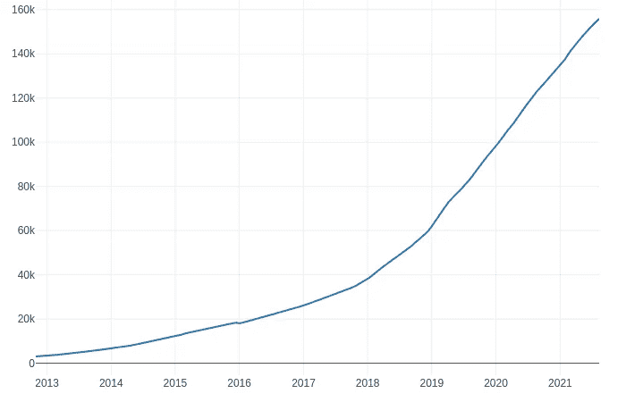
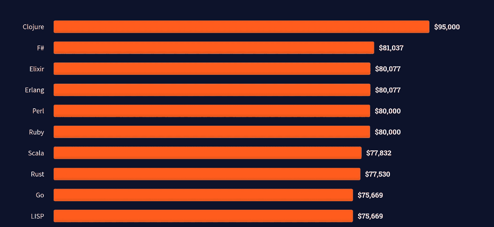

# Golang 成为优秀的初始/启动语言的 5 个原因

> 原文：<https://towardsdatascience.com/5-reasons-that-makes-golang-a-good-first-startup-language-28f27356c48a?source=collection_archive---------23----------------------->

## 我希望在我刚开始学习编程的时候就有 Go

迈克尔·克里斯滕森在 [Unsplash](https://unsplash.com/s/photos/yelling?utm_source=unsplash&utm_medium=referral&utm_content=creditCopyText) 上的照片

最近我一直看到同样的问题在 Go[subreddi](https://www.reddit.com/r/golang/)t 中反复出现。

> Golang 是学习的好的第一语言吗？—有抱负的新开发人员

我们经常看到这样的帖子，以及 Go 是否适合某一类项目的问题

*   [Go 作为 web 开发的第一语言](https://www.reddit.com/r/golang/comments/p0ex17/go_as_first_language_for_web_development/)
*   [作为一名初学者，我是否应该从](https://www.reddit.com/r/golang/comments/oxq8z9/as_a_beginner_would_it_be_better_for_me_to_start/)开始
*   [golang 是中型项目 api 的好选择吗？](https://www.reddit.com/r/golang/comments/o07u79/is_golang_good_choice_for_an_api_of_a_medium/)

我决定提出我对这件事的观点，所以我收集了我认为是学习和使用围棋的最重要原因的 5 件事。

## 1.友好且快速发展的社区

正如 [Go 开发者调查 2020 结果](https://blog.golang.org/survey2020-results)所示，Go 是一种在广泛领域快速发展的语言。Jetbrains 最近也发布了 Go 的状态，这也带来了一些关于使用的有趣数字。

> **110 万职业围棋开发者**将围棋作为**主要语言—** [叶卡捷琳娜·扎罗娃](https://blog.jetbrains.com/go/2021/02/03/the-state-of-go/)

这个数量不是个人使用，而是公司在工作中使用 Go。如果你已经在 Go 社区呆了一段时间，你可以很容易地从搜索 Go 开发人员的职位发布数量中看到这一点。

看看 Reddit 社区，随着新开发人员的加入，它一直在蓬勃发展。自 2020 年以来，新增用户近 6 万。

[/r/golang](https://www.reddit.com/r/golang/) 的统计—来自 subredditstats.com[的统计](https://subredditstats.com/r/golang)

不仅是社区爆炸，我还遇到了**超级友好的氛围**。人们乐于助人，有新想法的初级开发人员不会遇到干草叉和火把。

我可以有把握地说，这不是我在 Java 世界的经历。我记得有些想法被嘲笑，因为那根本不是你做事的方式。我还没有在 Go 社区中看到这种情况，但这可能与我的下一个观点有关

## 2.围棋是一门容易学习的小语种，因此很容易

当我找到第一份程序员的工作时，我不得不学习 Java。Java 是一种已经存在很长时间的庞大语言，有 Maven 和 Spring 这样的巨型框架。

我从来没有对 Java 感到舒服过，当然我学习了面向对象的编程概念。但是我建造的每样东西都感觉像是在建造一块巨石，不管这个项目有多小。出现这种情况的主要原因可能是由于存在大量的库，以及处理相同问题的不同方法。

所有这些听起来都是好事，有可能以不同的方式处理问题。但对我来说，这更像是一个阻碍，作为一个缺乏安全感的初级开发人员，我害怕做出错误的决定，每个人都指向不同的方向。

然而 Go 非常小，你可以在一个小时内阅读完整的语言规范。尽管如此，如果你不熟悉这门语言，我怀疑它会是一本好书。

> Go 高效、可扩展、高效— [Rob Pike](https://talks.golang.org/2012/splash.article)

你会问，这与 Java 相比如何？嗯你告诉我，这里是 [java 规范](https://docs.oracle.com/javase/specs/jls/se16/jls16.pdf)，**一个 844 页的小 PDF**。这只是语言，还有 JVM 规范。

Go 提供了简单的语法，很容易阅读和理解代码。Go 还有一个非常严格的编译器可以帮助你。我知道它不像 Rust 编译器，但它非常严格。Go 还涵盖了许多已知的编程概念，只是做起来更容易。

我在围棋方面的经验是很难出错，你有类型安全、编译器检查、静态类型。有这么多的安全措施，对新开发人员甚至老年人来说都很好。是的，学长也搞砸了。

事实上，如果我们关注 Reddit 上的讨论，你会看到评论说 Go 太容易了，开发者会失去或错过重要的知识。在我看来，这很有趣，就像告诉一个想学开车的人，他们应该在高速公路上开始学习，因为那是最难的部分。首先，我相信 Go 是一种可靠的语言，并且要坚持下去，但是我不认为从 Go 转向其他语言会有任何问题。

## 3.标准库真的很强大

我喜欢上的一件事是 Go 中的标准库。我知道以前有很多人称赞过标准库，但是我不认为我们能得到足够的称赞。这个`stdlib`通常足以完成我的大部分任务。

在我全职开发 Go 的 6 年中，我很少使用框架。当然，你不应该重新发明轮子，重建一切。你应该使用所有优秀的开源库。但是我要说的是，只使用标准库而不依赖于大型框架，大多数任务通常可以非常快速地管理。

最好的例子就是`[net/](https://pkg.go.dev/net/http)` http 库。我知道很多人在 Go 中使用著名的 web 框架来开发后端 web 服务，但是我很少需要这样做。我认为标准库为设置 HTTP 服务器提供了足够多且易于使用的方法。

Go 中的最小 HTTP 服务器。

我曾经放弃`net/http`库的唯一原因是在一个高性能项目中，我需要一个优化的 HTTP 路由器。

## 4.Go 在这里停留

当我决定开始学习围棋的时候，它还是非常新的，没有多少公司在生产中使用它。新事物总是让人害怕，我还不知道这种语言是否能接受它。我交谈过的许多人声称，这只是另一种被炒作的语言，很快就会被抛弃。

我记得我当时想，如果它得到了谷歌的支持，它一定会有所作为。

你猜怎么着，炒作列车咀嚼并抓住了许多跳上车的开发人员的心。随着越来越多的公司公开采用 Go 并使用它开发软件，Id 认为可以肯定地说 Go 将会继续存在。

现在一些重要的大人物正在使用围棋。你可以在这里找到完整的名单[。](https://github.com/golang/go/wiki/GoUsers)

这是一份列出的大公司名单

*   谷歌
*   砖坯黏土
*   自动警报系统
*   美国电话电报公司(American Telephone and Telegraph Company)
*   开源代码库
*   加拿大白鲑
*   脸谱网
*   浏览器名
*   网飞

有更多的大公司在使用 Go，但我认为你明白了这一点。

## 5.根据 Stackoverflow 排名的十大支付语言

Stackoverflow 进行了一项年度调查，向开发人员提出了一系列问题。其中一个话题是什么语言最受欢迎，根据 [2021 年调查](https://insights.stackoverflow.com/survey/2021#section-top-paying-technologies-top-paying-technologies)，围棋在世界上排名 **#9** 。该调查基于 5 月份 80，000 名开发者的回复。

截图自栈溢出[调查](https://insights.stackoverflow.com/survey/2021#section-top-paying-technologies-top-paying-technologies) 2021。

围棋开发人员的年平均工资为 75，669 美元。

现在我不是说钱应该让你决定使用哪种语言，但我相信这是公司愿意付钱给 Go 开发者的一个标志。

## 结论

我很高兴看到 Go 在软件领域的进步。

希望我能设法说服至少一个人加入到这个旅程中来。

你对要走的学习道路有什么看法？

你是地鼠福音传道者吗？

请随意联系，无论是在 Medium 上的评论中还是在 Twitter 上。

如果你有兴趣了解更多关于围棋的知识，请务必访问令人惊叹的在线巡回赛。我也写了很多关于围棋的东西，一定要跟着看。

 [## Go 界面

### 让我们剖析接口，成为交易高手](https://itnext.io/interfaces-in-go-5c6e38b81b41)  [## 阅读珀西·博尔默(以及媒体上成千上万的其他作家)的每一个故事

### 作为一个媒体会员，你的会员费的一部分会给你阅读的作家，你可以完全接触到每一个故事…

percybolmer.medium.com](https://percybolmer.medium.com/membership)