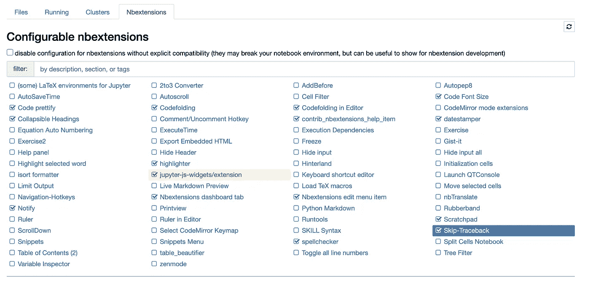
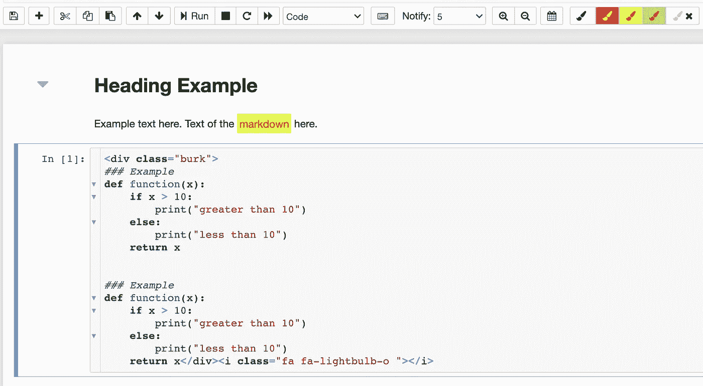
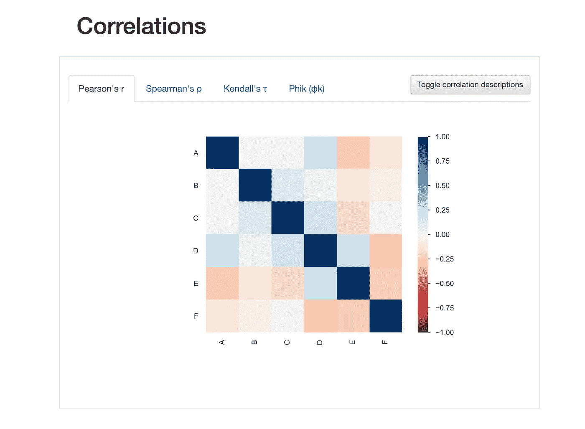

# 每位数据科学家需要使用 Jupyter 笔记本电脑的 5 个原因

> 原文：<https://towardsdatascience.com/5-reasons-why-every-data-scientist-needs-to-use-jupyter-notebooks-939d4e5d19dd?source=collection_archive---------26----------------------->

## 意见

## 深入了解 Jupyter 笔记本的基本功能


格雷格·拉科齐在[Unsplash](https://unsplash.com/s/photos/space?utm_source=unsplash&utm_medium=referral&utm_content=creditCopyText)【1】上拍摄的照片。

# 目录

1.  介绍
2.  附加组件
3.  文本编辑
4.  端到端机器学习
5.  SQL 适应性
6.  可视化显示
7.  摘要
8.  参考

# 介绍

如果你是数据科学的新手，你可能会问自己，一个以行星命名的笔记本到底是什么，但如果你是一名数据科学家，那么你应该知道这个工具是日常使用的主要工具。也就是说，如果你是一名数据科学家，我将讨论使用 [Jupyter 笔记本](https://jupyter.org/)【2】的五大理由——希望其中一些理由对你来说是新的。幸运的是，值得注意的是，您不仅可以在笔记本中应用数据科学方法，还可以在这里应用一般数据和业务分析及智能。因此，让我们深入到 Jupyter Notebook—“*一个开源的 web 应用程序，它允许您创建和共享包含实时代码、等式、可视化和叙述性文本的文档*”[2]。

# 附加组件



nb 扩展选项卡。作者截图[3]。

这款笔记本有许多功能，比如可以选择为自己的个人笔记本配置扩展。在上面的截图中，你可以看到各种独特而有用的笔记本附件。正如您将注意到的，为一个较长的数据科学项目编码和标记文本可能会变得非常视觉化，也可能变得难以组织。因此，[jupyter _ contrib _ nb extensions](https://jupyter-contrib-nbextensions.readthedocs.io/en/latest/install.html)[4]工具将允许您执行有用的操作，如代码折叠，这样您就可以有效地滚动，而不必查看数百行代码。类似地，一些可能的应用也可以应用于文本，我将在下面描述。

# 文本编辑



荧光笔延伸之前和之后。作者截图[5]。

与数据科学过程中的大计划相比，编辑文本可能看起来是一件微不足道的事情，但是，随着时间的推移，你会参考回你的笔记本，你会希望存储笔记，你会希望编辑这两者，以便不仅你自己，而且其他人也可以更容易地查看和协作。

> 在 Jupyter 笔记本中，您可以执行以下文本编辑操作:

*   **通用代码注释**—`#`表示您可以在可执行代码单元格中编写文本
*   **markdown** —在一个单元格中，您可以执行`code`、`markdown`、`raw nbconvert`或`heading`，`markdown`将允许您存储可用于描述编码过程的文本
*   **代码修饰** —自动对函数和代码进行空格/格式化
*   **可折叠标题** —有时标题信息可能会碍事，因此使用此功能，您可以将其折叠
*   **荧光笔** —朗读某些减价文本
*   **拼写检查器** —在编辑您的减价时，拼写错误的单词将会突出显示
*   **scratchpad** —使用键盘上的 Ctrl-B，您可以在笔记本上工作，同时存储面向研究/非生产的代码或普通笔记，本质上是一个数字便笺

正如您所看到的，笔记本中已经有了文本编辑的本地特性，如果您选择下载 nbextensions，那么您将有更多的选项来编辑和显示文本。

# 端到端机器学习


克莱顿·罗宾斯在[Unsplash](https://unsplash.com/?utm_source=unsplash&utm_medium=referral&utm_content=creditCopyText)【6】上拍摄的照片。

现在，我们已经强调了一些文本和代码功能，您可以看到这些功能对于使用机器学习算法构建数据科学模型的整个端到端过程是多么重要。

> 通常，数据科学流程遵循类似的步骤顺序:

*   业务问题陈述
*   数据摄取
*   探索性数据分析
*   特征工程
*   模型比较
*   最终模型
*   部署

几乎所有这些步骤都可以在您的 Jupyter 笔记本上执行，这也是该工具对数据科学家如此重要的原因。第一步，你可以用笔记本记下课文。然后，您可以通过读入一个要转换为您的熊猫数据帧的文件来摄取数据。接下来，您可以通过对字段执行 Python 操作来理解数据，例如识别数据的分布。然后，您可以看到因变量的相关特征，以及从像`division`这样的常见操作中创建的计算特征，例如，点击是一列，用户是另一列，然后您可以`divide`或`groupby`，最后的新特征是`clicks per user`或`clicks/user`。一旦有了数据和特征，就可以应用各种机器学习算法来预测或分类目标变量。然后，您可以存储您的模型并将其加载到您的笔记本中，以便可以预测新数据。

# SQL 适应性


卡斯帕·卡米尔·鲁宾在[Unsplash](https://unsplash.com/?utm_source=unsplash&utm_medium=referral&utm_content=creditCopyText)【7】上拍摄的照片。

在笔记本中，您可以连接到数据库并直接在笔记本单元格中查询，而不只是导入静态 CSV 文件。对我来说，这个特性几乎比在典型的数据库工具中查询更容易，这是因为我经常看到大量的 SQL 代码令人不知所措，当它被转换成一个更小的字符串块时，我可以更好地概述 SQL 代码正在做什么，而不是上下滚动来查看不同的子查询。

> 您可以在 Jupyter 笔记本中使用 SQL，方法是创建一个引擎，并通过建立以下重要信息连接到您的数据库:

`username`、`password`、`host`、`port`、`database`名称。

对于官方文件，你可以点击这个链接[这里](https://docs.sqlalchemy.org/en/14/)【8】。还有一个关于数据科学的博客，作者是 [Roman Orac](https://medium.com/u/68bf0657a0cd?source=post_page-----939d4e5d19dd--------------------------------) ，题为“[如何在 Jupyter 笔记本上运行 SQL 查询](/how-to-run-sql-queries-from-a-jupyter-notebook-aaa18e59e7bc)【9】。

另一种间接使用 SQL 的方法不是从数据库中查询，而是从你的熊猫数据框中查询。这个特性对于从业务分析师或数据分析师转型为数据科学家的人来说非常有用。你不需要建立任何连接，所以这也很容易。它类似于 SQL，但不完全是，因此是 SQL 和 Python 的良好结合。

> 这里有一个例子，由[熊猫](https://pandas.pydata.org/docs/reference/api/pandas.DataFrame.query.html)【10】记录:

```
df = pd.DataFrame({'A': range(1, 6),
                   'B': range(10, 0, -2),
                   'C C': range(10, 5, -1)})
df
   A   B  C C
0  1  10   10
1  2   8    9
2  3   6    8
3  4   4    7
4  5   2    6df.query('A > B')
   A  B  C C
4  5  2    6
```

该查询实质上是要求返回那些`column A value`大于`column B value`的行。对我来说，这个语法甚至比 SQL 更简单。当然，您还可以执行更多的查询操作，并且可以通过最后提到的链接了解更多信息。

# 可视化显示



作者截图[11]。

也许使用 Jupyter 笔记本最好的部分是它可视化一切的方式。与其在终端上打印出令人困惑的数据帧，不如让数据帧正确显示并易于阅读是一个巨大的优势。你不仅可以轻松查看你的数据，还可以使用 Jupyter Notebook 中的某些库来查看你的机器学习算法进度。有了无数的绘图库，您也可以创建类似 Tableau 的可视化效果。

正如您在上面的屏幕截图中所看到的，有时，拥有一个组织良好且颜色编码的图表或视觉效果不仅有利于您理解数据科学概念，而且有利于他人分享您的工作。

# 摘要

数据科学可能是压倒性的，难以组织，因此，这就是为什么日常使用 Juptyer 笔记本电脑是必不可少的。当然，你也可以使用其他工具，所以这完全取决于你。然而，我分享了我的主要原因，如果你选择使用 Jupyter 笔记本，希望这些原因也适用于你。

> 总而言之，以下是每位数据科学家需要了解 Jupyter Notebook 的五个原因:

```
* Add-ons* Text Editing* End-to-End Machine Learning* SQL Adaptability* Visualization Display
```

我希望你觉得我的文章既有趣又有用。如果您已经从这些关于作为数据科学家使用 Jupyter 笔记本的原因中受益，请随时在下面发表评论。请在下面评论您使用 Juptyer 笔记本的其他原因，或者，您是否会使用其他产品？

请随时查看我的个人资料和其他文章，也可以通过 LinkedIn 联系我。我不隶属于上述任何公司。

# 参考

[1]照片由[格雷格·拉科齐](https://unsplash.com/@grakozy?utm_source=unsplash&utm_medium=referral&utm_content=creditCopyText)在[Unsplash](https://unsplash.com/s/photos/space?utm_source=unsplash&utm_medium=referral&utm_content=creditCopyText)(2015)上拍摄

[2] Project Jupyter， [Jupyter 笔记本主页](https://jupyter.org/)，(2021—2021 年 2 月 8 日最后一次更新，周一)

[3] M.Przybyla，NBextensions 选项卡截图，(2020 年)

[4] Jupyter Contrib 团队，[Jupyter-Contrib-nb extensions](https://jupyter-contrib-nbextensions.readthedocs.io/en/latest/install.html)，(2015–2018)

[5] M.Przybyla，可折叠标题前后的截屏，(2020 年)

[6]克莱顿·罗宾斯(Clayton Robbins)在 [Unsplash](https://unsplash.com/?utm_source=unsplash&utm_medium=referral&utm_content=creditCopyText) 上拍摄的照片，(2020)

[7]照片由[卡斯帕·卡米尔·鲁宾](https://unsplash.com/@casparrubin?utm_source=unsplash&utm_medium=referral&utm_content=creditCopyText)在 [Unsplash](https://unsplash.com/?utm_source=unsplash&utm_medium=referral&utm_content=creditCopyText) 上拍摄，(2017)

[8] SQLAlchemy， [SQLAchemy 文档](https://docs.sqlalchemy.org/en/14/)，(2021)

[9] [罗曼·奥拉克](https://medium.com/u/68bf0657a0cd?source=post_page-----939d4e5d19dd--------------------------------)，[如何从 Jupyter 笔记本上运行 SQL 查询](/how-to-run-sql-queries-from-a-jupyter-notebook-aaa18e59e7bc)，(2020)

[10]熊猫，[熊猫查询](https://pandas.pydata.org/docs/reference/api/pandas.DataFrame.query.html)，(2021)

[11] [Matt Przybyla](https://medium.com/u/abe5272eafd9?source=post_page-----939d4e5d19dd--------------------------------) ，Jupyter 笔记本中的相关性截图，(2020)